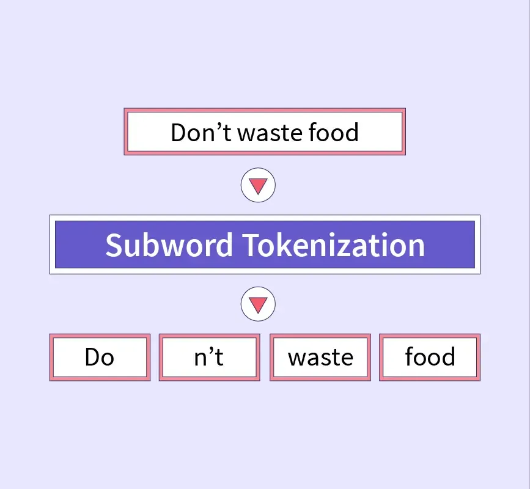

## Table of Contents

## What is a subword token in the context of machine learning?

In machine learning, especially in natural language processing, a subword token is a smaller unit of a word that helps in understanding and processing text more effectively. Instead of treating each word as a whole, subword tokenization breaks words down into smaller pieces. This is helpful because it can handle new or rare words better. For example, if a model sees the word "playing" for the first time, it might break it into "play" and "ing". This way, the model can understand the word even if it hasn't seen it before, by recognizing the familiar parts.

Subword tokenization is often used in models like those based on transformers, such as BERT and GPT. These models use algorithms like Byte Pair Encoding (BPE) or WordPiece to decide how to split words into subwords. By doing this, the models can have a smaller vocabulary size and still handle a wide variety of words. This makes the models more efficient and able to learn from less data. In practice, this technique helps improve the performance of language models in tasks like translation, text generation, and sentiment analysis.

## Why are subword tokens important in natural language processing?

Subword tokens are important in natural language processing because they help models understand and process words they haven't seen before. When a model uses whole words, it might not know what to do with new or rare words. But with subword tokens, the model can break down a new word into parts it already knows. For example, if a model sees the word "unhappiness" for the first time, it can split it into "un", "happy", and "ness". This way, the model can still understand the word even if it's new.

Using subword tokens also helps make models more efficient. Instead of having a huge list of every possible word, the model can work with a smaller list of subword units. This means the model can learn from less data and still do well on tasks like translating languages or understanding text. By breaking words into smaller pieces, the model can also handle different forms of words easily, like "play", "playing", and "played", without needing to learn each one separately.

## How do subword tokenization algorithms work?

Subword tokenization algorithms like Byte Pair Encoding (BPE) and WordPiece help break words into smaller parts. They start with a list of all the words they need to learn. At first, each word is split into its individual letters. Then, the algorithm looks for pairs of letters that appear together a lot. It picks the most common pair and turns it into a new token. This process repeats many times, each time making the vocabulary of tokens a bit bigger. The algorithm stops when it has made enough tokens to cover all the words well.

For example, if the word "playing" is in the list, it might start as "p", "l", "a", "y", "i", "n", "g". If "ay" is a common pair, it might become a new token, turning "playing" into "p", "l", "ay", "ing". This way, if the model sees a new word like "praying", it can split it into "p", "r", "ay", "ing" and understand it better. By breaking words into smaller, reusable parts, these algorithms help models learn from less data and handle new words more easily.

## What are some common subword tokenization techniques?

One common subword tokenization technique is Byte Pair Encoding (BPE). BPE starts by splitting words into individual characters. Then, it looks for pairs of characters that appear together often. It takes the most common pair and turns it into a new token. This process repeats many times, making the vocabulary of tokens bigger each time. BPE stops when it has enough tokens to cover all the words well. For example, if the word "playing" is in the list, it might start as "p", "l", "a", "y", "i", "n", "g". If "ay" is a common pair, it might become a new token, turning "playing" into "p", "l", "ay", "ing".

Another common technique is WordPiece, which is similar to BPE but has some differences. WordPiece also starts by splitting words into individual characters. Then, it looks for the best way to combine characters into tokens, trying to find the right balance between having a small vocabulary and being able to represent all words well. WordPiece might choose to combine "##ing" into a token if it appears often at the end of words. This way, words like "playing" and "running" can be broken down into "play", "##ing", and "run", "##ing". Both BPE and WordPiece help models understand new words by breaking them into familiar parts.

## Can you explain the difference between word-level and subword-level tokenization?

Word-level tokenization means breaking text into whole words. Each word is treated as one piece, like "dog", "house", or "running". This way, if a model sees a new word, it might not know what to do with it because it hasn't seen that exact word before. For example, if the model knows "run" and "running", it might not understand "runner" because it's a new word. Word-level tokenization can be simple, but it struggles with new words and different forms of the same word.

Subword-level tokenization breaks words into smaller parts. Instead of treating "running" as one word, it might break it into "run" and "##ing". This way, if the model sees "runner", it can break it into "run" and "##er", which it might already know. Subword tokenization helps models understand new words by using parts they've seen before. Techniques like Byte Pair Encoding (BPE) and WordPiece are used to decide how to break words into subwords. This makes models better at handling different forms of words and learning from less data.

## How does subword tokenization help with out-of-vocabulary words?

Subword tokenization helps with out-of-vocabulary words by breaking them into smaller, familiar parts. If a model sees a new word, it can split it into pieces it already knows. For example, if the model knows "play" and "ing", it can understand "playing" even if it hasn't seen it before. This way, the model can handle words it hasn't learned yet by using the parts it knows.

By using subword tokenization, models can work with a smaller vocabulary but still understand a lot of different words. Techniques like Byte Pair Encoding (BPE) and WordPiece help decide how to break words into subwords. This makes the models more efficient and better at learning from less data. So, even if a new word comes up, the model can still figure out what it means by looking at its parts.

## What are the advantages of using subword tokens over traditional word tokens?

Subword tokens help models understand new words better. When a model uses whole words, it might not know what to do with a word it hasn't seen before. But with subword tokens, the model can break the new word into pieces it already knows. For example, if the model knows "run" and "ing", it can understand "running" even if it hasn't seen it before. This way, the model can handle words it hasn't learned yet by using the parts it knows.

Using subword tokens also makes models more efficient. Instead of having a huge list of every possible word, the model can work with a smaller list of subword units. This means the model can learn from less data and still do well on tasks like translating languages or understanding text. By breaking words into smaller pieces, the model can also handle different forms of words easily, like "play", "playing", and "played", without needing to learn each one separately.

## How do models like BERT and GPT use subword tokenization?

Models like BERT and GPT use subword tokenization to understand and process text better. They break words into smaller parts, which helps them handle new or rare words. For example, if BERT sees the word "playing" for the first time, it can break it into "play" and "##ing". This way, even if the model hasn't seen "playing" before, it can still understand it by recognizing the familiar parts "play" and "##ing". This technique makes the models more efficient because they don't need a huge list of every possible word. Instead, they work with a smaller list of subword units, which means they can learn from less data and still do well on tasks like translating languages or understanding text.

BERT and GPT use algorithms like Byte Pair Encoding (BPE) or WordPiece to decide how to split words into subwords. These algorithms start by splitting words into individual characters and then look for pairs of characters that appear together often. They turn the most common pairs into new tokens, repeating this process many times until they have enough tokens to cover all the words well. For example, if "ay" is a common pair, it might become a new token, turning "playing" into "p", "l", "ay", "ing". By breaking words into smaller, reusable parts, these models can handle different forms of words easily, like "play", "playing", and "played", without needing to learn each one separately.

## What challenges are associated with subword tokenization?

Subword tokenization can make things harder because it adds more steps to how a model works. When you break words into smaller pieces, the model has to learn how to put those pieces back together to understand the full meaning. This can make the model slower and need more computer power. Also, choosing the right way to split words into subwords is not easy. Different languages and texts might need different ways of splitting, so what works well for one language might not work for another.

Another challenge is that subword tokenization can sometimes make the meaning of words unclear. For example, if a word is split into pieces that don't make sense on their own, like "un" and "##derstand", the model might have trouble figuring out what the whole word means. This can be a problem, especially with words that have many different meanings or uses. Even though subword tokenization helps with new words, it can also make things more complicated for the model to learn and understand language correctly.

## How can the choice of subword tokenization impact model performance?

The choice of subword tokenization can really change how well a model works. If the model uses a good way to split words into smaller pieces, it can understand new words better. This means the model can learn from less data and still do well on tasks like translating languages or understanding text. But if the model uses a bad way to split words, it might have trouble understanding new words or figuring out what the whole sentence means. This can make the model slower and need more computer power to work well.

Different ways of splitting words can also affect how clear the meaning of words is. For example, if a word is split into pieces that don't make sense on their own, like "un" and "##derstand", the model might have trouble figuring out what the whole word means. This can be a problem, especially with words that have many different meanings or uses. So, choosing the right way to split words into subwords is important for making sure the model works well and understands language correctly.

## What are some advanced techniques for optimizing subword tokenization?

One advanced technique for optimizing subword tokenization is using adaptive tokenization methods. These methods change how words are split into subwords based on the specific task or language the model is working on. For example, if the model is translating from English to Spanish, it might split words differently than if it's working on understanding English text. This helps the model understand new words better and work more efficiently. By adjusting the tokenization to fit the task, the model can learn from less data and still do well.

Another technique is using unsupervised learning to find the best way to split words. This means the model looks at a lot of text without any help and figures out the best way to break words into subwords. For example, it might see that "playing" often comes up and decide to split it into "play" and "##ing". This way, the model can handle new words better by using parts it already knows. By letting the model learn how to split words on its own, it can work well even with different kinds of text or languages.

## How can subword tokenization be adapted for languages with different morphological structures?

Subword tokenization can be adapted for languages with different morphological structures by using language-specific algorithms. For example, some languages like Finnish or Turkish have many word endings that change the meaning of words. In these cases, the tokenization method needs to be good at splitting words into parts that show these endings clearly. This can be done by using algorithms that look at how often certain word parts appear together and then decide the best way to split words. By doing this, the model can understand the different forms of words better and work well with these languages.

Another way to adapt subword tokenization is by using unsupervised learning. This means the model looks at a lot of text in the new language and figures out the best way to break words into subwords without any help. For example, if the model sees that words often end with certain endings in a language, it can learn to split words in a way that keeps these endings as separate tokens. This helps the model handle new words better by using parts it already knows. By letting the model learn how to split words on its own, it can work well even with languages that have very different ways of forming words.