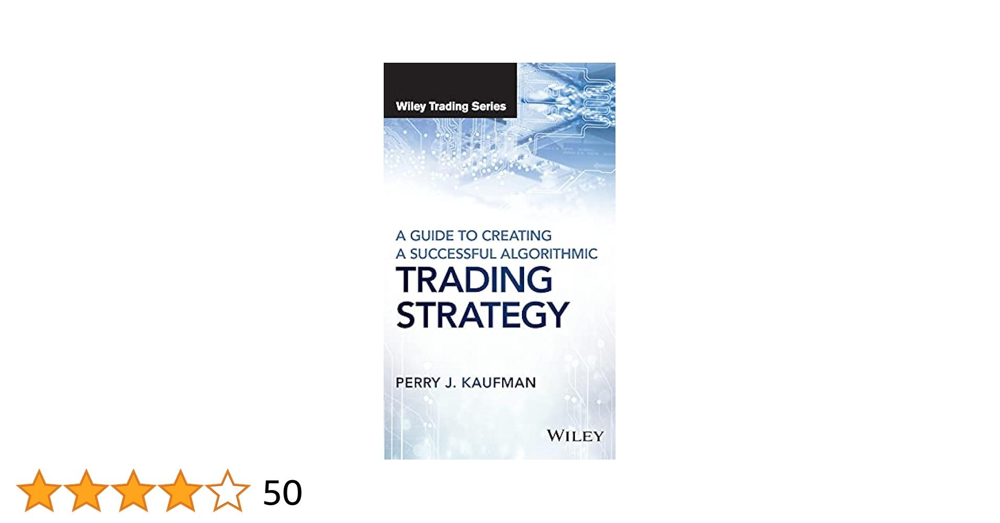

## Table of Contents

## What is algorithmic trading and why is it important?

Algorithmic trading is a way of buying and selling things like stocks or currencies using computers and special math formulas. Instead of people making the decisions, the computer follows the rules set in the formulas to trade automatically. This can happen very quickly, often in fractions of a second, which is much faster than a human could do it.

It's important because it can make trading more efficient and less emotional. When people trade, they can sometimes make mistakes because they get scared or excited. Computers don't feel emotions, so they stick to the plan. Also, algorithmic trading can handle a lot of information at once and make trades based on that information very quickly. This can help traders make money more consistently and manage big amounts of money more easily.

## How does an algorithmic trading ebook benefit beginners?

An algorithmic trading ebook can be really helpful for beginners because it teaches them the basics of how to use computers to trade. It explains things like what algorithms are, how to set them up, and how to use them to buy and sell stocks or other things. This can be a lot to learn, but an ebook breaks it down into easy-to-understand parts, so beginners don't feel overwhelmed.

Also, these ebooks often include examples and step-by-step guides. This means beginners can follow along and practice what they're learning. They can see how other people have used algorithms to make money and learn from their successes and mistakes. This hands-on approach helps beginners feel more confident as they start trading on their own.

## What are the basic concepts a beginner should know before starting algorithmic trading?

Before starting [algorithmic trading](/wiki/algorithmic-trading), a beginner should understand what an algorithm is. An algorithm is like a recipe or a set of instructions that a computer follows to make trading decisions. It's important to know that these algorithms can be based on different things like the price of a stock, how much it's going up or down, or even news events. Understanding how to create and use these algorithms is key because they will be doing the trading for you.

Another basic concept is knowing how to code. Most algorithmic trading systems need you to write code to tell the computer what to do. Languages like Python are popular because they're easier to learn and have lots of tools for trading. It's also important to learn about the markets you want to trade in, like stocks or [forex](/wiki/forex-system), because each market works a little differently. Knowing the basics of these markets will help you make better algorithms.

Lastly, risk management is crucial. This means understanding how much money you can afford to lose and setting up your algorithms to stop trading if things go badly. It's also important to test your algorithms with pretend money first to see if they work before using real money. This practice, called [backtesting](/wiki/backtesting), helps you see if your trading plan can make money without risking your savings.

## What programming languages are commonly used in algorithmic trading?

In algorithmic trading, some programming languages are used more often than others. Python is very popular because it's easy to learn and has lots of tools for trading. Libraries like Pandas and NumPy help with handling data, and others like Zipline and Backtrader let you test your trading ideas. Python is also good for connecting to trading platforms and getting real-time data, which is important for making quick trading decisions.

Another language often used is C++. It's faster than Python and good for handling a lot of data quickly. This speed can be important in algorithmic trading where every second counts. C++ is more complicated to learn, but it's used by many professional traders because it can make their trading systems work better.

Some people also use R for algorithmic trading. R is good for working with numbers and making charts, which can help with analyzing data and figuring out trading strategies. While it's not as common as Python or C++ for actual trading, it's useful for research and understanding the markets better before you start trading.

## How can one set up a basic trading algorithm?

To set up a basic trading algorithm, you first need to decide what you want the algorithm to do. For example, you might want it to buy a stock when its price goes up by a certain amount and sell it when the price goes down. Once you have your idea, you need to write it down as a set of rules that a computer can follow. This is where programming comes in. You'll use a language like Python to write these rules. You'll also need to connect your program to a trading platform so it can actually buy and sell things.

After you've written your algorithm, you need to test it. This means running it with pretend money to see if it works the way you want. You can use historical data to see how your algorithm would have done in the past. This is called backtesting. If your algorithm makes money during backtesting, that's a good sign. But remember, past results don't guarantee future success. Once you're happy with how your algorithm performs in testing, you can start using it with real money. But always keep an eye on it and be ready to make changes if the market changes or if your algorithm isn't working as well as you hoped.

## What are the common pitfalls to avoid in algorithmic trading?

One common pitfall in algorithmic trading is over-optimizing your algorithm based on past data. This happens when you tweak your algorithm too much to fit historical data, making it work great in the past but not so well in the future. This is called overfitting. It's important to remember that just because something worked before doesn't mean it will work again. To avoid this, you should test your algorithm with different sets of data and make sure it can handle changes in the market.

Another pitfall is not managing risk properly. When you're trading with algorithms, it's easy to forget that you can still lose money. You need to set limits on how much you're willing to lose and make sure your algorithm follows these limits. This means setting stop-loss orders, which automatically sell your investment if it drops too much. Also, don't put all your money into one trade. Spread it out over different investments to lower your risk.

Lastly, many beginners don't keep a close enough eye on their algorithms. Just because you've set up an algorithm doesn't mean you can forget about it. Markets change, and what worked yesterday might not work today. You need to check your algorithm regularly, update it if needed, and be ready to turn it off if it's not performing well. Staying involved and making adjustments can help you avoid big losses.

## How can one backtest and optimize trading strategies?

Backtesting a trading strategy means you run your trading rules on old market data to see how they would have worked in the past. You can use special software or programming languages like Python to do this. You take your trading rules, like buying when a stock goes up by 5% and selling when it goes down by 3%, and apply them to past stock prices. This helps you see if your strategy would have made money or lost money. It's important to use a lot of different data from different times to make sure your strategy works in many situations, not just one.

Optimizing a trading strategy means making small changes to your rules to see if they can work better. You might try different percentages for buying and selling, or you might change how long you hold onto a stock. You do this by running your backtests over and over with different settings to find the best ones. But be careful not to over-optimize, which means making your strategy fit the past data too perfectly. If you do that, it might not work well in the future. Always test your changes on new data that your strategy hasn't seen before to make sure it still works well.

## What advanced techniques can be used to improve trading algorithms?

One advanced technique to improve trading algorithms is using [machine learning](/wiki/machine-learning). Machine learning lets computers learn from data and get better over time. You can use it to find patterns in the market that are hard for people to see. For example, you can train a machine learning model with lots of past stock prices and other information to predict what might happen next. This can help your algorithm make smarter trading decisions. But remember, machine learning needs a lot of good data to work well, and it can be tricky to set up.

Another technique is using more advanced risk management methods. Instead of just setting simple stop-loss orders, you can use things like portfolio optimization. This means figuring out the best way to spread your money across different investments to lower your risk. You can also use something called Value at Risk (VaR) to guess how much money you might lose on a bad day. These methods help you keep your losses small while still trying to make money. It's important to keep testing and updating these methods because the market is always changing.

## How do market conditions affect algorithmic trading strategies?

Market conditions can really change how well your algorithmic trading strategies work. If the market is going up a lot, your strategy might make more money because prices are rising. But if the market is going down, your strategy might lose money, even if it's a good one. Things like big news events, changes in interest rates, or even the time of year can make the market act differently. Your algorithm needs to be able to handle these changes, or you might need to change your strategy to fit the new market conditions.

To deal with different market conditions, you can make your algorithm more flexible. This means it can change its rules based on what's happening in the market. For example, if the market is very calm, your algorithm might take bigger risks. But if the market is moving a lot, it might be more careful. You can also use different strategies for different market conditions. This way, you can switch between them depending on what's happening. Keeping an eye on the market and being ready to adjust your algorithm can help you do better no matter what the market is doing.

## What are the regulatory and ethical considerations in algorithmic trading?

When it comes to algorithmic trading, there are rules you need to follow. These rules are made by groups like the Securities and Exchange Commission (SEC) in the U.S. or the Financial Conduct Authority (FCA) in the U.K. They want to make sure that trading is fair and that no one is cheating. For example, you can't use your algorithms to do things like "front-running," which is when you trade ahead of a big order to make a quick profit. You also need to make sure your algorithms don't cause problems for the whole market, like causing big price swings or crashes. It's important to know these rules and follow them so you don't get in trouble.

There are also ethical things to think about. Just because something is legal doesn't mean it's the right thing to do. For example, you might have information that other people don't have, and using that to trade could be seen as unfair. It's also important to think about how your trading might affect other people. If your algorithm causes prices to go up and down a lot, it could hurt other traders or even the whole market. Being honest and fair in your trading is not just good for you, but it's also good for everyone else in the market.

## How can one scale up from a personal project to a professional algorithmic trading operation?

Scaling up from a personal project to a professional algorithmic trading operation means you need to think bigger and more organized. When you're just starting out, you might be using your own money and working on your own. But to go professional, you need to handle more money, maybe from other people, and you need to make sure everything is safe and legal. This means setting up a business, getting the right licenses, and following all the rules set by financial regulators. You'll also need to make your trading system more reliable, which might mean hiring other people to help with coding, data analysis, and risk management.

As you grow, you'll need better technology to handle more trades and more data. This could mean using powerful computers and servers to run your algorithms faster and more efficiently. You might also need to connect to more trading platforms and data sources to get the best information. It's important to keep testing and improving your algorithms to stay ahead in the market. And remember, with more money and more people involved, you need to be even more careful about managing risk. This means setting up strong rules for how much you're willing to lose and making sure everyone follows them.

## What are the latest trends and future directions in algorithmic trading?

One of the latest trends in algorithmic trading is the use of [artificial intelligence](/wiki/ai-artificial-intelligence) (AI) and machine learning. These technologies help trading algorithms learn from past data and get better over time. They can find patterns in the market that are hard for people to see and make smarter trading decisions. For example, AI can help predict how stock prices might move based on news or other information. This can make trading more successful, but it also needs a lot of good data and can be tricky to set up.

Another trend is the growth of high-frequency trading ([HFT](/wiki/high-frequency-trading-strategies)). This is when computers make a lot of trades very quickly, often in milliseconds. HFT can make money by taking advantage of tiny price differences in the market. But it's also making the market move faster and sometimes causing big price swings. In the future, we might see even more use of HFT, along with new rules to make sure it doesn't cause problems for the whole market.

Looking ahead, algorithmic trading might become more personalized. This means using data about individual traders to make better trading decisions for them. Also, blockchain technology could change how trading works by making it more open and safe. And as more people use algorithms to trade, there will be a bigger focus on making sure they follow the rules and are fair to everyone. Keeping up with these trends can help traders stay ahead in a market that's always changing.

## References & Further Reading

[1]: Bergstra, J., Bardenet, R., Bengio, Y., & Kégl, B. (2011). ["Algorithms for Hyper-Parameter Optimization."](https://papers.nips.cc/paper/4443-algorithms-for-hyper-parameter-optimization) Advances in Neural Information Processing Systems 24.

[2]: ["Advances in Financial Machine Learning"](https://www.amazon.com/Advances-Financial-Machine-Learning-Marcos/dp/1119482089) by Marcos Lopez de Prado

[3]: ["Evidence-Based Technical Analysis: Applying the Scientific Method and Statistical Inference to Trading Signals"](https://www.amazon.com/Evidence-Based-Technical-Analysis-Scientific-Statistical/dp/0470008741) by David Aronson

[4]: ["Machine Learning for Algorithmic Trading"](https://github.com/stefan-jansen/machine-learning-for-trading) by Stefan Jansen

[5]: ["Quantitative Trading: How to Build Your Own Algorithmic Trading Business"](https://books.google.com/books/about/Quantitative_Trading.html?id=j70yEAAAQBAJ) by Ernest P. Chan