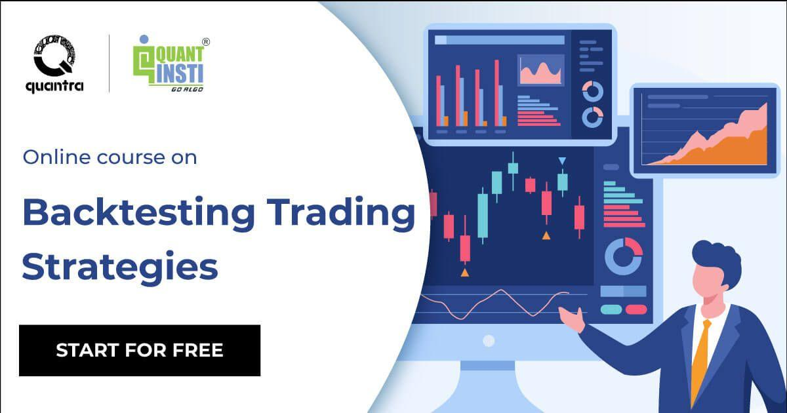

Backtesting is a critical component in algorithmic trading that enables traders to evaluate their strategies using historical data. This process is fundamental to assessing the potential success and viability of trading strategies before deploying them in live market conditions. By simulating trades with past data, traders can obtain a clearer picture of how their strategies might perform, enhancing decision-making and risk management.

Algorithmic trading relies heavily on quantitative models and data analysis. Thus, backtesting serves as a bridge between theoretical trading models and their practical application. The retrospective nature of backtesting allows traders to identify and rectify flaws within a strategy, which ultimately improves its chances of success when exposed to real-time trading scenarios.



The importance of backtesting in algorithmic trading cannot be understated. It not only aids in refining trading strategies to maximize returns while minimizing risks but also assists in understanding the dynamics and complexities of different market environments. Through backtesting, traders can build robust strategies that stand the test of time and varying market conditions, making it an indispensable tool in the arsenal of a trader.

This article aims to provide insights into backtesting's significance and the methodologies employed in algorithmic trading. From the foundational process of strategy evaluation to advanced techniques for ensuring robustness, a comprehensive understanding of backtesting can significantly enhance a trader's ability to navigate complex financial markets effectively.

## Table of Contents

## What is Algorithmic Trading Backtesting?

Algorithmic trading backtesting is a fundamental technique used to evaluate the potential performance of trading strategies by applying them to historical market data. Through this process, traders and developers can gain insights into how a strategy might perform under various market conditions that have occurred in the past. This is crucial for understanding whether a particular strategy has the potential to be profitable before it is implemented in a live trading environment.

The core premise of backtesting is to recreate the actions of a trading strategy using past data to estimate its effectiveness. By simulating the trades and decision-making logic that the algorithm would have executed during historical periods, traders can identify possible weaknesses and strengths within their logic. The accuracy of backtesting hinges on the quality and granularity of the historical data used and the fidelity of the execution simulator to real-world trading environments.

A simple [backtesting](/wiki/backtesting) process might involve historical price data, including open, high, low, close prices, along with [volume](/wiki/volume-trading-strategy) and other relevant market indicators. Traders code their strategies using programming languages like Python, implementing essential logic that dictates how and when to execute trades. Here is a basic example of how one might begin implementing a backtesting framework in Python:

```python
import pandas as pd

def moving_average_strategy(data, short_window, long_window):
    signals = pd.DataFrame(index=data.index)
    signals['price'] = data['Close']
    signals['short_ma'] = data['Close'].rolling(window=short_window, min_periods=1).mean()
    signals['long_ma'] = data['Close'].rolling(window=long_window, min_periods=1).mean()
    signals['signal'] = 0.0

    signals['signal'][short_window:] = np.where(signals['short_ma'][short_window:] > 
                                                 signals['long_ma'][short_window:], 1.0, 0.0)   
    signals['positions'] = signals['signal'].diff()

    return signals

# Load historical data
data = pd.read_csv('historical_data.csv', index_col='Date', parse_dates=True)
strategy_signals = moving_average_strategy(data, short_window=40, long_window=100)
```

In this example, a simple moving average crossover strategy is developed, where buy or sell signals are generated when a short-term moving average crosses a long-term moving average. The outputs are typically a series of trades that, when evaluated, help determine the profitability of this straightforward strategy historically.

It is critical to maintain a realistic simulation of conditions during backtesting. This includes accounting for transaction costs, slippage, and other market dynamics that occur in live trading but might be absent or simplified in historical datasets. By providing a comprehensive analysis of how a strategy performs with past data, backtesting helps in making informed decisions, reducing risks, and improving the strategy before committing any capital to a live market scenario.

## Importance of Backtesting in Algo Trading

Backtesting is a crucial aspect of [algorithmic trading](/wiki/algorithmic-trading), offering the distinct advantage of allowing traders to test and refine their strategies before employing them in live markets. This process involves applying trading rules to historical data and is integral to understanding the viability of a trading strategy in diverse market conditions.

One of the primary benefits of backtesting is its ability to highlight potential strengths and weaknesses in a trading strategy. By analyzing how a strategy would have performed historically, traders can optimize their strategies for better future performance. This optimization might involve adjusting parameters, such as entry and [exit](/wiki/exit-strategy) conditions, risk management rules, or asset selections, based on the insights gained from backtesting results.

Backtesting helps quantify the effectiveness of a strategy through various performance metrics. For instance, traders commonly use metrics like the Sharpe ratio to understand risk-adjusted returns, max drawdown to assess potential financial losses, and the win rate to evaluate the reliability of trade signals. These metrics provide valuable feedback, helping traders make informed decisions about modifications and enhancements needed for their strategies.

Moreover, backtesting helps simulate countless scenarios, pushing a strategy to its limits and exposing its vulnerabilities. Identifying these weaknesses early on allows traders to address them proactively, thereby reducing the likelihood of incurring significant losses in live trading situations. Additionally, this process helps identify the most favorable market conditions for a particular strategy, offering insights into when the strategy should be employed or paused.

The iterative nature of backtesting encourages continuous improvement and adaptation. Traders must regularly update and retest their strategies to reflect changing market dynamics and ensure that their models remain relevant. This continuous refinement is essential because markets are not static; they evolve due to various factors, including economic shifts, regulatory changes, and innovations in technology.

In conclusion, backtesting stands as a foundational element in the development and optimization of algorithmic trading strategies. It provides a systematic approach for assessing performance and fosters an environment of iterative refinement. This ensures that strategies are not only effective in historical simulations but are also robust enough to adapt to future market conditions.

## Key Components of Backtesting

In the process of backtesting, several key components are crucial for ensuring the validity and reliability of the results. These include data selection, strategy coding, statistical analysis, and result interpretation. Each of these components must be carefully managed to ensure the backtesting process accurately reflects potential real-world trading outcomes.

**Data Selection**: The foundation of effective backtesting lies in the quality and relevance of the historical data used. Choosing appropriate data involves ensuring it is clean, comprehensive, and representative of the market conditions the strategy will operate under. This includes selecting data with the correct granularity—tick, minute, or daily intervals depending on the trading strategy—and covering an adequate time span to capture various market cycles and anomalies.

**Strategy Coding**: Once data selection is complete, traders need to encode their trading strategy into a format that can be tested. This involves translating trading rules into a programming language capable of processing large datasets, such as Python. For instance, using Python's libraries, one might write a script that buys an asset when its moving average crosses above a predetermined level:

```python
import numpy as np
import pandas as pd

def moving_average_strategy(data, short_window, long_window):
    signals = pd.DataFrame(index=data.index)
    signals['signal'] = 0.0

    signals['short_mavg'] = data['close'].rolling(window=short_window, min_periods=1, center=False).mean()
    signals['long_mavg'] = data['close'].rolling(window=long_window, min_periods=1, center=False).mean()

    signals['signal'][short_window:] = np.where(signals['short_mavg'][short_window:] > signals['long_mavg'][short_window:], 1.0, 0.0)
    signals['positions'] = signals['signal'].diff()

    return signals
```

**Statistical Analysis**: This component involves evaluating the performance of the strategy through various metrics. Key performance indicators include the Sharpe ratio, which measures risk-adjusted returns, and maximum drawdown, indicating the largest peak-to-trough decline in portfolio value. Utilizing these metrics helps traders understand the risk-return profile of their strategy.

$$
\text{Sharpe Ratio} = \frac{E[R_p - R_f]}{\sigma_p}
$$

Where $E[R_p - R_f]$ is the expected return of the portfolio above the risk-free rate, and $\sigma_p$ is the standard deviation of the portfolio's excess return.

**Result Interpretation**: The final component of backtesting is interpreting the results to make informed decisions about strategy deployment. It requires analyzing the statistical outputs to identify patterns, assess risk management effectiveness, and evaluate how external factors influenced performance. This step often involves refining the strategy to address identified weaknesses and enhance strengths, making the transition from hypothetical to practical implementation more seamless. 

Overall, each component of backtesting plays an integral role in ensuring the process not only reflects historical performance but also aids in the strategic refinement necessary for success in live trading environments.

## Common Biases in Backtesting

In algorithmic trading, backtesting serves as a fundamental tool for assessing the viability of trading strategies before their implementation in live markets. However, the accuracy and reliability of backtesting results can be compromised by several inherent biases. Recognizing and mitigating these biases is crucial for traders to ensure that their strategies are robust and reliable.

Optimization bias, also known as overfitting, occurs when a trading strategy is excessively fine-tuned to yield positive results based on historical data. This can lead to a strategy that performs well during backtesting but fails in live trading due to its lack of adaptability to new data. A practical approach to minimize optimization bias is to use out-of-sample testing. By dividing historical data into in-sample data for strategy development and out-of-sample data for testing, traders can verify the strategy's ability to perform on data it was not optimized for.

Look-ahead bias is another critical issue that can skew backtesting results. It arises when the strategy improperly references future data during the analysis of past data, something that would not be available in real-time trading. To mitigate this bias, rigorous coding practices are essential. For example, in Python, traders should ensure that their algorithms do not access future data points unintentionally:

```python
# Example avoiding look-ahead bias
import pandas as pd

# Sample data
data = pd.DataFrame({'price': [100, 102, 101, 105, 107]})
data['future_price'] = data['price'].shift(-1)  # Improper look-ahead

# Correct approach: Avoid using 'future_price' in analysis
```

Survivorship bias occurs when backtesting is conducted using data that only includes firms that have survived until the end of the analysis period. This can lead to overly optimistic results, as it ignores companies that may have failed or exited during the period. Utilizing complete datasets that account for delisted stocks and corporate actions, or using adjusted indices, can help address this bias.

Effective backtesting practices require traders to implement robust data handling techniques and a disciplined approach to coding and strategy evaluation. Additionally, techniques such as walk-forward analysis can complement backtesting by allowing traders to simulate the re-calibration and testing of strategies in a way that mimics the evolving market environment. By understanding and addressing these biases, traders can enhance the validity of their backtesting outcomes and increase the likelihood of success in live trading.

## Tools and Software for Backtesting

Algorithmic trading backtesting relies heavily on specialized tools and software to execute strategies accurately and efficiently. Among the most popular tools are Python libraries like Backtrader, Zipline, and QuantConnect, each offering unique features tailored to different user needs.

**Backtrader** is praised for its flexibility and extensive documentation, making it a favorite among both beginners and advanced traders. It supports multiple data feeds and features built-in indicators essential for technical analysis. Users can write strategy logic in Python, benefitting from its readability and extensive ecosystem. A simple moving average crossover strategy in Backtrader might look like this:

```python
import backtrader as bt

class SmaCross(bt.SignalStrategy):
    def __init__(self):
        sma1 = bt.ind.SMA(period=10)
        sma2 = bt.ind.SMA(period=30)
        self.signal_add(bt.SIGNAL_LONG, sma1 > sma2)
        self.signal_add(bt.SIGNAL_SHORT, sma1 < sma2)

cerebro = bt.Cerebro()
cerebro.addstrategy(SmaCross)
# Assuming 'data' is a preloaded dataset
cerebro.adddata(data)
cerebro.run()
```

**Zipline** is another robust backtesting library developed by Quantopian. It provides a high-level API that simplifies the process of creating and testing trading algorithms. It's particularly known for its built-in functionalities and integration with data sources, making it a comprehensive tool for serious quants. However, it has become less prominent as Quantopian, its original sponsor, has ceased operations.

**QuantConnect** serves as a cloud-based alternative, offering an extensive algorithm library and a community-driven approach. It facilitates algorithm development using multiple languages, including Python and C#. Its cloud infrastructure computes backtests at scale, providing speed and convenience, especially for computationally intensive strategies. QuantConnect's LEAN engine is its core, offering features such as seamless data integration and robust risk management tools.

When choosing a backtesting tool, several factors should be considered. **Ease of use** is critical, especially for non-programmers or beginners, which makes Backtrader a common starting choice due to its intuitive design. **Customization** is another vital [factor](/wiki/factor-investing); experienced developers might favor tools that allow for in-depth strategy development and testing. **Speed** is significant, especially in high-frequency trading scenarios where milliseconds matter—QuantConnect's cloud facility shines in this regard. Lastly, a trader’s **programming skills** influence the decision; those comfortable with a particular language or seeking specific features may naturally gravitate towards a tool that aligns with their skill set and trading requirements.

Overall, the selection of backtesting software is deeply influenced by individual needs and strategy complexity, necessitating a thoughtful consideration of the aforementioned aspects.

## Performance Analysis and Optimization

Performance analysis and optimization are crucial steps in the backtesting process, providing traders with quantitative measures to evaluate the effectiveness and reliability of their trading strategies. Understanding these metrics allows traders to make informed decisions about whether a strategy is worth pursuing or requires adjustments.

### Performance Metrics

1. **Sharpe Ratio**: One of the most widely-used metrics, the Sharpe ratio evaluates the risk-adjusted returns of a trading strategy. It is defined as:
$$
   \text{Sharpe Ratio} = \frac{E[R] - R_f}{\sigma}

$$

   where $E[R]$ is the expected return of the strategy, $R_f$ is the risk-free rate, and $\sigma$ is the standard deviation of the excess returns. A higher Sharpe ratio generally indicates a more desirable risk-reward profile.

2. **Drawdowns**: A drawdown measures the peak-to-trough decline in the value of a trading account during a specific period. Analyzing drawdowns helps in assessing the risk of downturns and the potential loss during bear markets. The maximum drawdown is a critical figure traders consider for risk management.

3. **Win Rate**: This metric quantifies how often the strategy produces profitable trades. It is calculated as the ratio of profitable trades to the total number of trades. While a high win rate is desirable, it should be evaluated alongside other metrics like profit factor and average win/loss ratio to ensure the strategy is not merely achieving frequent but small gains while incurring large losses.

### Optimization

Optimization involves fine-tuning parameters to enhance the performance of a trading strategy but must be approached with caution to avoid overfitting—a scenario where a model learns the noise of the historical data rather than capturing the underlying market conditions. Overfitted strategies often perform poorly in live trading.

#### Overfitting Prevention

1. **Cross-validation**: This technique involves partitioning data into subsets and testing the strategy's performance across these subsets to ensure it generalizes well to unseen data.

2. **Regularization**: Implementing regularization techniques, such as L1 or L2 penalties, can prevent a model from becoming too complex and sensitive to noise.

3. **Walk-forward Optimization**: Uses an iterative testing process by applying the strategy to a portion of the data, optimizing it, and then validating on the remaining out-of-sample data. This method simulates how the strategy adapts to new data and helps in mitigating overfitting.

By applying these metrics and techniques, traders can refine their algorithmic strategies to achieve optimal performance in live market conditions, maintaining a strategic edge over constantly evolving market dynamics.

## Advanced Backtesting Techniques

Advanced backtesting techniques such as out-of-sample testing and walk-forward analysis are critical for validating the robustness and reliability of trading strategies in algorithmic trading. These methods aim to prevent overfitting—a common issue where a model is excessively tailored to past data, leading to poor performance on new data. By employing these techniques, traders can ensure that their strategies are not only effective on historical data but also adaptable to future market conditions.

Out-of-sample testing involves dividing historical data into two segments: in-sample and out-of-sample. The in-sample data is used to develop and optimize the trading strategy, while the out-of-sample data is reserved for testing the strategy's performance. This approach provides an unbiased evaluation of the strategy's effectiveness on unseen data and gauges its ability to generalize to new market conditions. The basic process can be represented as:

1. Split the data into in-sample and out-of-sample sets.
2. Optimize the strategy using the in-sample data.
3. Evaluate the optimized strategy using the out-of-sample data.

Walk-forward analysis expands on the concept of out-of-sample testing by employing a rolling or sliding window approach to simulate real-time trading conditions. The key steps in walk-forward analysis include:

1. Select an initial set of in-sample and out-of-sample periods.
2. Develop and optimize the strategy using the in-sample data.
3. Test the strategy on the subsequent out-of-sample data.
4. Advance the window forward by a set period and repeat the process.

This iterative process provides a more dynamic view of the strategy's performance across different time frames and market conditions, enhancing its robustness. Traders can implement walk-forward analysis in Python with pseudocode as follows:

```python
def walk_forward_analysis(data, in_sample_size, out_sample_size):
    results = []
    start = 0
    while start + in_sample_size + out_sample_size <= len(data):
        in_sample_data = data[start : start + in_sample_size]
        out_sample_data = data[start + in_sample_size : start + in_sample_size + out_sample_size]

        # Develop and optimize the strategy on in-sample data
        strategy = optimize_strategy(in_sample_data)

        # Test the strategy on out-of-sample data
        performance = evaluate_strategy(strategy, out_sample_data)

        results.append(performance)

        # Move the window forward
        start += out_sample_size

    return results
```

Both out-of-sample testing and walk-forward analysis are essential for developing robust trading strategies. By ensuring the strategy maintains its performance on new, unseen data, traders can improve their confidence in deploying these strategies in live trading scenarios, potentially leading to more sustainable trading success.

## Case Study: Mean-Reversion Strategy

A mean-reversion strategy capitalizes on the assumption that asset prices will revert to their historical mean or average level over time. This strategy involves identifying overbought or oversold conditions and taking positions against the current market trend with the expectation that prices will revert to a mean.

**Step 1: Data Collection**

For this case study, we use historical daily closing prices of a stock index, such as the S&P 500, over a period of five years. This dataset should be clean, without missing values, and adjusted for dividends and stock splits.

**Step 2: Strategy Definition**

A typical mean-reversion strategy might involve the use of the Bollinger Bands, which consist of a moving average and two standard deviation lines (upper and lower). The core rules for this strategy can be defined as follows:
- **Buy Signal**: Enter a long position when the asset price crosses below the lower Bollinger Band.
- **Sell Signal**: Enter a short position when the asset price crosses above the upper Bollinger Band.

Mathematically, Bollinger Bands are defined as:
$$
\text{Upper Band} = \text{MA}(P) + (k \cdot \sigma(P))
$$
$$
\text{Lower Band} = \text{MA}(P) - (k \cdot \sigma(P))
$$
Where:
- $\text{MA}(P)$ is the moving average of the price.
- $\sigma(P)$ is the standard deviation of the price.
- $k$ is a constant, typically set at 2.

**Step 3: Backtesting the Strategy**

For backtesting, Python provides efficient libraries such as Backtrader. Below is a simplified version of a backtesting script using these principles:

```python
import backtrader as bt
import pandas as pd

class MeanReversionStrategy(bt.Strategy):
    params = (('period', 20), ('devfactor', 2.0),)

    def __init__(self):
        self.boll = bt.indicators.BollingerBands(self.data.close,
                                                 period=self.params.period,
                                                 devfactor=self.params.devfactor)

    def next(self):
        if not self.position:  # Check if there is no open position
            if self.data.close < self.boll.lines.bot:
                self.buy()  # Buy signal
            elif self.data.close > self.boll.lines.top:
                self.sell()  # Sell signal
        else:
            if self.position.size > 0 and self.data.close > self.boll.lines.mid:
                self.close()  # Close if in long position and price crosses moving average
            elif self.position.size < 0 and self.data.close < self.boll.lines.mid:
                self.close()  # Close if in short position and price crosses moving average

# Load historical data
data = bt.feeds.GenericCSVData(
    dataname='sp500_daily.csv',
    dtformat='%Y-%m-%d',
    datetime=0,
    high=2,
    low=3,
    open=1,
    close=4,
    volume=5,
    openinterest=-1,
)

# Initialize Cerebro engine
cerebro = bt.Cerebro()
cerebro.adddata(data)
cerebro.addstrategy(MeanReversionStrategy)
cerebro.run()
cerebro.plot()
```

**Step 4: Performance Evaluation**

After running the backtest, performance metrics such as total returns, maximum drawdown, and Sharpe ratio should be evaluated to determine the strategy's effectiveness. A detailed analysis will reveal periods of profitability and loss, helping to refine the strategy further.

**Step 5: Strategy Refinement**

Based on the backtest results, refine the strategy by adjusting parameters such as the moving average period or the deviation factor. Additional filters such as volume or other technical indicators could also be integrated to improve robustness.

This case study showcases the practical implementation of a mean-reversion strategy, highlighting the importance of systematic backtesting in evaluating and optimizing trading strategies to achieve consistent results.

## Conclusion

Backtesting emerges as an indispensable tool for algorithmic traders, facilitating the development and refinement of trading strategies by simulating their performance using historical market data. It serves as a crucial step in ensuring strategies are not only theoretically sound but also practically viable in real-world scenarios. The insights gained from backtesting allow traders to optimize their methodologies, identify potential weaknesses, and refine strategies prior to live deployment.

To maintain the efficacy of trading strategies, continuous refinement and iterative testing are paramount. Market conditions are inherently dynamic, influenced by a myriad of factors such as economic shifts, geopolitical events, and evolving market participants. Hence, a strategy that performs well in a past market condition might not yield similar results in the future. Regular backtesting and strategy updates ensure that these algorithms remain aligned with current market trends and participant behaviors.

Furthermore, the incorporation of advanced techniques such as walk-forward analysis and out-of-sample testing enhances the robustness of a strategy, mitigating the risks associated with overfitting to historical data. By validating strategies against unseen data, traders can increase the likelihood of strategies performing effectively in live markets.

In summary, backtesting is more than just a preparatory step; it is a continuous process of validation and improvement, essential for sustaining strategy performance amid ever-changing market landscapes. Through rigorous backtesting and ongoing refinement, algorithmic traders can bolster their strategic edge and adapt to new challenges presented by the financial markets.

## References & Further Reading

[1]: ["Advances in Financial Machine Learning"](https://www.amazon.com/Advances-Financial-Machine-Learning-Marcos/dp/1119482089) by Marcos Lopez de Prado

[2]: ["Evidence-Based Technical Analysis: Applying the Scientific Method and Statistical Inference to Trading Signals"](https://www.amazon.com/Evidence-Based-Technical-Analysis-Scientific-Statistical/dp/0470008741) by David Aronson

[3]: ["Machine Learning for Algorithmic Trading"](https://github.com/stefan-jansen/machine-learning-for-trading) by Stefan Jansen

[4]: ["Quantitative Trading: How to Build Your Own Algorithmic Trading Business"](https://books.google.com/books/about/Quantitative_Trading.html?id=j70yEAAAQBAJ) by Ernest P. Chan

[5]: Pardo, R. (2008). ["The Evaluation and Optimization of Trading Strategies."](https://onlinelibrary.wiley.com/doi/book/10.1002/9781119196969) Wiley Trading.

[6]: Cartea, A., Jaimungal, S., & Penalva, J. (2015). ["Algorithmic and High-Frequency Trading."](https://assets.cambridge.org/97811070/91146/frontmatter/9781107091146_frontmatter.pdf) Cambridge University Press.

[7]: Chan, E. P. (2013). ["Algorithmic Trading: Winning Strategies and Their Rationale."](https://github.com/hudson-and-thames/arbitragelab/blob/master/docs/source/cointegration_approach/cointegration_tests.rst) Wiley Trading.