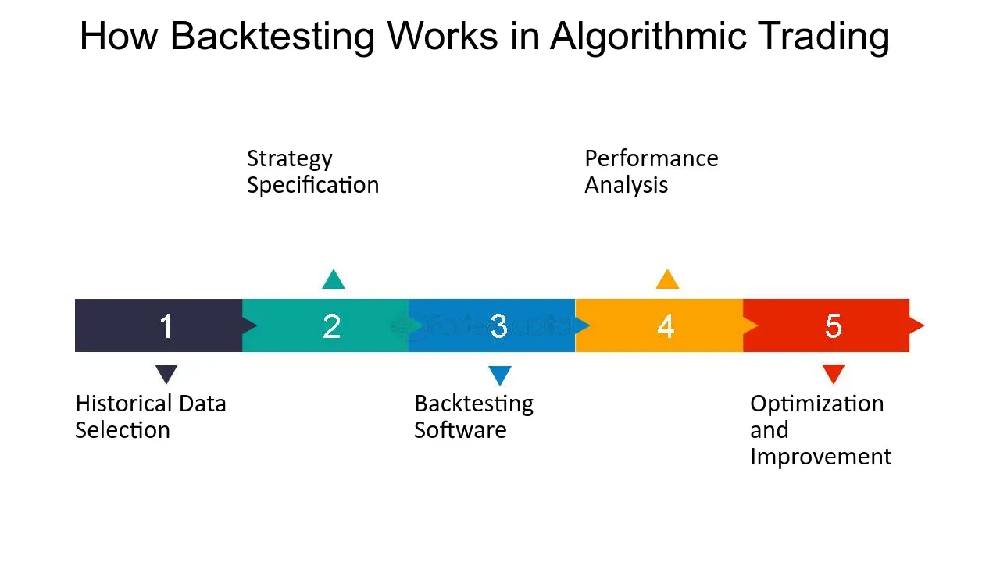

## Table of Contents

## What is backtesting in the context of algorithmic trading?

Backtesting in algorithmic trading is when you test a trading strategy using historical data. It's like trying to see if your strategy would have worked well in the past. By looking at old market data, you can see how your strategy would have performed if you had used it back then. This helps you understand if your strategy is good or if it needs changes before you use it with real money.

The process involves feeding historical price data into your trading algorithm to simulate trades. You can then analyze the results to see if the strategy made profits or losses. This is important because it helps you spot any problems or mistakes in your strategy. However, it's worth remembering that past results don't guarantee future success, as markets can change and behave differently over time.

## Why is backtesting important for developing trading strategies?

Backtesting is important for developing trading strategies because it lets you see how your strategy would have worked in the past. By using old market data, you can pretend to trade and see if your strategy would have made money or lost money. This helps you figure out if your strategy is good or if it needs to be changed before you start using real money. It's like practicing before a big game; you want to make sure your plan works before you play for real.

Another reason backtesting is important is that it helps you find problems in your strategy. When you test your strategy with historical data, you might see that it doesn't work well in certain situations or that it makes big losses sometimes. This gives you a chance to fix these issues before you start trading for real. But remember, even if your strategy did well in the past, it doesn't mean it will work the same way in the future. Markets can change, so always be ready to adjust your strategy.

## What are the basic steps involved in backtesting a trading strategy?

To start backtesting a trading strategy, first, you need to pick the historical data you want to use. This data should match the markets and time periods you plan to trade in. Once you have your data, you set up your trading rules. These rules tell your strategy when to buy and sell. Make sure your rules are clear so your strategy knows what to do with the data.

Next, you run your strategy on the historical data. This means letting your strategy pretend to trade using the old prices. You watch how it performs, seeing if it makes money or loses money. After the backtest is done, you look at the results. You check if your strategy made a profit and how it did during different market conditions. If there are problems, like big losses or times when it didn't work well, you can change your rules to make it better.

Finally, it's important to test your strategy many times with different sets of data. This helps you see if your strategy works well in different situations. Remember, even if your strategy did well in the past, it might not work the same way in the future. Markets change, so keep learning and adjusting your strategy to stay successful.

## How do you select historical data for backtesting?

When you want to backtest a trading strategy, you need to pick the right historical data. This means choosing data that matches the markets and time periods you plan to trade in. For example, if you want to trade stocks, you should use historical stock prices. If you're looking at a specific time frame, like daily or hourly data, make sure your data matches that. It's also important to use enough data to cover different market conditions, like bull markets, bear markets, and times when the market is calm or very volatile.

Once you have your data, think about how clean and accurate it is. Sometimes, data can have mistakes or missing parts, which can mess up your backtest. Make sure your data is from a good source and covers a long enough time to give you a clear picture of how your strategy might work. Using data from different periods and conditions helps you see if your strategy can handle changes in the market. Remember, the better your data, the more reliable your backtest results will be.

## What common pitfalls should beginners avoid when backtesting?

One common mistake beginners make when backtesting is using too little data. If you only test your strategy with a short period of time or just one market condition, you might think your strategy is great when it's not. It's important to use data from many different times and situations so you can see how your strategy works in all kinds of markets. This helps you avoid being surprised by changes in the market that your strategy can't handle.

Another pitfall is not checking for overfitting. Overfitting happens when you change your strategy too much to fit the past data perfectly, but then it doesn't work well in the future. Beginners might keep tweaking their strategy until it looks perfect in the backtest, but this can make it useless in real trading. It's better to keep your strategy simple and make sure it works well across different sets of data, not just one perfect set.

Lastly, beginners often forget to account for real-world costs like transaction fees and slippage. These costs can eat into your profits, and if you don't include them in your backtest, you might think your strategy is more profitable than it really is. Always make sure to include these costs to get a more accurate picture of how your strategy will perform in the real world.

## How can you ensure the statistical significance of backtest results?

To make sure your backtest results are statistically significant, you need to use enough data. This means testing your strategy over a long time and in different market conditions. If you only use a little bit of data, your results might not be reliable. You could get lucky or unlucky with a short period, but using more data helps you see the true performance of your strategy. Also, it's good to split your data into different parts, like using some for testing and some for checking if your results hold up. This way, you can be more confident that your strategy will work in the future.

Another important thing is to avoid overfitting. Overfitting happens when you adjust your strategy too much to fit the past data perfectly, but then it doesn't work well in the future. To prevent this, keep your strategy simple and test it with different sets of data. If your strategy performs well across various data sets, it's more likely to be statistically significant. Also, use statistical tests like the t-test or p-value to see if your results are due to chance or if they really mean something. These tests can help you understand if your strategy's performance is reliable or just a fluke.

## What metrics should be used to evaluate the performance of a backtested strategy?

When you backtest a trading strategy, you need to look at different numbers to see how well it did. One important number is the total return, which tells you how much money your strategy made or lost over time. Another useful number is the Sharpe ratio, which shows how much return you got for the risk you took. If the Sharpe ratio is high, it means your strategy did well compared to how risky it was. You should also check the drawdown, which is the biggest drop in your account value. A smaller drawdown means your strategy was more stable and didn't lose too much money at once.

Another set of numbers to look at are the win rate and the risk-reward ratio. The win rate tells you how often your trades made money, while the risk-reward ratio shows how much you could win compared to how much you could lose on each trade. A good strategy should have a high win rate and a risk-reward ratio that's at least 1:1, but ideally higher. Lastly, consider the turnover rate, which shows how often you're trading. A high turnover rate can mean more transaction costs, so you want to make sure these costs don't eat into your profits too much. By looking at all these numbers together, you can get a good idea of how well your backtested strategy might work in the real world.

## How can you adjust for overfitting when backtesting trading strategies?

To avoid overfitting when backtesting trading strategies, you need to keep your strategy simple. Overfitting happens when you change your strategy too much to fit the past data perfectly, but then it doesn't work well in the future. Instead of making lots of small changes to make your strategy look perfect in the backtest, try to keep it straightforward. Use fewer rules and don't tweak them too much. This way, your strategy is more likely to work well in different market conditions, not just the ones you used for backtesting.

Another way to adjust for overfitting is to use different sets of data for testing and validation. Split your historical data into two parts: one for testing your strategy and another for checking if it still works. If your strategy performs well on both sets of data, it's less likely to be overfitted. Also, try to test your strategy on data from different time periods and market conditions. If it works well across all these different situations, you can be more confident that it's not just tailored to one specific set of data. This helps make sure your strategy will be useful in the real world, not just in your backtest.

## What role does forward testing play after backtesting?

After you backtest your trading strategy, forward testing is the next step to make sure it works in the real world. Backtesting uses old data to see how your strategy would have done in the past, but forward testing uses live data to see how it does right now. This is important because markets change over time, and what worked before might not work the same way now. Forward testing helps you see if your strategy can handle current market conditions and if it's ready for real trading.

Forward testing usually involves trading with a small amount of money or using a demo account. This way, you can see how your strategy performs without risking too much. If your strategy does well in forward testing, it's a good sign that it might work when you start trading for real. But if it doesn't do well, you'll need to go back and adjust your strategy based on what you learned. Forward testing is like a final check to make sure your strategy is ready for the real world.

## How do you incorporate transaction costs and slippage into backtesting?

When you backtest a trading strategy, it's important to include transaction costs and slippage to make your results more realistic. Transaction costs are the fees you pay every time you buy or sell something. These can be things like broker fees or commissions. Slippage is when the price you want to trade at is different from the price you actually get. This can happen because markets move fast or because there isn't enough of what you want to buy or sell at the exact price you want. By adding these costs to your backtest, you get a better idea of how much money your strategy might really make or lose.

To include transaction costs and slippage in your backtest, you need to estimate how much they might be for each trade. You can use average fees from your broker or look at historical data to see how much slippage usually happens. Once you have these numbers, you can subtract them from your profits or add them to your losses in your backtest. This way, you see a more accurate picture of your strategy's performance. It helps you understand if your strategy can still make money even after paying these extra costs.

## What advanced techniques can be used to enhance the realism of backtesting?

To make backtesting more realistic, you can use something called walk-forward optimization. This means you split your historical data into smaller parts and test your strategy on one part at a time. After each test, you can make small changes to your strategy based on what you learned. Then, you move to the next part of the data and test again. This way, you're always testing your strategy on new data, which is more like how the real market works. It helps you see if your strategy can adapt to changing market conditions and makes your backtest results more reliable.

Another advanced technique is to use Monte Carlo simulations. This method uses random numbers to create many different versions of your historical data. By running your strategy on all these different versions, you can see how it might perform in lots of different situations. This helps you understand how sensitive your strategy is to changes in the market. It also gives you a better idea of the risks involved and how likely your strategy is to make money or lose money. Using Monte Carlo simulations can make your backtest more realistic by showing you a wider range of possible outcomes.

## How can machine learning be integrated into backtesting processes for better strategy optimization?

Machine learning can help make backtesting better by finding patterns in data that people might miss. You can use machine learning to look at lots of historical market data and find out what factors affect how well your trading strategy does. This means you can keep changing your strategy to make it work better as the market changes. Machine learning can also try out many different versions of your strategy really fast, which helps you find the best one without having to do all the work by hand. This makes your backtesting more thorough and helps you come up with a strategy that's more likely to work well in the real world.

Another way machine learning can help is by using something called reinforcement learning. This is when the machine learning model learns by doing, kind of like playing a game. It tries different trading actions and sees what happens, then it gets better over time by figuring out which actions make the most money. This can make your backtesting smarter because the model can learn from its mistakes and keep getting better. By using machine learning, you can make your backtesting process more advanced and find trading strategies that are more likely to succeed in the ever-changing market.

## What are the key components of backtesting?

In the process of backtesting, several key components are crucial for ensuring the validity and reliability of the results. These include data selection, strategy coding, statistical analysis, and result interpretation. Each of these components must be carefully managed to ensure the backtesting process accurately reflects potential real-world trading outcomes.

**Data Selection**: The foundation of effective backtesting lies in the quality and relevance of the historical data used. Choosing appropriate data involves ensuring it is clean, comprehensive, and representative of the market conditions the strategy will operate under. This includes selecting data with the correct granularity—tick, minute, or daily intervals depending on the trading strategy—and covering an adequate time span to capture various market cycles and anomalies.

**Strategy Coding**: Once data selection is complete, traders need to encode their trading strategy into a format that can be tested. This involves translating trading rules into a programming language capable of processing large datasets, such as Python. For instance, using Python's libraries, one might write a script that buys an asset when its moving average crosses above a predetermined level:

```python
import numpy as np
import pandas as pd

def moving_average_strategy(data, short_window, long_window):
    signals = pd.DataFrame(index=data.index)
    signals['signal'] = 0.0

    signals['short_mavg'] = data['close'].rolling(window=short_window, min_periods=1, center=False).mean()
    signals['long_mavg'] = data['close'].rolling(window=long_window, min_periods=1, center=False).mean()

    signals['signal'][short_window:] = np.where(signals['short_mavg'][short_window:] > signals['long_mavg'][short_window:], 1.0, 0.0)
    signals['positions'] = signals['signal'].diff()

    return signals
```

**Statistical Analysis**: This component involves evaluating the performance of the strategy through various metrics. Key performance indicators include the Sharpe ratio, which measures risk-adjusted returns, and maximum drawdown, indicating the largest peak-to-trough decline in portfolio value. Utilizing these metrics helps traders understand the risk-return profile of their strategy.

$$
\text{Sharpe Ratio} = \frac{E[R_p - R_f]}{\sigma_p}
$$

Where $E[R_p - R_f]$ is the expected return of the portfolio above the risk-free rate, and $\sigma_p$ is the standard deviation of the portfolio's excess return.

**Result Interpretation**: The final component of backtesting is interpreting the results to make informed decisions about strategy deployment. It requires analyzing the statistical outputs to identify patterns, assess risk management effectiveness, and evaluate how external factors influenced performance. This step often involves refining the strategy to address identified weaknesses and enhance strengths, making the transition from hypothetical to practical implementation more seamless. 

Overall, each component of backtesting plays an integral role in ensuring the process not only reflects historical performance but also aids in the strategic refinement necessary for success in live trading environments.

## What is Performance Analysis and Optimization?

Performance analysis and optimization are crucial steps in the backtesting process, providing traders with quantitative measures to evaluate the effectiveness and reliability of their trading strategies. Understanding these metrics allows traders to make informed decisions about whether a strategy is worth pursuing or requires adjustments.

### Performance Metrics

1. **Sharpe Ratio**: One of the most widely-used metrics, the Sharpe ratio evaluates the risk-adjusted returns of a trading strategy. It is defined as:
$$
   \text{Sharpe Ratio} = \frac{E[R] - R_f}{\sigma}

$$

   where $E[R]$ is the expected return of the strategy, $R_f$ is the risk-free rate, and $\sigma$ is the standard deviation of the excess returns. A higher Sharpe ratio generally indicates a more desirable risk-reward profile.

2. **Drawdowns**: A drawdown measures the peak-to-trough decline in the value of a trading account during a specific period. Analyzing drawdowns helps in assessing the risk of downturns and the potential loss during bear markets. The maximum drawdown is a critical figure traders consider for risk management.

3. **Win Rate**: This metric quantifies how often the strategy produces profitable trades. It is calculated as the ratio of profitable trades to the total number of trades. While a high win rate is desirable, it should be evaluated alongside other metrics like profit factor and average win/loss ratio to ensure the strategy is not merely achieving frequent but small gains while incurring large losses.

### Optimization

Optimization involves fine-tuning parameters to enhance the performance of a trading strategy but must be approached with caution to avoid overfitting—a scenario where a model learns the noise of the historical data rather than capturing the underlying market conditions. Overfitted strategies often perform poorly in live trading.

#### Overfitting Prevention

1. **Cross-validation**: This technique involves partitioning data into subsets and testing the strategy's performance across these subsets to ensure it generalizes well to unseen data.

2. **Regularization**: Implementing regularization techniques, such as L1 or L2 penalties, can prevent a model from becoming too complex and sensitive to noise.

3. **Walk-forward Optimization**: Uses an iterative testing process by applying the strategy to a portion of the data, optimizing it, and then validating on the remaining out-of-sample data. This method simulates how the strategy adapts to new data and helps in mitigating overfitting.

By applying these metrics and techniques, traders can refine their algorithmic strategies to achieve optimal performance in live market conditions, maintaining a strategic edge over constantly evolving market dynamics.

## References & Further Reading

[1]: ["Advances in Financial Machine Learning"](https://www.amazon.com/Advances-Financial-Machine-Learning-Marcos/dp/1119482089) by Marcos Lopez de Prado

[2]: ["Evidence-Based Technical Analysis: Applying the Scientific Method and Statistical Inference to Trading Signals"](https://www.amazon.com/Evidence-Based-Technical-Analysis-Scientific-Statistical/dp/0470008741) by David Aronson

[3]: ["Machine Learning for Algorithmic Trading"](https://github.com/stefan-jansen/machine-learning-for-trading) by Stefan Jansen

[4]: ["Quantitative Trading: How to Build Your Own Algorithmic Trading Business"](https://books.google.com/books/about/Quantitative_Trading.html?id=j70yEAAAQBAJ) by Ernest P. Chan

[5]: Pardo, R. (2008). ["The Evaluation and Optimization of Trading Strategies."](https://onlinelibrary.wiley.com/doi/book/10.1002/9781119196969) Wiley Trading.

[6]: Cartea, A., Jaimungal, S., & Penalva, J. (2015). ["Algorithmic and High-Frequency Trading."](https://assets.cambridge.org/97811070/91146/frontmatter/9781107091146_frontmatter.pdf) Cambridge University Press.

[7]: Chan, E. P. (2013). ["Algorithmic Trading: Winning Strategies and Their Rationale."](https://github.com/hudson-and-thames/arbitragelab/blob/master/docs/source/cointegration_approach/cointegration_tests.rst) Wiley Trading.