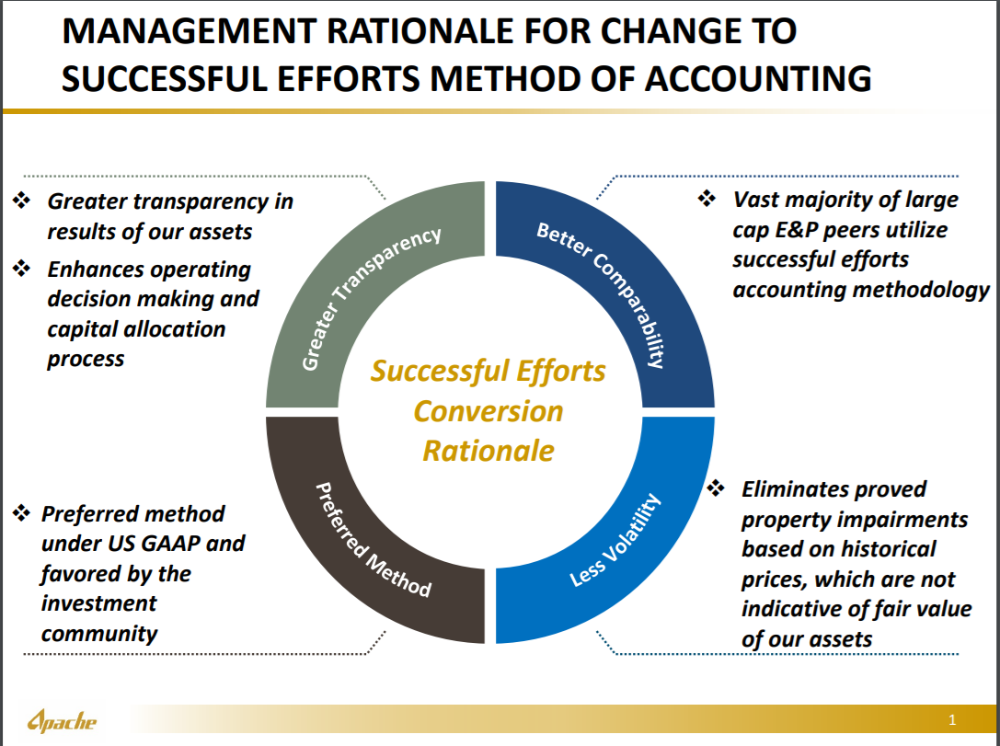

## Table of Contents

## What is Successful Efforts accounting?

Successful Efforts accounting is a method used by oil and gas companies to record their exploration costs. In this method, companies only capitalize the costs of successful exploration projects. This means that if a company drills a well and finds oil or gas, the costs of that drilling can be recorded as an asset on the balance sheet. However, if the exploration does not find any oil or gas, those costs are immediately written off as an expense. This approach can make a company's financial performance look more volatile because unsuccessful explorations directly impact the income statement.

This method contrasts with Full Cost accounting, where all exploration costs, whether successful or not, are capitalized. Successful Efforts accounting is favored by some because it is seen as more conservative and provides a clearer picture of the actual value of a company's assets. It is also required by some accounting standards, like those set by the U.S. Securities and Exchange Commission (SEC). However, it can make it harder for smaller companies to show profits, as they might have more unsuccessful explorations and thus more immediate expenses.

## What is Full Cost accounting?

Full Cost accounting is a way that oil and gas companies keep track of their money spent on looking for oil and gas. With this method, companies add up all the costs of looking for oil and gas, even if they don't find any. They put all these costs on their balance sheet as assets, not just the costs of the successful projects. This means that if a company drills a well and doesn't find oil or gas, they still keep those costs on their books, hoping to spread them out over time.

This way of accounting can make a company's financial reports look smoother because the costs of unsuccessful searches are spread out instead of being a big expense right away. But it can also make it harder to see how well a company is really doing, because all the costs are counted as assets, even if they might not lead to any oil or gas being found. Full Cost accounting is different from Successful Efforts accounting, where only the costs of successful projects are kept as assets, and the costs of unsuccessful projects are taken as an expense right away.

## How do Successful Efforts and Full Cost accounting differ?

Successful Efforts and Full Cost accounting are two different ways that oil and gas companies handle the costs of looking for oil and gas. With Successful Efforts accounting, companies only keep the costs of successful projects as assets on their balance sheet. If they drill a well and find oil or gas, those costs are seen as valuable and kept as assets. But if they drill and don't find anything, those costs are taken as an expense right away. This method can make a company's financial reports look more up and down because the costs of unsuccessful projects hit the income statement immediately.

On the other hand, Full Cost accounting lets companies keep all the costs of looking for oil and gas as assets, no matter if they find oil or gas or not. If a company drills a well and doesn't find anything, they still keep those costs on their [books](/wiki/algo-trading-books), hoping to spread them out over time. This method can make a company's financial reports look smoother because the costs of unsuccessful searches are spread out instead of being a big expense right away. But it can also make it harder to see how well a company is really doing, because all the costs are counted as assets, even if they might not lead to any oil or gas being found.

## What industries commonly use Successful Efforts accounting?

Successful Efforts accounting is mainly used by companies in the oil and gas industry. These companies explore for oil and gas, and this method helps them keep track of their money spent on these projects. With Successful Efforts accounting, they only count the costs of the projects that find oil or gas as assets. If they don't find anything, those costs are taken as an expense right away. This way of accounting is liked by some because it shows a clearer picture of what the company really has.

This method is also used by some mining companies. Like oil and gas companies, mining companies look for valuable minerals and metals. They use Successful Efforts accounting to only keep the costs of successful projects as assets. If they dig and don't find anything useful, those costs are seen as an expense right away. This helps these companies show a more accurate view of their financial health.

## What industries commonly use Full Cost accounting?

Full Cost accounting is mainly used by companies in the oil and gas industry. These companies look for oil and gas, and with Full Cost accounting, they can keep all the costs of their searches as assets, even if they don't find anything. This means if they drill a well and don't find oil or gas, they still keep those costs on their books, hoping to spread them out over time. This way of accounting can make their financial reports look smoother because the costs of unsuccessful searches are spread out instead of being a big expense right away.

Some mining companies also use Full Cost accounting. These companies search for valuable minerals and metals. With Full Cost accounting, they can keep all the costs of their searches as assets, no matter if they find anything or not. If they dig and don't find anything useful, they still keep those costs on their books, hoping to spread them out over time. This method can make their financial reports look more stable because the costs of unsuccessful searches are spread out instead of being a big expense right away.

## What are the advantages of using Successful Efforts accounting?

Successful Efforts accounting helps oil and gas companies show a clearer picture of what they really have. When they find oil or gas, the costs of drilling are kept as assets on their balance sheet. But if they don't find anything, those costs are taken as an expense right away. This way, the company's financial reports only show the value of the projects that actually work out. It's like only counting the money you make from selling apples that grow on your trees, not the ones that fall and rot.

This method is also liked by some because it's seen as more careful and honest. It follows rules set by groups like the U.S. Securities and Exchange Commission (SEC). By only keeping the costs of successful projects as assets, it's easier to see how well a company is really doing. But it can make a company's financial reports look more up and down because the costs of unsuccessful projects hit the income statement right away. It's like having a clear view of your money, but it might show big changes from one time to another.

## What are the advantages of using Full Cost accounting?

Full Cost accounting helps oil and gas companies make their financial reports look smoother. When they look for oil or gas, they can keep all the costs of their searches as assets, even if they don't find anything. This means if they drill a well and it's empty, they still keep those costs on their books, hoping to spread them out over time. It's like saving up all the money you spend on trying new things, even if they don't work out, so your money picture doesn't look too bumpy.

This method can make it easier for smaller companies to show they're doing well. Since they can spread out the costs of unsuccessful searches, their financial reports might look more stable. It's like putting all your eggs in one basket and hoping that over time, some of them will hatch. But it can also make it harder to see how well a company is really doing, because all the costs are counted as assets, even if they might not lead to any oil or gas being found.

## What are the potential drawbacks of Successful Efforts accounting?

One big problem with Successful Efforts accounting is that it can make a company's money reports look up and down. When they look for oil or gas and don't find anything, they have to count those costs as an expense right away. This can make their money picture look bad quickly, even if they're doing okay overall. It's like if you tried to sell apples and some of them went bad, you'd have to show that loss right away, which might make it seem like you're not doing well, even if you're selling lots of good apples too.

Another issue is that it can be hard for smaller companies. They might not find oil or gas as often as bigger companies, so they end up having to count more costs as expenses right away. This can make it tough for them to show they're making money, even if they're working hard and doing their best. It's like if you're a small farmer and you have a few bad crops, it can make it look like you're not doing well, even if you're trying your hardest to grow good food.

## What are the potential drawbacks of Full Cost accounting?

One big problem with Full Cost accounting is that it can make it hard to see how well a company is really doing. When they look for oil or gas and don't find anything, they still keep those costs as assets. This means their money reports might look good, but it's not showing the real picture. It's like if you kept all your receipts for things that didn't work out and said you were doing well because you had a lot of receipts, even if you didn't make any money from those things.

Another issue is that it can make a company look too confident. By keeping all the costs as assets, they're hoping that over time, they'll find oil or gas to make up for the costs. But if they never find anything, those costs just sit there, making their money picture look better than it really is. It's like if you kept buying lottery tickets and said you were rich because you had a lot of tickets, even if you never won anything.

## How does the choice between Successful Efforts and Full Cost accounting impact financial reporting?

The choice between Successful Efforts and Full Cost accounting can make a big difference in how a company's money reports look. With Successful Efforts accounting, only the costs of finding oil or gas are kept as assets. If a company drills and doesn't find anything, those costs are taken as an expense right away. This can make the company's money reports look up and down because the costs of unsuccessful projects hit the income statement immediately. It's like showing all the losses from bad apples right away, which can make the company look less stable.

On the other hand, Full Cost accounting lets a company keep all the costs of looking for oil or gas as assets, no matter if they find anything or not. If they drill and don't find oil or gas, those costs are still kept on the books, hoping to spread them out over time. This can make the company's money reports look smoother because the costs of unsuccessful searches are spread out instead of being a big expense right away. But it can also hide how well the company is really doing, because all the costs are counted as assets, even if they might not lead to any oil or gas being found. It's like keeping all your receipts for things that didn't work out and saying you're doing well because you have a lot of receipts.

## Can you provide a case study where Successful Efforts accounting was more beneficial?

A good example of when Successful Efforts accounting was more helpful is with a small oil company called Wildcat Drillers Inc. They were working in a new area where finding oil was tough. They tried drilling a few wells, but most of them came up dry. With Successful Efforts accounting, they had to count the costs of those dry wells as expenses right away. This made their money reports look bad for a while, but it also showed the truth about their situation. When they finally hit a big oil find, the costs of that successful well were kept as an asset, and their money reports started looking better. This way of accounting helped them show investors exactly what was happening, which built trust and helped them get more money to keep exploring.

Another case where Successful Efforts accounting was beneficial was with a medium-sized mining company, RockFinders Ltd. They were searching for gold in a challenging region. They drilled several holes, but only one of them found gold. With Successful Efforts accounting, the costs of the unsuccessful holes were taken as expenses right away, which made their money reports look a bit unstable. However, when they found the gold, the costs of that successful hole were kept as an asset. This clear picture helped them show their investors that they were making progress, even though it was tough. It also made it easier for them to plan their next moves based on real results, not just hopes.

## Can you provide a case study where Full Cost accounting was more beneficial?

A good example of when Full Cost accounting was more helpful is with a small oil company called SteadyDrill Energy. They were exploring in an area where finding oil was hard, and they had a lot of dry wells. With Full Cost accounting, they could keep all the costs of their drilling as assets, even when they didn't find oil. This made their money reports look smoother because they could spread out the costs of the dry wells over time. It helped them keep going and not look like they were losing money right away, which was important for getting more money to keep exploring. When they finally hit oil, it made their money reports look even better because all the past costs were now part of their successful find.

Another case where Full Cost accounting helped was with a mining company called MineralQuest Ltd. They were looking for copper in a new area and had a lot of holes that didn't find anything. By using Full Cost accounting, they could keep all the costs of their drilling as assets. This made their money reports look more stable because they could spread out the costs of the unsuccessful holes over time. It was important for them to show investors that they were still doing okay, even though they hadn't found copper yet. When they finally found a big copper deposit, it made their money reports look great because all the past costs were now part of their successful find.

## References & Further Reading

[1]: Wright, C. J. (2014). ["Successful Efforts Vs. Full Cost Accounting in the Oil and Gas Industry."](https://www.researchgate.net/publication/354122104_Full_Cost_Vs_Successful_Efforts_Accounting_A_Systematic_Review) World Oil.

[2]: Spears, H. (2012). ["Advanced Accounting in the Oil and Gas Industry."](https://books.google.com/books/about/Advanced_Accounting.html?id=x3WMBAAAQBAJ) Academia.edu.

[3]: Morris, D. (2016). ["Accounting for the Oil & Gas Industry."](https://www2.deloitte.com/content/dam/Deloitte/us/Documents/energy-resources/us-oil-and-gas-accounting-financial-reporting-and-tax-update-january-2015-01162015.pdf) Oil & Gas Financial Journal.

[4]: ["Fundamentals of Oil & Gas Accounting"](https://www.amazon.com/Fundamentals-Oil-Accounting-Charlotte-Wright/dp/1593703635) by Charlotte Wright

[5]: Johnston, D., & Johnston, D. C. (2015). ["Oil and Gas Property Evaluation."](https://www.oxfordenergy.org/wpcms/wp-content/uploads/2015/02/Fundamental-Petroleum-Fiscal-Considerations.pdf) PennWell Corporation.