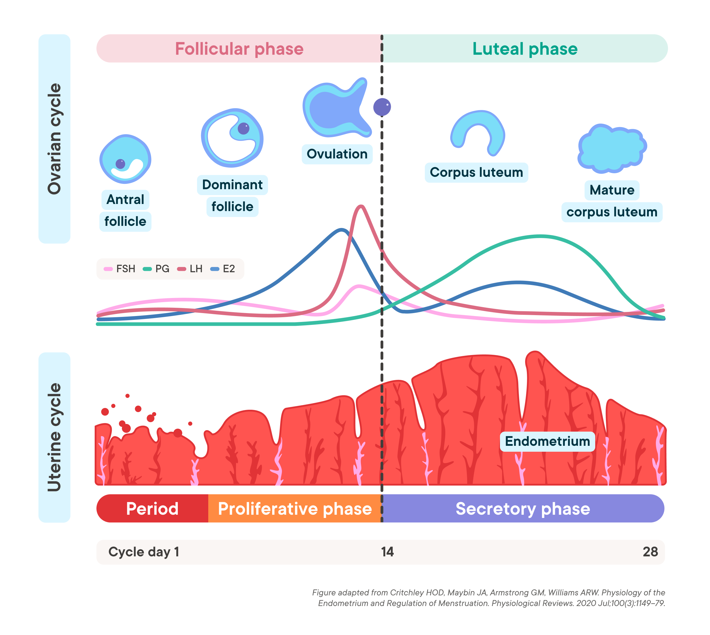

Understanding the natural rhythms of both biological and financial cycles can reveal intriguing parallels that are not immediately evident to the casual observer. These parallels offer valuable insights into two seemingly disparate fields: the menstrual cycle in biology and algorithmic trading in finance. By exploring the successive periods inherent in each, we gain a deeper understanding of how regular intervals influence decision-making processes.

The article at hand examines the concept of successive periods—defined as time intervals that follow one another in sequence—within the framework of menstrual cycles and trading algorithms. It highlights how each domain uses periodical analysis for informed decision-making. In biology, the menstrual cycle consists of phases marked by hormonal changes, crucial for fertility and health management. Understanding these changes helps predict moods, optimal health periods, and fertility windows. This cyclical nature finds an allegorical representation in algorithmic trading, where historical data and backtesting over successive periods inform strategies, ensuring robustness across diverse market conditions.



The examination begins with an analysis of the biological aspects of menstrual cycles, where hormones dictate successive phases. Following this, the article draws parallels in the financial world, where periodical market assessments guide algorithmic trading strategies. Comprehending these cycles enhances strategic approaches, whether for personal health management or financial market engagement.

By juxtaposing these fields, the exploration provides insights into optimal timing for actions, whether they pertain to health or financial decisions. Understanding these recurrent patterns offers a structured approach to improving outcomes in personal health optimizations and financial investments. Such an integrated understanding can be advantageous, offering individuals greater control over their health-related choices and investment strategies.

## Table of Contents

## Understanding Menstrual Cycles

The menstrual cycle is a complex biological process that plays a critical role in human reproduction. This cycle is divided into successive periods, each marked by distinctive hormonal changes that prepare the body for potential pregnancy. On average, the menstrual cycle spans approximately 28 days, although it can range from 21 to 35 days depending on individual variability.

The cycle is divided into four main phases: menstruation, the follicular phase, ovulation, and the luteal phase. Each phase is associated with specific hormonal fluctuations that drive various physiological changes in the body.

1. **Menstruation**: This phase begins on the first day of menstrual bleeding and typically lasts 3 to 7 days. During menstruation, the lining of the uterus (endometrium) sheds as menstruation occurs due to the drop in estrogen and progesterone levels if fertilization does not take place. This shedding marks the end of the previous cycle and the beginning of a new one.

2. **Follicular Phase**: Following menstruation, the follicular phase starts and lasts until ovulation. This phase is characterized by the growth of follicles in the ovaries stimulated by the hormone follicle-stimulating hormone (FSH). As follicles develop, they produce increasing amounts of estrogen, which helps in the regeneration of the uterine lining. The rising estrogen levels also prepare the body for ovulation by creating an environment conducive for a potential pregnancy.

3. **Ovulation**: Ovulation occurs midway through the menstrual cycle, typically around day 14 in a 28-day cycle. It is triggered by a surge in luteinizing hormone (LH) and marks the release of a mature egg from one of the follicles in the ovaries. The egg's release represents the peak of fertility within the cycle, as this is the window for potential fertilization.

4. **Luteal Phase**: The luteal phase follows ovulation and lasts until the onset of menstruation. After releasing the egg, the ruptured follicle transforms into the corpus luteum, which secretes progesterone. This hormone further thickens the uterine lining and inhibits the release of other eggs, preparing for possible implantation. If fertilization does not occur, the corpus luteum degenerates, leading to a drop in progesterone and estrogen levels, thus triggering the menstrual phase to commence anew.

Understanding these hormonal ups and downs is crucial for individuals managing conditions such as premenstrual syndrome (PMS) and for those aiming to optimize fertility. Tracking these phases can provide insights into mood fluctuations, energy levels, and overall health, making the menstrual cycle a key parameter in planning and managing various aspects of personal well-being.

## The Concept of Successive Periods

Successive periods refer to intervals of time that directly follow one another and are essential in various fields, particularly in finance. In finance, successive periods are used to represent continuous time frames that are critical for thorough data trend analysis. This concept allows analysts and investors to assess the performance of investments and market behaviors over time, facilitating informed decision-making.

The core idea behind successive periods is that they are not isolated; instead, each period is connected to specific events or outcomes. For instance, in the stock market, a period may reflect the duration between consecutive quarterly earnings reports or the time between annual shareholder meetings. These periods provide a structured approach for assessment. By comparing performance across these intervals, analysts can identify trends, forecast future performance, and strategize accordingly.

Recognition and accurate identification of these successive periods are crucial for effective planning, forecasting, and strategizing. By understanding patterns and cycles, stakeholders can better anticipate market movements and prepare strategies that mitigate risks while capitalizing on potential growth opportunities. The application of this concept extends beyond finance, providing valuable insights into any domain where periodical data analysis is necessary.

For example, in Python, a simple data analysis over successive financial periods could be scripted as follows:

```python
import pandas as pd
import numpy as np

# Sample data representing stock prices over time
data = {
    'Date': pd.date_range(start='01-01-2020', periods=6, freq='Q'),
    'Stock Price': [150, 155, 150, 160, 162, 170]
}

# Creating a DataFrame
df = pd.DataFrame(data)

# Calculating period-to-period returns
df['Return'] = df['Stock Price'].pct_change() * 100

# Analyzing period returns
mean_return = np.mean(df['Return'][1:])
std_dev_return = np.std(df['Return'][1:])

print(f"Mean Return: {mean_return:.2f}%")
print(f"Standard Deviation of Returns: {std_dev_return:.2f}%")
```

This Python snippet calculates the period-to-period returns of stock prices, providing insights into average returns and [volatility](/wiki/volatility-trading-strategies)—a fundamental aspect of successive period analysis in finance. By leveraging such analytical tools, financial decision-makers can enhance their strategic approaches, optimizing portfolio performance across successive periods.

## Algorithmic Trading and Successive Periods

Algorithmic trading, commonly referred to as algo trading, is a sophisticated method that utilizes pre-programmed instructions to execute orders based on a myriad of market variables such as price, timing, and [volume](/wiki/volume-trading-strategy). At its core, algo trading depends significantly on analyzing historical data to simulate numerous potential scenarios across different market conditions. This process, known as [backtesting](/wiki/backtesting), is crucial for evaluating the effectiveness of trading strategies over successive periods.

The concept of successive periods in [algorithmic trading](/wiki/algorithmic-trading) involves analyzing discrete time frames that replicate the continuous and dynamic nature of financial markets. By examining these intervals, traders can emulate diverse market movements that range from bullish to bearish trends. This strategic division allows traders to identify patterns or anomalies that might influence future trading decisions.

Backtesting typically involves selecting precise historical periods during which the algorithm's performance is assessed. These periods should be indicative of various realistic market states, offering a representative sample for thorough examination. Success in this step is achieved by choosing periods that not only encompass bull and bear markets but also highlight transitional phases, such as sideways or stagnant market conditions. The key is to select testing periods that cover a comprehensive range of scenarios, enhancing the reliability of the strategy under varying circumstances.

To ensure accuracy in evaluating a strategy's real-world viability, traders often employ statistical measures during backtesting. This includes metrics such as the Sharpe ratio, which assesses risk-adjusted returns, or drawdown analysis, which evaluates the strategy’s resilience during adverse market conditions. Through successive periods, these metrics can guide refinements in algorithmic design and parameter adjustments.

To illustrate, consider a simple moving average crossover strategy. A trader might backtest this strategy over successive months, identifying months classified as bullish (rapid price increases) and bearish (price declines). In Python, one could implement this strategy using libraries such as `pandas` for data manipulation and `numpy` for numerical calculations:

```python
import pandas as pd
import numpy as np

# Load historical data
data = pd.read_csv('historical_prices.csv')

# Calculate moving averages
data['Short_MA'] = data['Close'].rolling(window=30).mean()
data['Long_MA'] = data['Close'].rolling(window=90).mean()

# Generate signals
data['Signal'] = 0
data['Signal'][30:] = np.where(data['Short_MA'][30:] > data['Long_MA'][30:], 1, 0)

# Compute returns
data['Returns'] = data['Close'].pct_change()

# Calculate strategy performance over successive periods
data['Strategy_Return'] = data['Signal'].shift(1) * data['Returns']

# Backtesting results
cumulative_strategy_return = (data['Strategy_Return'] + 1).prod() - 1
print(f"Cumulative Strategy Return: {cumulative_strategy_return:.2%}")
```

The strategic deployment of algorithms across these diverse market conditions not only affirms the robustness of the algorithm but also assists in tailoring strategies to specific investment goals. By effectively leveraging successive periods, algo traders can attain nuanced insights into market dynamics, ultimately refining their algorithms to respond adeptly to real-world financial markets.

## Correlating Biological and Financial Successive Periods

Both menstrual and trading cycles rely on understanding patterns in successive periods to guide decisions. In biological terms, the menstrual cycle involves predictable hormonal fluctuations, primarily driven by estrogen and progesterone, which influence various physiological and emotional states. Similarly, in financial markets, algorithmic trading capitalizes on historical market patterns and trends, using them to predict future movements and optimize trading strategies.

In the menstrual cycle, hormone levels exhibit a cyclical pattern that dictates the four major phases: menstruation, follicular phase, ovulation, and luteal phase. Each phase represents a period marked by specific hormonal levels and corresponding physiological responses. For instance, the rise in estrogen levels leads to the thickening of the uterine lining, while the subsequent surge in luteinizing hormone triggers ovulation. Understanding these predictable patterns enables better health management and fertility planning.

Likewise, in algorithmic trading, market trends define the successive periods crucial for strategy development and execution. Just as the menstrual cycle's phases are marked by hormonal changes, financial markets undergo different phases defined by price movements, volume changes, and other market indicators. These can be bullish (characterized by rising prices), bearish (marked by falling prices), or stable (showing little overall movement). Recognizing these market phases aids traders in selecting appropriate strategies that align with current trends, thereby enhancing decision-making.

Analyzing these cycles—whether biological or financial—provides critical insights into optimal timing for actions. For example, applying algorithmic models to past market data allows traders to anticipate future movements, akin to predicting menstrual phase transitions based on hormone levels. Both disciplines benefit from this cyclical comprehension by optimizing timing for interventions, whether in health-related actions such as improving fertility chances or in market-centered strategies like capitalizing on price shifts.

The intersection of these fields suggests that learning from one domain can yield better strategic anticipations in the other. The ability to recognize, analyze, and act upon cyclic patterns underscores the importance of periodical analysis. Whether it’s planning for peak fertility during ovulation or adjusting stop-loss points during a bearish market phase, a nuanced understanding of successive periods enhances the capability to predict and respond effectively.

## Applications and Implications

Awareness of menstrual cycle periodicity plays a significant role in lifestyle planning, stress reduction, and health monitoring. By understanding the various phases of the menstrual cycle, individuals can tailor their activities to align with the natural hormonal fluctuations. For instance, recognizing when energy levels might be highest can help in scheduling physical activities or work tasks, and awareness of potential mood changes can improve mental health management. Apps and digital tools, like Clue or Flo, utilize algorithms to predict cycle patterns, allowing users to better plan their schedules and healthcare routines.

For algorithmic traders, strategic backtesting over successive market cycles is crucial for enhancing investment decisions and risk management. By analyzing historical data and simulating trading strategies across different successive periods, traders can assess the robustness of their strategies under various market conditions. This involves selecting periods that reflect different trends, such as bullish or bearish markets, to evaluate performance accuracy. In Python, the `pandas` library can be utilized for such data manipulation and analysis:

```python
import pandas as pd

# Sample historical data
data = {'Date': ['2023-01-01', '2023-01-02', '2023-01-03'],
        'Price': [100, 102, 101]}
df = pd.DataFrame(data)

# Set date as index
df['Date'] = pd.to_datetime(df['Date'])
df.set_index('Date', inplace=True)

# Calculate rolling average for successive period analysis
df['Rolling_Avg'] = df['Price'].rolling(window=2).mean()
print(df)
```

This code snippet demonstrates how traders might process financial data to identify trends over successive periods, thus refining strategies for optimal results.

The parallel understanding of both menstrual and financial cycles enriches applications by offering better control over both personal and financial outcomes. Just as individuals might adjust lifestyle choices based on menstrual cycle insights, traders make informed decisions by understanding market cycles. This integrated approach ensures that decisions, whether related to health or investments, are aligned with underlying cyclical patterns, promoting efficiency and effectiveness.

## Conclusion

Successive periods offer a structured approach to understanding cycles within different domains, whether biological or financial. The study of menstrual cycles provides a comprehensive insight into natural rhythms, marked by hormonal fluctuations across various phases. These biological cycles can serve as an allegory for financial analysis, where periodical trends are crucial in shaping algorithmic trading strategies. By aligning these natural cycles with financial analytics, one can better comprehend the significance of timing and phase transitions, leading to more informed decision-making.

Algorithmic trading thrives on the comprehension of successive periods to derive strategic benefits. This involves the careful analysis of historical market data, utilizing backtesting to evaluate strategy performance across diverse market scenarios. Successive periods in trading simulate different market conditions, such as bullish or bearish trends, allowing for robust strategy assessments. This periodical understanding can lead to the development of strategies that are resilient and adaptable to real-world market fluctuations.

Integrating knowledge from both biological and financial cycles enables a holistic approach to strategy formulation. In personal health, understanding menstrual periodicity aids in anticipating physiological changes and optimizing health management decisions. Similarly, in financial markets, recognizing cyclical patterns aids in enhancing investment strategies and managing risk effectively. By bridging the insights from these two fields, individuals can refine personal health management and improve financial decision-making, resulting in enhanced outcomes in both domains.

## References & Further Reading

[1]: Harper, M. A., & Begnell, P. C. (2020). ["Women's Health Across the Lifespan: A comprehensive guide to health and wellness"](https://onlinelibrary.wiley.com/doi/book/10.1002/9781119142812) by Mary Ann Harper

[2]: Hull, J. C. (2012). ["Options, Futures, and Other Derivatives"](https://www.semanticscholar.org/paper/Options%2C-Futures%2C-and-Other-Derivatives-Hull/89bdee500c8623864fc9eb7a471546aa713acc44) (8th Edition), Pearson.

[3]: ["The Menstrual Cycle: Physiology, Reproductive Disorders, and Infertility"](https://www.amazon.com/Menstrual-Cycle-Physiology-Reproductive-Infertility/dp/0195061934) by Michel Ferin, Raphael Jewelewicz, and Michelle P. Warren

[4]: Pardo, R. (2011). ["The Evaluation and Optimization of Trading Strategies"](https://onlinelibrary.wiley.com/doi/book/10.1002/9781119196969), John Wiley & Sons.

[5]: ["Clue: Period & Cycle Tracker App"](https://helloclue.com/) - A leading menstrual cycle tracking application that helps plan for menstrual phases and related symptoms.

[6]: ["Flo: Menstrual & Period Tracker App"](https://flo.health/) - An app designed to track menstrual cycles, optimize fertility, and provide health insights.

[7]: Fabozzi, F. J., & Focardi, S. M. (2004). ["The Mathematics of Financial Modeling and Investment Management"](https://archive.org/details/mathematicsoffin0000foca), Wiley Finance.