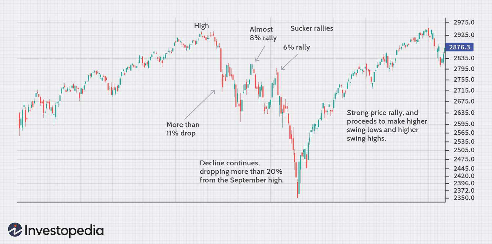

In the ever-evolving world of finance, understanding market trends and developing effective strategies to navigate them is crucial for any investor. Market trends, investment strategies, sucker rallies, and algorithmic trading are key concepts that can significantly impact financial decision-making and portfolio optimization.

Market trends represent the general direction in which financial markets are moving, providing strategic insights into potential buying or selling opportunities. Investment strategies vary according to market conditions, helping investors minimize risks and maximize returns. Identifying and understanding sucker rallies—temporary and deceptive market upswings—are essential for avoiding potential losses. Algorithmic trading, leveraging advanced technology to automate trades based on pre-set criteria, enhances trading efficiency and reduces human error.



This article aims to equip readers with the knowledge needed to make informed investment decisions. By exploring these interconnected components, we reveal how they interact and influence market dynamics, ultimately affecting trading outcomes. Understanding these elements is pivotal in optimizing investment portfolios, enabling investors to strategically manage risks and seize opportunities within the competitive financial landscape.

## Table of Contents

## Understanding Market Trends

Market trends represent the general direction in which the prices of financial assets move over a defined period. Recognizing these trends is crucial for investors as they form the basis for making informed buy and sell decisions. By understanding market trends, investors can ensure that their actions align with the prevailing market conditions, thereby optimizing their potential for return on investment.

To accurately track market trends, certain key indicators are utilized by market analysts. Two of the most prominent indicators are moving averages and trading volumes.

A moving average smooths out price data by creating a constantly updated average price. This simplification helps in mitigating the noise from short-term price fluctuations, allowing investors to better observe the true direction of a trend. There are several types of moving averages, such as the simple moving average (SMA) and the exponential moving average (EMA). The SMA is calculated by taking the arithmetic mean of a given set of prices over a specific number of periods. For example, the 10-day SMA can be calculated as follows:

$$
\text{SMA}_n = \frac{P_1 + P_2 + \ldots + P_n}{n}
$$

where $P_1, P_2, \ldots, P_n$ are the prices over the n periods.

The EMA gives more weight to recent prices, which makes it more sensitive to new information. It is calculated using a multiplier and the EMA of the previous period. Mathematically, it can be computed as:

$$
\text{EMA}_t = \left(\frac{2}{n+1}\right) \times (P_t - \text{EMA}_{t-1}) + \text{EMA}_{t-1}
$$

where $P_t$ is the current price, $\text{EMA}_{t-1}$ is the EMA of the previous period, and $n$ is the number of periods over which the EMA is calculated.

Trading [volume](/wiki/volume-trading-strategy) is another critical indicator, representing the total quantity of shares or contracts traded for a specific security or market. Significant changes or spikes in trading volume often accompany the formation or ending of market trends. For instance, if a price increase is accompanied by a high trading volume, it might indicate a strong trend, as more participants are engaging in trades.

By combining these indicators, investors can obtain a clearer picture of market trends. For example, if a security's price consistently remains above its moving average and is supported by large trading volumes, it may indicate a robust upward trend. Conversely, a drop below the moving average with declining volumes could signal a weakening trend or potential reversal.

Understanding and tracking these market trends is central to investment strategies, providing investors with the knowledge needed to capitalize on opportunities and mitigate risks.

## Investment Strategies for Diverse Market Conditions

Investment strategies are crucial for navigating diverse market conditions and optimizing portfolio performance. The dynamics of financial markets necessitate adaptation to shifting economic landscapes, which can manifest as bull or bear markets. Implementing the right investment strategies tailored to these conditions is essential for investors seeking to maximize returns while minimizing risks.

During bear markets, which are characterized by declining asset prices and general pessimism, conservative strategies are often recommended to safeguard investments. Asset diversification is one such strategy, aimed at spreading investments across different asset classes—such as stocks, bonds, real estate, and commodities—to reduce exposure to any single market segment's downturn. Diversification works on the principle that different assets often perform independently or inversely to each other. By maintaining a balanced portfolio, the negative performance of some assets can be offset by the positive performance of others, thus stabilizing overall returns.

In bull markets, identified by rising prices and investor optimism, a different approach may be more beneficial. Strategies that leverage the economic growth associated with bull markets often involve aggressive investing. This can include increasing exposure to equities, which tend to benefit from expanding corporate earnings and increasing valuations. Aggressive investors might opt to use financial leverage, borrowing funds to amplify investment returns. While leveraging can magnify gains in favorable market conditions due to the formula $\text{Return on Equity} = \frac{\text{Net Income}}{\text{Equity}}$, it carries higher risks, as losses can also be exacerbated. Therefore, a careful assessment of risk tolerance and market prospects is essential before employing leveraging strategies.

The adaptation of strategies to prevailing market conditions demands a thorough understanding of market indicators and economic signals. Investors should consistently monitor key economic indicators, such as GDP growth rates, inflation, and interest rates, alongside market-based indicators like moving averages and trading volumes. Such analysis can guide the identification of bear or bull market phases and support informed decision-making in strategy adjustment.

Another beneficial approach during bull markets includes sector rotation, which involves reallocating capital toward industry sectors expected to outperform due to macroeconomic trends. For instance, technology and consumer discretionary stocks might be favorable during early bull phases, whereas energy and industrial stocks could perform well as the economy matures.

Ultimately, successful investment in varying market conditions relies on a balanced approach, combining strategic foresight with disciplined execution. Regular portfolio reviews and rebalancing ensure alignment with current market dynamics and investment goals. By adopting flexible yet calculated strategies, investors can navigate both bear and bull markets to achieve robust, risk-adjusted returns over time.

## Decoding Sucker Rallies

A sucker rally is a phenomenon in financial markets characterized by a short-lived increase in asset prices, which can deceive investors into prematurely anticipating a sustained upward trend. These rallies commonly occur during bear markets, where the prevailing sentiment is generally negative, and prices are predominantly declining. The allure of quickly rising prices can lead unwary investors to make hasty decisions, potentially resulting in significant financial losses when prices retreat.

Sucker rallies are typically unsupported by the underlying economic fundamentals. This disconnect means that the movement in market prices is not driven by substantial changes in company performance, industry outlooks, or macroeconomic indicators. Instead, these rallies might be fueled by market rumors, short-term technical factors like short-covering, or even psychological factors such as fear of missing out (FOMO). The temporary nature of these rallies underlines the importance of detailed analysis rather than relying solely on immediate market signals.

Identifying a sucker rally requires investors to engage in thorough market analysis. This involves scrutinizing the broader economic environment, assessing company fundamentals, and understanding the potential influence of market sentiment. Investors should be wary of relying heavily on short-term price movements as they can be misleading. Instead, focusing on long-term trends and a comprehensive understanding of economic indicators can provide better guidance.

To avoid the pitfalls of investing during a sucker rally, it's advisable to employ disciplined investment strategies and risk management practices. This includes setting stop-loss orders to limit potential losses and diversifying portfolios to mitigate risk. Moreover, performing due diligence and resisting the temptation to make impulsive decisions based on short-term market fervor can help maintain financial stability. By distinguishing between genuine market recoveries and deceptive sucker rallies, investors stand a better chance of preserving their capital and making sound investment decisions.

## Role of Algorithmic Trading

Algorithmic trading involves the utilization of computer programs to execute trades automatically based on predetermined criteria. This method enhances trading efficiency by allowing for rapid execution, minimizing the time lag between decision-making and order placement. Furthermore, it reduces human error, offering a systematic approach to trading that can be particularly beneficial in volatile markets.

A key advantage of [algorithmic trading](/wiki/algorithmic-trading) is its ability to facilitate high-frequency trading ([HFT](/wiki/high-frequency-trading-strategies)), where large numbers of orders are executed within fractions of a second. This capability is pivotal in capturing small price differentials that may arise over short periods, resulting in cumulative profits for traders who engage in such practices. The automation involved allows traders to engage in strategies that would be impossible to manage manually.

Algorithmic trading strategies can be designed to respond swiftly to market fluctuations. For instance, algorithms can incorporate technical analysis tools, such as moving averages or other statistical indicators, to track and act upon market trends. This allows algorithms to buy or sell assets as soon as specific conditions are met, optimizing the timing of trades to capitalize on emerging opportunities.

To illustrate, consider an algorithm designed to trade based on a simple moving average crossover strategy. This algorithm buys an asset when a short-term moving average crosses above a long-term moving average, and sells when the reverse happens. In Python, such a strategy might be implemented as follows:

```python
def moving_average(data, window):
    return data.rolling(window=window).mean()

def moving_average_crossover_strategy(data, short_window, long_window):
    signals = pd.DataFrame(index=data.index)
    signals['price'] = data['price']
    signals['short_mavg'] = moving_average(signals['price'], short_window)
    signals['long_mavg'] = moving_average(signals['price'], long_window)
    signals['signal'] = 0.0
    signals['signal'][short_window:] = np.where(
        signals['short_mavg'][short_window:] > signals['long_mavg'][short_window:], 1.0, 0.0)
    signals['positions'] = signals['signal'].diff()
    return signals

# Assume 'data' is a DataFrame with a datetime index and a 'price' column
signals = moving_average_crossover_strategy(data, short_window=40, long_window=100)
```

This algorithm identifies trends and executes trades based on these signals, exemplifying how algorithms can react and adapt to market conditions.

In conclusion, algorithmic trading offers a powerful tool for traders, enabling the execution of complex strategies with speed and precision. By tailoring algorithms to specific market conditions, traders can optimize their performance, potentially increasing returns while managing risk more effectively.

## Integrating Algorithms in Market Trend Analysis

Algorithms are increasingly essential in market trend analysis due to their capacity to process and analyze vast datasets almost instantaneously. This capability is crucial for identifying trends that might be opaque to human traders. Algorithms are adept at scanning through historical market data, executing trades at optimal times, and optimizing portfolios. 

One of the critical components of algorithmic trading is [backtesting](/wiki/backtesting). Backtesting involves running a trading algorithm on historical data to see how it would have performed. This process helps traders refine their strategies based on historical market behavior and improve the algorithm’s reliability in varying market conditions. The primary goal is to test the effectiveness of a particular trading strategy before actual implementation in live markets. This can prevent potential financial losses that might occur if the strategy does not perform as expected in real-time trading.

```python
# Simple example of backtesting a moving average crossover strategy
import pandas as pd

# Simulated historical data
data = {'Price': [100, 101, 102, 100, 98, 97, 99, 100, 103, 105]}
df = pd.DataFrame(data)
# Calculating short-term and long-term moving averages
df['Short_MA'] = df['Price'].rolling(window=3).mean()
df['Long_MA'] = df['Price'].rolling(window=5).mean()

# Generating trading signals
df['Signal'] = 0
df['Signal'][df['Short_MA'] > df['Long_MA']] = 1
df['Position'] = df['Signal'].diff()

print(df)
```
The above Python snippet demonstrates a basic implementation of a moving average crossover strategy, where buy and sell signals are generated based on the crossover of short-term and long-term moving averages.

Besides improving the accuracy and viability of algorithms through backtesting, integrating algorithmic insights enables investors to design strategies that effectively mitigate risks associated with market anomalies like sucker rallies. Algorithmic trading systems can be fine-tuned to quickly adapt to new market data, swiftly adjusting trading strategies as market conditions change. 

Through sophisticated risk management, algorithms can identify the presence of a sucker rally—a temporary surge in prices unjustified by market fundamentals—and adjust trading strategies to minimize exposure. These systems use historical patterns, statistical models, and [machine learning](/wiki/machine-learning) techniques to forecast potential price movements and automate decision-making processes.

Integrating algorithms with market trend analysis not only improves the precision of trend identification but also enhances the ability to respond to dynamic market environments. This gives traders and investors a significant edge in an exceptionally competitive and volatile financial landscape.

## Conclusion

Understanding market trends, investment strategies, sucker rallies, and algorithmic trading is crucial in today's fast-paced financial environment. Investors who incorporate these elements into their approach can improve their investment portfolios by achieving more favorable risk-adjusted returns. Risk-adjusted returns assess the return of an investment compared to the risk taken, often measured through metrics like the Sharpe Ratio. The ability to navigate financial markets effectively hinges on both strategic foresight and technical skill.

Strategic thinking involves recognizing and adapting to various market conditions, employing suitable strategies to capitalize on opportunities while safeguarding against potential downsides. For instance, during volatile markets, careful diversification and risk management practices can protect assets from unforeseen downturns. Conversely, aggressive strategies may be more appropriate when markets are booming, allowing investors to maximize gains.

Technical acumen involves leveraging modern tools like algorithmic trading to enhance decision-making capabilities. By employing sophisticated algorithms that analyze vast datasets, traders can identify actionable patterns and trends that might elude manual analysis. Quantitative models, including statistical analysis and machine learning, enable algorithms to execute trades based on data-driven insights rapidly. These systems can also be programmed to mitigate risks associated with phenomena such as sucker rallies, preventing short-term gains from leading to longer-term losses.

The convergence of these elements empowers investors to navigate the increasingly complex landscape of global financial markets. By understanding the interplay of market dynamics and incorporating advanced trading techniques, investors can position themselves to make informed decisions that boost their potential for success. As such, mastering these components is imperative to achieving sustainable growth and resilience in investment portfolios.

## References & Further Reading

[1]: Bergstra, J., Bardenet, R., Bengio, Y., & Kégl, B. (2011). ["Algorithms for Hyper-Parameter Optimization."](https://dl.acm.org/doi/10.5555/2986459.2986743) Advances in Neural Information Processing Systems 24.

[2]: ["Advances in Financial Machine Learning"](https://www.amazon.com/Advances-Financial-Machine-Learning-Marcos/dp/1119482089) by Marcos Lopez de Prado

[3]: ["Evidence-Based Technical Analysis: Applying the Scientific Method and Statistical Inference to Trading Signals"](https://www.amazon.com/Evidence-Based-Technical-Analysis-Scientific-Statistical/dp/0470008741) by David Aronson

[4]: ["Machine Learning for Algorithmic Trading"](https://github.com/stefan-jansen/machine-learning-for-trading) by Stefan Jansen

[5]: ["Quantitative Trading: How to Build Your Own Algorithmic Trading Business"](https://www.amazon.com/Quantitative-Trading-Build-Algorithmic-Business/dp/1119800064) by Ernest P. Chan

[6]: Chan, E. (2013). ["Algorithmic Trading: Winning Strategies and Their Rationale."](https://github.com/ftvision/quant_trading_echan_book) Wiley Trading Series.

[7]: Spurgin, B. (2005). ["Market Timing and Technical Analysis."](https://onlinelibrary.wiley.com/doi/full/10.1111/j.1540-6261.2005.00783.x) CFA Institute Research Foundation.