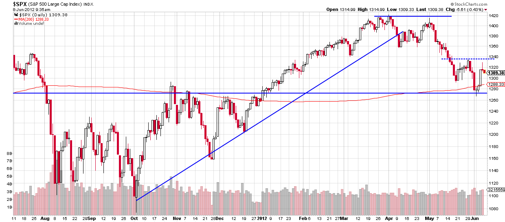

## Table of Contents

## What is a sucker rally?

A sucker rally is when the price of something, like a stock, goes up for a short time but then goes back down again. People might think the price is going to keep going up, so they buy it. But then they find out it was just a trick, and the price drops again. This can make people lose money if they bought it during the rally thinking it would keep going up.

These rallies can happen in the stock market or with other things people invest in. They often happen when the market is not doing well overall. People get excited when they see the price go up and think it's a good time to buy. But really, it's just a temporary increase, and the price will probably go back down soon. It's called a "sucker rally" because it can trick people into making bad investment choices.

## How does a sucker rally differ from a genuine market recovery?

A sucker rally and a genuine market recovery both involve the price of something going up, but they are different in what happens next and why they happen. A sucker rally is a short-term increase in price that tricks people into thinking the market is getting better. It usually happens when the market is not doing well overall, and the price goes up for a little bit before going back down. People who buy during a sucker rally might lose money because they thought the price would keep going up, but it was just a trick.

On the other hand, a genuine market recovery is when the price goes up and keeps going up over time. This happens because the market is actually getting better, maybe because the economy is improving or because more people want to buy the thing being sold. A genuine recovery is based on real changes in the market, not just a temporary increase. So, if you see the price going up and it keeps going up, that might be a sign of a genuine recovery, not just a sucker rally.

## What are the key indicators of a sucker rally?

A sucker rally often happens when the market is not doing well. You might see the price of a stock or another investment go up quickly, but this increase doesn't last long. It's like a quick jump that tricks people into thinking the market is getting better. But soon after, the price goes back down. This can happen because there's not enough real demand to keep the price up, or because people are just reacting to the short-term increase without understanding the bigger picture.

To spot a sucker rally, look at the overall market trends. If the market has been going down for a while, and then you see a sudden jump in price, it might be a sucker rally. Also, pay attention to the news and what's happening in the economy. If there's no good reason for the price to go up, like a new product or better earnings, then the rally might not be real. It's important to be careful and not get too excited about a quick price increase without looking at the bigger picture.

## What causes a sucker rally to occur?

A sucker rally happens when the price of something, like a stock, goes up for a short time even though the market is not doing well. This can trick people into thinking the market is getting better, so they buy the stock. But the price goes back down soon after because there's not enough real demand to keep it up. It's like a quick trick that makes people think things are improving when they're not.

These rallies can be caused by people reacting to the short-term increase without understanding the bigger picture. Sometimes, a few big investors might buy a lot of a stock, making the price go up. Other people see this and think it's a good time to buy too, but they don't know that the price will probably go back down. It's important to look at the overall market trends and not just the quick jump in price to avoid being tricked by a sucker rally.

## Can you explain the psychological factors that contribute to a sucker rally?

A sucker rally happens because of how people feel and think about the market. When people see the price of a stock go up quickly, they can get excited and hopeful. They might think that the market is getting better and that it's a good time to buy. This hope and excitement can make them ignore the bigger picture, like if the market has been going down for a while. They see the quick jump in price and think it's a sign of recovery, but it's really just a trick.

This kind of thinking is driven by something called FOMO, or the "Fear Of Missing Out." People don't want to miss out on a good opportunity, so they jump in and buy the stock without thinking it through. They see others buying and the price going up, and they want to be part of it too. But this rush to buy can lead to a quick drop in price when the excitement fades and people realize the market isn't really getting better. It's important to stay calm and look at the bigger picture to avoid being tricked by a sucker rally.

## What are the common patterns or technical signals associated with a sucker rally?

A sucker rally often shows up on charts as a quick jump in price that doesn't last long. You might see the price go up fast, but then it goes back down just as quickly. This can look like a sharp spike on a chart, followed by a drop. Traders might see this as a "false breakout," where the price breaks above a resistance level but then falls back below it. This pattern can trick people into thinking the price will keep going up, but it's really just a short-term trick.

Another common sign of a sucker rally is high trading volume during the price jump. When the price goes up quickly, a lot of people might start buying, thinking it's a good time to get in. But if the volume drops off quickly after the spike, it can be a sign that the rally won't last. Also, if the price goes up but other technical indicators, like moving averages or the relative strength index (RSI), don't confirm the upward move, it might be a sucker rally. These indicators can help traders see if the price increase is real or just a trick.

## How can investors identify the onset of a sucker rally?

Investors can spot the start of a sucker rally by watching for a quick jump in the price of a stock or other investment. This jump often happens when the market has been going down for a while. People see the price go up and get excited, thinking the market is getting better. But if the price goes up fast and there's no good reason for it, like a new product or better earnings, it might be a sucker rally. It's important to look at the bigger picture and not just the quick increase in price.

Another way to identify a sucker rally is by looking at trading volume. If a lot of people start buying during the price jump, it can make the price go up even more. But if the volume drops off quickly after the spike, it's a sign that the rally might not last. Also, pay attention to other technical indicators like moving averages or the relative strength index (RSI). If these don't confirm the upward move, it could mean the price increase is just a trick. By staying calm and looking at these signs, investors can avoid being fooled by a sucker rally.

## What strategies can investors use to protect themselves during a sucker rally?

To protect themselves during a sucker rally, investors should stay calm and not get too excited about a quick jump in price. They need to look at the bigger picture of the market and not just the short-term increase. If the market has been going down for a while and there's no good reason for the price to go up, like a new product or better earnings, it might be a sucker rally. Investors can use technical indicators like moving averages or the relative strength index (RSI) to see if the price increase is real or just a trick. If these indicators don't confirm the upward move, it's a sign to be careful.

Another strategy is to watch the trading volume. If a lot of people start buying during the price jump, it can make the price go up even more. But if the volume drops off quickly after the spike, it's a sign that the rally might not last. Investors should also set clear rules for when to buy and sell, and stick to them. This can help them avoid making quick decisions based on excitement. By staying patient and looking at all the signs, investors can protect themselves from losing money during a sucker rally.

## Can you provide historical examples of sucker rallies?

One famous sucker rally happened in the stock market in 1987. It was called "Black Monday" because the market crashed on October 19, 1987. Before the crash, there was a short time when the market went up a lot. People thought it was getting better, so they bought a lot of stocks. But it was just a trick. The market went down really fast after that, and people who bought during the rally lost a lot of money. This showed how a quick jump in price can fool people into thinking the market is recovering when it's not.

Another example of a sucker rally was during the dot-com bubble in the late 1990s and early 2000s. The stock market, especially for tech companies, went up a lot. People got really excited about internet companies and bought their stocks, thinking they would keep going up. But it was just a short-term trick. In 2000, the market started to go down, and many people lost a lot of money. This showed how excitement and hope can make people ignore the bigger picture and get tricked by a sucker rally.

## How do market manipulators exploit sucker rallies?

Market manipulators can take advantage of sucker rallies by making the price of a stock go up on purpose. They might buy a lot of a stock quickly to make other people think the market is getting better. When people see the price go up, they get excited and start buying too. This makes the price go up even more, but the manipulators know it's just a trick. They sell their stocks at the high price, making a lot of money, while other people who bought during the rally lose money when the price goes back down.

This kind of manipulation can happen because people get caught up in the excitement of a quick price increase. They don't always look at the bigger picture or think about why the price is going up. Manipulators use this to their advantage, knowing that people will jump in and buy without thinking it through. By the time everyone realizes it was just a sucker rally, the manipulators have already made their money and moved on, leaving others to deal with the falling prices.

## What are the long-term effects of a sucker rally on market sentiment and investor behavior?

A sucker rally can make people feel less sure about the market in the long run. When people see the price go up quickly and then go back down, they might start to think the market is not safe. They could feel tricked and lose trust in the market. This can make them more careful and less likely to buy stocks in the future. They might wait longer to see if a price increase is real before they decide to invest, which can make the market slower to recover.

Over time, sucker rallies can change how people act when they invest. People might start to look more closely at why the price is going up before they buy. They could use more tools and information to check if a price increase is real or just a trick. This can make people smarter about investing, but it can also make them miss out on real chances to make money. If people are too scared to buy because of past sucker rallies, they might not take part in the market as much, which can affect how the market grows.

## How can advanced trading algorithms detect and react to sucker rallies?

Advanced trading algorithms can spot a sucker rally by looking at a lot of data quickly. They watch for big jumps in price that don't last long. These algorithms can see if the price goes up fast but then goes back down. They also check if a lot of people are buying during the price jump, and if the buying stops quickly after. By looking at these patterns, the algorithms can tell if it's a sucker rally or a real recovery. They use things like moving averages and the relative strength index (RSI) to make sure the price increase is real, not just a trick.

Once an algorithm spots a sucker rally, it can react fast to protect the money it's managing. If it thinks the price will go back down, the algorithm might sell the stocks it has before the price drops. This can help avoid losing money. Some algorithms might even try to make money from the sucker rally by selling stocks short, betting that the price will go down. By reacting quickly and using a lot of data, these algorithms can help investors stay safe from the tricks of sucker rallies.

## What is the key to understanding market trends?

Market trends represent the general direction in which the prices of financial assets move over a defined period. Recognizing these trends is crucial for investors as they form the basis for making informed buy and sell decisions. By understanding market trends, investors can ensure that their actions align with the prevailing market conditions, thereby optimizing their potential for return on investment.

To accurately track market trends, certain key indicators are utilized by market analysts. Two of the most prominent indicators are moving averages and trading volumes.

A moving average smooths out price data by creating a constantly updated average price. This simplification helps in mitigating the noise from short-term price fluctuations, allowing investors to better observe the true direction of a trend. There are several types of moving averages, such as the simple moving average (SMA) and the exponential moving average (EMA). The SMA is calculated by taking the arithmetic mean of a given set of prices over a specific number of periods. For example, the 10-day SMA can be calculated as follows:

$$
\text{SMA}_n = \frac{P_1 + P_2 + \ldots + P_n}{n}
$$

where $P_1, P_2, \ldots, P_n$ are the prices over the n periods.

The EMA gives more weight to recent prices, which makes it more sensitive to new information. It is calculated using a multiplier and the EMA of the previous period. Mathematically, it can be computed as:

$$
\text{EMA}_t = \left(\frac{2}{n+1}\right) \times (P_t - \text{EMA}_{t-1}) + \text{EMA}_{t-1}
$$

where $P_t$ is the current price, $\text{EMA}_{t-1}$ is the EMA of the previous period, and $n$ is the number of periods over which the EMA is calculated.

Trading [volume](/wiki/volume-trading-strategy) is another critical indicator, representing the total quantity of shares or contracts traded for a specific security or market. Significant changes or spikes in trading volume often accompany the formation or ending of market trends. For instance, if a price increase is accompanied by a high trading volume, it might indicate a strong trend, as more participants are engaging in trades.

By combining these indicators, investors can obtain a clearer picture of market trends. For example, if a security's price consistently remains above its moving average and is supported by large trading volumes, it may indicate a robust upward trend. Conversely, a drop below the moving average with declining volumes could signal a weakening trend or potential reversal.

Understanding and tracking these market trends is central to investment strategies, providing investors with the knowledge needed to capitalize on opportunities and mitigate risks.

## References & Further Reading

[1]: Bergstra, J., Bardenet, R., Bengio, Y., & Kégl, B. (2011). ["Algorithms for Hyper-Parameter Optimization."](https://dl.acm.org/doi/10.5555/2986459.2986743) Advances in Neural Information Processing Systems 24.

[2]: ["Advances in Financial Machine Learning"](https://www.amazon.com/Advances-Financial-Machine-Learning-Marcos/dp/1119482089) by Marcos Lopez de Prado

[3]: ["Evidence-Based Technical Analysis: Applying the Scientific Method and Statistical Inference to Trading Signals"](https://www.amazon.com/Evidence-Based-Technical-Analysis-Scientific-Statistical/dp/0470008741) by David Aronson

[4]: ["Machine Learning for Algorithmic Trading"](https://github.com/stefan-jansen/machine-learning-for-trading) by Stefan Jansen

[5]: ["Quantitative Trading: How to Build Your Own Algorithmic Trading Business"](https://www.amazon.com/Quantitative-Trading-Build-Algorithmic-Business/dp/1119800064) by Ernest P. Chan

[6]: Chan, E. (2013). ["Algorithmic Trading: Winning Strategies and Their Rationale."](https://github.com/ftvision/quant_trading_echan_book) Wiley Trading Series.

[7]: Spurgin, B. (2005). ["Market Timing and Technical Analysis."](https://onlinelibrary.wiley.com/doi/full/10.1111/j.1540-6261.2005.00783.x) CFA Institute Research Foundation.