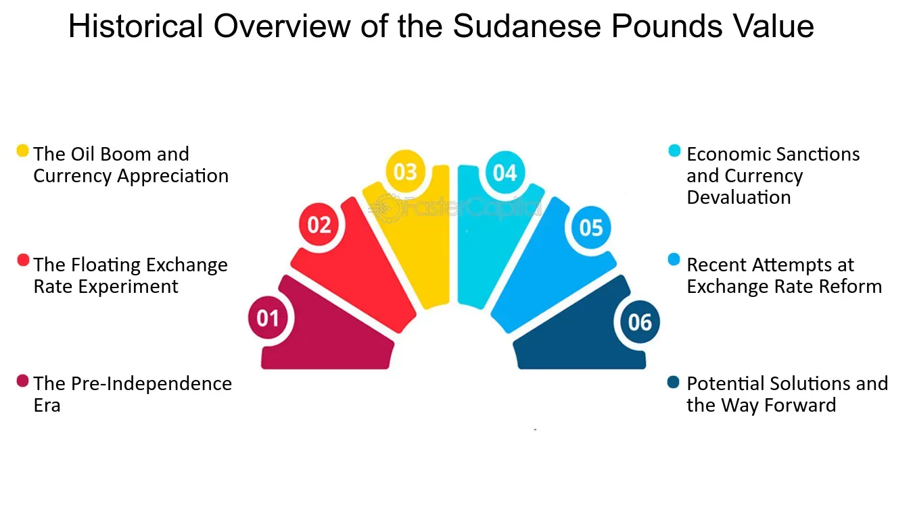

## Table of Contents

## What is the Sudanese Dinar?

The Sudanese Dinar was the currency used in Sudan from 1992 until 2007. Before the Sudanese Dinar, Sudan used the Sudanese pound. The government decided to change the currency to the Dinar to try and fix some money problems the country was having.

In 2007, Sudan switched back to using the Sudanese pound. This change happened because the government thought it would help the economy. Now, the Sudanese Dinar is no longer used anywhere, and the Sudanese pound is the official money in Sudan.

## When was the Sudanese Dinar first introduced?

The Sudanese Dinar was first introduced in 1992. Before that, Sudan used the Sudanese pound. The government wanted to change the currency to help fix some money problems the country was facing.

The Dinar was used until 2007. Then, Sudan switched back to the Sudanese pound. The government thought this change would be good for the economy. Now, the Sudanese Dinar is not used anymore, and the Sudanese pound is the official money in Sudan.

## What was the Sudanese Dinar replaced with and when?

The Sudanese Dinar was replaced with the Sudanese pound. This change happened in 2007. The government of Sudan decided to go back to using the Sudanese pound because they thought it would help the country's economy.

Before the Dinar, Sudan also used the Sudanese pound. The switch to the Dinar in 1992 was an attempt to fix money problems. But by 2007, the government believed that going back to the pound would be better for Sudan.

## What were the denominations of the Sudanese Dinar?

The Sudanese Dinar came in different amounts or denominations. There were coins and banknotes. The coins were in amounts like 1, 5, 10, 20, and 50 dinars. The banknotes were in bigger amounts like 1, 5, 10, 20, 50, 100, 200, 500, and 1000 dinars.

These different amounts helped people use the money for different things. Small coins were good for buying little things, while the bigger banknotes were used for more expensive stuff. This way, the Sudanese Dinar worked like money in other countries, with different sizes for different needs.

## How did the Sudanese Dinar impact the economy of Sudan during its circulation?

The Sudanese Dinar was introduced in 1992 to try and help fix some money problems Sudan was facing. At first, the new currency helped the government to control the money supply better. It also made it easier to do business because people were used to the new money. But over time, the Dinar started to lose its value because of inflation. This meant that prices went up and people's money could buy less than before. This made life harder for many people in Sudan.

By 2007, the government decided to go back to the Sudanese pound because they thought it would help the economy. The switch back to the pound was meant to stop the inflation that was hurting the Dinar. After changing back to the pound, the economy started to get better. People could trust their money more, and it was easier to buy things. The switch from the Dinar to the pound showed that changing the currency can have big effects on a country's money and how people live.

## What were the key factors that led to the devaluation of the Sudanese Dinar?

The Sudanese Dinar lost its value mainly because of inflation. Inflation means that prices go up and the money people have can buy less than before. In Sudan, the government was printing too much money, which made the Dinar worth less. When there is too much money, it loses its value. This was a big problem because it made life harder for people. They had to pay more for things like food and clothes.

Another reason the Dinar lost value was because Sudan was having economic problems. The country was not making enough money from selling things like oil, and it was hard to get money from other countries. This made the economy weak. When an economy is weak, people don't trust the money as much, and it loses value. The government tried to fix these problems by changing back to the Sudanese pound in 2007, hoping it would make the economy stronger.

## How did political events influence the value and usage of the Sudanese Dinar?

Political events had a big impact on the Sudanese Dinar. The government changed the currency from the Sudanese pound to the Dinar in 1992 because they wanted to fix money problems. But the government was not very stable, and this made people unsure about the Dinar. When people don't trust the government, they also don't trust the money. This made the Dinar lose value.

Also, Sudan was going through a lot of political trouble during the time the Dinar was used. There were fights and disagreements inside the country, and this made the economy weak. A weak economy means less money coming in, and this made the Dinar worth even less. By 2007, the government decided to go back to the Sudanese pound because they thought it would make people trust the money more and help the economy get better.

## What were the major economic policies implemented during the time of the Sudanese Dinar?

During the time of the Sudanese Dinar, the government tried different ways to make the economy better. They changed the currency from the Sudanese pound to the Dinar in 1992 to control how much money was in the country. They hoped this would help fix money problems like inflation, which means prices go up and money loses value. But the government also tried to control prices and stop people from taking money out of the country. These rules were meant to keep the economy stable, but they made it hard for businesses to grow.

Political problems also affected the economy a lot. The government was not very stable, and this made people unsure about the Dinar. When people don't trust the government, they don't trust the money either. So, the Dinar lost value over time. By 2007, the government decided to go back to the Sudanese pound because they thought it would help the economy. They hoped this change would make people trust the money more and help businesses grow.

## How did the transition from the Sudanese Dinar to the Sudanese Pound affect the general population?

When Sudan changed from the Sudanese Dinar to the Sudanese Pound in 2007, it had a big effect on people's lives. The Dinar had been losing value because of inflation, which means prices were going up and people's money could buy less. This made life hard for many people. They had to pay more for things like food and clothes. When the government switched back to the Sudanese Pound, they hoped it would stop the inflation and make the money worth more. This change was meant to help people trust their money again and make it easier to buy things.

The transition to the Sudanese Pound did help the economy get better over time. People started to trust their money more, and prices became more stable. This made it easier for people to plan their lives and spend their money. But the change was not easy for everyone. Some people had a hard time understanding the new money and how to use it. Also, the government had to make sure that the old Dinar could still be used for a while to help people switch over. Overall, the change to the Sudanese Pound was a big step to fix the money problems that the Dinar had caused.

## What are some notable historical events associated with the Sudanese Dinar?

The Sudanese Dinar was introduced in 1992 as part of the government's effort to fix money problems. Before the Dinar, Sudan used the Sudanese pound. The government hoped that changing to the Dinar would help control how much money was in the country and stop inflation, which means prices going up and money losing value. But the Dinar did not work out as planned. Over time, the Dinar lost its value because the government was printing too much money, and the country was having a lot of political and economic problems. This made life harder for people because they had to pay more for things like food and clothes.

By 2007, the government decided to switch back to the Sudanese pound. This was a big event because it showed that the government wanted to try a different way to fix the money problems. The change back to the pound was meant to stop the inflation that was hurting the Dinar. After changing back, the economy started to get better. People could trust their money more, and it was easier to buy things. The switch from the Dinar to the pound was important because it showed how changing the currency can have big effects on a country's money and how people live.

## How did the international community view the Sudanese Dinar during its circulation?

The international community had mixed feelings about the Sudanese Dinar during its circulation. When Sudan changed its currency to the Dinar in 1992, other countries were watching to see if it would help Sudan's money problems. At first, some countries were hopeful that the new currency would help Sudan control its money better and stop inflation. But over time, as the Dinar lost value because of inflation and political problems, the international community became more worried. They saw that the Dinar was not working well and that it was making life harder for people in Sudan.

By the time Sudan decided to switch back to the Sudanese pound in 2007, the international community was supportive of the change. They thought that going back to the pound might help Sudan fix its money problems. Many countries and international groups wanted to help Sudan's economy get better. They saw the switch back to the pound as a chance for Sudan to have a more stable money system. Overall, the international community's view of the Sudanese Dinar went from hopeful to worried, and they were glad when Sudan decided to change back to the pound.

## What lessons can be learned from the history of the Sudanese Dinar for current and future currency management in Sudan?

The history of the Sudanese Dinar shows that changing a country's money can be hard and risky. When Sudan changed from the Sudanese pound to the Dinar in 1992, they hoped it would help fix money problems like inflation. But the Dinar lost value because the government printed too much money and there were a lot of political and economic problems. This made life harder for people because they had to pay more for things. The lesson here is that just changing the currency is not enough if the government does not fix the bigger problems like inflation and political instability.

When Sudan switched back to the Sudanese pound in 2007, it showed that going back to a currency people trust can help the economy. The change to the pound helped stop the inflation that was hurting the Dinar. People started to trust their money more, and it was easier to buy things. This teaches us that it's important for the government to make sure people trust their money. They need to have good plans to control how much money is in the country and to keep the economy stable. In the future, Sudan should focus on making sure the economy is strong and that people can trust their money, no matter what currency they use.

## How do denominations affect currency stability?

The Sudanese Dinar (SDD) was characterized by a range of denominations designed to facilitate transactions within the economy. The denominations included both coins and banknotes, starting from as low as 1 dinar and scaling upwards to 5,000 dinars. This diverse range was intended to enhance transactional efficiency by accommodating both small everyday purchases and larger economic exchanges.

Despite the structured denominations, the SDD faced significant challenges concerning currency stability. Inflation played a particularly disruptive role during the dinar's circulation from 1992 to 2007. The high inflation rates were primarily driven by political instability, economic sanctions, and inadequate monetary policies. These factors together eroded the purchasing power of the dinar, often necessitating higher denomination banknotes merely to keep pace with rising prices. 

Political influences also contributed to currency instability. During the period in which the SDD was used, Sudan experienced significant political turmoil, including conflicts, government changes, and international isolation, all of which undermined economic stability. The interplay of these political dynamics with inflation highlighted the fragility of the dinar, as policymakers struggled to anchor the currency's value adequately.

To offer an empirical insight into these fluctuations, inflation rates can be analyzed. For example, if $I_t$ represents the inflation rate at time $t$, the purchasing power $P_t$ of the dinar can be approximated as:

$$
P_t = \frac{P_0}{(1 + I_t)^t}
$$

where $P_0$ is the initial purchasing power. This formula reveals how acute inflation diminishes currency value over time, impacting the economy's transactional capacity.

In response to these challenges, the structured denominations, despite their design for efficiency, were often inadequate in buffering the dinar against the loss of value. The legacy of the SDD provides a critical case study in the consequences of currency design operating within a challenging macroeconomic context, marked by high inflation and unstable political landscapes.

## References & Further Reading

[1]: ["Sudan’s Hyperinflations History."](https://www.cato.org/human-freedom-index/2021) Retrieved from the Cato Institute.

[2]: ["The History of Currency in Sudan."](https://sudanevents.com/index.php/2024/12/26/an-unknown-chapter-in-the-history-of-currency-in-sudan/) Retrieved from the Central Bank of Sudan.

[3]: Neftci, S. N. (2008). ["Principles of Financial Engineering."](https://books.google.com/books/about/Principles_of_Financial_Engineering.html?id=IOEyEY3TM9AC) Academic Press.

[4]: Ajao, R.O., & Babajide, A. (2011). ["Inflation and Currency Reforms: The Case of Sudan."](https://scholar.google.com/citations?user=cPPqqBwAAAAJ) Journal of Economic Policy Research.

[5]: Fabozzi, F. J., Focardi, S. M., & Kolm, P. N. (2010). ["Quantitative Equity Investing: Techniques and Strategies."](https://www.semanticscholar.org/paper/Quantitative-Equity-Investing%3A-Techniques-and-Fabozzi-Focardi/1c49a2a53919f7e65cb96f16691b8ff726fd3cd7) Wiley Finance.

[6]: Bloomfield, R. (2009). ["Trading and Exchanges: Market Microstructure for Practitioners."](https://wclc2018.iaslc.org/public/virtual-library/Documents/Trading_And_Exchanges_Market_Microstructure_For_Practitioners.pdf) Oxford University Press.

[7]: ["Sudan: A Country Study"](https://www.loc.gov/item/2014043450/) by Helen Chapin Metz, edition from the Library of Congress.

[8]: Westland, J.C. (2015). ["Structural Equation Models: From Paths to Networks."](https://link.springer.com/book/10.1007/978-3-030-12508-0) Springer.