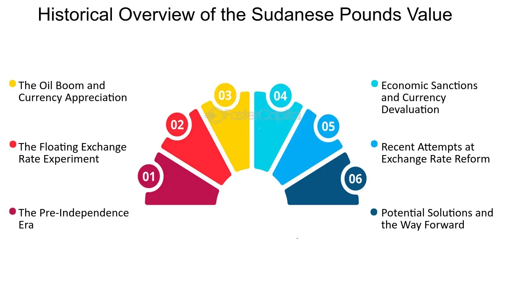

## Table of Contents

## What is the Sudanese Pound?

The Sudanese Pound is the official money used in Sudan, a country in Africa. It is shortened to SDG. People in Sudan use this money to buy things like food, clothes, and other stuff they need. The Sudanese Pound is managed by a special bank called the Central Bank of Sudan. This bank makes sure that the money is used correctly and that there is enough of it for everyone.

The Sudanese Pound has different coins and paper money. The coins come in smaller amounts, like 1, 2, 5, 10, 20, and 50 piasters. The paper money, or banknotes, come in bigger amounts, like 1, 2, 5, 10, 20, 50, 100, 200, 500, and 1000 Sudanese Pounds. Each type of money has its own special look and colors, so people can easily tell them apart.

## When was the Sudanese Pound first introduced?

The Sudanese Pound was first introduced in 1956. This was the same year that Sudan became an independent country, no longer ruled by another country. Before this, Sudan used the Egyptian pound. When Sudan got its own money, it was a big step for the country. It showed that Sudan could take care of its own money matters.

The first Sudanese Pound was split into 100 piastres, just like the Egyptian pound it replaced. The new money helped Sudan to grow and develop its own economy. People in Sudan started using the new pound to buy things and pay for services, which helped the country to move forward on its own.

## What are the denominations of the Sudanese Pound?

The Sudanese Pound has different types of money, called denominations. For coins, you can find 1, 2, 5, 10, 20, and 50 piasters. These are the smaller amounts of money that people use for everyday things. The coins are handy because they help people pay exact amounts without needing to use paper money.

For paper money, or banknotes, the Sudanese Pound comes in 1, 2, 5, 10, 20, 50, 100, 200, 500, and 1000 Sudanese Pounds. These are the bigger amounts of money that people use for more expensive things. Each banknote has its own special design and color, which makes it easy for people to see the difference between them.

## How has the design of the Sudanese Pound changed over time?

The design of the Sudanese Pound has changed a lot since it was first introduced in 1956. When it started, the banknotes showed pictures of important places and people in Sudan. They were simple and mostly in one color. Over the years, the designs got more colorful and detailed. New banknotes started to show more about Sudan's culture, like traditional music instruments and famous buildings. The coins also changed, with new sizes and pictures to make them easier to use.

In 2007, Sudan made a big change to its money. They added new security features to the banknotes to stop people from making fake money. These features included special watermarks and shiny strips that you can see when you hold the money up to the light. The designs also became more modern, with bright colors and clear pictures. The new designs helped people trust the money more and made it harder for anyone to copy it.

## What is the current exchange rate of the Sudanese Pound to the US Dollar?

The exchange rate of the Sudanese Pound to the US Dollar changes every day. As of the latest update, 1 US Dollar is equal to about 600 Sudanese Pounds. This rate can go up or down depending on many things like how much people want to buy or sell the currency, what's happening in the economy, and decisions made by the government and the Central Bank of Sudan.

People in Sudan use this exchange rate when they need to change their money into US Dollars or when they get money from other countries. For example, if someone in Sudan wants to buy something that costs 10 US Dollars, they would need to pay around 6,000 Sudanese Pounds at the current rate. It's important for people to check the exchange rate often because it can change quickly.

## How has the value of the Sudanese Pound fluctuated historically?

The value of the Sudanese Pound has changed a lot over the years. When it was first introduced in 1956, the Sudanese Pound was strong and stable. At that time, 1 Sudanese Pound was worth about 2.87 US Dollars. This made it easy for Sudan to trade with other countries. But over time, the value of the Sudanese Pound started to go down. By the 1980s, the Sudanese Pound was worth much less, and it kept losing value because of problems in the economy and political issues in the country.

In the 1990s and 2000s, the Sudanese Pound became even weaker. By 2011, when South Sudan became its own country, the Sudanese Pound lost a lot of its value because Sudan lost a big part of its oil money. In recent years, the Sudanese Pound has been very weak. For example, in 2020, the exchange rate was around 55 Sudanese Pounds to 1 US Dollar, and by 2023, it had dropped to about 600 Sudanese Pounds to 1 US Dollar. This big drop made life harder for people in Sudan because their money could buy less and less.

## What economic factors have influenced the Sudanese Pound's value?

The value of the Sudanese Pound has been affected by many economic problems in Sudan. One big issue is inflation, which means prices for things like food and clothes go up a lot. When inflation is high, the Sudanese Pound loses value because it can buy less. Another problem is that Sudan doesn't make enough money from things it sells to other countries, like oil. When South Sudan became its own country in 2011, Sudan lost a lot of its oil money, which made the Sudanese Pound weaker. Also, the government sometimes spends more money than it has, which can make the currency lose value.

Political problems have also played a big role in making the Sudanese Pound weaker. Sudan has had a lot of conflicts and changes in government, which can scare away people who want to invest money in the country. When investors are scared, they don't want to put their money into Sudan, and this can make the Sudanese Pound lose value. The government has tried to help by making new rules and trying to stop inflation, but it's hard to fix all the problems at once. All these things together have made the Sudanese Pound go down in value over time.

## How does the Sudanese Pound compare to other currencies in the region?

The Sudanese Pound is weaker than many other currencies in the region. For example, compared to the Egyptian Pound, which is used in Egypt, the Sudanese Pound is worth much less. If you want to change Sudanese Pounds into Egyptian Pounds, you would need a lot more Sudanese Pounds to get the same amount of Egyptian Pounds. The same is true for the Ethiopian Birr, which is used in Ethiopia. The Sudanese Pound is also weaker than the Kenyan Shilling, which is used in Kenya. All these countries are close to Sudan, but their money is worth more.

This difference in value makes it hard for people in Sudan to buy things from other countries in the region. For example, if someone in Sudan wants to buy something from Egypt, they need to pay a lot more in Sudanese Pounds than someone in Egypt would pay in Egyptian Pounds. This can make life harder for people in Sudan because their money doesn't go as far. The Sudanese Pound's weakness is because of many problems in Sudan's economy, like high inflation and not enough money coming in from selling things to other countries.

## What are the major economic reforms that have affected the Sudanese Pound?

The Sudanese Pound has been affected by several big economic changes in Sudan. One big change was in 2011 when South Sudan became its own country. Sudan lost a lot of its oil money because the oil fields were now in South Sudan. This made the Sudanese Pound weaker because the country didn't have as much money coming in. Also, the government in Sudan sometimes spent more money than it had, which is called a budget deficit. This made the Sudanese Pound lose value because people didn't trust the government to manage the money well.

Another important change was in 2018 when Sudan started to remove some of the rules that controlled the exchange rate. Before this, the government set a fixed rate for the Sudanese Pound against other currencies. But this didn't work well because the real value of the Sudanese Pound was much lower. When the government let the exchange rate float more freely, the Sudanese Pound lost even more value quickly. This was hard for people in Sudan because their money could buy less. The government also tried to stop inflation by making new rules, but it's been hard to fix all the problems at once.

## How is the Sudanese Pound managed by the Central Bank of Sudan?

The Central Bank of Sudan is like a big boss that takes care of the Sudanese Pound. It makes rules about how the money is used and tries to keep it stable. One of the main things the Central Bank does is set the interest rate, which is how much it costs to borrow money. If the interest rate is high, it can help stop inflation, which is when prices go up a lot. The Central Bank also decides how much money should be in the country. If there's too much money, it can make the Sudanese Pound weaker, so the Central Bank tries to keep the right amount.

Another important job of the Central Bank is to control the exchange rate, which is how much the Sudanese Pound is worth compared to other money like the US Dollar. Sometimes, the Central Bank will buy or sell Sudanese Pounds to make sure the exchange rate stays stable. In the past, the Central Bank tried to keep the exchange rate fixed, but now it lets it change more freely. The Central Bank also works to stop people from making fake money by adding special marks on the banknotes. All these things help the Central Bank manage the Sudanese Pound and keep the economy running smoothly.

## What are the implications of the Sudanese Pound's devaluation on the Sudanese economy?

The devaluation of the Sudanese Pound has made life harder for people in Sudan. When the Sudanese Pound loses value, it means that everything costs more money. For example, if someone wants to buy food or medicine from another country, they need a lot more Sudanese Pounds to get the same amount of foreign money. This makes things more expensive for everyone in Sudan. Also, when the Sudanese Pound is weak, people might not want to save their money because it loses value over time. This can make it hard for people to plan for the future or start businesses.

The weak Sudanese Pound also affects the whole country's economy. When the currency loses value, it can make it harder for Sudan to buy things it needs from other countries, like machines or technology. This can slow down the country's growth and development. Also, a weak currency can scare away people who want to invest money in Sudan. If investors think the Sudanese Pound will keep losing value, they might not want to put their money into the country. This can make it harder for Sudan to create jobs and improve its economy.

## What future trends might affect the stability of the Sudanese Pound?

The Sudanese Pound's stability in the future will depend a lot on how well Sudan's economy does. If Sudan can make more money from selling things like oil or farming products to other countries, the Sudanese Pound might get stronger. Also, if the government can keep inflation low and spend money wisely, it could help the currency stay stable. But if Sudan keeps having problems like high inflation and not enough money coming in, the Sudanese Pound might keep losing value.

Another big thing that could affect the Sudanese Pound is what happens in the world around Sudan. If other countries in the region have strong economies and stable currencies, it might help Sudan's currency too. But if there are wars or other problems in nearby countries, it could make things harder for Sudan and make the Sudanese Pound weaker. Also, if big countries like the US or China change their rules about money, it could affect the Sudanese Pound because Sudan trades with these countries. So, what happens in Sudan and around the world will both play a big role in the future of the Sudanese Pound.

## What are the factors affecting the Sudanese economy?

The economy of Sudan is intricately influenced by a combination of factors, most notably inflation, political instability, and international relations. Each of these elements interplays with the others, creating a complex economic environment.

Inflation is a formidable challenge for Sudan, characterized by extremely high rates that erode the purchasing power of the Sudanese Pound. For instance, inflation in Sudan has sometimes exceeded triple digits, which severely affects the economy by diminishing consumer purchasing power and increasing the cost of living. The formula for measuring inflation is typically given by:

$$
\text{Inflation Rate} = \left( \frac{\text{CPI in Current Period} - \text{CPI in Previous Period}}{\text{CPI in Previous Period}} \right) \times 100
$$

where CPI stands for Consumer Price Index, a measure reflecting the average change over time in the prices paid by consumers for a market basket of goods and services.

In response to runaway inflation, the Sudanese government has implemented a series of fiscal reforms. These efforts focus on curbing inflationary pressures through various means, such as monetary tightening and budgetary controls. These reforms aim to increase revenues while reducing unnecessary expenditures, thereby creating a more balanced and sustainable financial system.

Moreover, Sudan's economy has been historically reliant on its oil sector, which underscores the need for diversification. The volatility in global oil prices and the eventual loss of oil revenues following the secession of South Sudan in 2011 brought to light the vulnerabilities inherent in an oil-dependent economy. Consequently, the Sudanese government is pursuing strategies to diversify its economic base by investing in agriculture, mining, and manufacturing sectors. These investment strategies are intended to reduce dependency on oil exports and lay the groundwork for sustainable economic growth.

Political instability further complicates the economic landscape. Frequent changes in governmental structures and policies can deter foreign investment and disrupt economic planning and execution. International relations, particularly those involving sanctions, play a crucial role in shaping the economic environment. For many years, Sudan faced diplomatic and economic sanctions that limited its ability to engage in global trade, affecting the flow of foreign capital and resources into the country.

Efforts to stabilize the Sudanese economy are also impacted by global economic dynamics and regional cooperation initiatives. Enhancing international partnerships could potentially mitigate some of the present challenges, providing Sudan with access to broader markets and financial resources.

## References & Further Reading

[1]: Abdel-Rahman, M. Y. (2005). ["Inflation in Sudan"](https://www.researchgate.net/publication/46558079_Determinants_of_Inflation_and_Its_Instability_A_Case_Study_of_a_Less_Developed_Economy). Millennium: Journal of International Studies.

[2]: Jalil, A., & Feridun, M. (2008). ["Explaining Exchange Rate Movements: A Stock Market Perspective"](https://www.semanticscholar.org/paper/Explaining-exchange-rate-movements%3A-an-application-Jalil-Feridun/3d762ff9c57e342853cbc8bbce129c5b0de16248). Journal of Business Economics and Management.

[3]: Mohamed, M. E., & Shamboul, A. I. A. (2015). ["The Impact of Monetary Policy on Inflation in Sudan: Empirical Analysis (1970-2013)."](https://www.researchgate.net/profile/Elwasila-Mohamed/publication/328074036_Effect_of_external_debt_on_economic_growth_of_Sudan_Empirical_analysis_1969-2015/links/5c2beba5299bf12be3a7242b/Effect-of-external-debt-on-economic-growth-of-Sudan-Empirical-analysis-1969-2015.pdf) Sudan Journal of Economic Studies.

[4]: Badreldin, A., & Mutziger, K. (2015). ["The Sudanese Economy: Structure, Problems, and Future Aims"](https://scholar.google.com/citations?user=NYPLOL4AAAAJ&hl=en). Peter Lang.

[5]: Neftci, S. N. (1998). ["Foreign Exchange Market Intervention and Exchange Rate Volatility: The Sudanese Experiences."](https://www.sciencedirect.com/science/article/abs/pii/S0022199698000324) Macroeconomic Dynamics.

[6]: Bollen, N. P. B. (2011). ["Algorithmic Trading, Market Structure, and Market Dynamics"](https://cdn.vanderbilt.edu/vu-web/owen/files/people-286-BollenVita2021-20220207120411.pdf) Journal of Financial Markets.

[7]: Narang, R. K. (2009). ["Inside the Black Box: The Simple Truth About Quantitative Trading"](https://onlinelibrary.wiley.com/doi/book/10.1002/9781118267738). Wiley.