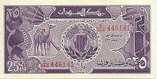

In this article, we examine the history and current state of the Sudanese Pound (SDP), which serves as the national currency of Sudan. The Sudanese Pound has experienced a complex journey through Sudan's political and economic shifts, reflecting the nation's tumultuous landscape. From its inception to its current form, the SDP has undergone numerous transformations driven by political decisions, economic challenges, and technological advancements.

Algorithmic trading, a modern technique in financial markets, is revolutionizing how traders and investors interact with various currencies, including the Sudanese Pound. This article will discuss how algorithmic trading methodologies can be applied to the SDP, offering investors and traders enhanced efficiency and accuracy. By leveraging algorithms, market participants can execute trades at high speeds and volumes, which is crucial in today's rapidly changing financial environment.



Furthermore, it's essential to consider Sudan's broader economic context, impacting the valuation and perception of the Sudanese Pound in global markets. Sudan's economy faces unique challenges, including political instability and economic uncertainty, which in turn affect the currency's strength and reliability. Understanding these factors provides a more comprehensive picture of the SDP's role in both local and international economic frameworks.

Ultimately, this article aims to provide a thorough analysis of the Sudanese Pound, highlighting its historical evolution, current economic implications, and future potential within global financial markets. Through this exploration, we offer insights into the SDP's significance and how modern trading techniques can be employed to engage with this complex currency.

## Table of Contents

## History of the Sudanese Pound (SDP)

The Sudanese Pound (SDP) has a history that mirrors the nation's complex political and economic journey. The SDP was first introduced in 1956, marking a significant shift from the Egyptian pound, which had been in use during the Anglo-Egyptian Condominium. The replacement was part of Sudan's post-independence efforts to establish its national identity and financial sovereignty.

In 1992, Sudan underwent significant economic reforms, leading to the introduction of the Sudanese Dinar (SDD). This change was driven by the country's need to stabilize its economy amidst internal strife and international isolation. The move from the SDP to the SDD was representative of a broader strategy to respond to hyperinflation and economic instability caused by prolonged civil conflict and shifting government policies.

The 2005 Comprehensive Peace Agreement, which aimed to end the Second Sudanese Civil War, paved the way for subsequent economic changes. In 2007, the Sudanese government introduced the second iteration of the Sudanese Pound (SDG). This reintroduction was part of a broader peacekeeping and economic recovery strategy intending to unify the country's dual banking systems and stabilize its economy. 

The next major evolution in Sudan's currency came following the secession of South Sudan in 2011. This geopolitical shift required Sudan to issue new banknotes for the SDP as the loss of significant oil revenues—most of which were located in the newly independent South—presented economic challenges. The new currency design and issuance marked Sudan's continued efforts to adapt to its altered economic landscape and maintain a stable currency.

Throughout these transitions, the Sudanese Pound has been deeply intertwined with Sudan's political and economic developments, reflecting the nation's attempts to navigate internal and external pressures while striving for economic stability.

## Sudanese Pound in the Modern Economy

The Sudanese Pound (SDP) plays a pivotal role in Sudan's modern economy, primarily influencing trade and economic policies. As of the latest iteration, the SDP is vital for facilitating trade with key partners, most notably China. This partnership is crucial due to China's significant investment in Sudan's infrastructure and its demand for Sudanese exports, which include oil and agricultural products. Agriculture remains a cornerstone of Sudan's economy and heavily influences the valuation of the SDP. The country's reliance on agriculture makes the currency particularly sensitive to shifts in agricultural output, which can be affected by climate variations and geopolitical factors.

Sudan is currently grappling with significant economic challenges, including stagflation—a combination of stagnant economic growth and high inflation—and soaring inflation rates. These issues undermine the strength of the Sudanese Pound and pose challenges for maintaining economic stability. For instance, in periods of high inflation, the purchasing power of the SDP diminishes, making imports more expensive and potentially leading to a trade deficit. To mitigate these challenges, the Central Bank of Sudan (CBOS) is instrumental in managing monetary policy aimed at ensuring currency stability. 

The CBOS undertakes measures to stabilize the currency, which include interventions in the foreign exchange market and adjustments to interest rates. A unique aspect of Sudan's monetary policy is its adherence to Islamic banking principles, which prohibit the payment of interest. Instead, the CBOS utilizes profit-sharing methods and other Sharia-compliant instruments to conduct monetary operations. These principles add a layer of complexity to monetary policy but are deeply rooted in the cultural and religious context of the country. 

Overall, the success of the Sudanese Pound in the modern economy is intertwined with the nation’s ability to navigate its economic challenges, maintain stable trade relationships, and manage monetary policy effectively in alignment with Islamic financial principles.

## Algorithmic Trading and the Sudanese Pound

Algorithmic trading, a method utilizing computer algorithms to execute trades at ultra-high speeds and volumes, has revolutionized [forex](/wiki/forex-system) markets, including trades involving the Sudanese Pound (SDP). This approach leverages pre-defined criteria and statistical models for making informed and rapid trading decisions, offering traders significant advantages in terms of efficiency and accuracy.

**Efficiency and Accuracy in Trading**

Algorithmic trading facilitates efficient trading of the Sudanese Pound by minimizing manual intervention. Algorithms analyze vast amounts of market data in real-time, enabling swift decision-making and execution. With [algorithmic trading](/wiki/algorithmic-trading), traders can capitalize on fleeting opportunities within fractions of a second, ensuring better execution prices and reduced transaction costs. This is particularly beneficial in volatile markets such as those influenced by the economic challenges in Sudan, where rapid currency fluctuations can occur.

**Execution at High Speed and Volumes**

The core of algorithmic trading lies in its ability to process and execute trades at high speeds and volumes. Algorithms are programmed to recognize market patterns and trigger trades based on set conditions such as price levels, trends, and historical data analysis. The following Python code snippet demonstrates a simplistic approach to algorithmic trading using moving averages:

```python
import pandas as pd
import numpy as np

# Example function to calculate moving averages
def calculate_moving_averages(prices, short_window, long_window):
    signals = pd.DataFrame(index=prices.index)
    signals['price'] = prices
    signals['short_mavg'] = prices.rolling(window=short_window, min_periods=1).mean()
    signals['long_mavg'] = prices.rolling(window=long_window, min_periods=1).mean()
    signals['signal'] = np.where(signals['short_mavg'] > signals['long_mavg'], 1.0, 0.0)
    signals['positions'] = signals['signal'].diff()
    return signals

# Example usage
prices = pd.Series([100, 102, 101, 103, 104, 105, 107, 108])
signals = calculate_moving_averages(prices, short_window=3, long_window=5)
print(signals)
```

This code calculates short and long-term moving averages to generate buy/sell signals for the Sudanese Pound, a common strategy in algorithmic trading.

**Benefits and Risks**

The key benefits of algorithmic trading include improved [liquidity](/wiki/liquidity-risk-premium), precise timing, and minimized human error, which are paramount in a fluctuating market landscape. However, it also carries substantial risks. High-frequency trading algorithms might exacerbate market [volatility](/wiki/volatility-trading-strategies), and technical failures or erroneous algorithms could lead to significant losses. Traders must be vigilant in back-testing and optimizing algorithms to align with market conditions and risk management strategies.

**Tools and Strategies**

Successful algorithmic trading in forex markets requires robust technology and strategic insights. Trading platforms like MetaTrader 4 and 5 offer algorithmic trading functionalities that can be applied to the Sudanese Pound. Strategies commonly employed include [trend following](/wiki/trend-following), [arbitrage](/wiki/arbitrage), and market-making. These strategies, combined with [machine learning](/wiki/machine-learning) models and big data analytics, can significantly enhance trading outcomes.

Algorithmic trading thus represents a sophisticated approach to engaging with the Sudanese Pound, offering possibilities for both mitigating risks and maximizing returns in Sudan's dynamic financial environment. However, comprehensive understanding and careful application are essential to harness its full potential in currency markets.

## Challenges and Opportunities

Trading the Sudanese Pound (SDP) presents a unique set of challenges and opportunities that reflect both the economic circumstances of Sudan and the broader dynamics of currency markets. Geopolitical risks and economic instability are paramount challenges. Sudan's political landscape, characterized by transitions and internal conflicts, often leads to market uncertainty. This unpredictability can affect investor confidence and result in fluctuating exchange rates, making it difficult for traders to forecast currency movements accurately.

Currency devaluation remains a significant hurdle. The SDP has experienced repeated devaluations in response to economic pressures such as inflation, which has persisted at high levels. Traders must remain vigilant of these economic signals as they directly affect the currency's value against global benchmarks. High inflation erodes purchasing power, prompting devaluations that can be sudden and substantial, catching traders off guard.

However, opportunities exist within this challenging environment for traders who can effectively leverage technology and comprehensive market analysis. Algorithmic trading, for instance, provides a way to manage these rapid and often unpredictable changes. Automation allows traders to execute strategies at the speed necessary to capitalize on market shifts, analyzing large data sets to predict future movements, and adjusting positions accordingly.

Investors are also exploring diversification strategies involving the Sudanese Pound. This approach can help mitigate risks associated with holding assets in a single currency. By incorporating the SDP into a broader investment portfolio, traders can balance risk by offsetting potential losses in the SDP with gains in other currencies or financial instruments.

For traders looking to align their strategies with the evolving currency market in Sudan, maintaining up-to-date geopolitical and economic insights is essential. Being aware of policy changes by the Central Bank of Sudan and other government measures can inform trading decisions. Furthermore, understanding local economic indicators, such as inflation rates and agricultural outputs, which significantly impact the SDP, is crucial.

In summary, while trading the Sudanese Pound involves navigating significant challenges, informed and strategic approaches can convert these challenges into profitable opportunities. Employing advanced technologies like algorithmic trading and implementing diversification strategies are key methods for managing risks and maximizing returns in this volatile market.

## Conclusion

The Sudanese Pound (SDP) is characterized by a complex interplay of historical evolution and contemporary economic challenges, presenting both hurdles and opportunities within the forex trading landscape. The currency's tumultuous history, marked by several transformations and the regional political shifts, has culminated in the present economic context of Sudan. Despite these challenges, advancements in financial technology, particularly algorithmic trading, open new avenues for engaging with the SDP market. This modern trading technique enhances trading efficiency and accuracy, reducing human error and allowing for rapid decision-making in a volatile market.

Engaging with the Sudanese financial markets demands a comprehensive understanding of the economic landscape and the inherent risks associated with trading the SDP. Economic factors such as high inflation rates, geopolitical instability, and dependency on agriculture are critical considerations for traders. Algorithmic trading can help mitigate some of these risks by employing data-driven strategies and real-time analysis, offering significant advantages in terms of executing large volumes of trades swiftly.

To effectively navigate the complexities of the Sudanese Pound, investors should remain informed about economic developments, regulatory changes, and technological advancements. Leveraging modern trading techniques, such as algorithmic trading, requires proficiency in programming languages like Python, which offers libraries that support the development of analytical models tailored to financial markets. Here is a simple Python script example to fetch and analyze forex data using the 'forex-python' library:

```python
from forex_python.converter import CurrencyRates
from forex_python.bitcoin import BtcConverter

# Initialize currency rate object
c = CurrencyRates()

# Fetch live rate of Sudanese Pound to US Dollar
rate = c.get_rate('SDG', 'USD')
print("Current exchange rate (SDG to USD):", rate)

# Assuming an algorithmic trading model, integrate data for decision-making
# Example: Check if the rate meets threshold for a hypothetical trading condition
threshold = 0.002  # Hypothetical threshold
if rate < threshold:
    print("Opportunity detected: Consider initiating trade based on algorithmic strategy.")
```

This simple script illustrates how traders might begin to develop algorithmic trading models to engage with the SDP market. By staying informed and applying disciplined, technology-enhanced strategies, investors can better manage risk and capitalize on market opportunities presented by the Sudanese Pound. Recognizing both the challenges and potential that accompany trading this currency, informed and strategic engagement is essential for success.

## References & Further Reading

[1]: Miller, R. (2015). ["Sudan's Currency: History and Challenges."](https://www.rbauction.com/cp/welding-machines-and-equipment?from=21840) African Review of Economics and Finance.

[2]: Lopez de Prado, M. (2018). ["Advances in Financial Machine Learning."](https://www.amazon.com/Advances-Financial-Machine-Learning-Marcos/dp/1119482089) Wiley.

[3]: Jansen, S. (2020). ["Machine Learning for Algorithmic Trading."](https://github.com/stefan-jansen/machine-learning-for-trading) Packt Publishing.

[4]: Chan, E. P. (2009). ["Quantitative Trading: How to Build Your Own Algorithmic Trading Business."](https://github.com/ftvision/quant_trading_echan_book) John Wiley & Sons.

[5]: Baladi, Y., & Benedek, E. P. (2018). ["Algorithmic Trading: Winning Strategies and Their Rationale."](https://www.wiley.com/en-us/Algorithmic+Trading%3A+Winning+Strategies+and+Their+Rationale-p-9781118460146) John Wiley & Sons.