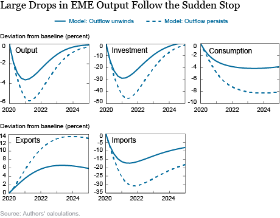

## Table of Contents

## What is a sudden economic stop?

A sudden economic stop is when a country's economy slows down very quickly. This happens when money from other countries stops coming in suddenly. It can cause big problems because the country might not have enough money to keep things running smoothly.

This can happen for different reasons, like if people in other countries lose trust in the economy or if there are big changes in the world's money markets. When it happens, it can lead to less spending, more people out of work, and businesses closing down. It's like the economy hits a big roadblock and struggles to keep moving forward.

## What are the common causes of a sudden economic stop?

A sudden economic stop often happens when foreign investors suddenly pull their money out of a country. This can happen if they lose confidence in the country's economy. For example, if there are signs that the country might not be able to pay back its debts, investors might get scared and take their money elsewhere. Another reason could be big changes in the global financial markets, like a crisis in another part of the world that makes investors nervous everywhere.

Also, problems within the country itself can lead to a sudden stop. If a country has been borrowing a lot of money from other countries, and then something goes wrong—like a political crisis or a natural disaster—investors might worry that the country won't be able to keep up with its payments. This fear can make them pull out their money quickly. Additionally, if a country's currency loses value very fast, it can make foreign money less valuable when it's brought back home, causing investors to withdraw their funds to avoid losses.

In summary, sudden economic stops are usually triggered by a mix of things. It could be because of global financial issues, or it could be because of problems happening right in the country. When investors get scared and take their money out fast, it can cause the economy to slow down suddenly, leading to tough times for the country.

## How does a sudden economic stop affect a country's economy?

When a sudden economic stop happens, it can really hurt a country's economy. It's like the money coming in from other countries suddenly stops, and this can cause big problems. Businesses that were counting on that money to grow or even just to keep running might have to close down or let people go. When people lose their jobs, they have less money to spend, and this can make the economy slow down even more. It's like a chain reaction where one problem leads to another, and soon the whole economy is struggling.

The government can also find it hard to keep things running smoothly during a sudden stop. They might not have enough money to pay for important services like healthcare or education. If the country had been borrowing money from other countries, it might struggle to pay back those loans, which can make the situation even worse. All these problems together can make life harder for everyone in the country, and it can take a long time for the economy to recover and start growing again.

## What are the immediate impacts of a sudden economic stop on businesses?

When a sudden economic stop happens, businesses feel the impact right away. They might have been planning to grow or expand using money from other countries, but now that money is gone. This means they might have to put their plans on hold or cancel them altogether. If a business was relying on that money to keep running, it could be in big trouble. They might have to cut costs quickly, which often means letting workers go or closing down parts of the business.

The loss of jobs can make things even harder for businesses. When people lose their jobs, they have less money to spend on things they want or need. This means fewer customers for businesses, which can lead to less money coming in. If businesses can't make enough money to cover their costs, they might have to close down. It's a tough cycle where one problem leads to another, making it hard for businesses to keep going during a sudden economic stop.

## Can you explain the role of capital flows in sudden economic stops?

Capital flows are like the money that moves between countries. When a country gets a lot of money from other countries, it can help the economy grow. Businesses can use this money to expand, and the government can use it to pay for important things. But if this money suddenly stops coming in, it can cause big problems. This is what happens during a sudden economic stop. When foreign investors get scared and take their money out of the country quickly, it's like pulling the rug out from under the economy.

When capital flows stop suddenly, businesses that were counting on that money to keep running or to grow might have to close down or let people go. This can lead to fewer jobs and less money for people to spend, which makes the economy slow down even more. The government might also struggle to pay for important services like healthcare or education because they were expecting that money to come in. So, capital flows are really important for keeping an economy going, and when they stop suddenly, it can cause a lot of trouble.

## How do sudden economic stops influence employment rates?

When a sudden economic stop happens, it can really hurt the number of people with jobs. Businesses that were using money from other countries to grow or just to keep going might have to let workers go because that money is suddenly gone. This means more people are out of work, and it can happen very quickly. When lots of people lose their jobs all at once, it's bad for the whole economy because those people have less money to spend.

As more people are out of work and spending less, businesses see fewer customers coming in. This can make businesses struggle even more, and they might have to close down or let even more people go. It's like a cycle where one problem leads to another, making it hard for the economy to get back on track. So, a sudden economic stop can lead to higher unemployment rates, and it can take a long time for things to get better.

## What are the policy responses to mitigate the effects of a sudden economic stop?

When a sudden economic stop happens, governments and central banks can take steps to help the economy. One thing they might do is lower interest rates. This makes it cheaper for businesses and people to borrow money, which can help them keep going or even grow. Governments might also spend more money on things like building roads or helping people who are out of work. This can create jobs and put more money into people's pockets, which can help the economy start moving again.

Another thing governments can do is try to make sure they have enough money saved up for tough times. This way, if foreign money stops coming in, they can use their savings to help keep the economy running. They might also talk to other countries or international groups to get help or loans. These steps can help soften the blow of a sudden economic stop and make it easier for the economy to recover.

## How do sudden economic stops differ from other economic crises?

A sudden economic stop is different from other economic crises because it happens very quickly and is often caused by money from other countries suddenly stopping. In other economic crises, like a recession, the economy might slow down over time because of things like high unemployment or businesses not doing well. But with a sudden stop, it's like the economy hits a wall because foreign investors pull their money out fast. This can happen because of a crisis in another part of the world or because people lose trust in the country's economy.

Another way sudden economic stops are different is that they can hit countries that rely a lot on money from other countries harder. For example, if a country has been borrowing a lot of money from abroad, a sudden stop can make it hard for them to pay back those loans. Other crises might be more about problems within the country itself, like a housing market crash or high inflation. Sudden stops are more about the flow of money between countries and how quickly things can change when that flow stops.

## What historical examples illustrate sudden economic stops and their outcomes?

One big example of a sudden economic stop happened in Mexico in 1994. It's called the "Tequila Crisis." Mexico had been getting a lot of money from other countries, but then people started to worry about Mexico's economy. They pulled their money out fast, and Mexico's economy slowed down a lot. The government had to ask for help from other countries and the International Monetary Fund. It took a few years, but with help, Mexico's economy started to get better.

Another example is the Asian Financial Crisis in 1997. It started in Thailand when people lost trust in the Thai currency and took their money out of the country. This sudden stop spread to other countries like South Korea and Indonesia. Many businesses closed down, and a lot of people lost their jobs. Countries had to get help from the International Monetary Fund to get their economies going again. It was a tough time, but slowly, these countries started to recover.

These examples show how sudden economic stops can cause big problems for a country. When money from other countries stops coming in suddenly, it can lead to businesses closing, people losing jobs, and the government struggling to pay for things. But with help and time, countries can start to get better.

## What are the long-term economic implications of a sudden economic stop?

A sudden economic stop can have big effects on a country's economy that last a long time. When foreign money stops coming in quickly, businesses might have to close down, and a lot of people can lose their jobs. This can make the economy slow down for years. It can also make it hard for the country to borrow money again in the future because other countries might not trust them as much. This means the country might have to pay higher interest rates if they want to borrow money, which can make things even tougher.

Over time, a sudden stop can change how a country's economy works. The government might have to spend a lot of money to help the economy recover, which can lead to more debt. This can make it hard for the government to spend money on important things like schools and hospitals. Also, if a lot of businesses closed down during the sudden stop, it might take a long time for new businesses to start up and for the economy to grow again. So, a sudden economic stop can have effects that last for many years, making it hard for the country to get back on track.

## How can predictive models help in anticipating a sudden economic stop?

Predictive models can help in anticipating a sudden economic stop by looking at different signs and patterns in the economy. These models use data from the past to see if there are any changes happening now that might lead to a sudden stop. For example, they can look at how much money is coming into the country from other countries, how much the country is borrowing, and how people feel about the economy. If the models see that foreign money is starting to leave the country quickly or that people are losing trust in the economy, they can warn that a sudden stop might be coming.

By using these models, governments and businesses can get ready for a sudden economic stop before it happens. They can start saving money, making plans to help businesses, and thinking about ways to keep the economy going if foreign money stops coming in. This can help make the effects of a sudden stop less bad and help the economy recover faster. So, predictive models are like a warning system that can help everyone be more prepared and make better choices to protect the economy.

## What are the current research trends and theories regarding sudden economic stops?

Researchers are always trying to learn more about sudden economic stops and how to predict them. One big trend in research is using new data and technology to make better predictive models. These models look at lots of different things, like how much money is coming into a country, how much the country is borrowing, and even things like how people feel about the economy. By putting all this information together, researchers hope to find patterns that can warn us when a sudden stop might be coming. This way, governments and businesses can be ready and take steps to make the effects less bad.

Another important area of research is understanding what causes sudden economic stops in the first place. Some theories say it's because of global financial problems, like a crisis in another part of the world that makes investors nervous everywhere. Other theories focus on things happening inside the country, like if the country has been borrowing too much money and can't pay it back. Researchers are trying to figure out which of these factors are most important and how they work together to cause a sudden stop. By understanding the causes better, we can come up with better ways to prevent sudden stops or at least make them less harmful when they do happen.

## References & Further Reading

[1]: Kirilenko, A.A., Kyle, A.S., Samadi, M., & Tuzun, T. (2014). ["The Flash Crash: The Impact of High-Frequency Trading on an Electronic Market."](https://onlinelibrary.wiley.com/doi/abs/10.1111/jofi.12498) The Journal of Finance, 69(6).

[2]: Hendershott, T., Jones, C.M., & Menkveld, A.J. (2011). ["Does Algorithmic Trading Improve Liquidity?"](https://onlinelibrary.wiley.com/doi/full/10.1111/j.1540-6261.2010.01624.x) The Review of Financial Studies, 24(3).

[3]: Easley, D., Lopez de Prado, M., & O’Hara, M. (2012). ["Flow Toxicity and Liquidity in a High-Frequency World."](https://www.semanticscholar.org/paper/Flow-Toxicity-and-Liquidity-in-a-High-Frequency-Easley-Prado/9369430bd005d194f9332ae7cbd5a57ace5e9ab3) The Review of Financial Studies, 25(5).

[4]: Bookstaber, R. (2007). ["A Demon of Our Own Design: Markets, Hedge Funds, and the Perils of Financial Innovation."](https://archive.org/details/demonofourowndes0000book) Wiley.

[5]: Shiller, R.J. (2008). ["The Subprime Solution: How Today's Global Financial Crisis Happened, and What to Do about It."](https://www.jstor.org/stable/j.cttq94jd) Princeton University Press.

[6]: Borio, C., & Drehmann, M. (2009). ["Assessing the Risk of Banking Crises – Revisited."](https://www.bis.org/publ/qtrpdf/r_qt0903e.htm) Bank for International Settlements, Working Paper No. 208.