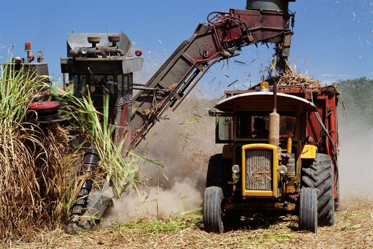

The global sugar industry plays a crucial role in the world economy, serving as an essential commodity for numerous countries and driving economic activities spanning agriculture, trade, and manufacturing. Sugarcane and sugar beet, the primary sources of sugar production, are cultivated across diverse geographic regions, contributing significantly to the livelihood of millions of farmers. The sugar industry not only supports various economic sectors but also addresses vital food security needs by providing a stable source of energy for consumption and production processes.

Sugar futures have become indispensable instruments in commodity markets, particularly for hedging, speculating, and establishing future delivery prices of sugar. These derivative contracts allow parties to lock in the price of sugar for delivery on a specified future date, thus enabling them to manage price volatility. Among these, Sugar No.11 futures stand out as a benchmark for global sugar pricing. Traded on the Intercontinental Exchange (ICE), the Sugar No.11 contract is pivotal for countries involved in sugar production and trade, determining the economic viability of sugar exports and imports.



The emergence of algorithmic trading has transformed the commodity sector, introducing a technological edge to trading practices. Algorithmic trading involves using pre-programmed sequences of trading instructions for executing orders automatically, enabling rapid transaction processing and the ability to exploit market inefficiencies. In the context of commodity markets, algorithmic trading offers enhanced speed, precision, and the capacity to process substantial volumes of data, aligning seamlessly with the dynamic nature of sugar futures trading.

Exploring algorithmic approaches in sugar futures trading presents a compelling opportunity to leverage these technological advancements, potentially optimizing trading strategies and mitigating risks. Through sophisticated algorithms, traders can analyze historical data, identify patterns, and predict price movements with greater accuracy. This exploration includes understanding how algorithmic trading can benefit sugar futures trading by offering tools for better market predictions, efficient order execution, and risk management.

This article endeavors to examine strategies, challenges, and potential benefits associated with algorithmic trading in Sugar No.11 futures. By focusing on the specifics of algorithmic strategy development, market analysis, and risk mitigation, the discussion aims to provide insights into maximizing profitability while navigating the intricate landscape of the sugar futures market. The evolving nature of commodities trading and regulatory landscapes will also be considered, setting the stage for future trends and technological innovations in the industry.

## Table of Contents

## Understanding Sugar No.11 Futures

Sugar No.11 futures represent standardized contracts for the delivery of raw cane sugar at a specified future date, with its primary trading platform being the Intercontinental Exchange (ICE). The contract is considered the global benchmark for raw sugar pricing due to its widespread use and historical significance in the commodities market.

Historically, Sugar No.11 has played a pivotal role in stabilizing sugar prices worldwide. Its significance traces back to the early 20th century when sugar began to be traded on exchanges, providing a mechanism to hedge the risk of price fluctuations. The contractual specifications, including a standard lot size of 112,000 pounds, facilitate ease of trade among producers, consumers, and speculators.

Key factors influencing Sugar No.11 prices involve a combination of supply-demand dynamics, weather conditions, and geopolitical influences. Supply factors include the annual yield of sugarcane, which can be affected by climatic variations such as El Niño. Demand factors often correlate with global economic conditions and changes in consumption patterns, driven by health trends and sugar substitution. Geopolitical factors, such as trade policies and tariffs, can also exert substantial impact. For instance, trade agreements between major producing countries like Brazil and consuming regions like the European Union or the United States may alter price dynamics significantly.

For producers, traders, and investors, Sugar No.11 futures provide a crucial tool for making informed decisions. Producers use these contracts to lock in prices and hedge against adverse price movements, ensuring stable revenue in volatile markets. Traders and investors participate to capture [arbitrage](/wiki/arbitrage) opportunities and speculate on future price movements aided by fundamental and technical analysis.

When compared with other sugar futures contracts, such as Sugar No.16, which is specific to the U.S. domestic market, Sugar No.11 provides a broader international perspective on sugar prices, thereby being more susceptible to global market influences. This contrasts with more localized commodities or contracts of white sugar, which are typically influenced by additional refining costs and regional market conditions.

In summary, understanding the intricate workings and influential factors surrounding Sugar No.11 futures is essential for stakeholders in predicting future trends and optimizing their positions in these markets.

## Significance of Algorithmic Trading in Commodity Markets

Algorithmic trading refers to the use of computer programs and algorithms to execute trades in financial markets. These systems analyze market data and execute orders automatically based on pre-defined criteria. Commonly employed in various financial markets, [algorithmic trading](/wiki/algorithmic-trading) enhances the speed and efficiency of transactions, enabling traders to capitalize on minute price differentials with [high frequency](/wiki/high-frequency-trading) and precision.

Key benefits of using algorithms in trading include increased speed, accuracy, and data processing capabilities. Algorithms can process vast amounts of data in real-time, identify patterns, and execute trades far faster than human traders. This rapid processing is crucial in modern markets where milliseconds can determine the profitability of a trade. Algorithms also eliminate human error associated with manual trading, leading to more accurate trades.

In the context of commodity markets, including sugar futures, algorithmic trading offers specific advantages. The commodity markets are often characterized by high [volatility](/wiki/volatility-trading-strategies) and rapid price changes, driven by factors such as weather events, geopolitical developments, and changing supply-demand dynamics. Algorithms can swiftly respond to these changes, making it possible to optimize trading strategies based on current market conditions. They can assess factors like historical price data, seasonal trends, and macroeconomic indicators, helping traders to make informed decisions.

Algorithms contribute to risk management by incorporating risk controls and stop-loss orders into trading strategies. They can adjust positions based on market conditions, volatility levels, or predefined loss thresholds, thereby mitigating potential losses. Additionally, algorithms can diversify trading activities by simultaneously managing multiple strategies across different commodities or markets, thereby spreading risk.

Despite its advantages, algorithmic trading in commodity markets presents challenges and limitations. One significant challenge is latency, which refers to the time delay between receiving market data and executing trades. Even small delays can lead to missed opportunities or increased exposure to risk. Ensuring high-quality data is another critical [factor](/wiki/factor-investing); inaccurate or outdated data can lead to erroneous trading decisions. System reliability is equally important, as technical failures can disrupt trading operations and result in financial losses.

Regulatory and compliance concerns are also crucial. Commodity markets are subject to stringent regulations, and algorithmic traders must ensure their strategies comply with legal standards. Additionally, they must be vigilant against market manipulation and other unethical practices, as automated systems can inadvertently contribute to such activities.

Unexpected market volatility or unforeseen global events can pose significant risks to algorithmic trading strategies. Algorithms designed for stable markets may not perform well under unexpected conditions, necessitating continual refinement and adaptation of trading models. To mitigate these challenges, traders employ stress testing, scenario analysis, and ongoing monitoring of algorithm performance, ensuring systems are resilient and adaptable to changing market environments.

## Developing Algorithmic Strategies for Sugar No.11 Futures

Developing algorithmic strategies for trading Sugar No.11 futures involves a methodical process to ensure that the strategies are not only profitable but also robust against market fluctuations. This process typically involves a series of steps:

1. **Market Analysis, Pattern Recognition, and Data Collection**: A crucial first step in algorithmic trading strategies is understanding the factors that affect Sugar No.11 futures prices. This involves analyzing market data to identify trends, seasonal patterns, and anomalies. Tools such as time series analysis, regression analysis, and machine learning models (e.g., clustering for pattern recognition) can be employed to interpret historical data and predict future price movements. Data collection is vital, and it must encompass a comprehensive range of economic indicators, weather patterns affecting sugarcane yield, and geopolitical events that could impact supply and demand dynamics.

2. **Tools and Technologies**: Developing these algorithms effectively requires sophisticated tools and technologies. Popular programming languages used in algorithmic trading include Python and C++ due to their libraries and computational efficiency. Python, with libraries like Pandas for data manipulation, NumPy for numerical computations, and SciPy for scientific computations, is widely used. Machine learning frameworks such as TensorFlow, Scikit-learn, or PyTorch could be leveraged to create predictive models. Trading platforms like MetaTrader, TradeStation, or Interactive Brokers provide APIs which can be used to execute trades based on algorithmic decisions.

3. **Designing Algorithms for Specific Market Conditions**: Customization of algorithms to suit market conditions specific to Sugar No.11 is critical. For instance, if the market tends to show high price volatility during certain periods (perhaps due to weather uncertainties affecting sugarcane crops), algorithms can be devised to take advantage of these conditions. Strategies might involve mean reversion, where the algorithm identifies overbought or oversold conditions, or momentum trading, which capitalizes on strong directional trends. The algorithm must incorporate rules for entry and exit points, position sizing, and risk management to accommodate these conditions.

4. **Backtesting and Refining Strategies**: Before deploying a trading strategy, backtesting is essential to simulate its performance against historical data. This process helps evaluate how the algorithm would have performed in the past, providing insights into its potential profitability and risks. The backtesting environment should replicate real trading conditions, considering factors such as transaction costs and slippage. Once tested, strategies should be refined and optimized to handle different market scenarios, reduce drawdowns, and enhance returns. Continuous feedback loops and iterative improvements to the algorithm are crucial for adapting to changing market conditions.

In conclusion, the development of algorithmic trading strategies for Sugar No.11 futures relies on a strong foundation of market analysis, effective use of technology, designing tailored algorithms, and rigorous [backtesting](/wiki/backtesting). These elements work together to create strategies that are not just profitable but also resilient in the face of market uncertainties.

## Challenges in Algorithmic Trading of Sugar No.11 Futures

Algorithmic trading in Sugar No.11 futures presents a unique set of challenges that traders must navigate to maintain profitability and system integrity. Below, the primary risks and difficulties associated with this domain are outlined, as well as effective strategies to mitigate these issues.

Technical challenges are among the most significant hurdles in algorithmic trading. Latency— the delay between input and execution— can severely impact trade outcomes, especially in volatile markets where prices fluctuate rapidly. Ensuring minimal latency requires robust infrastructure, often involving co-location services near exchange data centers and high-speed network connections. Moreover, data quality is paramount. Algorithms rely on accurate, real-time data feeds; thus, any discrepancies or lags can lead to poor decision-making and financial loss. System reliability also poses a technical challenge; trading systems must operate continuously with minimal downtime, demanding comprehensive testing and redundant systems to prevent failures.

Regulatory and compliance issues add another layer of complexity. Commodity markets, including sugar futures, are tightly regulated to ensure fair trading practices and market integrity. Algorithmic trades must comply with these regulations, necessitating thorough understanding and implementation of compliance measures within trading algorithms. This includes rules concerning order types, limits on trade sizes, and specific restrictions that may vary across jurisdictions.

Managing unexpected market volatility is critical in protecting against financial loss. Algorithmic traders must design their systems to handle sharp price movements and [liquidity](/wiki/liquidity-risk-premium) shortages, which can arise from unforeseen global events such as political instability or environmental factors impacting sugar supply. Risk management strategies, such as pre-defined stop-loss orders and volatility-adjusted position sizes, can help mitigate potential losses.

Traders employ various strategies to overcome these challenges and enhance resilience. Firstly, continuous system monitoring and maintenance are essential. Algorithms should be tested regularly, with updates applied as market conditions change or new regulatory guidelines are introduced. Employing [machine learning](/wiki/machine-learning) techniques can also enhance algorithmic performance by enabling systems to learn from historical data and adapt to emerging patterns. For example, a machine learning model might be implemented in Python using libraries such as scikit-learn to identify market trends:

```python
from sklearn.ensemble import RandomForestRegressor
import numpy as np

# Sample data
X = np.array([[1, 2], [2, 4], [3, 6]])
y = np.array([10, 20, 30])

# Initialize and train the model
model = RandomForestRegressor()
model.fit(X, y)

# Forecast future prices
future_data = np.array([[4, 8]])
forecast = model.predict(future_data)
print(f"Forecasted price: {forecast}")
```

In summary, while algorithmic trading in Sugar No.11 futures faces various challenges from technical and regulatory fronts to unpredictable market conditions, traders can employ robust infrastructure, ensure compliance, and implement adaptive strategies to overcome these obstacles. This balanced approach is essential for achieving long-term success in the volatile landscape of commodity trading.

## Case Studies and Success Stories

Analyzing successful examples of algorithmic trading in sugar futures involves examining the strategies employed by major players in the commodity trading sector. Algorithmic trading, which utilizes computer algorithms to automate trading decisions, has been extensively adopted in the sugar futures market, particularly with Sugar No.11 contracts. These futures have long been regarded as a benchmark in the sugar industry, providing liquidity and price discovery crucial for global players.

One notable example of success in algorithmic trading of sugar futures comes from commodity trading firms such as Louis Dreyfus Company and Cargill. These firms have invested significantly in technology and data analysis capabilities, enabling them to harness the power of algorithms effectively. By doing so, they have been able to optimize trading strategies, reduce transaction costs, and enhance the accuracy and speed of their trades. This technological edge has provided them with a competitive advantage in the highly dynamic sugar market.

Lessons learned from these firms emphasize the importance of a robust data infrastructure and advanced analytical tools. For new traders entering the market, this suggests that gaining a thorough understanding of market data and developing the capability to analyze it efficiently is critical. Additionally, having an adaptable strategy that can respond quickly to market changes can enhance the success of algorithmic trading systems. Implementing continuous learning mechanisms, such as machine learning models, can further refine trading algorithms to adapt to evolving market dynamics.

The impact of successful algorithmic trading on Sugar No.11's market dynamics is significant. It increases market liquidity, as algorithmic traders typically engage in a higher frequency of trades. Moreover, it can lead to more efficient price discovery processes, as algorithms are able to absorb and react to information faster than human traders. However, it also introduces challenges such as increased volatility and potential for market manipulation if not properly regulated.

These examples and lessons highlight that while algorithmic trading in sugar futures can provide substantial advantages, it also necessitates a profound understanding of both technology and market fundamentals. As the sugar market continues to evolve, it is likely that the role of algorithmic trading will only grow in importance, shaping both strategies and outcomes for traders involved with Sugar No.11 futures.

## Future Trends in Sugar Futures Trading

The sugar futures market has experienced transformative shifts due to the infusion of technological advancements, particularly in the realm of algorithmic trading. As these tools evolve, they are set to redefine commodity markets, including sugar futures, by enhancing efficiency and decision-making processes.

### Predictions on the Future of Sugar Markets and Technology's Role

The integration of advanced technologies is expected to play a pivotal role in the sugar markets' future. Algorithmic trading is anticipated to become more prevalent, driven by the capabilities of AI and machine learning. These technologies enable traders to analyze large datasets in real-time, predict market trends, and execute trades with greater precision, contributing to more dynamic and responsive market environments. The use of these technologies within sugar futures can significantly optimize trading strategies, potentially leading to reduced market inefficiencies and more stable pricing mechanisms.

### Emerging Trends in Algorithmic Trading

Algorithmic trading in sugar futures is likely to focus on optimizing parameters such as speed and data analysis capabilities. High-frequency trading algorithms that capitalize on microsecond advantages can offer benefits like improved arbitrage opportunities. Moreover, the integration of predictive analytics can aid in anticipating market movements, thereby enabling smarter decision-making processes. This will fundamentally alter how market participants engage with sugar futures, enhancing liquidity and potentially reducing market volatility.

### Innovations in AI and Machine Learning

Recent advancements in AI and machine learning offer promising innovations for sugar futures trading. Machine learning models can be trained to detect complex patterns and correlations in historical price data that are not easily visible through traditional analysis. These capabilities allow for the development of more nuanced trading strategies that adapt to changes in market behavior. For example, [reinforcement learning](/wiki/reinforcement-learning) algorithms can dynamically adjust trading approaches based on incoming data, optimizing outcomes even in volatile environments.

Python Example:
```python
import numpy as np
from sklearn.ensemble import RandomForestRegressor

# Simulated dataset
X = np.random.rand(1000, 5)  # Feature matrix
y = np.random.rand(1000)     # Target variable (price)

# Model fitting
model = RandomForestRegressor(n_estimators=100, random_state=42)
model.fit(X, y)

# Predicting future sugar prices
future_prices = model.predict(np.random.rand(10, 5))
print(future_prices)
```

This example demonstrates the application of a machine learning model to predict future price trends based on historical data. Such tools can be part of a strategic toolkit for improving trading efficiency.

### The Evolving Regulatory Landscape

The regulatory framework governing commodity markets, including sugar futures, continues to evolve. Emerging regulations may impose stricter compliance requirements on algorithmic trading strategies to ensure market integrity and prevent manipulative practices. Regulations might require greater transparency in algorithmic processes and serendipitously encourage the development of more robust risk management mechanisms within trading systems. Traders engaging in algorithmic strategies will need ongoing adaptation to these changing regulatory norms to maintain compliance and competitiveness.

### Conclusion on Sustainability and Long-Term Benefits

The sustainability of algorithmic trading within sugar futures hinges on balancing innovation with risk management. As technological sophistication grows, so too does the potential for algorithmic trading to offer long-term benefits, such as improved market transparency and efficiency. Nonetheless, traders must remain vigilant in navigating the complexities and risks inherent in these systems. Continuous education and adaptation will be crucial for traders leveraging these tools to enhance their positions in the market, thereby ensuring the enduring viability and success of algorithmic trading in sugar futures.

## Conclusion

The exploration of Sugar No.11 futures trading using algorithmic approaches has highlighted several key facets integral to modern commodity trading. Algorithmic trading provides numerous advantages, such as enhanced speed, accuracy, and the capacity to process large volumes of data efficiently. For Sugar No.11 futures, these benefits allow for rapid responses to market fluctuations and informed decision-making, which are crucial in a commodity sector characterized by volatility and geopolitical influences.

Algorithmic trading in Sugar No.11 futures also helps optimize trading strategies by employing advanced techniques like market analysis, pattern recognition, and backtesting. This technological edge assists traders in managing risks more effectively while striving for profitability. Despite these advantages, it is essential to strike a balance between innovation and risk. Algorithmic trading systems must be reliable, comply with regulatory standards, and be robust against unexpected market volatility.

As the trading environment continuously evolves with technological and regulatory changes, it is crucial for traders and investors to remain informed and adaptable. Innovation in AI and machine learning promises to further transform the landscape, offering improved predictive capabilities and potentially greater returns. Traders and investors are encouraged to explore algorithmic trading approaches as part of their strategy to enhance efficiency and resilience in managing Sugar No.11 futures. Embracing these advances ensures that market participants remain competitive and can capitalize on the dynamic opportunities the commodity market presents.

## References & Further Reading

[1]: ["Advances in Financial Machine Learning"](https://www.amazon.com/Advances-Financial-Machine-Learning-Marcos/dp/1119482089) by Marcos Lopez de Prado

[2]: ["Machine Learning for Algorithmic Trading"](https://github.com/stefan-jansen/machine-learning-for-trading) by Stefan Jansen

[3]: ["Quantitative Trading: How to Build Your Own Algorithmic Trading Business"](https://www.amazon.com/Quantitative-Trading-Build-Algorithmic-Business/dp/1119800064) by Ernest P. Chan

[4]: Ayache, E. (2006). ["The Blank Swan: The End of Probability."](https://onlinelibrary.wiley.com/doi/book/10.1002/9781119206354) Wiley.

[5]: Taleb, N. N. (2010). ["The Black Swan: The Impact of the Highly Improbable."](https://www.jstor.org/stable/23045073) Random House. 

[6]: ["Evidence-Based Technical Analysis: Applying the Scientific Method and Statistical Inference to Trading Signals"](https://www.amazon.com/Evidence-Based-Technical-Analysis-Scientific-Statistical/dp/0470008741) by David Aronson