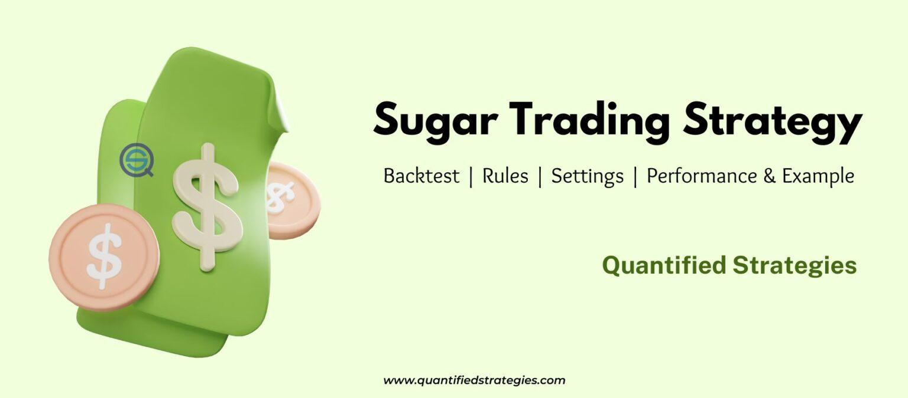

Sugar trading represents a vital aspect of the soft commodities market, encompassing a global network where supply and demand dynamics dictate pricing and investment strategies. Soft commodities refer to goods that are grown rather than mined, and sugar is a prominently traded item in this category due to its extensive production and consumption. As a staple commodity, it serves not only food industries but also the burgeoning biofuel sector, primarily through ethanol production. This multifaceted demand underscores its economic significance.

In recent decades, the financial landscape has undergone significant transformation with the advent of algorithmic trading. This form of trading utilizes computer algorithms to execute orders at speeds and frequencies far surpassing human capability. Algorithms can analyze market conditions, identify patterns, and make trading decisions based on extensive datasets quickly and without the emotional biases that can afflict human traders. This technological advance has permeated various trading markets, including commodities like sugar.



Understanding sugar trading within the context of algorithmic strategies is essential for both market participants and observers. It allows traders to apply systematic and quantitative strategies that can optimize returns and manage risks more effectively. By employing sophisticated algorithms, traders can harness benefits such as increased transaction speed, precision in executing trades, and the ability to process and act upon market information rapidly. These advantages make algorithmic trading a compelling prospect for those involved in sugar futures markets.

The objective of this article is to explore how algorithmic trading can be integrated into sugar futures trading. By examining the utilization of algorithms in such a critical commodity market, this article will provide insights into the current practices and future potential of algorithmic strategies. The focus will be on how these strategies can enhance trading efficiency, manage risks, and exploit market opportunities within the sugar market's dynamic environment.

## Table of Contents

## Understanding Sugar Futures

Sugar futures are standardized contracts in which the commodity, sugar, is bought and sold at a predetermined price for delivery on a specified future date. These contracts are pivotal in the soft commodities market, serving as tools for both producers and consumers to manage price risks associated with the volatility in sugar markets.

Trading in sugar futures is primarily conducted on major exchanges such as the Intercontinental Exchange (ICE) and the Chicago Mercantile Exchange (CME). These exchanges facilitate a centralized and regulated environment for trading, ensuring transparency and liquidity. ICE, for instance, offers the world benchmark contract for raw sugar, known as the Sugar No. 11 contract. This contract denotes the standard terms of trade, including the minimum price fluctuations, delivery months, and quality specifications, ensuring uniformity and reducing risks. Similarly, the CME provides platforms for both futures and options trading in sugar, catering to varying risk appetites and investment strategies.

The primary purpose of trading sugar futures lies in their versatility. For speculators, these contracts present an opportunity to profit from anticipated movements in sugar prices without the need for physical ownership of the commodity. Leveraging these contracts, traders can amplify potential gains, although this comes with increased risk. Hedgers, such as sugar producers and food manufacturers, utilize futures contracts to lock in prices, thereby protecting against adverse price fluctuations. For instance, a sugar mill may sell futures contracts to ensure a favorable selling price, mitigating the risk of price drops. Diversification is another benefit, as investors incorporate sugar futures into broader portfolios to spread risk across different asset classes.

The settlement process in sugar futures trading is crucial, delineating the transfer of funds and commodities upon the contract's expiration. Settlement can occur in two primary forms: cash settlement and physical delivery. Cash settlement involves the monetary difference between the contract price and the market price at maturity, allowing traders to settle their obligations without actual delivery of sugar. In contrast, physical delivery requires the actual exchange of sugar quantities as per contract specifications. This process is particularly significant for industrial participants who rely on the physical product.

In conclusion, understanding sugar futures involves comprehension of their core components, trading platforms, functional benefits, and settlement mechanisms. These contracts play a significant role in managing risk and facilitating strategic positioning in the global sugar markets.

## Algorithmic Trading in Commodities

Algorithmic trading refers to the use of computer algorithms to automate trading decisions in financial markets, including the commodities market. In the context of futures trading, [algorithmic trading](/wiki/algorithmic-trading) optimizes the execution of trades based on predefined criteria, leveraging computational power to identify profitable opportunities across various time frames.

One of the primary benefits of algorithmic trading is its speed. Algorithms can process vast amounts of market data and execute orders within milliseconds, which is significantly faster than any human trader could achieve. This rapid execution enables traders to capitalize on fleeting market opportunities, especially in volatile markets.

Accuracy is another advantage. Algorithms are programmed to operate with precision, reducing the chances of errors that may occur with manual trading. They can consistently apply trading logic over time, ensuring adherence to the trader's strategy without deviations caused by emotional influences.

Emotion-free trading is a crucial component of algorithmic trading. Traders are often subjected to emotional biases, such as fear and greed, which can lead to irrational decision-making. By automating trades, algorithms remove these emotional elements, executing decisions solely based on data and pre-set rules.

Although algorithmic trading offers notable benefits, it is not without its challenges and risks, especially in commodity markets. One challenge is the [liquidity](/wiki/liquidity-risk-premium) risk, where lack of sufficient market participants can lead to larger-than-expected price impacts when executing trades. Additionally, algorithms depend heavily on accurate and timely data; any delays or inaccuracies in data can result in substantial financial losses.

Furthermore, algorithmic trading is exposed to technological risks such as system failures or connectivity issues, which could lead to missed opportunities or erroneous trades. Market slippage and latency are additional risks, where delays in data processing or order execution can affect the performance of the trading strategy.

Technological requirements for implementing algorithmic trading systems are significant. These systems require high-speed internet connections, robust software platforms, advanced hardware capable of handling large computations, and access to real-time market data feeds. Additionally, efficient [backtesting](/wiki/backtesting) capabilities are crucial to validate the performance of trading algorithms under different market conditions before they are deployed in live trading environments.

Developing a robust algorithmic trading setup often involves using programming languages like Python or C++ due to their extensive libraries and community support. For instance, Python's libraries such as Pandas for data manipulation, NumPy for numerical computations, and libraries like PyAlgoTrade for backtesting and strategy implementation, are widely used in developing and testing trading algorithms.

```python
# Example setup of a basic algorithmic trading system using Python
import pandas as pd
import numpy as np

# Load data
data = pd.read_csv('sugar_futures_data.csv')
data['SMA50'] = data['Close'].rolling(50).mean()
data['SMA200'] = data['Close'].rolling(200).mean()

# Simple moving average crossover strategy
data['Signal'] = np.where(data['SMA50'] > data['SMA200'], 1, 0)

# Calculate returns
data['Returns'] = data['Close'].pct_change()
data['Strategy Returns'] = data['Returns'] * data['Signal'].shift(1)

# Backtesting the strategy
cumulative_returns = (1 + data['Strategy Returns']).cumprod()
print("Cumulative Returns:", cumulative_returns.iloc[-1])
```

In summary, algorithmic trading in commodities markets combines the advantages of speed, accuracy, and emotion-free execution with challenges related to data accuracy and technological dependencies. Establishing a sound technological infrastructure and well-defined risk management strategies are essential for successful deployment in the sugar futures market and other commodity segments.

## Sugar Trading Strategies in Algorithmic Trading

Trend-following strategies are a popular approach in algorithmic trading, particularly in markets like sugar futures that exhibit systematic trends driven by various factors. These strategies aim to capitalize on the [momentum](/wiki/momentum) of an asset's price movement, assuming that these movements will continue for a certain period. In sugar trading, trend-following can be instrumental in exploiting both upward and downward trends driven by supply-demand imbalances, market sentiment, and macroeconomic factors.

### Case Study: Backtested Strategy Using Trend-Following on Sugar Futures

A typical trend-following strategy might involve the use of moving averages to identify potential trends. For instance, a simple moving average (SMA) crossover strategy could be implemented, where a shorter-term SMA (e.g., 10-day) crossing above a longer-term SMA (e.g., 50-day) would generate a buy signal, while a crossover in the opposite direction would signal a sell.

```python
import pandas as pd
import numpy as np

# Load sugar futures data
data = pd.read_csv('sugar_futures.csv')
data['Date'] = pd.to_datetime(data['Date'])
data.set_index('Date', inplace=True)

# Calculate moving averages
data['10_SMA'] = data['Close'].rolling(window=10).mean()
data['50_SMA'] = data['Close'].rolling(window=50).mean()

# Generate buy/sell signals
data['Signal'] = np.where(data['10_SMA'] > data['50_SMA'], 1, 0)
data['Position'] = data['Signal'].diff()

# Backtest strategy
data['Strategy_Return'] = data['Close'].pct_change() * data['Position'].shift(1)
data['Cumulative_Strategy_Return'] = (1 + data['Strategy_Return']).cumprod()

# Plot results
import matplotlib.pyplot as plt

plt.figure(figsize=(14,7))
plt.plot(data['Cumulative_Strategy_Return'], label='Strategy Return')
plt.plot((1 + data['Close'].pct_change()).cumprod(), label='Sugar Futures Return')
plt.legend()
plt.show()
```

This Python script outlines a simple backtest of a moving average crossover strategy using historical sugar futures data. By comparing the cumulative returns of the strategy with those of the sugar futures, traders can assess its effectiveness.

### Overview of Potential Trading Signals Derived from Technical Analyses

Technical analyses provide an array of potential trading signals that can support trend-following strategies. These include:

- **Relative Strength Index (RSI):** Helps identify overbought or oversold conditions.
- **MACD (Moving Average Convergence Divergence):** Indicates the strength and direction of a trend.
- **Bollinger Bands:** Display volatility trends, useful for identifying breakout opportunities.

### Importance of Seasonality and Other Fundamental Factors in Strategy Formulation

Seasonality plays a crucial role in sugar trading strategies. Sugar production and prices are heavily influenced by climatic conditions, such as monsoons in India or droughts in Brazil, leading to predictable seasonal patterns. Incorporating seasonal analysis into trend-following strategies involves adjusting parameters to fit predicted seasonal shifts, thereby enhancing predictive power.

Fundamental factors, such as changes in government agricultural policies, shifts in global sugar consumption, and production costs, significantly impact sugar prices. Incorporating these elements into algorithmic models helps traders anticipate market dynamics beyond technical indicators, offering a more holistic approach to strategy formulation.

Overall, integrating trend-following strategies with thorough technical and [fundamental analysis](/wiki/fundamental-analysis) can improve the robustness and performance of sugar trading algorithms, allowing traders to better navigate the complexities of the sugar futures market.

## Impact of Market Dynamics on Sugar Trading

Sugar trading is significantly affected by various market dynamics, encompassing geopolitical factors, governmental policies, global production hubs like Brazil, the interconnection with ethanol demand, and inherent price [volatility](/wiki/volatility-trading-strategies). Understanding these elements is crucial for effective trading strategies, particularly when utilizing algorithmic trading systems.

Geopolitical factors and government policies substantially impact sugar prices by influencing supply chains and trade regulations. Tariffs, trade agreements, and import/export restrictions can either enhance or restrict the flow of sugar in international markets. For instance, increased tariffs on sugar imports by consuming nations can lead to price hikes in the global market, whereas subsidies for domestic sugar industries can cause overproduction, subsequently leading to price declines. Governmental interventions, such as setting minimum support prices or promoting domestic use over exports, also play pivotal roles. Policy changes in major sugar-producing countries, such as export quotas in India or subsidies to Brazilian producers, directly affect the global supply and pricing mechanisms.

Brazil stands as the world's largest sugar producer and exporter, making it a pivotal player in global sugar pricing. Its climatic conditions, crop yields, and domestic policies directly affect sugar availability on the world stage. Any adverse weather conditions, like droughts or excessive rainfall, can significantly disrupt Brazilian sugar production, leading to price volatility. Furthermore, Brazil's decision on the proportion of sugarcane directed towards sugar versus ethanol production directly influences supply levels. A shift towards ethanol, driven by favorable market conditions or government policies promoting biofuels, can reduce sugar export volumes, exerting upward pressure on prices.

The demand for sugar in ethanol production introduces another layer of complexity to market movements. Sugarcane is a key feedstock for ethanol production, particularly in Brazil. The interplay between sugar and ethanol markets creates a substitution effect; when ethanol prices rise, more sugarcane might be diverted towards ethanol production, tightening sugar supply and increasing prices. Conversely, a drop in ethanol demand or prices might lead to an oversupply of sugar, pushing prices downward. This dual demand structure necessitates that traders closely monitor energy markets and governmental policies supporting biofuels to anticipate sugar market trends accurately.

Price volatility is a characteristic feature of the sugar market. Such fluctuations can be driven by unpredictable factors like weather changes, sudden policy shifts, or global economic conditions. Algorithmic trading offers several strategies to manage this volatility effectively. By employing techniques such as trend-following, mean reversion, or statistical [arbitrage](/wiki/arbitrage), traders can systematically exploit price movements and reduce exposure to adverse shifts. For example, a trend-following strategy may involve using technical indicators like moving averages to detect and ride the momentum of price trends, whilst ignoring short-term noise. Algorithms can process vast amounts of data in real-time, allowing quicker and more informed decision-making.

Python, a popular programming language for algorithmic trading, can be instrumental in strategy development. By utilizing libraries like `pandas` for data manipulation, `numpy` for numerical computations, and `matplotlib` for plotting data trends, traders can create robust trading systems. 

Here’s a simple Python snippet illustrating a moving average crossover strategy, a common approach to manage sugar futures volatility:

```python
import pandas as pd
import numpy as np
import matplotlib.pyplot as plt

# Load sugar futures data
data = pd.read_csv('sugar_futures.csv')
data['MA50'] = data['Close'].rolling(50).mean()
data['MA200'] = data['Close'].rolling(200).mean()

# Plotting the data
plt.figure(figsize=(10, 5))
plt.plot(data['Close'], label='Sugar Futures Price')
plt.plot(data['MA50'], label='50-Day MA', color='r')
plt.plot(data['MA200'], label='200-Day MA', color='g')
plt.legend(loc='best')
plt.show()

# Trading signals
data['signal'] = np.where(data['MA50'] > data['MA200'], 1, 0)
data['position'] = data['signal'].diff()

# Output trading signals
buy_signals = data[data['position'] == 1]
sell_signals = data[data['position'] == -1]
```

This code detects the crossover points where the short-term moving average (50-day) crosses above or below the long-term moving average (200-day), generating buy and sell signals respectively. Such strategies can be backtested and refined to fit the sugar market’s unique characteristics.

In summary, understanding geopolitical, production, and demand factors, combined with efficient algorithmic strategies, is vital for navigating the complex and dynamic landscape of sugar trading.

## Developing a Sugar Trading Algorithm

Developing an algorithmic trading system for sugar futures involves a structured approach, ensuring that the trading strategies are both robust and adaptive to market conditions. Key steps include data selection and quality assurance, refining strategies through [machine learning](/wiki/machine-learning), and implementing risk management and optimization techniques.

### Steps to Develop an Algorithmic Trading System for Sugar Futures

1. **Selecting Appropriate Data and Ensuring Data Quality for Backtesting**

   The foundation of any algorithmic trading system is high-quality data. This includes historical price data, [volume](/wiki/volume-trading-strategy) data, and any relevant economic indicators that might affect sugar prices. Data should be collected from reliable sources such as the Intercontinental Exchange (ICE) or the Chicago Mercantile Exchange (CME).

   Ensuring data quality involves cleaning the data to remove any inconsistencies or errors. Common practices include handling missing values, removing outliers, and ensuring synchronized timestamps across datasets. Statistical methods, such as z-score normalization, can be employed to standardize the data, facilitating more accurate backtesting:

   ```python
   import pandas as pd
   from scipy.stats import zscore

   # Load data
   data = pd.read_csv('sugar_futures_data.csv')

   # Handle missing values
   data.fillna(method='ffill', inplace=True)

   # Standardize data
   data['Price'] = zscore(data['Price'])
   ```

2. **Using Machine Learning Techniques to Refine Trading Strategies for Sugar**

   Machine learning can significantly enhance trading strategies by identifying patterns and relationships not immediately apparent through traditional analysis. Techniques such as neural networks, support vector machines, and random forests can be applied to predict price movements or classify market conditions.

   Feature engineering is crucial, involving the creation of input variables that capture essential sugar market dynamics, such as moving averages, RSI (Relative Strength Index), and seasonality factors. These features are then used by machine learning models to improve predictions:

   ```python
   from sklearn.model_selection import train_test_split
   from sklearn.ensemble import RandomForestClassifier

   # Example feature engineering
   data['Moving_Avg'] = data['Price'].rolling(window=20).mean()
   data['RSI'] = calculate_rsi(data['Price'])

   # Splitting data for training and testing
   X = data[['Moving_Avg', 'RSI']]
   y = data['Price'].shift(-1) > data['Price']  # Predicting price increase
   X_train, X_test, y_train, y_test = train_test_split(X, y, test_size=0.2, random_state=42)

   # Train model
   model = RandomForestClassifier(n_estimators=100)
   model.fit(X_train, y_train)
   ```

3. **Risk Management and Optimization Techniques in Algorithmic Trading**

   Effective risk management is essential in algorithmic trading to mitigate losses and protect capital. Techniques such as position sizing, stop-loss orders, and diversification are key. Furthermore, optimization of trading parameters can enhance performance, often using methods like grid search or genetic algorithms.

   Backtesting should be employed to evaluate how strategies would have performed using historical data, adjusting for transaction costs and slippage:

   ```python
   # Example of a simple backtest
   data['Signal'] = model.predict(X)
   data['Strategy_Return'] = data['Signal'] * data['Price'].pct_change()

   # Calculating cumulative returns
   data['Cumulative_Returns'] = (1 + data['Strategy_Return']).cumprod()

   # Implementing a stop-loss
   def apply_stop_loss(returns, threshold=0.02):
       for i in range(1, len(returns)):
           if returns[i] < -threshold:
               returns[i] = -threshold
       return returns

   data['Strategy_Return'] = apply_stop_loss(data['Strategy_Return'])
   ```

In conclusion, developing a sugar trading algorithm combines domain expertise in commodity trading with advanced computational techniques. By carefully selecting and processing data, leveraging machine learning models, and rigorously managing risks, traders can design systems that are both profitable and resilient to market uncertainties.

## Practical Considerations and Future Outlook

Algorithmic trading has transformed the landscape of financial markets, and its impact on sugar trading is no exception. As the use of algorithms becomes more prevalent, understanding the practical considerations and potential future developments in this space is essential.

**Regulatory Considerations and Compliance**

Algorithmic trading in sugar markets, like other commodities, is subject to stringent regulations to ensure market stability and fairness. Regulatory bodies such as the Commodity Futures Trading Commission (CFTC) in the United States oversee the conduct of market participants. Compliance involves adhering to rules that govern trade execution speeds, pre-trade risk checks, and error management systems. Trading firms must implement robust monitoring systems to detect and respond to market anomalies, ensuring that algorithms do not disrupt market order. Firms often require audits and detailed reporting to regulators to maintain transparency and accountability.

**Integration of Emerging Technologies**

The integration of [artificial intelligence](/wiki/ai-artificial-intelligence) (AI) and machine learning (ML) into sugar trading represents a significant technological advancement. AI algorithms can process vast datasets to identify patterns and make predictions about future price movements. For example, using supervised learning algorithms, traders can develop models that predict sugar prices based on historical trends and external factors such as weather conditions and geopolitical events. Python libraries such as scikit-learn and TensorFlow are commonly used for developing such predictive models.

```python
from sklearn.model_selection import train_test_split
from sklearn.ensemble import RandomForestRegressor
import pandas as pd

# Load dataset
data = pd.read_csv('sugar_data.csv')

# Prepare features and target
X = data.drop('price', axis=1)
y = data['price']

# Split the data
X_train, X_test, y_train, y_test = train_test_split(X, y, test_size=0.2, random_state=42)

# Train a Random Forest model
model = RandomForestRegressor(n_estimators=100, random_state=42)
model.fit(X_train, y_train)

# Make predictions
predictions = model.predict(X_test)
```

Machine learning can also enhance the adaptability of trading algorithms, allowing them to learn and adjust strategies in real time as they adapt to new market conditions.

**The Future of Sugar Trading**

The advent of these technologies will likely make sugar trading more efficient and accessible. As algorithmic strategies become more sophisticated, traders will be better equipped to anticipate market movements and mitigate risks. The future may also see increased collaboration between algorithm developers and traditional traders, blending quantitative methods with market experience to optimize performance.

**Conclusion**

The landscape of sugar trading is continuously evolving with technological advancements in algorithmic strategies. As regulatory frameworks adapt to these changes, the integration of AI and ML will likely drive further innovation. Traders must keep abreast of these developments to leverage the full potential of algorithmic trading, ensuring that they remain competitive in the dynamic commodity markets. The future promises a more data-driven, efficient, and transparent approach to trading, paving the way for a significant transformation in how sugar and other commodities are traded globally.

## References & Further Reading

[1]: Bergstra, J., Bardenet, R., Bengio, Y., & Kégl, B. (2011). ["Algorithms for Hyper-Parameter Optimization."](https://proceedings.neurips.cc/paper/2011/file/86e8f7ab32cfd12577bc2619bc635690-Paper.pdf) Advances in Neural Information Processing Systems 24.

[2]: ["Advances in Financial Machine Learning"](https://www.amazon.com/Advances-Financial-Machine-Learning-Marcos/dp/1119482089) by Marcos Lopez de Prado

[3]: ["Evidence-Based Technical Analysis: Applying the Scientific Method and Statistical Inference to Trading Signals"](https://www.amazon.com/Evidence-Based-Technical-Analysis-Scientific-Statistical/dp/0470008741) by David Aronson

[4]: ["Machine Learning for Algorithmic Trading"](https://github.com/stefan-jansen/machine-learning-for-trading) by Stefan Jansen

[5]: ["Quantitative Trading: How to Build Your Own Algorithmic Trading Business"](https://books.google.com/books/about/Quantitative_Trading.html?id=j70yEAAAQBAJ) by Ernest P. Chan