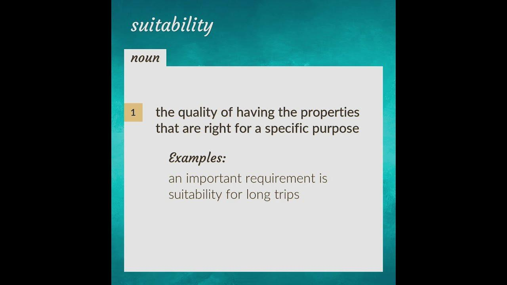

Algorithmic trading, commonly referred to as algo trading, has dramatically transformed the financial markets by enabling faster and more precise transactions. This technological advancement leverages computer algorithms to automate trading operations, thus eliminating human error and emotional decision-making from the trading process. The shift from traditional floor trading to electronic markets in recent decades has accelerated the adoption of algorithmic strategies, making them an integral part of modern financial markets.

At its core, algorithmic trading employs complex algorithms to initiate trades at optimal times, often based on pre-determined criteria such as price trends, timing, and volume levels. These algorithms can execute orders at a pace and scale far exceeding human capabilities, allowing traders to capitalize on fleeting market opportunities. The sophistication of these systems means they are used by a diverse range of market participants, from individual retail traders employing simple automated strategies to large institutional investors utilizing intricate high-frequency trading models.



The subsequent sections will outline the various types of algorithmic trading systems, their strategic applications, and their relevance to different trader profiles. By understanding these factors, traders can better navigate the algorithms' complexity and harness their potential to enhance trading effectiveness. This analysis will also address the benefits and challenges intrinsic to algorithmic trading, equipping readers with a comprehensive understanding of its role and impact in today’s financial market landscape.

## Table of Contents

## Understanding Algorithmic Trading

Algorithmic trading utilizes computer programs to execute trades based on predefined criteria and algorithms, streamlining the trading process by leveraging technology to make more rapid and calculated decisions. These algorithms are designed to manage trades by analyzing timing, price, and [volume](/wiki/volume-trading-strategy), among other market factors, enabling a disciplined and systematic approach to trading that significantly reduces the emotional aspect of decision-making.

The fundamental principle behind algorithmic trading is the use of quantitative models to determine trading strategies. This involves processing vast quantities of data using statistical analysis to uncover profitable trading opportunities. These sophisticated programs implement strategies such as arbitrage, trend following, and market making by executing a series of instructions, as defined algorithms, far more efficiently than human traders could.

Historically, algorithmic trading began gaining traction with the introduction of electronic trading platforms in the 1970s. The New York Stock Exchange introduced the Designated Order Turnaround (DOT) system, a precursor to today's sophisticated algorithmic trading systems. These platforms facilitated the electronic communication of orders, providing the infrastructure necessary for the rapid execution and reduced cost of transactions.

The evolution of technology further accelerated the adoption of [algorithmic trading](/wiki/algorithmic-trading). The rise of personal computing and increasing network speeds during the late 20th century made it viable for institutional investors and, eventually, retail investors. Algorithmic trading became imperative for high-frequency trading ([HFT](/wiki/high-frequency-trading-strategies)) firms, where thousands of orders might be executed in seconds across multiple markets and exchanges.

To successfully implement algorithmic trading, robust models and platforms are necessary. Python has become a popular language in this domain due to its flexible data manipulation capabilities through libraries such as Pandas and NumPy. Here's a simple example of how one might conceptualize a basic moving average trading strategy using Python:

```python
import pandas as pd

def moving_average_strategy(prices, short_window=40, long_window=100):
    signals = pd.DataFrame(index=prices.index)
    signals['price'] = prices
    signals['short_mavg'] = prices.rolling(window=short_window, min_periods=1, center=False).mean()
    signals['long_mavg'] = prices.rolling(window=long_window, min_periods=1, center=False).mean()
    signals['signal'] = 0.0

    # Create signals based on the moving averages
    signals['signal'][short_window:] = np.where(signals['short_mavg'][short_window:] > signals['long_mavg'][short_window:], 1.0, 0.0)   

    # Create trading orders
    signals['positions'] = signals['signal'].diff()

    return signals

# Example usage
price_data = pd.Series(...)  # Insert actual price data here
signals = moving_average_strategy(price_data)
```

In this code snippet, we create a simple moving average crossover strategy where trades are executed when a shorter-term moving average crosses above or below a longer-term moving average. This is a basic example of how algorithmic trading systems can be designed to systematically execute trades based on quantitative data, thus significantly enhancing the efficiency and effectiveness of trading operations. 

With ongoing advancements in [artificial intelligence](/wiki/ai-artificial-intelligence) and [machine learning](/wiki/machine-learning), the capabilities and effectiveness of algorithmic trading are expected to increase, allowing traders to harness even greater precision and insight from data.

## Types of Algorithmic Trading

Algorithmic trading encompasses a variety of strategies, each designed to capitalize on different market opportunities leveraging advanced mathematical models and execution speeds. Key types include high-frequency trading, statistical [arbitrage](/wiki/arbitrage), [market making](/wiki/market-making), and [trend following](/wiki/trend-following) strategies.

**High-Frequency Trading (HFT):** High-frequency trading characterizes rapid trade execution and exceptionally high order-to-trade ratios. HFT algorithms are designed to capture small price inefficiencies that exist temporarily, executing a large volume of trades at a very rapid pace. The focus is on speed and the ability to process a vast amount of market data quickly. These algorithms typically involve co-located servers and direct market access to minimize latency. According to the National Bureau of Economic Research, HFT can add liquidity to the market but may also increase competition for liquidity, influencing market volatility (Menkveld, 2013).

**Statistical Arbitrage:** This type of algorithmic trading exploits statistical mispricings between related securities. It involves a complex set of mathematical models to identify such patterns, consisting of pairs, basket trades, or index arbitrages. Statistical arbitrage is often employed over short holding periods, given its reliance on quantitative models that predict short-term price movements. These strategies rely on mean reversion principles, wherein assets expected to deviate temporarily from the long-term mean return to those average levels, hence generating trading opportunities.

**Market Making:** Market-making involves providing liquidity by placing both buy and sell limit orders simultaneously, benefiting from the bid-ask spread. Algorithmic systems automate this process by continuously adjusting both sides of the order book to maintain tight spreads and accumulate small but consistent profits. Firms engaging in market making must manage inventory risk, which arises from holding significant volumes of securities that could fluctuate in price. As noted by the Bank of England, algorithmic market making stabilizes prices during normal trading conditions but has the potential to withdraw liquidity faster during stressed conditions (Farmer et al., 2013).

**Trend Following Strategies:** These algorithms capitalize on the momentum within security prices, which involves identifying and following ongoing trends. Trend followers employ technical indicators such as moving averages, Relative Strength Index (RSI), or Bollinger Bands to ascertain entry and exit points. The logic is that certain price patterns tend to persist, hence holding positions in the direction of the trend until a signal indicates reversal. While these strategies can be profitable in trending markets, they may underperform in sideways or highly volatile markets due to false signals.

Each type varies in complexity, infrastructure requirements, and regulatory scrutiny, employing specialized algorithms tailored to particular market dynamics. Recognizing these differences allows traders and firms to adopt strategies that best align with their goals, risk tolerance, and operational capabilities.

## Advantages of Algorithmic Trading

Algorithmic trading provides several pivotal advantages that have transformed trading activities. Foremost among these is speed. Automated systems allow for the execution of orders in fractions of a second, far quicker than any human capability. This rapid execution ensures that traders can capitalize on fleeting market opportunities that might otherwise be missed if reliant on manual trading methods. By integrating fast execution with market dynamism, traders can effectively respond to even minimal price discrepancies almost immediately.

Accuracy is another critical benefit of algorithmic trading. Human traders are susceptible to errors, particularly in high-stress market conditions. Algorithms, however, execute trades with precise adherence to the pre-set parameters, significantly reducing the likelihood of errors. This precision ensures that trades occur under optimal conditions, governed only by the criteria embedded within the algorithm, with no deviation due to human cognitive failings.

Moreover, algorithmic trading eradicates the impact of emotional decision-making, a common pitfall in traditional trading. Emotions can lead to impulsive decisions often resulting in suboptimal trading outcomes. By entrusting trades to algorithms, decisions are made based on logic and data, not emotional impulses, fostering a more disciplined trading approach.

Automated systems in algorithmic trading also enable [backtesting](/wiki/backtesting). This process involves applying trading strategies to historical market data to determine their past efficacy. By analyzing how a strategy would have performed in different market environments, traders can gauge its potential future performance. Consequently, backtesting provides a rigorous method to refine strategies before live deployment, thus enhancing their reliability and success rates in actual trading.

These advantages collectively render algorithmic trading a powerful tool, granting traders the ability to act swiftly, accurately, and unemotionally. The capability to backtest strategies further amplifies the system's robustness, permitting a detailed evaluation of potential trading strategies under diverse market scenarios without risking actual capital.

## Disadvantages of Algorithmic Trading

Despite its significant advantages, algorithmic trading has several drawbacks that traders must consider, notably system failures and market [volatility](/wiki/volatility-trading-strategies). System failures can occur due to bugs in the algorithms, hardware malfunctions, or connectivity issues, which can lead to substantial financial losses. In high-frequency trading environments, where transactions are executed in fractions of a second, even minor disruptions can have magnified consequences. Furthermore, algorithms can exacerbate market volatility. For instance, algorithms designed to initiate trades based on specific market movements can trigger a cascade of buy or sell signals, amplifying price swings and potentially leading to flash crashes, as observed in the 2010 Flash Crash.

Algorithmic trading systems require substantial infrastructure investments. The development and maintenance of these systems necessitate advanced computing resources, sophisticated software, and continuous monitoring to ensure optimal performance. This can be a significant financial burden, especially for smaller trading firms or individual traders. Additionally, these costs do not end with the initial setup. Continuous enhancements and updates to the algorithms are necessary to keep pace with changing market conditions and regulatory requirements, further increasing the financial outlay.

Another critical disadvantage is the lack of transparency, particularly concerning black-box algorithms. These are proprietary systems whose internal mechanics are opaque, even to those using them. The opaqueness can pose ethical dilemmas concerning fairness and accountability, as traders and regulators cannot fully understand or predict the decision-making processes driving trades. This lack of transparency can lead to regulatory challenges, as financial authorities strive to monitor market manipulation and ensure market integrity. Regulators may question the fairness of algorithmic trading systems and may impose restrictions or require disclosures that could impede the flexibility and profitability of these systems.

In summary, while algorithmic trading offers speed and efficiency, the associated risks, infrastructure costs, and transparency issues present critical challenges that require careful management and regulation to ensure that benefits are maximized while mitigating potential negative impacts.

## Suitability of Algorithmic Trading

Determining the suitability of algorithmic trading for various participants involves multiple factors, including the investor's objectives, risk tolerance, and level of market expertise. Algorithmic trading, with its reliance on automated strategies, can cater to a wide range of trading profiles, from retail traders to large institutional investors. 

Retail traders typically benefit from simpler algorithmic strategies that do not require heavy computational resources or extensive market data. These strategies can include rudimentary forms of trend following or moving average crossovers, which are relatively easy to implement in online trading platforms with minimal programming skills. Retail traders should still ensure they understand the basic principles of the algorithms they choose to deploy, as this will help manage their expectations and mitigate risks.

Institutional investors, on the other hand, leverage complex algorithms often designed for high-frequency trading (HFT). These algorithms may execute thousands of trades per second, exploiting minute price discrepancies that are invisible to the human eye. High-frequency trading demands intricate infrastructure, including low-latency connections and substantial computational power, often making it inaccessible to retail investors. The sophistication of these algorithms requires advanced technical knowledge and is typically supported by a team of quantitative analysts and developers.

Regulations and ethical considerations substantially influence the suitability of algorithmic trading strategies. Different markets and jurisdictions have varying regulatory frameworks which can impact the extent and manner in which algorithmic trading can be employed. For instance, certain high-frequency trading strategies may face stricter regulation intended to prevent market manipulation and ensure fair market practices. Ethical considerations also arise concerning market fairness and transparency, particularly with "black-box" algorithms whose decision-making processes are not entirely transparent.

Algorithmic trading is suitable for a broad spectrum of traders when the strategies align with their financial goals and risk appetite, alongside compliance with regulatory and ethical standards. Properly identifying these parameters helps tailor algorithmic trading to effectively meet the needs of both retail and institutional investors.

## Conclusion

Algorithmic trading continues to evolve, offering both opportunities and challenges to traders. This evolution is driven by advancements in technology, increased access to large volumes of market data, and the development of innovative trading strategies. The core advantage of algorithmic trading lies in its ability to process vast amounts of information at speeds unattainable by human traders, which can lead to more efficient market transactions.

Understanding the various types and suitability of algorithmic trading is crucial for making informed decisions. High-frequency trading, [statistical arbitrage](/wiki/statistical-arbitrage), market making, and trend following are some of the primary strategies utilized, each catering to different market needs and trader objectives. The choice of strategy should align with the trader's risk tolerance, investment goals, and level of expertise. Retail traders may benefit from simpler, rule-based algorithms, while institutional investors often employ complex, high-frequency strategies that require substantial infrastructure and expertise.

Traders must carefully weigh the advantages of algorithmic trading against its potential drawbacks to maximize their trading efficacy. The benefits of speed, precision, and emotion-free decision-making must be balanced against risks such as system failures, market volatility, and the lack of transparency inherent in some black-box algorithms. It is also essential to consider the regulatory landscape and ethical implications associated with automated trading systems.

Ultimately, algorithmic trading offers a powerful toolset for modern traders. However, to leverage its full potential, one must maintain a nuanced understanding of its mechanisms and remain vigilant about the associated risks. By doing so, traders can better position themselves to capitalize on opportunities while mitigating potential challenges.

## References & Further Reading

[1]: Menkveld, A. J. (2013). ["High Frequency Trading and the New-Market Makers."](https://papers.ssrn.com/sol3/papers.cfm?abstract_id=1722924) Journal of Financial Markets, 16(4), 712-740.

[2]: Farmer, J. D., Skouras, S., & Lillo, F. (2013). ["The Price Impact of Order Book Events."](https://papers.ssrn.com/sol3/papers.cfm?abstract_id=1712822) Bank of England Working Paper No. 460.

[3]: Lopez de Prado, M. (2018). ["Advances in Financial Machine Learning."](https://www.amazon.com/Advances-Financial-Machine-Learning-Marcos/dp/1119482089) Wiley.

[4]: Chan, E. P. (2008). ["Quantitative Trading: How to Build Your Own Algorithmic Trading Business."](https://github.com/ftvision/quant_trading_echan_book) Wiley.

[5]: Aronson, D. (2006). ["Evidence-Based Technical Analysis: Applying the Scientific Method and Statistical Inference to Trading Signals."](https://www.amazon.com/Evidence-Based-Technical-Analysis-Scientific-Statistical/dp/0470008741) Wiley.

[6]: Jansen, S. (2020). ["Machine Learning for Algorithmic Trading."](https://github.com/stefan-jansen/machine-learning-for-trading) Packt Publishing.