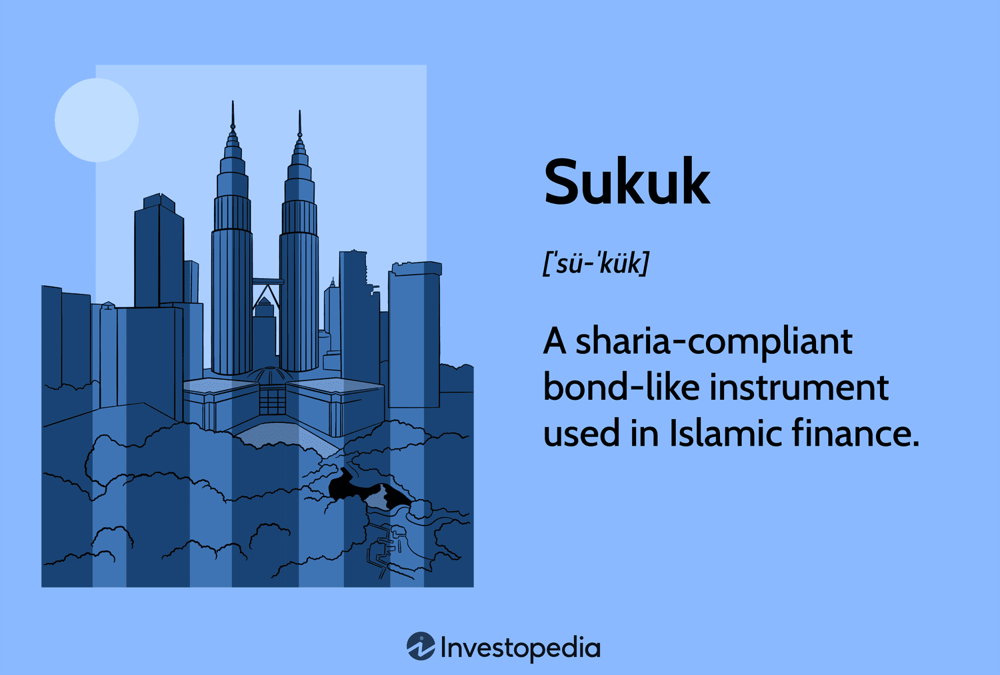

## Table of Contents

## What is a Sukuk?

A Sukuk is a type of investment that follows Islamic financial principles. It is similar to a bond, but instead of paying interest, it represents ownership in an asset or a project. This means that when you invest in a Sukuk, you are buying a share of something that generates income, like a building or a business.

The money you get from a Sukuk comes from the profits of the asset or project you own a part of. This is different from a bond, where you get interest payments. Sukuk are popular in countries where Islamic finance is important because they follow rules that say you can't earn money from interest. Instead, you earn money by sharing in the profits and risks of the investment.

## How does Sukuk differ from conventional bonds?

Sukuk and conventional bonds are both ways to invest money, but they work differently. A conventional bond is like a loan you give to a company or government. They promise to pay you back the money you lent them, plus some extra money called interest, over time. The interest is a fixed amount that doesn't change, no matter how well the company or government is doing. With a bond, you're not an owner of anything; you're just a lender.

On the other hand, a Sukuk follows Islamic finance rules, which don't allow earning money from interest. Instead of lending money, when you buy a Sukuk, you're buying a piece of an asset or project, like a building or a business. The money you get from a Sukuk comes from the profits that the asset or project makes. This means your earnings can go up or down depending on how well the asset or project is doing. So, with a Sukuk, you're more like a partner sharing in the success and risks of the investment.

## What are the basic principles of Sharia that Sukuk must comply with?

Sukuk must follow the basic rules of Sharia, which is Islamic law. One important rule is that you can't earn money from interest. This means Sukuk can't work like regular bonds where you get paid interest. Instead, Sukuk must be based on real things like buildings or businesses. When you invest in a Sukuk, you own a part of these real things and get money from the profits they make.

Another key rule is that all deals must be fair and clear. This means everyone involved in a Sukuk must know what they're getting into, and no one should be tricked or treated unfairly. Also, the money from Sukuk can't be used for things that Sharia doesn't allow, like gambling or making alcohol. So, Sukuk must be used for good and honest projects that follow these rules.

## What are the different types of Sukuk structures?

There are several types of Sukuk structures, each designed to meet different needs while following Islamic finance rules. One common type is the Ijarah Sukuk, which is like renting. When you buy an Ijarah Sukuk, you're buying a part of something like a building, and you get money from the rent it makes. Another type is the Mudarabah Sukuk, which is like a partnership. Here, you invest money in a business, and the profits from that business are shared with you.

Another popular type is the Murabaha Sukuk, which works like a sale. You buy something at a higher price than what it cost and then get paid back over time as the buyer pays off the cost plus the profit. Lastly, there's the Musharaka Sukuk, which is also a partnership but more equal. In this type, you and others invest money together in a project, and everyone shares the profits and risks equally.

These different types of Sukuk help make sure that everyone can find a way to invest that fits their needs and follows Islamic finance rules. Whether it's through renting, partnering in a business, or buying and selling, Sukuk offer a variety of ways to invest while staying true to Sharia principles.

## How is the ownership and risk-sharing structured in Sukuk?

In Sukuk, ownership and risk-sharing are set up in a way that follows Islamic finance rules. When you buy a Sukuk, you're not just lending money like with a bond. Instead, you become a part-owner of an asset or a project, like a building or a business. This means you have a share in something real, not just a promise to get your money back with interest. The money you get from a Sukuk comes from the profits that the asset or project makes. So, if the asset does well, you earn more money, but if it doesn't do well, you might earn less or even lose money.

The way risk is shared in Sukuk depends on the type of Sukuk you invest in. For example, with an Ijarah Sukuk, you share the risk of the asset you own, like a building. If the building can't be rented out, you might not get any money. In a Mudarabah Sukuk, you're partnering with a business, so you share the risk of the business doing well or not. If the business fails, you might lose your investment. In all cases, the idea is that everyone involved shares both the good and the bad, which is a key part of Islamic finance.

## What are the common uses of Sukuk in Islamic finance?

Sukuk are used in Islamic finance to help people and businesses raise money without breaking Islamic rules. For example, governments might use Sukuk to pay for big projects like building roads or hospitals. Instead of borrowing money and paying interest, they sell Sukuk to people who want to invest. The money from these Sukuk helps pay for the projects, and the investors get a share of the profits from the project, like tolls from the road or fees from the hospital.

Businesses also use Sukuk to grow or start new projects. For example, a company might want to build a new factory. They can sell Sukuk to raise the money they need. People who buy the Sukuk become part-owners of the factory and get a share of the profits it makes. This way, the company can expand without using interest, and investors can earn money by owning a part of a real business.

## How is the pricing and valuation of Sukuk determined?

The pricing and valuation of Sukuk are based on the expected profits from the underlying asset or project. When people buy Sukuk, they're buying a part of something real, like a building or a business. The price of the Sukuk is set by looking at how much money that asset or project is expected to make. If the project is expected to make a lot of money, the Sukuk might be priced higher because people are willing to pay more for a bigger share of the profits.

Valuation of Sukuk can change over time, just like the value of the asset or project it's tied to. If the building starts making more rent or the business starts earning more profits, the value of the Sukuk might go up. On the other hand, if the asset or project doesn't do well, the value of the Sukuk might go down. This means that the price and value of Sukuk are always connected to how well the real thing they're based on is doing.

## What are the regulatory and legal frameworks governing Sukuk?

The rules and laws for Sukuk are different in each country, but they all have to follow the main ideas of Islamic finance. In many places, special groups called Sharia boards make sure that Sukuk follow these rules. These boards check that Sukuk are based on real things like buildings or businesses, and that the money from them comes from profits, not interest. Governments also have their own rules to make sure Sukuk are safe and fair for everyone involved. For example, in Malaysia, the Securities Commission has rules that say how Sukuk should be made and sold.

Besides the rules in each country, there are also international groups that help set standards for Sukuk. The Accounting and Auditing Organization for Islamic Financial Institutions (AAOIFI) is one of these groups. They have guidelines that many countries use to make sure their Sukuk follow Islamic finance rules. Another group, the Islamic Financial Services Board (IFSB), works on making sure that the rules for Sukuk are strong and clear, so people can trust them. These international standards help make Sukuk more popular and easier to use around the world.

## How do Sukuk issuances impact the global financial market?

Sukuk issuances are becoming more important in the global financial market. They give countries and businesses a new way to raise money without using interest, which is important in places where Islamic finance is popular. When a big Sukuk is issued, it can bring in a lot of investors from around the world who want to invest in a way that follows Islamic rules. This can help countries and companies grow and start new projects, like building new roads or factories. It also makes the financial market more diverse because it offers more choices for people who want to invest their money.

Sukuk also help connect different parts of the world's financial markets. When Sukuk are sold in places like the Middle East, Asia, or Europe, it shows that Islamic finance is becoming more accepted everywhere. This can lead to more cooperation between countries and help spread Islamic finance ideas to new places. As more people learn about and invest in Sukuk, it can make the global financial market stronger and more inclusive, giving everyone more ways to invest and grow their money.

## What are the challenges and risks associated with investing in Sukuk?

Investing in Sukuk can be a bit tricky because they follow special rules from Islamic finance. One big challenge is making sure that the Sukuk really follow these rules. A group called a Sharia board checks this, but sometimes people might not agree with their decisions. Also, the rules can be different in different countries, which can make it hard to know if a Sukuk is okay to invest in everywhere. Another challenge is that Sukuk are often tied to real things like buildings or businesses. If these things don't do well, the Sukuk might not make as much money or could even lose value.

There are also risks to think about when investing in Sukuk. Since Sukuk are based on real things, they can be affected by what's happening in the economy or the market. If the building or business that the Sukuk is tied to has problems, like not being able to rent out the building or the business not making enough profit, the Sukuk might not pay out as much as expected. Also, because Sukuk are newer and not as common as regular bonds, they might be harder to sell if you need your money back quickly. This means you might have to wait longer or accept a lower price to sell your Sukuk.

## How has the Sukuk market evolved over the years, and what are the current trends?

The Sukuk market has grown a lot over the years. It started in the 1980s, but really took off in the early 2000s. At first, Sukuk were mostly used in countries where Islamic finance was important, like Malaysia and the Middle East. But as more people learned about them, Sukuk started to be used in more places around the world. Now, you can find Sukuk being issued in Europe, Asia, and even in the United States. The market has gotten bigger and more diverse, with different types of Sukuk being created to meet different needs.

Today, one big trend in the Sukuk market is that more governments and big companies are using them to raise money. This is because Sukuk can help them reach new investors who want to follow Islamic finance rules. Another trend is that Sukuk are being used for more than just building things like roads or hospitals. Now, they're also used for things like helping the environment or supporting small businesses. The Sukuk market is also becoming more connected with the rest of the world's financial markets, making it easier for people everywhere to invest in them.

## What are the future prospects and potential innovations in the Sukuk market?

The future of the Sukuk market looks bright. More and more people around the world are learning about Sukuk and wanting to invest in them. This means that the market could keep growing and become even more important in global finance. Countries and companies might use Sukuk more often to raise money for big projects, like building new schools or helping the environment. As the market grows, it could also become easier for people to buy and sell Sukuk, making them a more common choice for investors everywhere.

One exciting possibility for the future is new types of Sukuk. Right now, Sukuk are mostly used for things like buildings or businesses, but in the future, they could be used for even more things. For example, there could be Sukuk that help fight climate change by investing in green energy projects. Or, there could be Sukuk that help small businesses grow by giving them the money they need. These new types of Sukuk could make the market even more interesting and useful for people who want to invest in a way that follows Islamic finance rules.

## References & Further Reading

[1]: Iqbal, Z., & Mirakhor, A. (2011). ["An Introduction to Islamic Finance: Theory and Practice."](https://archive.org/details/introductiontois0000iqba) Wiley Finance.

[2]: Obaidullah, M. (2005). ["Islamic Financial Services."](https://www.researchgate.net/publication/266149378_Islamic_Financial_Services) Islamic Foundation.

[3]: Thomas, A., Cox, S., & Kraty, B. (2005). ["Structuring Islamic Finance Transactions."](https://books.google.com/books/about/Structuring_Islamic_Finance_Transactions.html?id=-qcsvgAACAAJ) Euromoney Books.

[4]: Wilson, R. (2004). ["Overview of the Sukuk Market."](https://alhudacibe.com/images/Presentations%20on%20Islamic%20Banking%20and%20Finance/Sukuk/Structuring%20and%20investing%20in%20Sukuk%20by%20Prof.%20Rodney%20Wilson.pdf) Islamic Financial Services Board Journal.

[5]: Fathy, A. (2015). ["Integration of Shariah in Algorithmic Trading."](https://www.sciencedirect.com/science/article/pii/S2405844022016735) Journal of Islamic Finance.

[6]: Mohieldin, M., & Iqbal, Z. (2012). ["The Role of Islamic Finance in Enhancing Financial Inclusion."](https://openknowledge.worldbank.org/bitstream/handle/10986/3692/WPS5920.pdf?sequence=1) World Bank Policy Research Working Paper.

[7]: Naughton, S., & Naughton, T. (2000). ["Religion, ethics and stock trading: The case of an Islamic equities market."](https://link.springer.com/article/10.1023/A:1006161616855) Journal of Business Ethics.