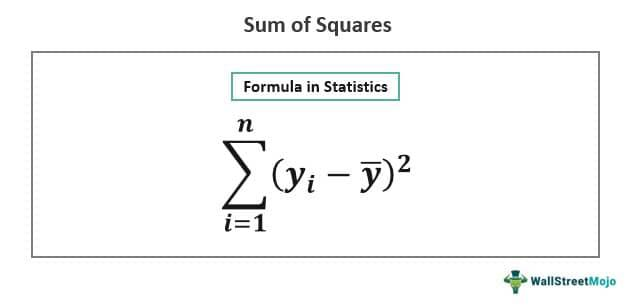

The calculation of squares, the various types of squares, and the summation of squares are core concepts integral to the fields of mathematics and statistics. These concepts play a significant role in data analysis, allowing for a deeper understanding of data dispersion and variability. Data points, when represented as squares of their values, offer insight into fundamental statistical measures such as variance and standard deviation, which are critical in analyzing the spread of data.

In the context of algorithmic trading, these mathematical constructs are indispensable as they underpin robust statistical frameworks used for financial decision-making. As trading strategies increasingly rely on data-driven approaches, leveraging the calculation of squares becomes crucial in developing quantitative models that predict market behavior. Statistical measures offer traders the ability to assess asset performance, gauge volatility, and ultimately, maximize returns while mitigating risks.



This article aims to provide a comprehensive understanding of these mathematical calculations and their application in financial trading strategies. By exploring the calculation of squares, the categorization into different types, and the concept of the sum of squares, we address how these elements are instrumental in crafting informed and effective trading decisions. Understanding these concepts is imperative for data interpretation and plays a pivotal role in evolving domains where data-driven decision-making is essential.

## Table of Contents

## Calculation of Squares

The calculation of squares is a fundamental operation in mathematics involving multiplying a number by itself. If $n$ is any given number, its square is represented as $n^2$. This operation is conceptually straightforward but serves as the foundation for more sophisticated mathematical computations.

In algebra, the calculation of squares is crucial for solving quadratic equations, formulating polynomial expressions, and establishing algebraic identities such as the difference of squares, expressed as $a^2 - b^2 = (a+b)(a-b)$. Beyond elementary mathematics, squares play a significant role in statistical analysis. For instance, in statistical measures like variance, the deviations of data points from the mean are squared and summed to provide insight into data dispersion.

Efficient calculation of squares is facilitated by algorithms in programming languages. For instance, in Python, squaring a number can be achieved succinctly:

```python
def square_number(n):
    return n ** 2

# Example
print(square_number(5))  # Output: 25
```

Moreover, when dealing with arrays or large datasets, libraries such as NumPy allow for vectorized operations to compute squares efficiently:

```python
import numpy as np

numbers = np.array([1, 2, 3, 4, 5])
squares = np.square(numbers)
print(squares)  # Output: [ 1  4  9 16 25]
```

The utility of squares extends from pure mathematics to domains like data analysis and financial forecasting, where understanding variability and risk is essential. In these fields, squared values often aid in constructing models that predict trends or assess potential risks by quantifying the extent of deviations from expected outcomes.

Thus, the simple act of squaring a number serves as a cornerstone for both theoretical explorations and practical applications across diverse disciplines.

## Types of Squares

There are several types of squares utilized in mathematics and [statistics](/wiki/bayesian-statistics), each with unique properties and applications that extend across various fields.

Perfect squares are fundamental in mathematics. They are integers obtained by multiplying an integer by itself. For example, $4$ (which is $2^2$), $9$ (which is $3^2$), and $16$ (which is $4^2$) are perfect squares. These numbers are integral in algebra for solving quadratic equations and factorization.

In statistics, the sum of squares plays an essential role in understanding data variance and deviation. It quantifies how data points differ from the mean, providing insight into variability within a dataset. The sum of squares is instrumental in calculating the variance ($\sigma^2$) and standard deviation ($\sigma$), which are critical for statistical inference. The formula for the sum of squares is given by:

$$

SS = \sum_{i=1}^{n} (x_i - \bar{x})^2 
$$

where $x_i$ represents each individual data point and $\bar{x}$ is the mean of the data points.

Geometrical squares concern properties and calculations associated with squares in geometry. The properties of a square, such as its four equal sides and angles, are the basis for numerous geometrical calculations, including area ($A = a^2$, where $a$ is the side length) and perimeter ($P = 4a$).

Each type of square, whether in pure mathematics, statistics, or geometry, facilitates complex problem-solving and data analysis, proving indispensable across various academic and professional disciplines.

## Sum of Squares

The sum of squares is a vital statistical measure frequently used to understand how data points are distributed around the mean. By summing the squared deviations of each data point from the mean, it quantifies data [dispersion](/wiki/dispersion-trading). This measure is integral in statistical contexts, primarily for its role in regression analysis. In regression, the sum of squares helps determine how effectively a model predicts or describes a data series, giving insights into the model's accuracy.

Mathematically, if you have a dataset with values $x_1, x_2, x_3, \ldots, x_n$, and the mean of this dataset is $\bar{x}$, then the sum of squares $SS$ is calculated as:

$$

SS = \sum_{i=1}^{n} (x_i - \bar{x})^2
$$

### Types of Sum of Squares

1. **Total Sum of Squares (TSS):** This measures the total variance present in the dataset. It is the sum of squares of the difference between each data point and the mean of the dataset. Formula-wise, it is expressed as:
$$
   TSS = \sum_{i=1}^{n}(x_i - \bar{x})^2

$$

2. **Residual Sum of Squares (RSS):** Also known as the error sum of squares, this measures the variance unexplained by the regression model. It evaluates the discrepancy between the observed data and the values predicted by the model. The formula is:
$$
   RSS = \sum_{i=1}^{n}(y_i - \hat{y}_i)^2

$$

   where $y_i$ is the observed data and $\hat{y}_i$ is the predicted data from the model.

3. **Regression Sum of Squares (RegSS):** This measures how much of the data's variability is explained by the regression model. It focuses on the difference between the predicted values and the mean of the observed data. The formula is:
$$
   RegSS = \sum_{i=1}^{n}(\hat{y}_i - \bar{y})^2

$$

   where $\bar{y}$ is the mean of the observed data.

Understanding and computing these sums of squares is crucial for assessing model performance in regression analysis, determining variance, and calculating statistical metrics like variance and standard deviation, which indicate how much spread exists within a dataset.

### Financial Applications

In finance, the sum of squares is applied to gauge stock [volatility](/wiki/volatility-trading-strategies) and risk. For instance, by evaluating the variance (which uses the sum of squares) of stock returns, analysts can infer past price fluctuations and predict future risk. This knowledge aids in making investment decisions and managing financial risk. In [algorithmic trading](/wiki/algorithmic-trading), understanding these measures enables refined modeling of stock price movements, enhancing trade strategies.

Overall, the sum of squares is more than a mathematical abstraction; it's a practical tool providing vital insights into data variability and model performance, pivotal in both statistical analysis and financial applications.

## Algorithmic Trading and Sum of Squares

Algorithmic trading is a domain where statistical measures are vital for the development of trading strategies. One of the essential statistical tools used in this field is the sum of squares, which aids in analyzing market data to anticipate asset values and price movements. The sum of squares is integral in quantifying the variability of data points, making it invaluable in predicting the volatility of stocks and other financial instruments.

The sum of squares is generally employed to calculate variance and standard deviation, which are crucial indicators of market volatility. In financial terms, understanding these metrics allows traders to assess the risk associated with particular securities. Specifically, the total sum of squares (TSS), residual sum of squares (RSS), and regression sum of squares (RegSS) provide insights into how well a model fits the observed data.

$$
\text{TSS} = \sum(y_i - \bar{y})^2
$$
$$
\text{RSS} = \sum(y_i - \hat{y}_i)^2
$$
$$
\text{RegSS} = \sum(\hat{y}_i - \bar{y})^2
$$

In these equations, $y_i$ denotes the observed value, $\hat{y}_i$ represents the predicted value, and $\bar{y}$ is the mean of the observed values. By minimizing the RSS, models can be optimized for better prediction accuracy, crucial for developing robust trading strategies.

Traders leverage these statistical calculations to gauge the intrinsic risk of holding certain portfolios and make informed decisions to mitigate potential losses. Incorporating them into trading algorithms facilitates automated decision-making, enabling traders to react swiftly to market changes without human intervention. This aspect is pivotal in the fast-paced environment of financial markets, where quick adaptations can significantly impact profitability.

Furthermore, these mathematical models can be coded into algorithms using programming languages like Python. For instance, linear regression, a common method utilized in trading algorithms, can be implemented in Python to predict future prices based on historical data. The scipy.stats library provides a linear regression function that can compute the necessary statistics for trading models.

```python
import numpy as np
from scipy import stats

# Sample market data (e.g., historical stock prices)
x = np.array([1, 2, 3, 4, 5])
y = np.array([5, 7, 9, 11, 13])

# Perform linear regression
slope, intercept, r_value, p_value, std_err = stats.linregress(x, y)

# Calculate predicted values
predicted_values = intercept + slope * x

# Calculate residual sum of squares
rss = np.sum((y - predicted_values) ** 2)

print(f"Residual Sum of Squares: {rss}")
```

Automation of trading strategies using statistical tools like the sum of squares is pivotal for traders seeking to maximize returns and minimize risks. This approach enhances precision in trading strategies, providing traders with a competitive edge in the financial markets. As data continues to drive market dynamics, the utilization of these mathematical models becomes increasingly critical in analyzing and predicting market trends effectively.

## Practical Applications and Examples

In practical applications, the calculation of squares and the sum of squares plays a significant role, particularly in determining the volatility of stock prices using historical market data. Stock price volatility is a key metric in financial analysis, representing the degree to which a stock price varies over time. This measure is crucial for assessing risk and making informed trading decisions.

To calculate stock volatility, analysts often use the standard deviation, which involves determining the sum of squares. Here's a simple calculation example:

1. **Collect Data:**
   Gather historical daily closing prices for a stock over a specific time period.

2. **Calculate Returns:**
   Compute the daily returns, $R_t$, from the closing prices using the formula:
$$
   R_t = \frac{P_t - P_{t-1}}{P_{t-1}}

$$

   where $P_t$ is the closing price at time $t$.

3. **Determine the Mean Return:**
   Calculate the average of the daily returns.

4. **Sum of Squares:**
   Compute the sum of squared deviations from the mean return:
$$
   \text{Sum of Squares} = \sum (R_t - \bar{R})^2

$$

   where $\bar{R}$ is the mean return.

5. **Calculate Standard Deviation:**
   The volatility is then derived from the standard deviation of returns:
$$
   \sigma = \sqrt{\frac{\text{Sum of Squares}}{N-1}}

$$

   where $N$ is the number of observations.

This method highlights the application of squares and sum of squares in computing volatility—a key parameter that traders and financial analysts use to evaluate market risks.

In algorithmic trading, these calculations help in developing efficient trading algorithms that seek to predict asset values and minimize risks. Traders can leverage these formulas to automate decision-making processes, enabling them to respond swiftly to market changes. For example, algorithms might adjust investment portfolios based on calculated volatility levels to maximize returns while managing risks effectively.

Understanding these mathematical applications provides critical insights into various industries, beyond finance. For instance, in quality control, the sum of squares helps in analyzing variability in manufacturing processes, ensuring that production stays within set quality standards. Similarly, in engineering, it aids in stress analysis, validating the durability and reliability of materials under different conditions.

These examples illustrate the pivotal role of squares and sum of squares in not only financial sectors but also in broader industry applications, underscoring their importance in data-driven decision-making processes.

## Conclusion

The calculation of squares, types of squares, and the sum of squares are essential tools that serve as the backbone for numerous applications in mathematics and trading. These concepts enable a deeper understanding of data analysis and variance, thereby playing a pivotal role in risk management and informed decision-making. By harnessing the analytical power of squares and the sum of squares, traders and analysts can gain insights into data dispersion and variability, facilitating better strategic decisions.

In algorithmic trading, the precision provided by these mathematical tools is instrumental in the development of robust trading strategies. Utilizing squares and sum of squares can enhance the precision of these strategies, giving traders a competitive edge in a fast-paced environment. Python libraries such as NumPy and pandas can be employed to efficiently perform these calculations. For instance, calculating the variance of stock returns can be achieved using the code:

```python
import numpy as np

# Sample returns
returns = np.array([0.01, 0.02, -0.01, 0.03, 0.04])

# Calculate variance
variance = np.var(returns)
print("Variance of returns:", variance)
```

As data continues to drive market dynamics, the calculations of squares and sum of squares become increasingly important in financial analysis. They are not just abstract mathematical tools but practical instruments that can greatly influence trading operations. By integrating these concepts into mathematical models, traders can automate decision-making processes, allowing for more efficient and effective market engagement.

This article highlights the critical importance of these mathematical concepts, illustrating how they can be leveraged in trading operations to optimize performance and manage risks effectively. As we move deeper into the data-driven era, the role of accurate mathematical analysis in financial markets cannot be overstated.

## References & Further Reading

[1]: Bergstra, J., Bardenet, R., Bengio, Y., & Kégl, B. (2011). ["Algorithms for Hyper-Parameter Optimization."](https://papers.nips.cc/paper/4443-algorithms-for-hyper-parameter-optimization) Advances in Neural Information Processing Systems 24.

[2]: ["Advances in Financial Machine Learning"](https://www.amazon.com/Advances-Financial-Machine-Learning-Marcos/dp/1119482089) by Marcos Lopez de Prado

[3]: ["Evidence-Based Technical Analysis: Applying the Scientific Method and Statistical Inference to Trading Signals"](https://www.amazon.com/Evidence-Based-Technical-Analysis-Scientific-Statistical/dp/0470008741) by David Aronson

[4]: ["Machine Learning for Algorithmic Trading"](https://github.com/stefan-jansen/machine-learning-for-trading) by Stefan Jansen

[5]: ["Quantitative Trading: How to Build Your Own Algorithmic Trading Business"](https://www.amazon.com/Quantitative-Trading-Build-Algorithmic-Business/dp/1119800064) by Ernest P. Chan