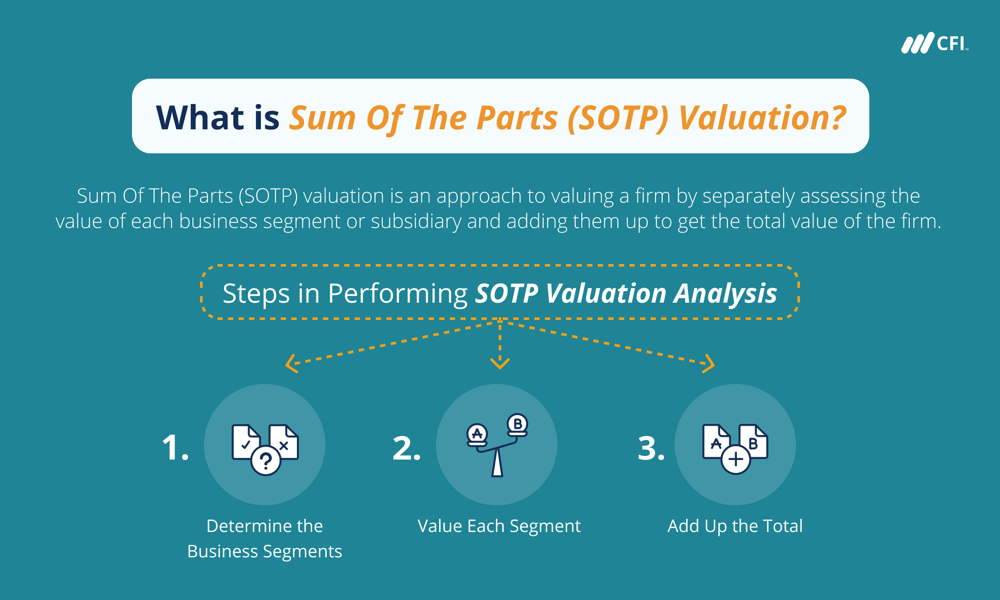

## Table of Contents

## What is Sum-of-the-Parts Valuation?

Sum-of-the-Parts Valuation, often called SOTP, is a way to figure out how much a company is worth by adding up the value of all its different parts. Imagine a company is like a big puzzle with many pieces. Each piece could be a different business or division within the company. To find the total value, you look at each piece separately and add up their values. This method is useful when a company has many different kinds of businesses, and it helps investors understand if the company is worth more broken up than kept together.

This valuation method is especially helpful for big companies with lots of different businesses. For example, a company might own a car manufacturing division, a tech division, and a food division. Each of these parts can be valued on its own, using different methods like comparing them to similar companies or looking at their future earnings. By adding up these values, investors can see if the market is undervaluing the company as a whole. It's like looking at the price of a whole house versus the value of its land, building, and furniture separately.

## Why is Sum-of-the-Parts Valuation important for investors?

Sum-of-the-Parts Valuation is important for investors because it helps them see the true value of a company that has many different businesses. Sometimes, the market might not see how valuable each part of the company is when they are all together. By breaking the company into its parts and valuing each one separately, investors can find out if the company is worth more than what the stock price shows. This can help them make better decisions about whether to buy, sell, or hold the stock.

For example, if a company has a tech division that's growing fast but is hidden within a larger, slower-growing company, Sum-of-the-Parts Valuation can show how much that tech division is really worth. This can be especially useful for investors thinking about whether the company should be broken up into separate businesses. If the sum of the parts is much higher than the current market value, it might be a good sign that the stock is undervalued, giving investors a chance to buy at a lower price before the market catches up.

## What are the key components of a Sum-of-the-Parts Valuation?

The key components of a Sum-of-the-Parts Valuation start with identifying all the different parts of a company. This means looking at each business or division separately. For example, if a company has a car manufacturing part, a tech part, and a food part, you would look at each one on its own. You need to understand what each part does and how it makes money. This helps you see the whole picture of the company.

Next, you need to value each part. There are different ways to do this, like comparing each part to similar companies or looking at how much money each part might make in the future. Once you have a value for each part, you add them all up to get the total value of the company. This total value can then be compared to the company's current stock price to see if the stock is a good buy. By doing this, investors can make smarter choices about their investments.

## How do you calculate the value of each part in a Sum-of-the-Parts Valuation?

To calculate the value of each part in a Sum-of-the-Parts Valuation, you need to look at each business or division separately. You can start by comparing each part to other similar companies in the market. This is called the comparable company analysis. You look at the financial numbers of these similar companies and see how much they are worth. For example, if your company's tech division is similar to another tech company, you might look at how much that company is valued per dollar of sales or earnings. You then apply those same multiples to your company's tech division to estimate its value.

Another way to value each part is by looking at their future earnings. This is called the discounted cash flow (DCF) method. You predict how much money each part will make in the future and then figure out what that money is worth today. You do this by applying a discount rate, which accounts for the time value of money and risk. For example, if your food division is expected to make a certain amount of money over the next few years, you use the DCF method to see what that future money is worth right now. By using one or both of these methods, you can come up with a good estimate of the value of each part of the company.

## What is the formula for Sum-of-the-Parts Valuation?

The formula for Sum-of-the-Parts Valuation is simple. You add up the value of all the different parts of a company. If a company has three parts, like a car part, a tech part, and a food part, you find out how much each part is worth on its own. Then, you add those values together. The total is the Sum-of-the-Parts Valuation of the company.

To find the value of each part, you can use different methods. One way is to compare each part to other similar companies and see how much they are worth. Another way is to guess how much money each part will make in the future and then figure out what that money is worth today. By adding up the values you get from these methods, you can see if the company is worth more than what the stock price says. This helps investors make better choices about buying, selling, or holding the stock.

## Can you provide a simple example of Sum-of-the-Parts Valuation?

Let's say there's a company called BigCo that has three different parts: a car part, a tech part, and a food part. To find out how much BigCo is worth using Sum-of-the-Parts Valuation, we need to look at each part separately. First, we find out how much the car part is worth. We see that it's similar to another car company that's valued at $500 million. So, we say the car part of BigCo is worth $500 million too. Then, we look at the tech part. It's like another tech company that's worth $300 million, so we say BigCo's tech part is worth $300 million. Finally, we check the food part. It's like a food company worth $200 million, so we value BigCo's food part at $200 million.

Now, we add up the values of all the parts. The car part is worth $500 million, the tech part is worth $300 million, and the food part is worth $200 million. When we add these together, we get $500 million + $300 million + $200 million = $1 billion. So, using Sum-of-the-Parts Valuation, we see that BigCo is worth $1 billion. If BigCo's stock price shows it's only worth $800 million, then it might be a good buy because it's undervalued. This helps investors see if they should buy the stock or not.

## What industries or types of companies benefit most from Sum-of-the-Parts Valuation?

Sum-of-the-Parts Valuation is especially helpful for big companies that have lots of different businesses. For example, a company like a big conglomerate that owns everything from car factories to tech startups and food companies can use this method. These companies might be hard to value as one big thing because each part is so different. By looking at each part on its own, investors can see if the company is worth more broken up than kept together. This is important for companies in industries like manufacturing, technology, and consumer goods where they have many different kinds of businesses.

Also, companies that are thinking about breaking up into smaller parts or selling off some of their businesses can benefit a lot from Sum-of-the-Parts Valuation. If a company is in industries like energy, where it might own oil, gas, and renewable energy divisions, this method can show if selling off one part could make the whole company worth more. It helps investors and the company's leaders make smart choices about what to do with their different parts.

## How does Sum-of-the-Parts Valuation differ from other valuation methods?

Sum-of-the-Parts Valuation is different from other valuation methods because it looks at each part of a company separately instead of the whole company at once. For example, if you use a method like the Price-to-Earnings (P/E) ratio, you look at the company's total earnings and compare it to its stock price. But with Sum-of-the-Parts, you break the company into its different businesses, like a car part, a tech part, and a food part, and value each one on its own. This can show if the company is worth more broken up than kept together, which other methods might not see.

Other valuation methods, like Discounted Cash Flow (DCF), focus on the future earnings of the whole company. You guess how much money the company will make in the future and then figure out what that money is worth today. Sum-of-the-Parts Valuation can use DCF too, but it does it for each part of the company separately. This helps investors see if one part of the company is growing fast and might be worth a lot more than the market thinks. By looking at each part on its own, Sum-of-the-Parts Valuation gives a clearer picture of the company's true value, especially for big companies with lots of different businesses.

## What are the common challenges and limitations of using Sum-of-the-Parts Valuation?

One big challenge with Sum-of-the-Parts Valuation is that it can be hard to find the right value for each part of the company. You need to look at each business or division on its own and compare it to other similar companies. But sometimes, there might not be any similar companies to compare to. Also, guessing how much money each part will make in the future can be tricky because it's hard to predict what will happen. If you get these guesses wrong, your total value for the company could be way off.

Another limitation is that this method takes a lot of time and work. You have to do a lot of research to find out how much each part of the company is worth. This can be especially hard for big companies with many different businesses. Also, just because you think the company is worth more broken up than kept together, it doesn't mean it will actually happen. The company might not want to break up, or it might be too hard to do. So, even if your numbers show the company is undervalued, it might not change anything in the real world.

## How can Sum-of-the-Parts Valuation be used in mergers and acquisitions?

Sum-of-the-Parts Valuation is really helpful when companies are thinking about merging or being bought out. Imagine a big company wants to buy another company that has lots of different parts, like a car part, a tech part, and a food part. The big company can use Sum-of-the-Parts Valuation to see how much each part is worth on its own. This helps them decide if the whole company is a good buy or if they should just buy one part of it. By looking at each part separately, the big company can make a smarter choice about what to do.

Also, Sum-of-the-Parts Valuation can help a company that wants to sell itself. If the company thinks it's worth more broken up than kept together, it can use this method to show buyers how much each part is worth. This can make the company look more attractive to buyers who might be interested in just one part of the business. By showing the value of each part, the company can get a better price for the whole thing or for the parts it wants to sell.

## What advanced techniques can be applied to improve the accuracy of Sum-of-the-Parts Valuation?

To make Sum-of-the-Parts Valuation more accurate, you can use something called Monte Carlo simulations. This is a fancy way of saying you run a lot of different guesses about the future to see what might happen. You can guess different things about how much money each part of the company will make and how much it will cost to run them. By running these guesses many times, you can get a better idea of what the company might be worth. This helps you see not just one number, but a range of possible values, which can be more useful when making big decisions.

Another way to improve accuracy is by using real options valuation. This method looks at the choices a company might have in the future, like growing one part of the business or selling another part. By putting a value on these choices, you can see how they might change the value of the company. It's like looking at a map of different paths the company could take and seeing which ones might be worth the most. This can give you a clearer picture of what each part of the company is really worth, helping you make smarter choices about buying, selling, or keeping the company together.

## How does the market perception and investor sentiment affect Sum-of-the-Parts Valuation?

Market perception and investor sentiment can really change how much each part of a company is worth in a Sum-of-the-Parts Valuation. If people think a company's tech part is going to do great things in the future, they might value it higher than if they thought it was just okay. This means the total value of the company can go up or down based on what people think and feel about its different parts. If everyone is excited about one part of the company, like a new food product, it can make that part seem more valuable, even if the numbers don't change.

Also, if investors are feeling good about the market in general, they might be willing to pay more for each part of the company. But if they're worried about the economy or the industry the company is in, they might value each part lower. This can make a big difference in the total value of the company. So, when you're doing a Sum-of-the-Parts Valuation, you have to think about what people are saying and feeling about the company and its different parts, because that can change the numbers a lot.

## What is Understanding Sum-of-the-Parts Valuation (SOTP)?

Sum-of-the-Parts (SOTP) valuation is a financial analysis method used to assess the value of a conglomerate or a company with multiple diverse business units. By evaluating each business segment independently, financial analysts aim to determine the intrinsic value of the entire entity more accurately than traditional single-valuation methods. This approach is particularly significant for companies whose segments operate in varying industries or markets, as it accounts for specific growth prospects, risk profiles, and competitive landscapes individual to each segment.

The process of SOTP valuation begins by identifying and valuing each of the company's distinct business segments. Each segment is treated as a standalone entity and is analyzed using appropriate valuation methods. Frequently employed techniques include Discounted Cash Flow (DCF) analysis, market multiples, and transaction comparables.

1. **Discounted Cash Flow (DCF) Analysis**: This method involves forecasting the future cash flows of a business segment and discounting them back to their present value using the segment's weighted average cost of capital (WACC). The formula used is:
$$
   \text{DCF} = \sum_{t=1}^{n} \frac{FCF_t}{(1 + r)^t}

$$
   Where $FCF_t$ is the free cash flow at time $t$, $r$ is the discount rate, and $n$ is the number of periods.

2. **Market Multiples**: Analysts might apply valuation multiples derived from comparable companies operating in similar sectors. Common multiples used include Price-to-Earnings (P/E), Enterprise Value-to-EBITDA (EV/EBITDA), and Price-to-Sales (P/S).

3. **Transaction Comparables**: Recent transactions involving similar business units are analyzed to extract relevant valuation ratios, which can then be applied to the target segment.

Once each segment is valued, these values are aggregated to calculate the company's total enterprise value. This comprehensive view not only highlights the intrinsic value of the conglomerate or multi-segment company but also uncovers potential undervaluation or overvaluation by the market.

SOTP provides investors and analysts with distinct insights into each of the company’s components and identifies hidden value that might not be apparent through consolidated financial statements. This can inform strategic initiatives such as spin-offs, divestitures, or investments and enable a more informed investment decision-making process.

## What are the mechanics of SOTP valuation?

Sum-of-the-Parts (SOTP) valuation is a method used to evaluate a company's intrinsic value by analyzing and valuing each of its individual business segments separately. This approach is particularly useful for conglomerates or companies with diverse operations, as it allows for a more granular assessment of the overall corporate value. Here, the mechanics of SOTP valuation will be explored, detailing the necessary steps and methodologies utilized in the process.

**Identification and Valuation of Business Segments**

The first step in the SOTP valuation process is to identify the distinct business segments within a company. This involves breaking down the company's operations into separate units based on different lines of business, geographical regions, or other relevant criteria. For instance, a company like General Electric could be segmented into Aviation, Healthcare, and Renewable Energy.

Once the segments are identified, each needs to be valued individually. This involves assessing the financial performance, growth prospects, and market dynamics specific to each segment. Key financial metrics such as revenue, earnings before interest, taxes, depreciation, and amortization (EBITDA), and cash flows are evaluated to establish a basis for valuation.

**Methods of Segment Valuation**

Several methodologies can be employed to value the individual segments:

1. **Discounted Cash Flow (DCF) Analysis**: This method involves forecasting the future cash flows of a business segment and discounting them back to their present value using an appropriate discount rate. The formula for DCF can be expressed as:
$$
   \text{DCF Value} = \sum \frac{CF_t}{(1 + r)^t}

$$

   where $CF_t$ is the cash flow in year $t$, and $r$ is the discount rate.

2. **Market Multiples**: This approach uses valuation multiples derived from comparable companies in the same industry. Common multiples include price-to-earnings (P/E), enterprise value-to-sales (EV/Sales), and EV/EBITDA. The value of a segment is estimated by applying these multiples to its respective financial metrics.

3. **Transaction Comparables**: Also known as precedent transactions, this method involves analyzing the pricing of similar transactions in the market to estimate the value of a segment. By examining the acquisition prices of comparable companies, an implied valuation can be derived for the segment in question.

**Adjustment for Debt and Cash**

Once the individual segments are valued, the next step is to adjust these values for the company's financial structure. This involves considering the company's debt and cash positions, which can significantly affect the overall enterprise value (EV).

- **Debt Adjustment**: The total value of all business segments (sum of individual segments' values) is combined, and any outstanding debt is subtracted to arrive at the equity value. This is represented as:
$$
   \text{Equity Value} = \sum (\text{Segment Values}) - \text{Total Debt}

$$

- **Cash Adjustment**: Conversely, any surplus cash held by the company is added back to the equation, as this represents liquid assets that can enhance shareholder value:
$$
   \text{Adjusted Equity Value} = \text{Equity Value} + \text{Cash}

$$

The final result is a comprehensive valuation of the company's overall worth, which reflects the combined value of its diverse business segments, accounting for the financial structure, including debt and cash considerations. This provides a clearer picture of the company's intrinsic value, informing investment decisions and strategic planning.

## References & Further Reading

[1]: Damodaran, A. (2002). ["Investment Valuation: Tools and Techniques for Determining the Value of Any Asset,"](https://archive.org/details/investmentvaluat0000damo_n6k9) Wiley Finance.

[2]: McKinsey & Company Inc., Koller, T., Goedhart, M., & Wessels, D. (2015). ["Valuation: Measuring and Managing the Value of Companies,"](https://www.mckinsey.com/capabilities/strategy-and-corporate-finance/our-insights/valuation-measuring-and-managing-the-value-of-companies) 6th Edition, Wiley Finance.

[3]: Tjia, J. S. (2009). ["Building Financial Models,"](https://books.google.com/books/about/Building_Financial_Models.html?id=tZ7ss5KihJ0C) McGraw-Hill.

[4]: Penman, S. H. (2012). ["Financial Statement Analysis and Security Valuation,"](https://archive.org/details/financialstateme0000penm_r9u4) McGraw-Hill Education.

[5]: Damodaran, A. (2006). ["Damodaran on Valuation: Security Analysis for Investment and Corporate Finance,"](https://onlinelibrary.wiley.com/doi/book/10.1002/9781119201786) 2nd Edition, Wiley Finance.