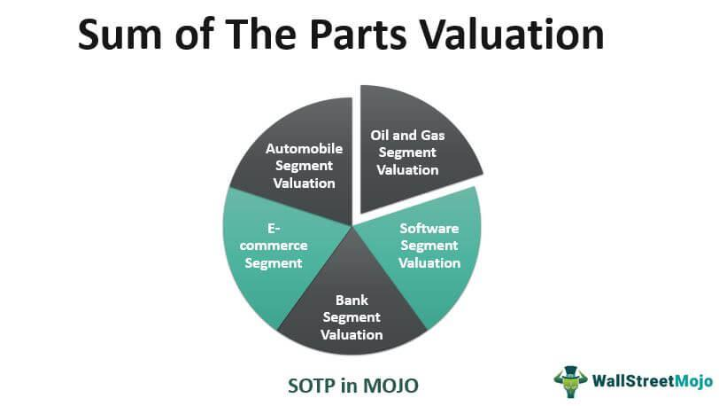

Valuation in finance is the process of determining the present value of an asset or a company. It is a crucial aspect of investment analysis, corporate finance, and portfolio management. Various methodologies, such as Discounted Cash Flow (DCF), comparable company analysis, and precedent transactions, are utilized to ascertain a company’s worth. Among these, Sum-of-the-Parts (SOTP) valuation holds particular significance, especially when evaluating conglomerates or companies with multiple distinct business units.

SOTP valuation is particularly relevant in financial evaluation and algorithmic trading because it provides a granular perspective on the value of a company’s individual segments. In today’s complex markets, companies often comprise diverse business operations, each contributing differently to the overall organization. By separately valuating these components, investors and financial analysts can gain a deeper insight into the company’s intrinsic value. This method is invaluable for assessing conglomerates where the sum of individual segment values may differ from the company’s consolidated market value. For instance, a conglomerate’s total market value might not reflect the potential growth and profitability of high-performing segments. Therefore, SOTP can help uncover hidden value, thereby informing investment decisions and strategies.



In the context of algorithmic trading, SOTP valuation provides a data-driven approach that can feed into sophisticated trading algorithms. These algorithms can use SOTP insights to identify arbitrage opportunities, optimize asset allocation, and enhance trading strategies by considering the intrinsic value of individual segments and the company as a whole. Additionally, SOTP can aid traders in making informed decisions about mergers and acquisitions or corporate restructuring by highlighting under or overvalued units within a conglomerate.

This article aims to explore the SOTP valuation technique, outlining its methodology, practical implications, and the challenges it presents. By dissecting the process of conducting a SOTP valuation and examining its application in real-world scenarios, the article will offer a comprehensive understanding of its utility in financial analysis and trading. Moreover, it will discuss the benefits and limitations of SOTP, providing a balanced view of its effectiveness and areas for further exploration.

## Table of Contents

## Understanding Sum-of-the-Parts Valuation (SOTP)

Sum-of-the-Parts (SOTP) valuation is a financial analysis method used to assess the value of a conglomerate or a company with multiple diverse business units. By evaluating each business segment independently, financial analysts aim to determine the intrinsic value of the entire entity more accurately than traditional single-valuation methods. This approach is particularly significant for companies whose segments operate in varying industries or markets, as it accounts for specific growth prospects, risk profiles, and competitive landscapes individual to each segment.

The process of SOTP valuation begins by identifying and valuing each of the company's distinct business segments. Each segment is treated as a standalone entity and is analyzed using appropriate valuation methods. Frequently employed techniques include Discounted Cash Flow (DCF) analysis, market multiples, and transaction comparables.

1. **Discounted Cash Flow (DCF) Analysis**: This method involves forecasting the future cash flows of a business segment and discounting them back to their present value using the segment's weighted average cost of capital (WACC). The formula used is:
$$
   \text{DCF} = \sum_{t=1}^{n} \frac{FCF_t}{(1 + r)^t}

$$
   Where $FCF_t$ is the free cash flow at time $t$, $r$ is the discount rate, and $n$ is the number of periods.

2. **Market Multiples**: Analysts might apply valuation multiples derived from comparable companies operating in similar sectors. Common multiples used include Price-to-Earnings (P/E), Enterprise Value-to-EBITDA (EV/EBITDA), and Price-to-Sales (P/S).

3. **Transaction Comparables**: Recent transactions involving similar business units are analyzed to extract relevant valuation ratios, which can then be applied to the target segment.

Once each segment is valued, these values are aggregated to calculate the company's total enterprise value. This comprehensive view not only highlights the intrinsic value of the conglomerate or multi-segment company but also uncovers potential undervaluation or overvaluation by the market.

SOTP provides investors and analysts with distinct insights into each of the company’s components and identifies hidden value that might not be apparent through consolidated financial statements. This can inform strategic initiatives such as spin-offs, divestitures, or investments and enable a more informed investment decision-making process.

## The Mechanics of SOTP Valuation

Sum-of-the-Parts (SOTP) valuation is a method used to evaluate a company's intrinsic value by analyzing and valuing each of its individual business segments separately. This approach is particularly useful for conglomerates or companies with diverse operations, as it allows for a more granular assessment of the overall corporate value. Here, the mechanics of SOTP valuation will be explored, detailing the necessary steps and methodologies utilized in the process.

**Identification and Valuation of Business Segments**

The first step in the SOTP valuation process is to identify the distinct business segments within a company. This involves breaking down the company's operations into separate units based on different lines of business, geographical regions, or other relevant criteria. For instance, a company like General Electric could be segmented into Aviation, Healthcare, and Renewable Energy.

Once the segments are identified, each needs to be valued individually. This involves assessing the financial performance, growth prospects, and market dynamics specific to each segment. Key financial metrics such as revenue, earnings before interest, taxes, depreciation, and amortization (EBITDA), and cash flows are evaluated to establish a basis for valuation.

**Methods of Segment Valuation**

Several methodologies can be employed to value the individual segments:

1. **Discounted Cash Flow (DCF) Analysis**: This method involves forecasting the future cash flows of a business segment and discounting them back to their present value using an appropriate discount rate. The formula for DCF can be expressed as:
$$
   \text{DCF Value} = \sum \frac{CF_t}{(1 + r)^t}

$$

   where $CF_t$ is the cash flow in year $t$, and $r$ is the discount rate.

2. **Market Multiples**: This approach uses valuation multiples derived from comparable companies in the same industry. Common multiples include price-to-earnings (P/E), enterprise value-to-sales (EV/Sales), and EV/EBITDA. The value of a segment is estimated by applying these multiples to its respective financial metrics.

3. **Transaction Comparables**: Also known as precedent transactions, this method involves analyzing the pricing of similar transactions in the market to estimate the value of a segment. By examining the acquisition prices of comparable companies, an implied valuation can be derived for the segment in question.

**Adjustment for Debt and Cash**

Once the individual segments are valued, the next step is to adjust these values for the company's financial structure. This involves considering the company's debt and cash positions, which can significantly affect the overall enterprise value (EV).

- **Debt Adjustment**: The total value of all business segments (sum of individual segments' values) is combined, and any outstanding debt is subtracted to arrive at the equity value. This is represented as:
$$
   \text{Equity Value} = \sum (\text{Segment Values}) - \text{Total Debt}

$$

- **Cash Adjustment**: Conversely, any surplus cash held by the company is added back to the equation, as this represents liquid assets that can enhance shareholder value:
$$
   \text{Adjusted Equity Value} = \text{Equity Value} + \text{Cash}

$$

The final result is a comprehensive valuation of the company's overall worth, which reflects the combined value of its diverse business segments, accounting for the financial structure, including debt and cash considerations. This provides a clearer picture of the company's intrinsic value, informing investment decisions and strategic planning.

## Case Studies: Applying SOTP Methodology

To illustrate the application of Sum-of-the-Parts (SOTP) valuation, we can consider the case of General Electric (GE), a multinational conglomerate with diverse business segments. Each segment operates in distinct industries, including Aviation, Healthcare, and Renewable Energy. By individually evaluating these segments, we can derive an intrinsic value for the entire company.

### Valuation of GE’s Segments

#### Aviation
The Aviation segment of GE is a leading provider of jet engines, components, and integrated systems for commercial and military aircraft. To value this segment, we might use the Discounted Cash Flow (DCF) method, considering the steady cash flow from long-term contracts and the market growth for aviation services. Analysts typically project future cash flows based on historical performance and forecasted trends and then discount them back to present value using an appropriate discount rate. 

Formula for DCF:
$$
\text{DCF} = \sum \frac{CF_t}{(1 + r)^t}
$$
where $CF_t$ is the cash flow in year $t$, and $r$ is the discount rate.

#### Healthcare
The Healthcare segment, known for its medical imaging and diagnostics equipment, can be valued using market multiples, such as the Price/Earnings (P/E) ratio, compared to competitors within the healthcare industry. By multiplying the segment's earnings by the industry-average P/E ratio, an approximate market value can be established.

#### Renewable Energy
The Renewable Energy segment encompasses products and services in wind, hydro, and solar power generation. This segment can be valuated using transaction comparables, which involve assessing recent acquisitions or sales of similar businesses in the renewable energy sector to derive a benchmark value.

### Aggregation to Total Enterprise Value

Once the individual segment values are calculated using the appropriate methods, they are aggregated to determine the total enterprise value. It’s important to adjust for items such as corporate debt, cash, and minority interests to ensure an accurate enterprise valuation.

Formula for Total Enterprise Value:
$$
\text{Total\ Enterprise\ Value} = \sum \text{Segment\ Values} - \text{Net Debt}
$$

For General Electric, consideration of both synergies among segments and strategic disadvantages of standalone valuations is essential. By aggregating the aviation, healthcare, and renewable energy segments' values and accounting for the corporate structure, we acquire a comprehensive view of GE’s intrinsic value through SOTP valuation. This approach highlights potential hidden value within the conglomerate, informing strategic decisions and investment assessments.

## SOTP in Algorithmic Trading

Sum-of-the-Parts (SOTP) valuation can significantly enhance [algorithmic trading](/wiki/algorithmic-trading) strategies by providing granular insights into a company's intrinsic value. By assessing each business segment individually, SOTP allows traders to capture differential value drivers, leading to more informed trading decisions.

Incorporating SOTP insights into automated trading algorithms involves integrating the segmented valuations into a model that can dynamically adjust to market data and segment-specific variables. For instance, a trader could develop an algorithm that updates the value of each segment based on recent financial disclosures, stock performance, or sector trends, and then calculates the total enterprise value. This process would maintain alignment with both market movements and intrinsic value changes.

Python can be effectively used to automate this process. Below is a simplified conceptual example:

```python
def sotp_valuation(segments, market_data):
    total_value = 0
    for segment in segments:
        # Extract segment-specific data
        revenue = market_data[segment]['revenue']
        margin = market_data[segment]['margin']
        sector_multiple = market_data[segment]['sector_multiple']

        # Calculate segment valuation
        segment_value = revenue * margin * sector_multiple
        total_value += segment_value
    return total_value

# Example usage
market_data = {
    'Aviation': {'revenue': 5000, 'margin': 0.2, 'sector_multiple': 8},
    'Healthcare': {'revenue': 3000, 'margin': 0.25, 'sector_multiple': 10},
    'Renewable Energy': {'revenue': 1500, 'margin': 0.1, 'sector_multiple': 12},
}

segments = ['Aviation', 'Healthcare', 'Renewable Energy']
enterprise_value = sotp_valuation(segments, market_data)
```

This approach offers several advantages. Firstly, it uncovers hidden values within conglomerates, which may not be evident through traditional top-down valuation models, thereby offering the opportunity to exploit market inefficiencies. Secondly, the tailored valuation of each segment allows the algorithm to [factor](/wiki/factor-investing) in diverse growth trajectories and risk profiles, aligning trading strategies more closely with the underlying fundamentals.

Moreover, using SOTP data in algorithmic trading can enhance risk management. By evaluating each segment independently, traders can identify and hedge against specific segment risks, thus refining portfolio risk strategies.

Nonetheless, there are challenges, such as ensuring data accuracy and real-time updating capabilities, which must be addressed for successful integration. Despite these challenges, the potential benefits of using SOTP valuation as part of algorithmic trading can be substantial, offering sharper insights and more strategic trading executions.

## Advantages and Challenges of SOTP Valuation

Sum-of-the-Parts (SOTP) valuation is a valuable tool in financial analysis, offering several distinct advantages. Firstly, it allows analysts to uncover hidden value within a conglomerate or diversified company. By breaking down the enterprise into individual segments and valuing each one separately, analysts may identify undervalued components whose intrinsic value is not immediately apparent from the company's aggregated financial figures. This can lead to more informed and strategic decision-making, particularly in environments where the market may not fully recognize the worth of individual business segments. Consequently, investors and management can better allocate resources, optimize portfolio management, and make informed mergers and acquisitions decisions.

Despite its advantages, SOTP valuation presents several challenges and limitations. A significant issue lies in the availability and granularity of data, which is critical for the accurate valuation of individual business segments. Companies may not disclose detailed enough information about each division, leading to valuation guesses. Moreover, assembling multiple valuations requires handling complex and varied data points, introducing room for discrepancies and errors. Each segment employs different valuation methodologies like Discounted Cash Flow (DCF), market multiples, and transaction comparables, all of which require specific assumptions and inputs. Navigating these complexities demands a high level of expertise and judgment.

Additionally, the accuracy of SOTP valuation can be impacted by synergies and prevailing market conditions. Synergies, both operational and financial, may exist between different business segments, and SOTP inherently risks overlooking these interdependencies by valuing segments individually. This can lead to an overestimation or underestimation of a company’s total value. Similarly, market conditions, including economic fluctuations and industry trends, can influence the outcomes of valuation methodologies employed for each segment. For instance, reliance on market multiples necessitates an understanding of broader market valuations that are subject to rapid and unpredictable changes.

In conclusion, while SOTP valuation is a potent analytical tool to capture the nuanced value of diversified companies, its effectiveness is highly contingent upon the availability of comprehensive data, the complexity of valuations, and the ability to account for synergies and market influences accurately.

## Conclusion

Sum-of-the-Parts (SOTP) valuation is a vital tool in financial analysis, offering a nuanced approach to determining the intrinsic value of companies with diverse operations. This method shines in its ability to deconstruct complex conglomerates into their individual business segments, enabling a more precise evaluation of each constituent part. By doing so, SOTP aids in uncovering hidden value that might be obscured in a traditional, unified valuation approach. 

The primary benefit of SOTP lies in its strategic decision-making assistance. It facilitates a granular understanding of how different business segments contribute to the overall value of a company. This can be particularly useful for investors and corporate strategists seeking to identify undervalued segments that might warrant further investment or divestment. Moreover, SOTP offers a foundation for comprehensive enterprise value assessment, beneficial for mergers and acquisitions where understanding each segment's worth is crucial.

Despite its advantages, SOTP valuation isn't without challenges. Accurately valuing individual segments requires robust data, which may not always be readily available or straightforward to interpret. The complexity of performing multiple valuations simultaneously can introduce potential inaccuracies, particularly if assumptions about future performance and market conditions vary significantly. Additionally, synergies between business units, a common factor in conglomerates, may lead to discrepancies between the sum of individual valuations and the market's actual assessment of the company's value.

Looking ahead, there is ample opportunity to leverage SOTP insights in algorithmic trading. Traders can incorporate these detailed valuations into their trading algorithms to better inform buy and sell decisions, potentially gaining a competitive edge by anticipating market movements based on undervalued or overvalued segments. Further exploration of SOTP's application, particularly in automating trading strategies, could yield significant advantages in portfolio management and financial forecasting.

In conclusion, SOTP valuation remains an essential methodology in financial analysis, offering a precise lens through which to view complex corporate structures. Its integration into algorithmic trading and other financial strategies holds promise, encouraging continued refinement and application of SOTP in a variety of financial contexts. As data availability and analytical techniques continue to evolve, the effectiveness and applicability of SOTP are likely to expand, reinforcing its status as a cornerstone of financial evaluation.

## References & Further Reading

[1]: Damodaran, A. (2002). ["Investment Valuation: Tools and Techniques for Determining the Value of Any Asset,"](https://archive.org/details/investmentvaluat0000damo_n6k9) Wiley Finance.

[2]: McKinsey & Company Inc., Koller, T., Goedhart, M., & Wessels, D. (2015). ["Valuation: Measuring and Managing the Value of Companies,"](https://www.mckinsey.com/capabilities/strategy-and-corporate-finance/our-insights/valuation-measuring-and-managing-the-value-of-companies) 6th Edition, Wiley Finance.

[3]: Tjia, J. S. (2009). ["Building Financial Models,"](https://books.google.com/books/about/Building_Financial_Models.html?id=tZ7ss5KihJ0C) McGraw-Hill.

[4]: Penman, S. H. (2012). ["Financial Statement Analysis and Security Valuation,"](https://archive.org/details/financialstateme0000penm_r9u4) McGraw-Hill Education.

[5]: Damodaran, A. (2006). ["Damodaran on Valuation: Security Analysis for Investment and Corporate Finance,"](https://onlinelibrary.wiley.com/doi/book/10.1002/9781119201786) 2nd Edition, Wiley Finance.