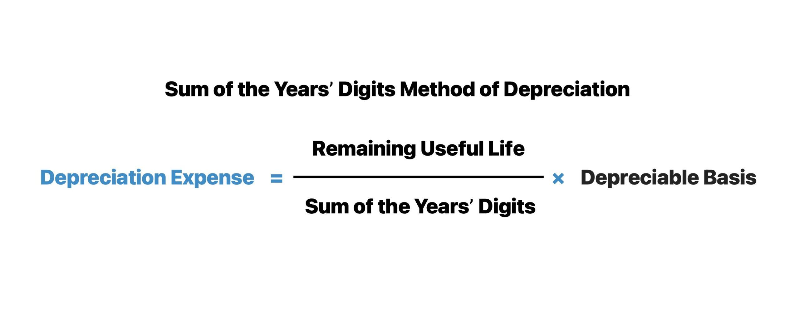

## Table of Contents

## What is the Sum-Of-The-Years’ Digits Method?

The Sum-Of-The-Years’ Digits Method is a way to calculate how much an asset loses value over time. It's used in accounting to figure out depreciation, which is how much the value of something like a machine or a vehicle goes down each year. This method is different from others because it makes the asset lose more value in the early years and less in the later years. To use this method, you add up the digits of the years the asset will be used. For example, if an asset lasts 5 years, you add 5 + 4 + 3 + 2 + 1 to get 15.

Once you have the total sum of the years' digits, you use it to figure out the depreciation for each year. You start with the highest digit for the first year and go down each year. So, for a 5-year asset, the first year you use 5/15 of the total depreciation, the second year you use 4/15, and so on until the last year when you use 1/15. This method helps businesses plan their finances better because they can predict larger expenses early on and smaller ones later.

## How does the Sum-Of-The-Years’ Digits Method differ from straight-line depreciation?

The Sum-Of-The-Years’ Digits Method and straight-line depreciation are two different ways to figure out how much an asset loses value over time. With the straight-line method, you divide the total cost of the asset by the number of years it will be used. This means the asset loses the same amount of value each year. For example, if a machine costs $10,000 and will be used for 5 years, you would subtract $2,000 from its value each year.

On the other hand, the Sum-Of-The-Years’ Digits Method makes the asset lose more value in the early years and less in the later years. To use this method, you add up the digits of the years the asset will be used, and then you use a fraction of the total depreciation each year, starting with the highest number. So, for the same $10,000 machine used for 5 years, you would subtract more than $2,000 in the first year and less than $2,000 in the last year. This method can be helpful for businesses that want to account for more depreciation early on.

## What are the steps to calculate depreciation using the Sum-Of-The-Years’ Digits Method?

To calculate depreciation using the Sum-Of-The-Years’ Digits Method, start by figuring out how many years the asset will be used. Let's say it's 5 years. Add up the digits of these years: 5 + 4 + 3 + 2 + 1. This gives you a total of 15. Next, find out how much the asset costs and how much it will be worth at the end of its life. If a machine costs $10,000 and will be worth $2,000 at the end, the total depreciation is $10,000 - $2,000 = $8,000.

Now, use the sum of the years' digits to figure out the depreciation for each year. In the first year, you use the highest digit, which is 5. So, you calculate 5/15 of the total depreciation: (5/15) * $8,000 = $2,666.67. In the second year, you use the next highest digit, which is 4. So, you calculate 4/15 of the total depreciation: (4/15) * $8,000 = $2,133.33. You keep going like this, using 3/15 for the third year, 2/15 for the fourth year, and 1/15 for the fifth year. This way, you spread out the depreciation over the life of the asset, with more depreciation in the early years and less in the later years.

## Can you provide an example of how to apply the Sum-Of-The-Years’ Digits Method to an asset?

Let's say you bought a machine for your business that cost $10,000. You think it will last for 5 years and then be worth $2,000. To figure out how much the machine loses value each year using the Sum-Of-The-Years’ Digits Method, you first add up the numbers from 5 to 1. That's 5 + 4 + 3 + 2 + 1, which equals 15. The total amount the machine will lose value over those 5 years is $10,000 - $2,000 = $8,000.

Now, you use the sum of the years' digits to find out how much the machine loses value each year. In the first year, you use the biggest number, which is 5. So, you calculate 5/15 of the total depreciation: (5/15) * $8,000 = $2,666.67. In the second year, you use the next biggest number, which is 4. So, you calculate 4/15 of the total depreciation: (4/15) * $8,000 = $2,133.33. You keep going like this, using 3/15 for the third year, 2/15 for the fourth year, and 1/15 for the fifth year. This way, the machine loses more value in the early years and less in the later years.

## What types of assets are best suited for the Sum-Of-The-Years’ Digits Method?

The Sum-Of-The-Years’ Digits Method works best for assets that lose more value when they are new. This means things like cars or heavy machines that need a lot of repairs or might break down more often at first. Using this method helps businesses account for the bigger drop in value early on, which can be more realistic than other methods.

It's also good for assets that will be used a lot at the start and less as time goes on. For example, if a company buys a new computer system that will be used a lot in the first few years but less later, this method can show how the value goes down faster at first. This way, the business can plan its money better, knowing it will have bigger expenses early and smaller ones later.

## How does the Sum-Of-The-Years’ Digits Method impact a company's financial statements?

The Sum-Of-The-Years’ Digits Method impacts a company's financial statements by changing how much depreciation is shown each year. With this method, the company will show a bigger loss in value for an asset in the early years and a smaller loss later on. This means in the first few years, the company's income statement will show higher expenses because of the larger depreciation amounts. This can make the company's profits look smaller early on, which might affect how investors see the company's performance.

On the balance sheet, the value of the asset will go down faster at first. This means the company's total assets will be lower in the early years. But over time, as the depreciation amounts get smaller, the impact on the balance sheet will lessen. This method can be helpful for planning because it matches the higher costs of using and maintaining new assets with higher depreciation early on. It gives a more realistic picture of how the asset's value decreases over time.

## What are the advantages of using the Sum-Of-The-Years’ Digits Method over other depreciation methods?

The Sum-Of-The-Years’ Digits Method has some good points that make it better than other ways to figure out how much an asset loses value. One big advantage is that it shows a bigger drop in value for new assets, which matches how many things like cars or machines lose value faster when they are new. This can help businesses plan their money better because they can expect bigger expenses early on and smaller ones later. It's also good for assets that will be used a lot at first and less as time goes on, like a new computer system that gets used a lot in the first few years.

Another advantage is that this method can give a more realistic picture of how an asset's value goes down over time. When you use this method, your financial statements will show higher expenses in the early years, which can be helpful for tax planning. This might mean the company pays less tax early on because of the higher depreciation amounts. Plus, it can make the company's profits look smaller at first, which might be good if you want to show investors that you're being careful with your money.

## Are there any disadvantages or limitations to using the Sum-Of-The-Years’ Digits Method?

One disadvantage of the Sum-Of-The-Years’ Digits Method is that it can make a company's profits look smaller in the early years because of the higher depreciation amounts. This might not be good if you want to show investors that your business is doing well right away. Also, this method can be a bit harder to understand and explain to people who are not used to it. It needs more math than the straight-line method, which might make it confusing for some people.

Another limitation is that this method might not be the best fit for all types of assets. It works well for things that lose value quickly when they are new, but it might not make sense for assets that lose value at a steady rate or those that keep their value for a long time. Also, if a company changes how it figures out depreciation, it can make it hard to compare financial statements from year to year. This can make it tricky to see how the business is doing over time.

## How does the Sum-Of-The-Years’ Digits Method comply with different accounting standards?

The Sum-Of-The-Years’ Digits Method is allowed under different accounting rules, like the Generally Accepted Accounting Principles (GAAP) in the United States. GAAP says companies can use this method if it matches how the asset loses value over time. But, it's important for the company to explain why they chose this method in their financial reports. This way, people who look at the reports understand why the company's profits might look smaller at first.

Other rules, like the International Financial Reporting Standards (IFRS), are a bit different. IFRS doesn't like the Sum-Of-The-Years’ Digits Method as much because it wants companies to use methods that show how the asset is used up over time. But, if a company can show that this method matches how the asset loses value, they might still be able to use it. It's always a good idea for a company to talk to an accountant to make sure they are following the right rules for their situation.

## What are the tax implications of using the Sum-Of-The-Years’ Digits Method?

Using the Sum-Of-The-Years’ Digits Method for depreciation can help a company save on taxes in the early years. This method lets the company take bigger depreciation expenses at first, which means they can show less profit on their tax returns. When a company shows less profit, they pay less in taxes. So, if a company buys a new machine and uses this method, they can lower their tax bill right away, which can help them save money when the machine is new and might need more repairs or maintenance.

However, this method also means the company will have smaller depreciation expenses in later years, which could lead to higher taxes as time goes on. This can be good or bad, depending on what the company wants. If they want to save money on taxes early on, this method works well. But if they want a steady tax bill over time, they might choose a different method like straight-line depreciation. It's always a good idea for a company to talk to a tax expert to see which method will help them the most with their taxes.

## How can software tools assist in applying the Sum-Of-The-Years’ Digits Method?

Software tools can make it easier to use the Sum-Of-The-Years’ Digits Method. They can do the math for you, so you don't have to add up the years' digits or figure out the fractions for each year. All you need to do is put in the cost of the asset, how long it will last, and what it will be worth at the end. The software will then calculate how much the asset loses value each year using this method. This saves time and helps make sure the numbers are right.

Using software also helps keep track of everything. It can make reports and show you how the asset's value changes over time. This can be helpful when you need to show your financial statements to others, like investors or the tax office. The software can also change the numbers if you need to update the asset's life or value. This makes it easier to stay on top of your finances and follow the right accounting rules.

## What advanced considerations should be taken into account when using the Sum-Of-The-Years’ Digits Method in complex scenarios?

When using the Sum-Of-The-Years’ Digits Method in complex scenarios, one important thing to think about is how changes in the asset's life or value can affect the calculations. If a company decides to use an asset longer than they first thought, or if the asset's value at the end changes, they need to update their depreciation numbers. This can be tricky because it means going back and changing the depreciation for past years too. It's important to keep good records and use software that can handle these changes easily.

Another thing to consider is how this method fits with different accounting rules in different countries or situations. For example, if a company does business in more than one country, they need to make sure they're following the right rules for each place. Also, if the company gets audited, they need to be able to explain why they chose this method and show that it matches how the asset loses value over time. Talking to an accountant or using software that knows about these rules can help make sure everything is done right.

## How does SYD compare to other depreciation methods?

Other common depreciation methods include the Straight-Line, Declining Balance, and Units of Production techniques. Each method varies in terms of how depreciation is allocated across an asset's useful life and the financial implications it carries.

The Straight-Line method distributes the cost of an asset evenly across its useful life. It is calculated using the formula:

$$
\text{Annual Depreciation Expense} = \frac{\text{Cost of Asset} - \text{Residual Value}}{\text{Useful Life in Years}}
$$

This method is simple and results in a consistent expense each year. Unlike the Sum of the Years' Digits (SYD) approach, it does not account for the accelerated wear and tear that certain assets may experience in the initial years.

The Declining Balance method, another accelerated depreciation technique, applies a constant depreciation rate to the diminishing book value of an asset. The commonly used double declining balance method is calculated as:

$$
\text{Depreciation Expense} = 2 \times \left(\frac{1}{\text{Useful Life}}\right) \times \text{Book Value at Beginning of Year}
$$

This method provides higher depreciation in earlier years compared to later years, similar to SYD, but it typically results in smaller depreciation amounts as the asset ages, due to the exponential reduction.

Units of Production, on the other hand, ties depreciation to the actual usage of an asset rather than time. This method is particularly useful for machinery or equipment whose value declines with usage. The calculation is based on:

$$
\text{Depreciation Expense} = \frac{\text{Cost of Asset} - \text{Residual Value}}{\text{Total Estimated Production}} \times \text{Units Produced in Period}
$$

This method allows for a direct correlation between the depreciation charge and the asset's productivity.

Choosing between these methods depends on a company's asset management strategy, financial objectives, and reporting needs. SYD is advantageous for assets that lose value quickly after acquisition, aligning costs with revenue generation in the early stages. The Straight-Line method offers consistency and ease of calculation, suitable for assets with a steady usage pattern. Meanwhile, Declining Balance suits businesses seeking significant tax advantages by deferring tax liabilities into later years. Units of Production is preferred where asset use fluctuates significantly year-to-year.

Tailoring a depreciation strategy requires an understanding of the financial impact, tax considerations, and alignment with the organization's operational dynamics and goals, ensuring financial statements accurately reflect asset utilities and values.

## References & Further Reading

[1]: ["Financial & Managerial Accounting"](https://www.investopedia.com/ask/answers/041015/how-does-financial-accounting-differ-managerial-accounting.asp) by Charles T. Horngren, Tracie L. Miller-Nobles, Brenda L. Mattison

[2]: ["Intermediate Accounting"](https://accountingtestprep.com/intermediate-accounting-2/) by Donald E. Kieso, Jerry J. Weygandt, Terry D. Warfield

[3]: ["Advances in Financial Machine Learning"](https://www.amazon.com/Advances-Financial-Machine-Learning-Marcos/dp/1119482089) by Marcos Lopez de Prado

[4]: ["Depreciation: Fundamental Concepts"](https://www.investopedia.com/terms/d/depreciation.asp) in The New York Times Archive

[5]: ["Machine Learning for Algorithmic Trading"](https://github.com/PacktPublishing/Machine-Learning-for-Algorithmic-Trading-Second-Edition) by Stefan Jansen