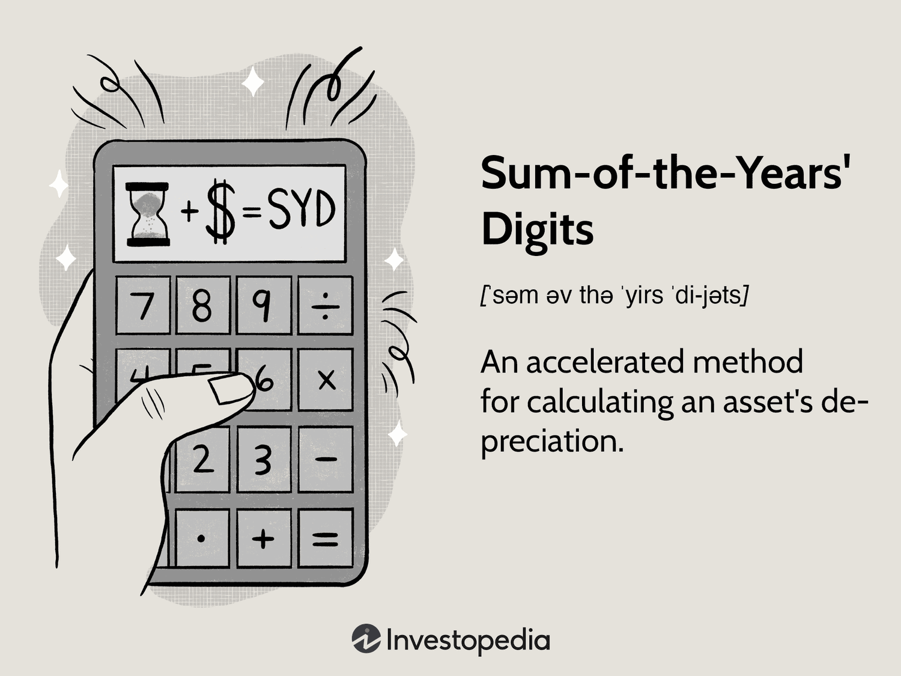

The world of financial accounting encompasses various methods for calculating depreciation, each offering distinct advantages. Among these methods, the Sum of the Years' Digits (SYD) technique stands out for its accelerated approach, allowing for a greater reduction in asset value during the early years of use. This method is particularly beneficial for companies seeking to align expenses with revenues in the initial stages of asset deployment.

In this article, we explore the intricacies of the SYD depreciation method, examining its applications and advantages within different financial contexts. Understanding the nuances of depreciation is essential for conducting accurate financial analysis and strategic planning. Furthermore, the intersection of depreciation methods with algorithmic trading will be addressed, highlighting their role in optimizing asset valuation and decision-making processes.



Algorithmic trading, reliant on precise financial metrics, can gain significant insights from depreciation data, aiding in portfolio management and investment return calculations. Technological advancements necessitate frequent asset evaluation and depreciation recalibrations, aligning with market dynamics. By incorporating such metrics into trading algorithms, financial institutions can enhance predictive accuracy and maintain a competitive edge.

Let us explore the specifics of the Sum of the Years' Digits method and its relevance not only in traditional finance but also in the burgeoning field of emerging technologies. Understanding these elements is pivotal for stakeholders aiming to optimize asset management and capitalize on robust financial reporting strategies.

## Table of Contents

## Understanding Depreciation in Financial Accounting

Depreciation is a fundamental concept in financial accounting that quantifies the decrease in value of an asset over its useful life. This systematic allocation of an asset's cost over its lifespan ensures that financial statements accurately represent the value of assets owned by a business. When assets such as machinery, equipment, and technology undergo usage, wear, and obsolescence, their value inevitably declines. Recognizing this decline through depreciation is pivotal for effective financial planning and accurate financial reporting.

Accurate depreciation methods are vital to maintain a true and fair view of an entity's financial position. By applying depreciation techniques, companies can match the cost of an asset to the revenue it generates, enabling more precise profit measurement over accounting periods. This matching principle is essential in upholding the integrity of financial statements, thereby providing stakeholders with reliable information on asset valuation and business performance.

Various depreciation methods address different strategic needs, with the Sum of the Years' Digits (SYD) method being one more accelerated option available to accountants. The type of method chosen can influence tax liabilities, as depreciation is often deductible, thus reducing taxable income. Consequently, selecting an appropriate depreciation strategy plays a crucial role in tax planning, as well as in investment analysis and budget management. Businesses aiming to optimize their tax efficiency and alignment with financial goals must incorporate tailored depreciation methodologies into their accounting practices.

In summary, depreciation not only reflects the physical and economic realities of asset usage but also serves as a strategic tool in financial management. The methodology adopted can have significant implications for a company’s financial reporting, tax obligations, and overall fiscal strategy, underscoring the need for thoughtful consideration in its application.

## What is the Sum of the Years' Digits Method?

The Sum of the Years' Digits (SYD) method represents an accelerated depreciation technique that facilitates greater asset value reduction during the initial years of an asset's lifespan. This method effectively aligns with the principle of accelerated depreciation, which recognizes that many assets lose value more rapidly in the earlier stages of their useful life due to declining utility or technological obsolescence. 

At the core of the SYD method is a formula-driven calculation process. The key aspect of this technique is the calculation based on the sum of the digits of the years constituting the asset's useful life. For instance, if an asset has a lifespan of five years, the sum of the year's digits would be $1 + 2 + 3 + 4 + 5 = 15$. Each year, the application of the method demands determining a fraction based on the asset's remaining life. This fraction is then multiplied by the depreciable amount to ascertain the depreciation expense for each year.

The method assigns a declining depreciation charge each year by using a fraction where the numerator is the asset's remaining life at the beginning of the year and the denominator is the total sum of the year's digits. This results in a higher depreciation charge in the early years, which gradually reduces over the asset's life cycle.

For example, if a company purchases an asset with a cost of $10,000, a salvage value of $2,000, and a useful life of 5 years, the depreciable base is $8,000. The annual depreciation under the SYD method can be computed as follows:

1. Calculate the sum of the years' digits: $1 + 2 + 3 + 4 + 5 = 15$.
2. Compute each year's depreciation charge:
   - Year 1: $\frac{5}{15} \times 8000 = \$2666.67$
   - Year 2: $\frac{4}{15} \times 8000 = \$2133.33$
   - Year 3: $\frac{3}{15} \times 8000 = \$1600.00$
   - Year 4: $\frac{2}{15} \times 8000 = \$1066.67$
   - Year 5: $\frac{1}{15} \times 8000 = \$533.33$

The SYD method is advantageous for businesses that need alignment between expense recognition and revenue generation, particularly when revenues linked to the asset are expected to be higher in the early years of its use. The structured yet straightforward approach allows companies to strategically manage financial statements, thereby supporting effective financial strategies. Understanding the precise mechanics of the SYD calculation is crucial for businesses considering its implementation as part of their financial operations.

## Calculating Depreciation Using SYD

To implement the Sum of the Years' Digits (SYD) method of depreciation, one must first determine two crucial factors: the useful life of the asset and the depreciable base. The useful life is the estimated period over which the asset is expected to be productive for its user. The depreciable base is the cost of the asset minus any expected residual value at the end of its useful life.

The next step in the SYD method involves calculating the sum of the year's digits. This is achieved by adding the sequence of numbers from 1 up to the total years of the asset's useful life. For example, if the useful life of an asset is five years, the sum of the years' digits is $1 + 2 + 3 + 4 + 5 = 15$. This sum acts as the denominator in the fraction used across each period to allocate depreciation costs.

In each year of the asset's useful life, the remaining life is used as the numerator in the fraction to determine the depreciation expense for that particular year. For instance, using the five-year example, the first year's depreciation expense fraction would be $\frac{5}{15}$, the second year's fraction would be $\frac{4}{15}$, and so forth until the fifth year, which would be $\frac{1}{15}$. 

This approach inherently provides a larger depreciation expense in the initial periods, gradually tapering off over the later years. This front-loading of expenses can be beneficial for businesses to offset higher revenues expected earlier in the asset's life or to gain immediate tax advantages.

Here's a simple Python example to illustrate how SYD depreciation affects financial reporting:

```python
def syd_depreciation(cost, salvage_value, useful_life):
    depreciable_base = cost - salvage_value
    sum_of_digits = sum(range(1, useful_life + 1))
    depreciation_schedule = {}

    for year in range(1, useful_life + 1):
        remaining_life = useful_life - (year - 1)
        depreciation_factor = remaining_life / sum_of_digits
        annual_depreciation = depreciable_base * depreciation_factor
        depreciation_schedule[year] = annual_depreciation

    return depreciation_schedule

# Example usage:
cost_of_asset = 10000
salvage_value = 2000
useful_life = 5

depreciation_expenses = syd_depreciation(cost_of_asset, salvage_value, useful_life)
print(depreciation_expenses)
```

This program calculates the depreciation expense for each year based on the SYD method, helping to understand how such calculations may affect financial outcomes. The SYD method is valuable for financial reporting and tax obligation planning, allowing businesses to match asset depreciation with revenue generation efficiently.

## Comparing SYD to Other Depreciation Methods

Other common depreciation methods include the Straight-Line, Declining Balance, and Units of Production techniques. Each method varies in terms of how depreciation is allocated across an asset's useful life and the financial implications it carries.

The Straight-Line method distributes the cost of an asset evenly across its useful life. It is calculated using the formula:

$$
\text{Annual Depreciation Expense} = \frac{\text{Cost of Asset} - \text{Residual Value}}{\text{Useful Life in Years}}
$$

This method is simple and results in a consistent expense each year. Unlike the Sum of the Years' Digits (SYD) approach, it does not account for the accelerated wear and tear that certain assets may experience in the initial years.

The Declining Balance method, another accelerated depreciation technique, applies a constant depreciation rate to the diminishing book value of an asset. The commonly used double declining balance method is calculated as:

$$
\text{Depreciation Expense} = 2 \times \left(\frac{1}{\text{Useful Life}}\right) \times \text{Book Value at Beginning of Year}
$$

This method provides higher depreciation in earlier years compared to later years, similar to SYD, but it typically results in smaller depreciation amounts as the asset ages, due to the exponential reduction.

Units of Production, on the other hand, ties depreciation to the actual usage of an asset rather than time. This method is particularly useful for machinery or equipment whose value declines with usage. The calculation is based on:

$$
\text{Depreciation Expense} = \frac{\text{Cost of Asset} - \text{Residual Value}}{\text{Total Estimated Production}} \times \text{Units Produced in Period}
$$

This method allows for a direct correlation between the depreciation charge and the asset's productivity.

Choosing between these methods depends on a company's asset management strategy, financial objectives, and reporting needs. SYD is advantageous for assets that lose value quickly after acquisition, aligning costs with revenue generation in the early stages. The Straight-Line method offers consistency and ease of calculation, suitable for assets with a steady usage pattern. Meanwhile, Declining Balance suits businesses seeking significant tax advantages by deferring tax liabilities into later years. Units of Production is preferred where asset use fluctuates significantly year-to-year.

Tailoring a depreciation strategy requires an understanding of the financial impact, tax considerations, and alignment with the organization's operational dynamics and goals, ensuring financial statements accurately reflect asset utilities and values.

## Relevance of Depreciation in Algorithmic Trading

Algorithmic trading relies heavily on precise calculations to optimize trades and boost returns. Central to this precision is a comprehensive understanding of financial metrics, including asset depreciation. Depreciation can significantly impact asset valuation, portfolio management, and ultimately the returns on investment (ROI) achieved through trading algorithms.

Incorporating accurate depreciation data allows trading algorithms to align more effectively with asset market behavior influenced by depreciation. For instance, as an asset depreciates in value, trading strategies may need to adjust in response to changes in market perception and asset [liquidity](/wiki/liquidity-risk-premium). Therefore, understanding depreciation dynamics becomes pivotal in predicting price movements and timing trades for better financial outcomes.

Rapid technological advancements further highlight the need for continuous asset evaluation and depreciation recalculations. Innovations in trading systems and the frequent upgrade of technological equipment necessitate regular updates of depreciation schedules. Failure to accurately incorporate these changes can lead to misvalued assets and suboptimal trading decisions. Algorithmically, this adjustment involves recalibrating the models and algorithms to ensure that they reflect current and anticipated asset values.

The optimization of trading algorithms with depreciation data can be achieved through enhanced predictive accuracy. For example, by factoring in expected depreciation expenses in their models, data-driven traders can simulate future scenarios more realistically. Python programming provides a flexible platform to integrate such calculations, leveraging libraries like NumPy or pandas. A basic Python script that integrates depreciation data might look like this:

```python
import numpy as np

def syd_depreciation(initial_cost, salvage_value, years, current_year):
    # Calculate total depreciable amount
    total_depreciable_amount = initial_cost - salvage_value

    # Calculate sum of the years digits
    syd = sum(range(1, years + 1))

    # Current depreciation factor
    depreciation_factor = (years - current_year + 1) / syd

    # Depreciation expense for current year
    depreciation_expense = total_depreciable_amount * depreciation_factor

    return depreciation_expense

# Example usage:
initial_cost = 10000  # Initial cost of the asset
salvage_value = 2000  # Salvage value at the end of the asset's useful life
years = 5            # Useful life of the asset
current_year = 2     # Current year of depreciation

expense = syd_depreciation(initial_cost, salvage_value, years, current_year)
print(f"Depreciation Expense for Year {current_year}: {expense}")
```

This example illustrates computing the Sum of the Years' Digits (SYD) depreciation expense, which can be integrated into larger trading algorithms to refine asset evaluation methodologies.

Trading systems that accommodate such refined models stand to gain a competitive advantage, particularly in high-frequency trading environments where minor discrepancies in asset valuation can lead to significant financial implications. Therefore, incorporating detailed depreciation metrics is more than a financial strategy—it's a tactical component that can enhance decision-making and support the development of robust, future-focused trading strategies.

## Conclusion

The Sum of the Years' Digits (SYD) method stands as an essential tool in financial accounting, especially pertinent for sectors undergoing rapid technological transformation. This accelerated depreciation technique allows businesses to front-load depreciation expenses, which can align with the economic reality of asset usage and revenue generation. By doing so, it offers companies a strategic approach to manage their resources and financial planning effectively.

Savvy investors and traders recognize the value of incorporating SYD and accurate depreciation metrics into their analyses. These methods can lead to more insightful decision-making and precise financial reporting. Accurate depreciation, exemplified by SYD, not only aids in portraying a true financial picture but also provides a foundation for robust investment strategies. This approach ensures that asset valuation reflects current market conditions, which is invaluable for assessing investment opportunities.

The flexibility of various depreciation strategies, including SYD, allows organizations to tailor their accounting practices to be in harmony with their specific business objectives and market environments. Businesses can choose the method that best fits the nature of their assets and financial goals, thus optimizing resource allocation and capital management.

For participants in [algorithmic trading](/wiki/algorithmic-trading), a deeper understanding and accommodation of depreciation metrics can confer significant competitive advantages. Integrating accurate depreciation data into trading algorithms enables better adaptation to market behaviors influenced by asset value adjustments. This can enhance portfolio management, optimize asset allocation, and improve the predictive accuracy of trading models.

As the financial landscape continues to evolve, so too must the strategies around depreciation. Embracing methods like the SYD ensures businesses are not only compliant with financial standards but also strategically positioned to sustain growth. With the ongoing shift towards technology-driven markets, astute asset management and depreciation understanding are crucial for maintaining a competitive edge and maximizing investment returns.

## References & Further Reading

[1]: ["Financial & Managerial Accounting"](https://www.investopedia.com/ask/answers/041015/how-does-financial-accounting-differ-managerial-accounting.asp) by Charles T. Horngren, Tracie L. Miller-Nobles, Brenda L. Mattison

[2]: ["Intermediate Accounting"](https://accountingtestprep.com/intermediate-accounting-2/) by Donald E. Kieso, Jerry J. Weygandt, Terry D. Warfield

[3]: ["Advances in Financial Machine Learning"](https://www.amazon.com/Advances-Financial-Machine-Learning-Marcos/dp/1119482089) by Marcos Lopez de Prado

[4]: ["Depreciation: Fundamental Concepts"](https://www.investopedia.com/terms/d/depreciation.asp) in The New York Times Archive

[5]: ["Machine Learning for Algorithmic Trading"](https://github.com/PacktPublishing/Machine-Learning-for-Algorithmic-Trading-Second-Edition) by Stefan Jansen