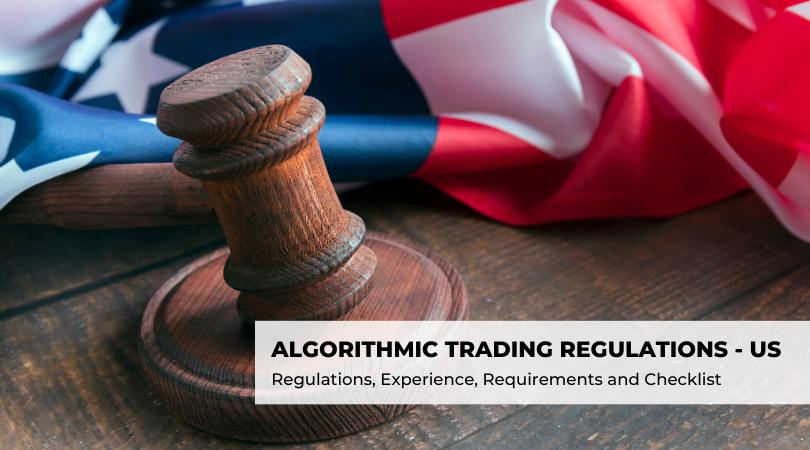

Sunday trading laws significantly affect retail business hours, shaping when and how retailers can operate on Sundays. These laws, varying across regions, often represent historical, cultural, and religious considerations. Retailers must navigate these rules to align their business operations with local customs and expectations. Sunday trading restrictions can influence consumer behavior, limiting shopping opportunities and prompting shifts in retail strategies.

Simultaneously, algorithmic trading has emerged as a crucial player within the retail sector, especially in inventory management, pricing strategies, and sales forecasting. By utilizing algorithms to automate trading decisions, retailers can optimize their operations, adapting swiftly to market changes. This efficiency is paramount in a competitive landscape, where margins can be slim, and consumer preferences fluctuate rapidly.



Balancing business operations with legal and societal expectations is pivotal for sustainable growth. Retailers must comply with local trading laws while leveraging technological advancements like algorithmic trading. This balance ensures legal adherence and fosters community integration, enhancing brand reputation and customer trust. Consequently, understanding and adapting to the landscape of retail laws and trading technologies are crucial for retailers seeking to thrive amidst evolving legal frameworks and technological innovations.

## Table of Contents

## Understanding Sunday Trading Laws

Sunday trading refers to the regulations that govern the opening hours and operations of retail businesses on Sundays, often influenced by cultural, religious, and historical factors. Its origins can be traced back to religious observance and traditional rest days, with many societies historically designating Sunday as a day of worship and rest. The laws surrounding Sunday trading are a blend of these cultural traditions and modern economic pressures.

Globally, there is significant variation in how Sunday trading laws are implemented, leading to diverse implications for retail businesses. In some countries, such as the United States, Sunday trading is generally unrestricted, reflecting a more commerce-friendly approach. Retailers can operate freely, adjusting their opening hours based on consumer demand. In contrast, European countries like Germany and France typically impose stricter regulations, limiting the hours retail establishments can operate, often with notable exceptions for essential services such as pharmacies and gas stations. The United Kingdom strikes a balance, allowing shops over 280 square meters to open for six consecutive hours between 10 am and 6 pm, while smaller shops face fewer restrictions.

The variations in these laws imply differing economic outcomes for retailers. In regions with liberal Sunday trading laws, businesses may experience increased revenue opportunities, given extended shopping hours. Conversely, in areas with stringent regulations, the potential for economic activity on Sundays is curtailed, impacting overall weekly sales and operational strategies for businesses.

Exemptions and penalties associated with Sunday trading laws also vary significantly across regions. Certain businesses, such as small family-run shops or those in tourist areas, may be exempt from restrictions, recognizing their unique sales environments or community role. Violating these regulations can result in penalties ranging from fines to more severe legal repercussions, depending on the jurisdiction and the nature of the breach. Retailers must navigate these laws carefully to optimize their business operations while remaining compliant, making it crucial to understand and adapt to local legislation.

## Impact of Sunday Trading on Retail Businesses

Sunday trading laws have a significant impact on retail businesses, influencing consumer behavior, economic performance, and market dynamics across different regions. These laws govern the hours during which retailers can operate on Sundays and vary widely across the globe, leading to diverse effects on retail enterprises.

### Consumer Behavior and Shopping Trends

Sunday trading hours can alter consumer behavior and shopping trends. In regions where Sunday trading is restricted, consumers often adjust their shopping schedules accordingly, leading to increased footfall on Saturdays and other weekdays. Conversely, in areas with liberalized Sunday trading laws, consumers benefit from greater flexibility, which can lead to evenly distributed shopping throughout the week. This flexibility can enhance consumer satisfaction by reducing overcrowding and improving the shopping experience.

Research indicates that extended Sunday trading hours are particularly attractive to dual-income households and individuals with demanding weekday commitments, as they offer more opportunities for leisure shopping. Additionally, tourism-driven economies often find liberalized Sunday trading beneficial, as it aligns with tourists' shopping activities, contributing to increased retail sales and economic growth.

### Economic Effects on Small vs. Large Retail Enterprises

The economic impact of Sunday trading laws varies between small and large retail enterprises. Large retailers typically benefit from extended trading hours as they possess the resources to capitalize on increased consumer traffic. They can absorb additional labor costs and effectively manage inventory to meet demand. Large retailers also employ strategic marketing and sales promotions to enhance their competitive advantage during extended hours.

In contrast, small retailers may face challenges due to Sunday trading. The costs associated with additional staffing and operations can strain their limited financial resources. Small businesses may also struggle to attract customers who prefer the convenience and variety offered by larger competitors. However, in certain communities, smaller retailers can maintain a loyal customer base by emphasizing personalized service and niche product offerings.

### Case Studies of Regions with Liberalized Sunday Trading Laws

Several regions have experienced significant changes following the liberalization of Sunday trading laws. For instance, the United Kingdom's partial deregulation of Sunday trading laws in the 1990s allowed larger stores to open for limited hours, resulting in changes in retail dynamics. Studies showed that consumer spending increased, with shoppers appreciating the added convenience.

Similarly, countries like Australia and several European nations have adapted their Sunday trading laws, observing economic growth in areas with relaxed regulations. In New South Wales, Australia, the deregulation of trading hours in the 1990s stimulated retail activity, contributed to employment growth in the retail sector, and transformed consumer shopping habits.

While liberalized laws generally benefit urban and tourist-oriented areas, rural regions with smaller populations may not experience the same level of economic uplift, as the demand for extended shopping hours is not as pronounced compared to metropolitan areas.

In summary, Sunday trading laws exert substantial influence on consumer behavior, economic dynamics, and retail competition. The effects of these laws underscore the importance of considering both market demand and the competitive landscape when formulating retail strategies and legislative frameworks.

## Algorithmic Trading in Retail

Algorithmic trading, often referred to as algo-trading, involves the use of computer algorithms to automate trading decisions in financial markets. Originating in the financial sector, this approach uses pre-defined rules and strategies to conduct transactions at speeds and frequencies that would be impossible for a human trader. The basis of [algorithmic trading](/wiki/algorithmic-trading) lies in its ability to leverage advanced mathematical models and innovative software to make data-driven decisions.

In the retail sector, algorithmic trading plays an increasingly significant role in optimizing various aspects of operations. By automating tasks such as inventory management, pricing strategies, and supply chain coordination, retailers can enhance efficiency and react in real-time to market changes. For example, a retailer can deploy algorithms to determine optimal pricing by analyzing competitors’ prices, inventory levels, and consumer demand patterns.

The benefits of integrating algorithmic trading in retail are considerable. The primary advantage is the improved operational efficiency, as algorithms can process vast amounts of data much faster than human input, thereby enabling timely decisions that reflect current market conditions. Additionally, automation reduces the likelihood of human error and can lead to significant cost savings. For instance, optimizing stock levels through predictive algorithms minimizes waste and reduces storage costs.

Despite these benefits, the integration of algorithmic trading into retail also presents several challenges. One of the foremost issues is the risk associated with algorithm errors or unintended strategy outcomes, which can lead to significant financial losses. Furthermore, the initial cost of implementing sophisticated algorithmic systems can be a barrier for smaller retailers. Ensuring data security and maintaining consumer trust are also crucial challenges, as algorithmic systems rely heavily on sensitive consumer data to function effectively.

For example, a simple Python algorithm could be implemented to automatically adjust product prices based on competitor pricing and sales data:

```python
import numpy as np

def adjust_prices(current_price, competitor_prices):
    # Calculate the price adjustment based on competitor average
    competitor_avg = np.mean(competitor_prices)
    # Adjust the current price by a factor of 10% towards the competitor average
    new_price = current_price * 0.9 + competitor_avg * 0.1
    return new_price

# Current price of the product
current_price = 100.0

# Sample data of competitors' prices
competitor_prices = [95.0, 110.0, 100.0, 105.0]

# Calculate the new price
new_price = adjust_prices(current_price, competitor_prices)
print(f"New adjusted price: {new_price:.2f}")
```

This script exemplifies a basic model, showcasing how algorithmic strategies can be employed to dynamically adjust pricing, thereby optimizing sales and competitiveness in the retail market.

## Legal and Ethical Considerations

Legal and ethical considerations in retail trading are multifaceted and vary significantly across regions, impacting both Sunday trading and algorithmic trading. These considerations play a crucial role in shaping business strategies and operational compliance within the retail sector.

### Legal Frameworks Governing Sunday Trading and Algorithmic Trading

Sunday trading laws have their roots in religious and cultural traditions, originally intended to preserve Sunday as a day of rest and worship. The legal frameworks governing Sunday trading have evolved, reflecting changes in societal norms and economic demands. In regions such as the United Kingdom, the Sunday Trading Act 1994 limits the trading hours of large retailers, allowing them to open for up to six consecutive hours between 10 a.m. and 6 p.m. [^1]. In contrast, countries like the United States largely leave Sunday trading regulations to state or local jurisdictions, resulting in a patchwork of laws that businesses must navigate.

Algorithmic trading, often associated with financial markets, has found applications in the retail sector, particularly in inventory management and dynamic pricing. Legal aspects of algorithmic trading involve regulations to ensure market integrity and prevent manipulation. Notably, the European Union's Markets in Financial Instruments Directive II (MiFID II) imposes strict requirements on high-frequency and algorithmic trading to safeguard market stability [^2].

### Ethical Concerns with Extended Trading Hours and Automation

The extension of trading hours, facilitated by flexible Sunday trading laws, raises ethical concerns about workers' rights and societal well-being. Retail employees might face increased pressure to work during traditional rest periods, potentially affecting work-life balance and mental health. Businesses are ethically obligated to provide fair working conditions and respect employees' rights to rest, which requires careful scheduling and consideration of employees' preferences.

The use of algorithmic trading in retail brings about ethical challenges, primarily around transparency and fairness. Algorithms can lead to unintended biases, such as preferential pricing for certain consumer segments, exacerbating inequalities. There is also the risk of manipulation if algorithms are used to exploit market dynamics unethically.

### Strategies for Complying with Regulations While Maintaining Business Efficiency

To comply with Sunday trading laws while maintaining operational efficiency, businesses can adopt strategies such as optimizing staff schedules and utilizing technology to enhance customer service during permitted hours. Retailers can also engage in dialogue with policymakers to advocate for laws that balance commercial interests with societal expectations.

In algorithmic trading, ensuring compliance involves implementing robust monitoring systems to detect and rectify any unethical or illegal trading patterns. Retailers can enhance algorithmic transparency through documentation and regular audits. The use of explainable AI can further help in understanding algorithmic decisions, thereby reinforcing ethical standards.

Overall, legal compliance and ethical considerations are integral to sustainable retail operations. By addressing these aspects diligently, businesses can enhance their reputation and ensure long-term success.

[^1]: UK Government. Sunday Trading Act 1994. Retrieved from https://www.legislation.gov.uk/ukpga/1994/20/contents
[^2]: European Securities and Markets Authority. MiFID II. Retrieved from https://www.esma.europa.eu/policy-rules/mifid-ii-and-mifir

## Balancing Business Needs with Legal Compliance

Effective business strategies for navigating Sunday trading laws require retailers to be well-informed and adaptable. Understanding specific regional regulations is crucial, as Sunday trading laws vary significantly across different countries and even within regions of the same country. Retailers should establish a compliance team responsible for monitoring changes in legislation and assessing how these changes impact business operations. Engaging with local authorities, trade associations, and legal experts can provide insights into upcoming regulatory changes and potential adaptations in trading practices.

Retailers can optimize their operations by implementing flexible staffing and dynamic scheduling systems. These systems can help manage human resources efficiently, ensuring that labor costs are minimized while customer service is maintained. For instance, adopting a part-time or rotational workforce on Sundays can help compete in markets with restricted trading hours. Simultaneously, utilizing technology such as customer footfall analytics can aid in predicting high-traffic periods, thereby aligning staff schedules with peak hours.

Implementing algorithmic trading while ensuring compliance involves integrating technology that adheres to legal requirements. Algorithmic trading in retail involves using automated systems to manage inventory, pricing, and supply chain logistics. Retailers should ensure that their algorithms are compliant with data protection and privacy laws. Regular audits of these systems can help identify and rectify any compliance issues.

Retailers can benefit by adopting [machine learning](/wiki/machine-learning) algorithms to enhance operational efficiency. Such systems can optimize inventory management by predicting demand and adjusting stock levels accordingly, ensuring that popular items are available when consumers need them while minimizing overstock situations. It is crucial to document these algorithms thoroughly and maintain transparency in their decision-making processes to ensure ethical standards are met.

Future trends in retail trading laws and technological advancements indicate a move towards greater flexibility and automation. As consumer behavior shifts towards online shopping and 24/7 availability, there may be a push to relax Sunday trading laws. This could provide new business opportunities, allowing retailers to expand offerings and reach a broader audience.

Technological advancements in [artificial intelligence](/wiki/ai-artificial-intelligence) (AI) and machine learning will likely continue to revolutionize the retail sector. Predictive analytics and recommendation engines will play increasingly important roles, enabling retailers to provide personalized shopping experiences. Keeping abreast of technological trends and regulatory changes will be essential for retailers seeking to maintain a competitive advantage in this evolving landscape.

In summary, balancing business needs with legal compliance in retail requires an agile approach to adapting to both trading laws and technological advancements. Implementing strategies to comply with Sunday trading restrictions and leveraging algorithmic trading within legal frameworks will support sustainable growth. As retail laws and technologies evolve, businesses that remain informed and adaptable will be better positioned for long-term success.

## Conclusion

Sunday trading laws and algorithmic trading have each shaped the retail sector profoundly, influencing both operational strategies and consumer behavior. Sunday trading laws, which dictate when retail businesses may operate, vary significantly across the globe. These laws reflect cultural, economic, and religious considerations, impacting consumer habits and business profitability. In areas where Sunday trading has been liberalized, businesses often experience increased foot traffic and sales, highlighting the economic benefits of flexible trading hours.

Algorithmic trading, on the other hand, has introduced a layer of technological advancement within the retail sector. By employing algorithms to make data-driven trading decisions, retailers can optimize inventory management, pricing strategies, and supply chain operations. This ability to harness vast amounts of data efficiently leads to enhanced competitiveness and operational efficiency. However, the integration of such technology requires careful consideration of ethical, regulatory, and technical challenges to ensure fairness and compliance.

Adapting to these legal changes and technological advancements is crucial for sustainable growth in the retail industry. Businesses must stay informed about evolving laws regarding trading hours and the implementation of automation technologies. By doing so, they can leverage these changes to enhance consumer engagement and operational efficiency, ensuring resilience in a rapidly changing market environment.

In conclusion, the intersection of legislative frameworks and advanced trading technologies signifies a dynamic future for the retail sector. As laws and technologies continue to evolve, retailers that adapt proactively will likely enjoy sustainable growth and a competitive edge. This balance between legal compliance and technological adoption is essential for thriving in the modern retail landscape.

## References & Further Reading

[1]: UK Government. [Sunday Trading Act 1994](https://www.legislation.gov.uk/ukpga/1994/20).

[2]: European Securities and Markets Authority. [MiFID II](https://www.esma.europa.eu/publications-and-data/interactive-single-rulebook/mifid-ii).

[3]: Lopez de Prado, M. (2018). [Advances in Financial Machine Learning](https://www.amazon.com/Advances-Financial-Machine-Learning-Marcos/dp/1119482089). Wiley.

[4]: Jansen, S. (2020). [Machine Learning for Algorithmic Trading](https://github.com/stefan-jansen/machine-learning-for-trading). Packt Publishing.

[5]: Chan, E. P. (2008). [Quantitative Trading: How to Build Your Own Algorithmic Trading Business](https://github.com/ftvision/quant_trading_echan_book). Wiley.