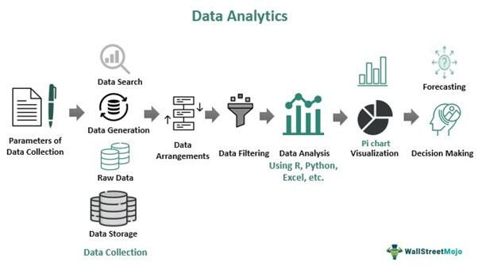

In the ever-evolving landscape of financial services technology, SunGard Data Systems stands out as a prominent player with its vast array of services and solutions. Acquired by Fidelity National Information Services (FIS) in 2015, SunGard has a long history of driving innovation in software and IT services across various sectors, including financial services, higher education, and the public sector. 

Founded as a spin-off of the Sun Oil Company in 1982, SunGard quickly made a mark in the technological domain by going public in 1986. Its dedication to enhancing financial technology became more pronounced with its 2005 leveraged buyout, which focused the company's efforts on developing more specialized IT services. The acquisition by FIS in 2015 further amplified SunGard’s reach and capabilities within the IT services sector, allowing it to expand its innovative solutions and services.

In algorithmic trading, SunGard's contribution has been significant. Algorithmic trading, which involves the processing and analysis of large volumes of data in real-time for automated trade execution, has seen tremendous enhancement through SunGard's development of robust trading systems. These systems excel in market data capture and order routing performance, providing traders with the agility required in high-frequency trading environments. Key products such as GL Stream and GL Tactics exemplify SunGard’s proficiency in delivering high-frequency and algorithmic trading solutions.

A notable aspect of SunGard's technological innovation is its integration with QuantHouse data feeds. This strategic collaboration offers customers ultra-low latency market data, which is essential in high-stakes trading scenarios where every millisecond counts. The partnership with QuantHouse enhances the resilience, performance, and flexibility of SunGard's data systems, thereby providing clients the ability to select optimal market data solutions tailored to their specific trading needs.

SunGard's commitment to innovation is further reflected in its initiatives like global hackathons that stimulate creativity and the development of novel tools. Such initiatives not only enhance employee engagement but also translate into practical enhancements and innovative offerings for SunGard's clients.

As the financial services technology space continues to transform, SunGard Data Systems remains at the forefront of providing advanced algorithmic trading systems empowered by state-of-the-art data systems technology. Through its integration with QuantHouse and continued focus on innovation, SunGard solidifies its role as a key influencer in the arena of high-frequency trading solutions. With the ever-increasing sophistication of algorithmic trading, SunGard’s adaptive and novel solutions ensure its position as a critical player in the industry.

## Table of Contents

## The Evolution of SunGard Data Systems

SunGard Data Systems originated as a spin-off from the Sun Oil Company in 1982, marking its entry into the burgeoning technology sector. The company's inception was driven by the need to create an independent entity focused on developing software solutions and IT services, laying the foundation for what would become a significant force in the industry. By 1986, SunGard had successfully navigated the complexities of the technology landscape and went public, a move that provided the necessary capital to expand and innovate further.

In 2005, SunGard underwent a transformative phase when it was involved in one of the largest leveraged buyouts at the time. This buyout, valued at approximately $11.3 billion, was orchestrated by a consortium of private equity firms, including Silver Lake Partners, TPG Capital, Bain Capital, and others. This strategic privatization was aimed at restructuring SunGard to enhance its competitive edge and enable a more agile response to the rapidly changing demands of the IT services market. As a private entity, SunGard focused on expanding its suite of services and fortifying its presence across various sectors, including financial services, education, and the public sector.

The pivotal moment in SunGard's history came in 2015 when it was acquired by Fidelity National Information Services (FIS) for $9.1 billion. This acquisition was a strategic move by FIS to bolster its capabilities as a provider of financial services technology, by leveraging SunGard's extensive portfolio of solutions and its established customer base. The integration of SunGard into FIS allowed the combined company to enhance its service offerings, particularly in the areas of payment processing, financial software, and risk management systems. With this merger, SunGard's strengths in financial systems and IT solutions were complemented by FIS's expansive resources and global reach, consolidating its status in the IT services sector.

## SunGard's Impact on Algo Trading

Algorithmic trading, often referred to as algo trading, significantly benefits from the capabilities offered by SunGard's advanced systems. These systems are designed to manage and analyze extensive datasets in real-time, optimizing both the speed and accuracy of trading operations. SunGard has established itself as a key contributor to the field, leveraging its technological solutions to enhance both market data capture and order routing efficiency.

A cornerstone of SunGard's offerings in this area includes products like GL Stream and GL Tactics. These solutions are specifically engineered for high-frequency trading environments where split-second decisions are crucial. GL Stream facilitates the rapid intake and processing of market data, ensuring that traders have access to the most up-to-date information required to execute trades accurately. This product's ability to handle high volumes of data without compromising on speed is crucial for minimizing latency, which can significantly impact trading outcomes.

In conjunction with GL Stream, GL Tactics provides sophisticated tools for developing and deploying trading strategies. This platform allows traders to create algorithmic strategies that can automatically process market data and execute trades based on predefined criteria. The efficiency of GL Tactics lies in its ability to swiftly route orders to optimal venues, a task made increasingly complex by the fragmented nature of modern financial markets.

Together, these systems leverage cutting-edge technology to not only improve trade execution but also to enable real-time analysis and decision-making. This is vital in the fast-paced environment of [algorithmic trading](/wiki/algorithmic-trading), where timely access to information can be the difference between profit and loss. SunGard's impact is thus measured by how its systems empower traders with the tools necessary to navigate complex market conditions with greater precision and agility.

## Integration with QuantHouse Data Feeds

SunGard's integration with QuantHouse significantly bolsters its capabilities in delivering high-frequency trading solutions. By providing ultra-low latency market data, this partnership is instrumental for traders operating in high-stakes environments where split-second decisions are crucial. The synergy between SunGard and QuantHouse allows for precise and swift data processing, a necessity for algorithmic trading strategies that require real-time market data analysis.

QuantHouse is renowned for its API-driven market data solutions which facilitate optimal data delivery and integration. This complements SunGard's existing technologies, enhancing resilience and performance in data feed provision. The collaboration enables clients to subscribe to data feeds tailored to their specific requirements, thus ensuring access to the most relevant market information at blazing speeds. 

The ultra-low latency achieved through this partnership is pivotal for minimizing slippage and maximizing execution quality. In algorithmic trading, latency often determines the success of a trade, as even microseconds of delay can lead to significant opportunity costs. By leveraging QuantHouse's advanced infrastructure, SunGard can offer latency reductions that significantly improve the efficiency and effectiveness of trading algorithms.

The partnership also brings a new level of flexibility to SunGard's offerings. Clients can choose from a variety of data feed customization options, allowing them to align their feeds with proprietary trading strategies. The ability to filter and process data in real-time, without compromising on speed, adds a competitive edge to traders leveraging SunGard’s integrated solutions.

In conclusion, the integration with QuantHouse positions SunGard as a leader in delivering high-performance data feeds critical for modern trading operations, characterized by their ability to adapt and meet the evolving demands of global financial markets.

## The Role of Innovation at SunGard

SunGard Data Systems has consistently prioritized innovation, recognizing its importance in maintaining a competitive edge within the technology and financial services sectors. One prominent example of this commitment is the organization of global hackathons. These events are designed to harness the creativity and technical acumen of SunGard's employees, providing them with a platform to develop new tools and solutions that address existing challenges.

Global hackathons serve multiple purposes: they boost employee morale, stimulate idea generation, and encourage collaboration across different departments. By bringing together diverse teams from various geographical regions, these events foster a culture of inclusivity and innovation. Participants are often tasked with solving complex problems under constrained time conditions, which promotes ingenuity and creative problem-solving skills.

The tangible outcomes of these hackathons are evident in the innovative solutions that emerge, which can be directly implemented to enhance SunGard's product offerings or improve internal processes. For instance, projects developed during hackathons have led to the creation of new algorithms that optimize transaction speed and accuracy in algo trading systems, thereby providing clients with a competitive advantage in financial markets.

Moreover, SunGard's hackathons are not limited to the development of software tools; they also explore enhancements in user interface design, data analytics, and system architecture. This breadth of focus ensures that the benefits of innovation are widespread, impacting various facets of the company's operations and service delivery.

By continuously engaging employees in these collaborative and dynamic events, SunGard not only reinforces its commitment to innovation but also cultivates an environment where creative ideas can flourish. This strategic approach helps maintain SunGard's leadership position within the industry, demonstrating the power of innovation-driven growth and development.

## Conclusion

SunGard Data Systems has maintained its leadership in the financial services technology sector through the provision of sophisticated algorithmic trading systems. These systems are underpinned by advanced data systems technology that ensures optimal performance and reliability. The integration with QuantHouse significantly enhances SunGard's offerings by providing ultra-low latency market data feed solutions, which are critical for the success of high-frequency trading activities. This collaboration not only augments the performance but also increases the flexibility of their solutions, allowing clients to tailor data feeds to their specific requirements.

The commitment to continuous innovation, coupled with strategic partnerships, reinforces SunGard's influential role in high-frequency trading solutions. As the landscape of algorithmic trading continues to evolve, the company's adaptability and technological advancements ensure its status as a critical component in the industry. By fostering a culture of innovation and leveraging technological advancements, SunGard is poised to continue shaping the future of algo trading.

## References & Further Reading

[1]: ["Quantitative Trading: How to Build Your Own Algorithmic Trading Business"](https://www.amazon.com/Quantitative-Trading-Build-Algorithmic-Business/dp/1119800064) by Ernest P. Chan

[2]: ["Advances in Financial Machine Learning"](https://www.amazon.com/Advances-Financial-Machine-Learning-Marcos/dp/1119482089) by Marcos Lopez de Prado

[3]: ["Machine Learning for Algorithmic Trading"](https://github.com/stefan-jansen/machine-learning-for-trading) by Stefan Jansen

[4]: ["Evidence-Based Technical Analysis: Applying the Scientific Method and Statistical Inference to Trading Signals"](https://www.amazon.com/Evidence-Based-Technical-Analysis-Scientific-Statistical/dp/0470008741) by David Aronson

[5]: Brynjolfsson, E., & McAfee, A. (2014). ["The Second Machine Age: Work, Progress, and Prosperity in a Time of Brilliant Technologies"](https://psycnet.apa.org/record/2014-07087-000). W.W. Norton & Company. 

[6]: Goodfellow, I., Bengio, Y., & Courville, A. (2016). ["Deep Learning"](https://www.deeplearningbook.org/). MIT Press.

[7]: Aldridge, I. (2013). ["High-Frequency Trading: A Practical Guide to Algorithmic Strategies and Trading Systems,"](https://www.amazon.com/High-Frequency-Trading-Practical-Algorithmic-Strategies/dp/1118343506) 2nd Edition, Wiley.