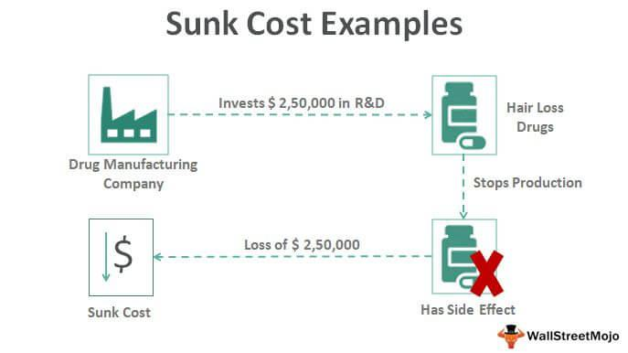

Algorithmic trading combines finance and advanced computing to transform how financial markets operate. By utilizing algorithms to execute trades with high speed and minimal human intervention, it aims to maximize efficiency and profit. Despite its automation, algorithmic trading is not immune to human biases that can influence decision-making processes. One significant bias impacting traders is the sunk cost dilemma. This psychological phenomenon involves the urge to continue an endeavor due to the resources already committed, despite potential losses or setbacks.

Traders worldwide struggle with the sunk cost dilemma, often finding it difficult to abandon losing positions due to prior investments in time and capital. This challenge is particularly pronounced in algorithmic trading, where human oversight or poor algorithm design can perpetuate suboptimal decisions based on past expenditures rather than future potential.



Understanding the sunk cost dilemma is vital for making rational trading decisions, as it helps prevent emotional attachments from dictating financial strategies. This article explores how the sunk cost dilemma influences algorithmic trading and provides strategies to mitigate its impact, helping traders refine their strategies for more profitable outcomes. Recognizing and addressing this bias is crucial for maintaining an objective and forward-looking approach in the fast-paced world of algorithmic trading.

## Table of Contents

## What is the Sunk Cost Dilemma?

The sunk cost dilemma arises when individuals face the challenge of deciding whether to persist in a project or investment despite lacking desired outcomes after significant resources and time have been committed. In essence, it reflects the emotional struggle tied to the reluctance in abandoning previous investments, which can obscure rational decision-making processes.

In trading, the sunk cost dilemma frequently manifests as investors hold onto losing positions, driven by the hope that their previous costs necessitate a recovery effort. This attachment to past investments leads traders to fall into the sunk cost fallacy, whereby they irrationally prioritize recovering past losses over making decisions based on present and future market conditions. An investor might unjustifiably retain a depreciating stock, convincing themselves that additional time or capital will eventually turn the tides in their favor.

From an economic perspective, sunk costs are irrelevant for decision-making. Economic theory prescribes that only marginal costs and benefits—prospective costs that can influence current decisions—should guide future actions. Sunk costs, by definition, are expenditures that cannot be recovered or altered by any present or future decisions. For example, if an investor has already spent $10,000 on a stock that has depreciated significantly, this $10,000 should not influence future trading decisions since it cannot be recovered.

However, psychological influences often override this economic rationale, and the emotional burden of acknowledging a loss can lead traders to allocate additional resources in pursuit of regaining sunk costs. This behavior not only defies economic logic but can lead to inefficient trading practices and detrimental financial outcomes.

Thus, the sunk cost dilemma represents a significant psychological barrier in trading, necessitating strategies to mitigate its influence and promote more rational investment decisions. By understanding and addressing this dilemma, traders can enhance their performance and develop strategies that emphasize forward-looking decision-making, unencumbered by past investments.

## Impact of Sunk Cost Dilemma on Algo Trading

Algorithmic trading is celebrated for its reliance on data-driven and impartial decisions, but the presence of the sunk cost dilemma poses a significant challenge. This bias infiltrates algorithms through human influence in their design and operational feedback loops. Misaligned trading algorithms, which fail to account for sunk costs, can perpetuate inefficient resource allocation and maintain losing positions, akin to human traders' tendencies.

The sunk cost bias may manifest in algorithms when past investments or losses unduly influence future decisions. For instance, a trading algorithm may continue to execute trades based on outdated strategies simply because considerable time and resources were previously invested in developing them. This adherence can lead to continuous losses instead of transitioning to more profitable strategies. 

To illustrate, consider a scenario where an algorithm maintains a position in a depreciating asset, ignoring new market data, due to previous significant investments. Rather than reallocating to emerging opportunities, the algorithm is stuck in a cycle of unprofitable trades, an embodiment of how sunk cost bias affects decisions. The persistence in maintaining such a position results in resource inefficiency, diverting capital and computational resources from potentially gainful ventures.

Understanding the impact of sunk cost bias in algorithms is vital for maintaining profitability. It requires constant scrutiny of the decision-making models that underpin trading strategies. This involves ensuring that algorithms prioritize real-time data and current market analysis over historical investments.

The adaptation of trading strategies through continual algorithmic updates can mitigate the bias. Traders must emphasize dynamic decision-making models that are reformulated based on real-time feedback rather than past performance. This approach ensures that trading activities remain aligned with current market conditions, optimizing resource allocation and maximizing potential returns. 

Thus, acknowledging and rectifying sunk cost bias in [algorithmic trading](/wiki/algorithmic-trading) is an essential step toward sustaining a successful trading operation. This requires a strategic framework that prioritizes adaptive algorithms capable of evolving in response to market dynamics, ensuring decisions are always grounded in present and future assessments rather than past commitments.

## Sunk Costs and Rational Decision-Making

Rational decision-making in trading hinges on evaluating the future prospects of an investment without being swayed by past expenditures that cannot be recovered. The essence of rational judgment is to separate emotions from decision-making processes, ensuring that investments are based on objective assessments of potential benefits and costs. 

Sunk costs, by definition, are irretrievable past expenses. In trading, these might include investments of time, money, or resources that have already been made into a position. Despite their irrevocable nature, sunk costs often cloud judgment, provoking a psychological tendency known as the sunk cost fallacy. This fallacy occurs when individuals allow non-recoverable past investments to influence their current decision-making process, thus hampering sound financial judgments.

To mitigate the influence of sunk cost bias, it is vital for traders to employ objective evaluation techniques. These methods should focus exclusively on the present and prospective value of an asset, disregarding past losses or commitments. One effective way to accomplish this is through the application of decision-making frameworks like the Expected Value (EV) model. The EV of an investment can be calculated using the formula:

$$
\text{EV}(x) = \sum_{i=1}^{n} p_i \times v_i
$$

where $p_i$ represents the probability of outcome $i$, and $v_i$ denotes the monetary value of that outcome. By calculating the expected value of different investment options, traders can objectively assess where their resources would be most efficiently allocated without the interference of previous investments.

Python can be used to programmatically evaluate expected values and assist in rational decision-making. Here is a basic example:

```python
def expected_value(probabilities, values):
    return sum(p * v for p, v in zip(probabilities, values))

# Example probabilities and values
probabilities = [0.2, 0.3, 0.5]
values = [10000, 15000, -5000]

ev = expected_value(probabilities, values)
print(f"The expected value of the investment is: {ev}")
```

This script evaluates the expected value based on a list of probabilities and corresponding values, facilitating an objective decision-making process. By focusing on forward-looking analyses and incorporating objective criteria, traders can enhance their ability to make sound investment decisions that are free from the detrimental effects of sunk costs.

## Examples of Sunk Cost Influence in Trading

Successful traders often demonstrate a profound understanding of market dynamics, allowing them to adapt quickly to changes and disregard losses stemming from sunk costs. These traders focus on future opportunities rather than being anchored by past investments. By implementing strategies such as dynamic portfolio adjustment and real-time analytics, they manage to enhance profitability while minimizing emotional bias.

Conversely, other traders may fall victim to the sunk cost fallacy, where they persist in unprofitable strategies due to previous investments. For example, some traders continue to hold declining stocks despite clear market indicators suggesting a sell-off. This adherence to sunk costs can result in continued financial losses, as these traders rely heavily on the initial investment rather than analyzing current market data.

Analyzing case studies of these behaviors provides invaluable insights into overcoming emotional decision-making influenced by sunk costs. For instance, a study of traders during the 2008 financial crisis revealed two distinct behaviors: those who clung to real estate investments despite declining prices suffered more substantial losses than those who reallocated their resources to more promising sectors. Traders who cut their losses early and moved to emerging markets or defensive stocks generally fared better.

To mitigate the effects of sunk costs, successful traders employ robust decision-making frameworks. Techniques such as back-testing, where strategies are tested against historical data, and the use of predictive analytics to foresee potential market shifts, help in forming a strategy based on data rather than emotions. Machine learning models can further support this approach by identifying patterns that humans might overlook, ensuring trading decisions remain influenced by potential future gains rather than past losses. 

By adopting such objective evaluation techniques, traders can avoid the trap of sunk costs, leading to more rational and potentially profitable investment decisions.

## Strategies to Overcome the Sunk Cost Dilemma

Implementing effective strategies to mitigate the sunk cost dilemma in algorithmic trading is essential for enhancing decision-making and optimizing trading performance. Several strategies can be employed to address this bias effectively.

Stop-loss orders are a crucial tool in risk management, enabling traders to set predetermined price levels to automatically sell an asset, thereby limiting potential losses. By employing stop-loss orders, traders can prevent emotional entanglement with failing investments, ensuring that decisions are made based on logic rather than psychological attachment to past investments. This mechanical approach facilitates more disciplined trading, effectively managing risk and curtailing the influence of sunk costs.

Regular reviews and updates of trading algorithms are critical to ensure that the decisions are driven by real-time data and current market conditions rather than outdated or irrelevant past investments. This involves incorporating feedback loops and performance evaluations into trading systems. Continuous monitoring helps identify inefficiencies and biases, allowing for timely adjustments to optimize algorithm outputs. For instance, integrating a routine algorithm review schedule can ensure that strategies remain aligned with prevailing market dynamics, mitigating the influence of sunk costs in decision-making.

Incorporating [machine learning](/wiki/machine-learning) models into trading strategies offers a dynamic approach to countering the sunk cost dilemma. Machine learning algorithms can identify and adapt to changing market conditions, learning from a vast dataset to predict future trends and behaviors. By relying on data-driven insights, traders can make more informed decisions, minimizing emotional biases associated with sunk costs. Models such as [reinforcement learning](/wiki/reinforcement-learning) and supervised learning can be utilized to enhance predictive accuracy and adapt strategies proactively.

Through the application of these strategies, traders can effectively navigate the challenges posed by the sunk cost dilemma, fostering a rational and forward-looking approach to trading.

## Conclusion

The sunk cost dilemma presents an ongoing challenge in algorithmic trading, yet it can be effectively addressed with intentional and strategic interventions. Recognizing how sunk costs distort decision-making is the first critical step toward mitigating their influence. By reframing psychological predispositions toward past investments, traders can shift their focus to future potentials and embrace adaptability in their trading strategies. 

Implementing strategies such as regular algorithm reviews, integrating machine learning models, and setting stop-loss orders empowers traders to remain forward-looking. These measures enable a data-driven approach that prioritizes current market conditions and future gains over previous investments. As algorithmic trading continues to evolve, maintaining this forward-focused perspective is essential to enhancing decision-making quality and maximizing trading profits.

By cultivating an awareness of the sunk cost fallacy and employing strategic tools, traders can substantially improve their performance, making algorithmic trading more objective and efficient. Thus, success in algorithmic trading effectively hinges on an unwavering commitment to assessing prospective benefits rather than dwelling on past expenditures.

## References & Further Reading

[1]: Thaler, R. H. (1980). ["Toward a positive theory of consumer choice."](https://www.sciencedirect.com/science/article/pii/0167268180900517) Journal of Economic Behavior & Organization, 1(1), 39-60.

[2]: Arkes, H. R., & Blumer, C. (1985). ["The Psychology of Sunk Cost."](https://psycnet.apa.org/record/1985-20101-001) Organizational Behavior and Human Decision Processes, 35(1), 124-140.

[3]: Statman, M., & Caldwell, D. (1987). ["Applying Behavioral Finance to Trading and Investment."](https://www.semanticscholar.org/paper/Applying-Behavioral-Finance-to-Capital-Budgeting%3A-Statman-Caldwell/0cffd711c19bd1d744388f4f74465bce0d914bbc) CFA Institute.

[4]: Barberis, N., & Thaler, R. (2003). ["A survey of behavioral finance."](https://www.semanticscholar.org/paper/A-Survey-of-Behavioral-Finance-Barberis-Thaler/a4ab7d7161deac0f532d121b1614cf7b97d90e78) Handbook of the Economics of Finance, 1, 1053-1128.

[5]: Hilpisch, Y. (2018). ["Python for Finance: Mastering Data-Driven Finance."](https://books.google.com/books/about/Python_for_Finance.html?id=2qd9DwAAQBAJ) Wiley.

[6]: Kahneman, D., & Tversky, A. (1979). ["Prospect Theory: An Analysis of Decision under Risk."](https://www.jstor.org/stable/1914185) Econometrica, 47(2), 263-291.

[7]: Baker, H. K., & Ricciardi, V. (2014). ["How Biases Affect Investor Behaviour."](https://www.researchgate.net/publication/280087380_How_Biases_Affect_Investor_Behaviour) Financial Analysts Journal, 70(1), 1-13.