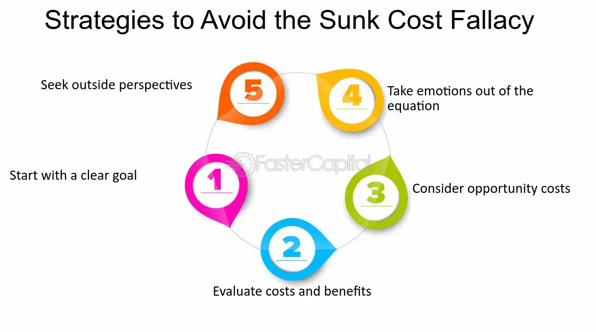

## Table of Contents

## What is the sunk cost fallacy?

The sunk cost fallacy is when people keep doing something because they've already spent time, money, or effort on it, even if it's not working out. They think they need to keep going to not waste what they've already put in. But really, those costs are gone and can't be recovered, so it's better to make choices based on what will happen in the future, not what's already happened.

For example, imagine you bought a ticket to a concert, but on the day of the event, you're feeling sick. You might go to the concert anyway because you don't want the ticket money to go to waste. But if you're sick, it's probably better to stay home and rest, even though you can't get your money back. The money spent on the ticket is a sunk cost, and it shouldn't affect your decision to go or not.

## Can you provide an example of the sunk cost fallacy in everyday life?

Imagine you're watching a movie at home that you rented for the weekend. Halfway through, you realize you're not enjoying it at all. But you keep watching because you paid for the rental and feel like you should get your money's worth. This is the sunk cost fallacy at work. The money you spent on the movie is already gone, and you can't get it back. It would be better to stop watching and do something else you enjoy, but the feeling of not wanting to waste the money keeps you glued to the screen.

Another common example is sticking with a gym membership you're not using. You signed up for a year-long contract, but after a few months, you find you're not going as often as you planned. Instead of canceling and losing the money you've already paid, you keep the membership, hoping you'll start using it more. But the money you've spent so far is a sunk cost. It's gone, and it shouldn't affect your decision to cancel or not. If you're not using the gym, it might be better to cut your losses and find a different way to stay active that you'll actually enjoy.

## Why do people fall into the sunk cost fallacy?

People fall into the sunk cost fallacy because they don't want to feel like they wasted their time, money, or effort. It's hard to let go of something you've invested in, even if it's not working out. We want to believe that if we keep going, we'll eventually see the payoff we were hoping for. This hope can make us ignore the fact that what we've already spent is gone and can't be recovered.

Another reason is that we often feel like giving up means admitting failure. No one likes to fail, so we keep going to avoid that feeling, even if it's not the best choice. Our emotions and the way we think about past investments can trick us into making decisions that aren't in our best interest. Understanding this can help us make better choices and move forward without being held back by what's already happened.

## How does the sunk cost fallacy affect decision-making?

The sunk cost fallacy makes people make bad choices because they focus on what they've already spent instead of what will happen next. When you've put time, money, or effort into something, it's hard to stop, even if it's not working out. You might keep going because you don't want to feel like you wasted your investment. But what you've already spent is gone and can't be brought back. So, it's better to look at what will happen in the future and make choices based on that, not on what's already happened.

For example, if you keep putting money into a failing business just because you've already invested a lot, that's the sunk cost fallacy at work. The money you've spent is gone, and it shouldn't affect your decision about whether to keep going or not. If the business isn't doing well, it might be smarter to stop and try something else. But the fear of losing what you've already put in can make you ignore the signs that it's time to move on. Understanding this can help you make better decisions and not let past costs hold you back.

## What are the psychological factors contributing to the sunk cost fallacy?

One big reason people fall into the sunk cost fallacy is because they don't want to feel like they've wasted their time, money, or effort. It's hard to let go of something you've invested in, even if it's not working out. We want to believe that if we keep going, we'll eventually see the payoff we were hoping for. This hope can make us ignore the fact that what we've already spent is gone and can't be recovered. Our emotions can trick us into thinking that if we stop now, we've failed, and no one likes to feel like a failure.

Another reason is how we think about our past investments. We often see them as part of who we are and what we've done. Giving up on something can feel like giving up a part of ourselves. This makes it even harder to walk away, even when it's the smart thing to do. Our brains are also wired to avoid loss, so the idea of losing what we've already put in can be more painful than the potential gain from moving on. Understanding these psychological factors can help us make better decisions and not let past costs hold us back.

## What are some common scenarios where the sunk cost fallacy is likely to occur?

One common scenario where the sunk cost fallacy happens is in relationships. Imagine you've been dating someone for a long time, but you're not happy anymore. You might stay in the relationship because you've already spent so much time with this person. You think about all the memories and effort you've put in, and it feels like a waste to leave. But the time you've spent together is already gone, and it shouldn't stop you from making a choice that's best for your happiness now and in the future.

Another scenario is with projects at work or school. Let's say you've been working on a project for months, but it's not going well. You might keep working on it because you've already put in so much time and effort. It feels like giving up would mean all that work was for nothing. But the time and effort you've spent are sunk costs. They're gone, and they shouldn't affect your decision to keep going or start something new that might be more successful.

## How can one identify when they are falling into the sunk cost fallacy?

One way to tell if you're falling into the sunk cost fallacy is if you keep doing something just because you've already spent time, money, or effort on it. You might feel like you need to keep going to not waste what you've put in, even if it's not working out. For example, if you're in a job you don't like but stay because you've been there for years, you might be letting sunk costs affect your decision.

Another sign is if you feel bad about stopping something because it feels like admitting failure. You might think that if you quit, all the time and effort you spent was for nothing. But remember, what you've already spent is gone, and it shouldn't stop you from making choices that are best for your future. If you find yourself thinking more about what you've already done than what might happen next, you could be falling into the sunk cost fallacy.

## What are effective strategies to avoid the sunk cost fallacy?

One good way to avoid the sunk cost fallacy is to focus on the future instead of the past. When you're making a choice, think about what will happen next, not what you've already spent. Ask yourself if what you're doing is still worth it, no matter how much you've put in before. If the answer is no, it's okay to stop and try something else. This helps you make better decisions based on what's best for you now and moving forward.

Another helpful strategy is to talk to someone else about your situation. Sometimes, it's hard to see the sunk cost fallacy when you're in the middle of it. A friend or family member might see things more clearly and can help you decide what to do. They can remind you that what you've already spent is gone and can't be changed, so you should focus on what will make you happy or successful in the future.

## How does the sunk cost fallacy impact business decisions?

The sunk cost fallacy can really mess up business decisions. Imagine a company that keeps pouring money into a project that's not working out, just because they've already spent a lot on it. They think they need to keep going to not waste the money they've already put in. But that money is gone, and they can't get it back. If they keep going, they might lose even more money. It's better for the company to stop the project and use their resources on something that has a better chance of succeeding.

Another way the sunk cost fallacy affects businesses is when they stick with old ways of doing things just because they've always done it that way. For example, a business might keep using an old machine that's not working well anymore, just because they paid a lot for it years ago. But if a new machine would make things better and cost less in the long run, it's smarter to switch. Businesses need to make choices based on what will help them in the future, not on what they've already spent.

## Can you discuss a case study where the sunk cost fallacy led to significant consequences?

One famous example of the sunk cost fallacy leading to big problems is the Concorde airplane project. Back in the 1960s, the UK and France decided to build a supersonic jet that could fly faster than the speed of sound. They spent a lot of money on it, but soon they found out that the plane was going to be really expensive to build and run. Even though it didn't make sense to keep going, both countries kept putting more money into the project because they had already spent so much. They didn't want to admit that all that money was wasted, so they kept going until the Concorde finally started flying in 1976.

But the Concorde never made any money. It was too expensive to fly, and not enough people wanted to pay the high ticket prices. The plane ended up being a big money-loser for both countries. They could have stopped the project earlier and saved a lot of money, but the sunk cost fallacy made them keep going. In the end, the Concorde was retired in 2003, and it's a classic example of how focusing on what you've already spent can lead to bad decisions and big losses.

## How do different cultures perceive and handle the sunk cost fallacy?

Different cultures can see and deal with the sunk cost fallacy in their own ways. In some cultures, like in Japan, people might feel a strong sense of duty and honor, which can make them keep going with something even if it's not working out. They might not want to let down their team or family by giving up, so they stick with it even if it's a bad choice. In other places, like the United States, people might be more okay with cutting their losses and moving on to something new. They might see stopping as a smart move, not a failure.

But even though cultures can be different, the sunk cost fallacy can still affect people everywhere. No matter where you're from, it's hard to let go of something you've spent a lot of time or money on. Understanding that what's already spent is gone can help people in any culture make better choices. Talking to others and thinking about the future, not the past, are good ways to avoid falling into the sunk cost fallacy, no matter where you live.

## What are advanced techniques for mitigating the sunk cost fallacy in organizational settings?

In organizational settings, one advanced technique to mitigate the sunk cost fallacy is to set up regular review points for projects. This means stopping at certain times to look at how things are going and deciding if it's still a good idea to keep going. By doing this, teams can focus on the future and make choices based on what will happen next, not on what they've already spent. It helps them see if a project is still worth it or if they should stop and try something else. This can be done by having clear goals and checking progress against them regularly.

Another technique is to bring in outside experts or consultants to give a fresh look at the project. Sometimes, people inside the organization can get too close to a project and can't see it clearly. An outsider can point out if the team is falling into the sunk cost fallacy and suggest better ways to move forward. This can help the organization make decisions that are based on what's best for the future, not on what's already happened. It's like getting a second opinion from someone who isn't tied to the past costs.

## What is the impact of the sunk cost fallacy on trading performance?

The sunk cost fallacy can significantly impair trading performance by causing traders to continue allocating resources to losing positions due to prior investments. This cognitive bias results in a misallocation of assets and a resistance to adapt strategies based on changing market conditions.

A notable example of the sunk cost fallacy's impact is the London Whale incident, whereby JPMorgan Chase incurred substantial losses in 2012 due, in part, to decision-makers persisting with failing trading strategies. This incident underscores how prioritizing previous investments over objective analysis of current data can severely harm financial performance.

One of the main consequences of the sunk cost fallacy is the limitation it imposes on [liquidity](/wiki/liquidity-risk-premium). When traders refuse to close losing positions, capital is tied up in underperforming assets. This limits the ability to seize new, potentially profitable trading opportunities, ultimately affecting overall returns. The formula for calculating opportunity cost helps elucidate this concept:

$$
\text{Opportunity Cost} = \text{Return on Next Best Alternative} - \text{Return on Investment}
$$

If the opportunity cost is high, sticking to sunk investments can be a substantial detriment to a trading portfolio's profitability.

To combat this, traders should integrate decision-making processes that focus exclusively on possible future gains rather than sunk costs. Modern trading algorithms can be programmed to evaluate positions based on potential future profitability. This can involve creating criteria that automatically assess the remaining potential of a trade position and trigger sell orders when predefined thresholds are met.

Python programming, a common tool in [algorithmic trading](/wiki/algorithmic-trading), allows for the incorporation of such logic. An example snippet that outlines a basic conditional sell strategy might include:

```python
def evaluate_position(current_value, future_potential):
    if future_potential < current_value:
        execute_trade('sell')

def execute_trade(action):
    if action == 'sell':
        print("Executing sell order")
    else:
        print("No action taken")

# Example Usage
current_trade_value = 100
expected_future_value = 90

evaluate_position(current_trade_value, expected_future_value)
```

By utilizing algorithms that continuously reevaluate trades based on this kind of forward-looking analysis, traders can minimize the negative impacts of the sunk cost fallacy on their decision-making and trading outcomes.

## References & Further Reading

[1]: Kahneman, D. (2011). ["Thinking, Fast and Slow."](https://link.springer.com/article/10.1007/s00362-013-0533-y) Farrar, Straus and Giroux.

[2]: Thaler, R. H. (2015). ["Misbehaving: The Making of Behavioral Economics."](https://psycnet.apa.org/record/2015-22902-000) W. W. Norton & Company.

[3]: Ariely, D. (2008). ["Predictably Irrational: The Hidden Forces That Shape Our Decisions."](https://en.wikipedia.org/wiki/Predictably_Irrational) Harper Perennial.

[4]: Chan, E. (2013). ["Algorithmic Trading: Winning Strategies and Their Rationale."](https://github.com/ftvision/quant_trading_echan_book) Wiley.

[5]: Lopez de Prado, M. (2018). ["Advances in Financial Machine Learning."](https://www.amazon.com/Advances-Financial-Machine-Learning-Marcos/dp/1119482089) Wiley.