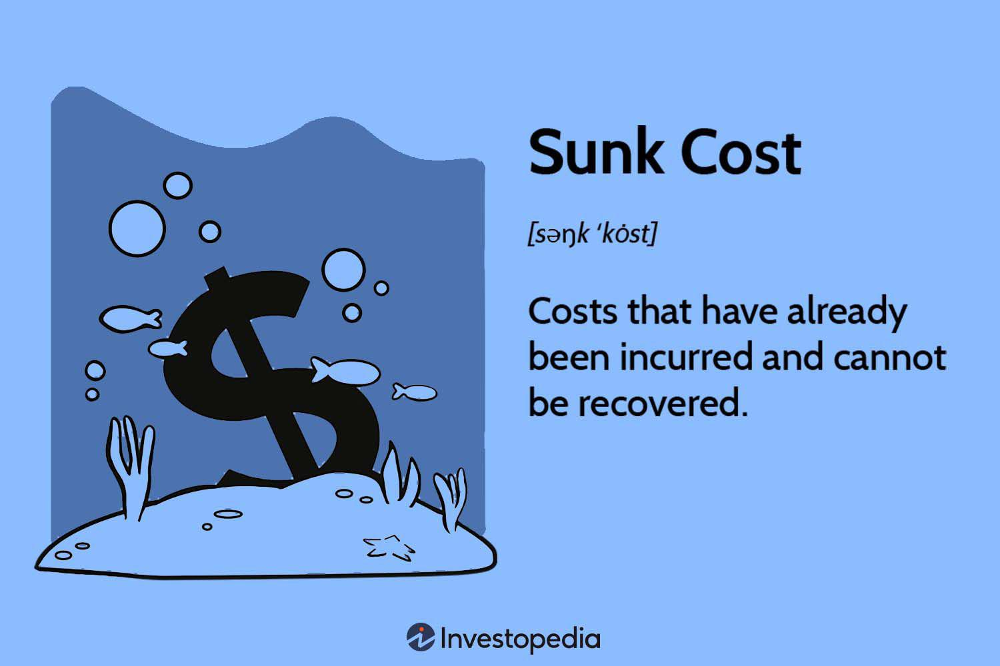

The sunk cost fallacy is a well-documented cognitive bias influencing decision-making by compelling individuals to factor in irrecoverable past investments over prospective advantages. Originating from the field of behavioral economics, the fallacy plays a role in numerous everyday scenarios. Whether it's persisting with an investment or refusing to abandon an endeavor despite evidence of potential future losses, the sunk cost fallacy challenges rational evaluation.

This article investigates the manifestation of the sunk cost fallacy within algorithmic trading. Although algorithmic trading is inherently data-driven and ostensibly objective, it remains susceptible to human cognitive biases. By gaining insights into how these biases manifest, both developers and traders can significantly improve the efficacy and rationality of their trading strategies.



Throughout the article, we will examine various strategies to mitigate the effect of the sunk cost fallacy on trading algorithms, offering both theoretical foundations and practical applications to enhance decision-making processes. Implementing these strategies requires blending insights from behavioral economics with modern technological advancements. Such integration is not merely academic; it stands as a crucial aspect of optimizing trading outcomes by reinforcing disciplines grounded in rationality.

Advancements in technology and data analytics provide powerful tools for circumventing cognitive biases. However, the effectiveness of these tools is contingent upon a comprehensive understanding of the psychological underpinnings driving bias. By examining the interplay between cognitive biases and algorithmic trading, we aim to equip traders and developers with knowledge and solutions that foster improved, unbiased trading performance.

## Table of Contents

## Understanding Sunk Cost Fallacy

The sunk cost fallacy represents a cognitive bias where individuals persist in an activity based on previously invested resources—time, money, or effort—despite evidence indicating that the costs of continuing exceed the benefits. This behavior is illuminated within the scope of behavioral economics, a discipline examining how psychological factors affect economic decisions, often diverging from rational choice theory.

One frequently cited example is the reluctance to stop watching a movie one finds unenjoyable simply because they have already watched most of it. Similarly, businesses might persist with failing projects due to the substantial resources already committed, ignoring current data suggesting a strategic pivot or project abandonment might be more beneficial. These scenarios underscore the irrational weighting of past costs over objective assessment of future outcomes.

The susceptibility to the sunk cost fallacy is primarily driven by two psychological factors: loss aversion and commitment. Loss aversion, a concept developed by Daniel Kahneman and Amos Tversky, explains that individuals feel the pain of losses more intensely than the pleasure of equivalent gains. This leads to decision-making that seeks to avoid perceived losses, in this case, the loss of previously invested resources. Commitment, on the other hand, reflects an individual's inclination to remain consistent with past actions, driven by a desire to validate earlier decisions and maintain a positive self-image.

Understanding these psychological factors is essential for counteracting the sunk cost fallacy in decision-making processes. Recognizing loss aversion allows individuals to recalibrate their judgment by consciously evaluating decisions based on objective risk-reward analyses rather than emotional attachment to past investments. Similarly, awareness of commitment biases encourages individuals to question the rationale behind their consistency, promoting flexibility and adaptability to new information.

By comprehending the foundation and influence of the sunk cost fallacy, individuals and organizations can better navigate decision-making landscapes, enhanced by a rational focus on future potential rather than historical expenditure. This understanding not only optimizes resource allocation but also mitigates the emotional influence that often leads to inefficient outcomes.

## Cognitive Bias in Algorithmic Trading

Algorithmic trading involves the use of computer algorithms to automate trading decisions, relying heavily on data analysis to optimize performance. Despite its data-driven nature, [algorithmic trading](/wiki/algorithmic-trading) can still be influenced by cognitive biases, one of which is the sunk cost fallacy. This bias occurs when traders continue investing in trades based on prior expenditures rather than evaluating potential future outcomes, which can lead to suboptimal decision-making.

The sunk cost fallacy manifests in algorithmic trading when algorithms, programmed with biases or subjected to human oversight, maintain positions or trade patterns that are no longer beneficial simply because significant resources have already been invested. This tendency is contrary to the fundamental economic principle that decision-making should be guided by prospective outcomes rather than historical costs.

To address this cognitive bias, it is crucial to understand how psychological factors impact financial decisions, even in a seemingly objective field like algorithmic trading. The field of behavioral economics provides insights into how cognitive biases function and influence decision-making processes. By integrating these insights into the design of trading algorithms, developers can create systems that reduce the influence of biases like the sunk cost fallacy.

For instance, algorithms can be programmed to reassess positions based solely on future profitability metrics rather than prior investments. This can be achieved by incorporating rules that automatically liquidate positions when certain risk or return thresholds are breached, effectively preventing an algorithm from stubbornly holding onto losing trades due to previous expenditures. In Python, a simple implementation to incorporate such a rule could look like this:

```python
def evaluate_position(current_value, threshold):
    if current_value < threshold:
        return "Sell"
    else:
        return "Hold"

# Example usage:
current_trade_value = 95
threshold_value = 100
decision = evaluate_position(current_trade_value, threshold_value)
print(decision)  # Outputs: Sell
```

By acknowledging the impact of cognitive biases and incorporating safeguards against them, traders and developers can improve the decision-making processes in algorithmic trading. This not only minimizes potential losses but also enhances overall trading performance by making strategies more rational and forward-looking, instead of being anchored by irrelevant past investments.

## The Impact of Sunk Cost Fallacy on Trading Performance

The sunk cost fallacy can significantly impair trading performance by causing traders to continue allocating resources to losing positions due to prior investments. This cognitive bias results in a misallocation of assets and a resistance to adapt strategies based on changing market conditions.

A notable example of the sunk cost fallacy's impact is the London Whale incident, whereby JPMorgan Chase incurred substantial losses in 2012 due, in part, to decision-makers persisting with failing trading strategies. This incident underscores how prioritizing previous investments over objective analysis of current data can severely harm financial performance.

One of the main consequences of the sunk cost fallacy is the limitation it imposes on [liquidity](/wiki/liquidity-risk-premium). When traders refuse to close losing positions, capital is tied up in underperforming assets. This limits the ability to seize new, potentially profitable trading opportunities, ultimately affecting overall returns. The formula for calculating opportunity cost helps elucidate this concept:

$$
\text{Opportunity Cost} = \text{Return on Next Best Alternative} - \text{Return on Investment}
$$

If the opportunity cost is high, sticking to sunk investments can be a substantial detriment to a trading portfolio's profitability.

To combat this, traders should integrate decision-making processes that focus exclusively on possible future gains rather than sunk costs. Modern trading algorithms can be programmed to evaluate positions based on potential future profitability. This can involve creating criteria that automatically assess the remaining potential of a trade position and trigger sell orders when predefined thresholds are met.

Python programming, a common tool in algorithmic trading, allows for the incorporation of such logic. An example snippet that outlines a basic conditional sell strategy might include:

```python
def evaluate_position(current_value, future_potential):
    if future_potential < current_value:
        execute_trade('sell')

def execute_trade(action):
    if action == 'sell':
        print("Executing sell order")
    else:
        print("No action taken")

# Example Usage
current_trade_value = 100
expected_future_value = 90

evaluate_position(current_trade_value, expected_future_value)
```

By utilizing algorithms that continuously reevaluate trades based on this kind of forward-looking analysis, traders can minimize the negative impacts of the sunk cost fallacy on their decision-making and trading outcomes.

## Mitigating Sunk Cost Fallacy in Trading Algorithms

Mitigating the sunk cost fallacy in trading algorithms requires a blend of financial discipline and sophisticated data analysis techniques. The implementation of robust strategies, such as stop-loss orders and automatic [exit](/wiki/exit-strategy) points, plays a crucial role in reducing emotional interference in trading decisions. These tools allow traders to set predefined thresholds for exiting a trade, thus ensuring that decisions are based on objective criteria rather than emotional attachment to past investments. For instance, a stop-loss order automatically triggers a sale of an asset once its price falls below a certain level, preventing the trader from holding onto loss-making positions.

Backtesting is another vital strategy that enables traders to refine and validate their algorithms. By simulating trades with historical data, traders can evaluate the viability of their strategies and identify patterns that may lead to suboptimal decisions. This retrospective analysis helps in assessing the impact of various cognitive biases, including the sunk cost fallacy, on trading outcomes. The ability to test different scenarios enhances the algorithm's adaptability to changing market conditions.

Additionally, [machine learning](/wiki/machine-learning) algorithms can be employed to minimize human bias in trading strategies. These algorithms can learn from vast datasets to identify complex patterns and predict market movements with greater accuracy. By continuously updating their models based on new data, machine learning systems can adapt autonomously, reducing the influence of biases such as the sunk cost fallacy. A simple implementation in Python could involve using a library like scikit-learn to develop a predictive model:

```python
from sklearn.ensemble import RandomForestRegressor
from sklearn.model_selection import train_test_split

# Example dataset containing historical trading data
X = dataset.drop('target', axis=1)  # Features
y = dataset['target']  # Target variable

# Split data into training and test sets
X_train, X_test, y_train, y_test = train_test_split(X, y, test_size=0.3, random_state=42)

# Initialize and train the model
model = RandomForestRegressor(n_estimators=100, random_state=42)
model.fit(X_train, y_train)

# Evaluate the model
predictions = model.predict(X_test)
```

Each approach requires iterative refinement to maintain the effectiveness and neutrality of the algorithms. Regular evaluation and adjustment of these strategies ensure that they remain relevant in dynamic market environments. By incorporating these measures, traders can mitigate the effects of the sunk cost fallacy and enhance decision-making processes, ultimately leading to improved trading performance.

## Conclusion

Recognizing the sunk cost fallacy is vital for traders aiming to enhance decision-making processes by focusing on potential future outcomes rather than dwelling on past investments. The fallacy can lead to suboptimal trading decisions, hindering the overall performance by prioritizing irrecoverable costs. By acknowledging and addressing this bias, traders can shift their focus towards more rational decision-making models that emphasize prospective gains.

Implementing strategies such as automated exit points and machine learning transforms trading algorithms, improving their ability to act based on future potential rather than sunken past costs. Automated exit points, like stop-loss orders, help facilitate objective decision-making by predefining exit conditions. These mechanisms reduce the emotional impact of losing positions, as the execution is prompt and data-driven. By harnessing the power of machine learning, algorithms can learn from past performance data and continuously adapt to changing market conditions, providing sophisticated models that minimize bias.

A balance between data-driven strategies and an understanding of behavioral biases forms the core of successful trading. Algorithmic systems that integrate insights from behavioral economics offer a comprehensive approach to market engagement, aligning technical robustness with psychological awareness. This dual focus allows traders to develop systems resilient to behavioral biases, optimizing decision-making and enhancing return potentials while mitigating risks associated with the sunk cost fallacy.

## Further Reading and Resources

Recommended [books](/wiki/algo-trading-books) and articles provide deeper insights into behavioral economics and its influence on trading practices. Notable works such as "Thinking, Fast and Slow" by Daniel Kahneman offer comprehensive exploration into cognitive biases like the sunk cost fallacy, providing a foundation for understanding how these biases affect financial decisions. Similarly, "Misbehaving: The Making of Behavioral Economics" by Richard H. Thaler and "Predictably Irrational" by Dan Ariely expand on the principles of behavioral economics and its application in financial contexts.

For resources dedicated to algorithmic trading strategies that address cognitive biases, "Algorithmic Trading: Winning Strategies and Their Rationale" by Ernie Chan is a valuable guide. This book outlines a variety of strategies employed in algorithmic trading, with insights into mitigating biases by leveraging quantitative approaches. Another key resource is "Advances in Financial Machine Learning" by Marcos López de Prado, which introduces machine learning techniques to enhance trading algorithms and reduce human intervention.

Online courses and webinars provide accessible platforms for those aiming to enhance their trading techniques and understand the impact of cognitive biases on decision-making. Platforms like Coursera and Udemy offer courses such as "Trading Algorithms" and "Behavioral Finance" that combine theoretical knowledge with practical implementation strategies. Additionally, institutions such as the MIT Sloan School of Management offer webinars and courses on algorithmic trading, providing opportunities to learn from experts in the field and engage with the latest research and methodologies. By leveraging these resources, traders and developers can foster a deeper understanding and more effectively circumvent cognitive biases in their trading endeavors.

## References & Further Reading

[1]: Kahneman, D. (2011). ["Thinking, Fast and Slow."](https://link.springer.com/article/10.1007/s00362-013-0533-y) Farrar, Straus and Giroux.

[2]: Thaler, R. H. (2015). ["Misbehaving: The Making of Behavioral Economics."](https://psycnet.apa.org/record/2015-22902-000) W. W. Norton & Company.

[3]: Ariely, D. (2008). ["Predictably Irrational: The Hidden Forces That Shape Our Decisions."](https://en.wikipedia.org/wiki/Predictably_Irrational) Harper Perennial.

[4]: Chan, E. (2013). ["Algorithmic Trading: Winning Strategies and Their Rationale."](https://github.com/ftvision/quant_trading_echan_book) Wiley.

[5]: Lopez de Prado, M. (2018). ["Advances in Financial Machine Learning."](https://www.amazon.com/Advances-Financial-Machine-Learning-Marcos/dp/1119482089) Wiley.