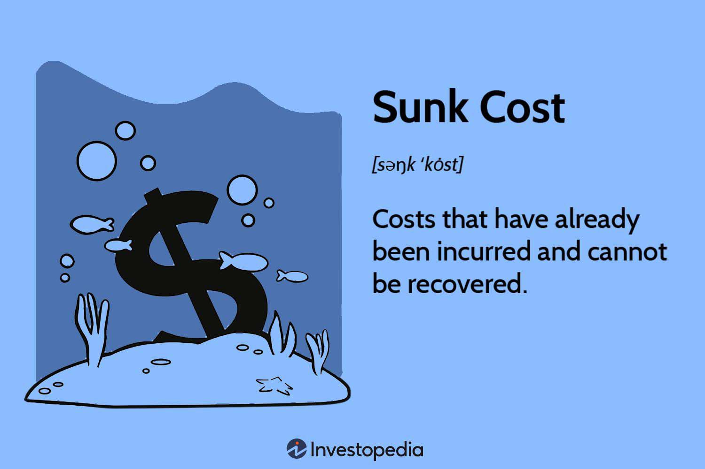

The sunk cost fallacy represents a pervasive cognitive bias where individuals continue an endeavor once an investment in money, effort, or time has been made, regardless of the current costs outweighing potential benefits. This phenomenon is significantly relevant within behavioral economics, a field examining how psychological factors influence economic decision-making. Behavioral economics seeks to elucidate why rational actors, as predicted by traditional economic theory, frequently deviate from rational choices, opting instead to persist with failing projects or investments due to their previous commitments.

Understanding the sunk cost fallacy is particularly crucial in algorithmic trading, where decisions are typically driven by advanced computations and data analytics. However, human oversight in algorithm development and management can introduce biases such as sunk costs, which can lead to suboptimal trading behavior. Algorithmic trading involves executing pre-programmed trading instructions accounting for variables like timing, price, and volume. Here, the sunk cost fallacy can manifest when traders continue with an ineffective algorithm because of the resources already spent on its development, ignoring the mounting evidence against its efficacy.



This article will explore the nature of the sunk cost fallacy, its origins, and implications in both personal and economic spheres. It will also examine how sunk costs can distort decision-making processes in the context of trading and the potential irrationality that may occur when traders adhere to failing strategies due to their previous investments in them. To address these challenges, strategies to mitigate the fallacy's impact on algorithmic trading will be discussed, including implementing rigorous risk management techniques and utilizing machine learning for adaptive strategy optimization.

By recognizing and addressing the sunk cost fallacy, algorithm developers and traders can improve their decision-making processes, enhance trading performance, and minimize losses, ultimately leading to more robust and resilient trading strategies. This knowledge serves as the foundation for navigating the complexities of financial markets with an awareness of cognitive biases which impact decision-making.

## Table of Contents

## Understanding Sunk Cost Fallacy

The sunk cost fallacy is a cognitive bias whereby individuals continue an endeavor or continue to invest in a project based purely on the cumulative prior investment (time, money, resources) despite new evidence suggesting that the cost, moving forward, outweighs the expected benefit. This fallacy has its roots in behavioral economics, a field that examines the psychological influences on economic decision-making. Behavioral economics emerged as a response to traditional economic theories, which often assumed that individuals made decisions based solely on rational calculations and comprehensive information.

Common examples of the sunk cost fallacy manifest in everyday decisions as well as in broader economic contexts. For instance, someone might continue watching a movie they find boring just because they've already invested an hour into it. Similarly, in the business world, a company may continue to fund a failing project due to significant amounts of money already spent on its development, despite indicators that further investment will not change its negative trajectory.

The influence of sunk costs on decision-making is significant as it causes individuals to maintain a [course](/wiki/best-algorithmic-trading-courses) of action even when better alternatives or discontinuation would be advisable. The critical [factor](/wiki/factor-investing) here is the cognitive cost of cutting losses, which often feels more painful than the rational calculation of future returns. This phenomenon can be mathematically understood by considering the decision weight assigned to the past investments versus future benefits. Even when the net present value (NPV) of future benefits is negative, the weight of past investments can unduly influence decisions.

Several psychological factors contribute to the susceptibility to the sunk cost fallacy, with loss aversion being a predominant one. According to prospect theory, people experience losses more intensely than gains of the same magnitude, prompting them to avoid realizing a loss where possible, even if that means incurring greater future losses. Commitment to a decision also plays a role; having publicly committed to a course of action, individuals may find it psychologically difficult to withdraw, as it could imply a misjudgement of their initial decision. This psychological need for consistency and the avoidance of the cognitive dissonance associated with admitting a mistake intensify the sunk cost effect. 

Understanding these facets of the sunk cost fallacy is vital as it impacts various sectors, including business strategy and personal finance, often leading to suboptimal decision-making and resource allocation.

## Behavioral Economics and Sunk Costs

Behavioral economics provides valuable insights into why individuals and even organizations fall prey to the sunk cost fallacy. This cognitive bias stems from people's tendency to justify additional investment in a decision based on previously invested resources, such as time and money, rather than future benefits. Traditional economics assumes rational decision-making processes, where choices are made based solely on expected future advantages. However, behavioral economics recognizes that human behavior often deviates from this model due to psychological factors.

One of the primary reasons people succumb to the sunk cost fallacy is the aversion to loss. Loss aversion, a concept formalized by the influential behavioral economists Daniel Kahneman and Amos Tversky, suggests that losses weigh heavier on individuals than equivalent gains, prompting them to avoid realizing a loss. This can lead to a persistence in ineffective strategies, where decision-makers continue allocating resources to a losing venture, hoping to recover their initial investment.

There have been several key studies and experiments that demonstrate the impact of sunk costs on decision-making. One such classic experiment involved participants being given movie tickets for a show that they found out was not interesting. Despite this new information, many chose to attend the movie to avoid 'wasting' the ticket cost, exemplifying how sunk costs influence behavior. Another notable study, conducted by Arkes and Blumer in 1985, challenged participants to imagine investing in a project plagued with unforeseen issues. Many indicated they would continue funding the troubled project, thus reinforcing the prevalence of the sunk cost effect.

Associated cognitive biases further illuminate why sunk costs affect decision-making. The endowment effect describes how people assign higher value to things merely because they own them, potentially leading them to irrationally retain current investments. Status quo bias, another related bias, exemplifies the preference for current states, resulting in resistance to change despite external evidence indicating the need for a different course of action.

These insights underscore the critical role behavioral economics plays in understanding sunk costs. Recognizing these biases and their foundations helps address irrational tendencies in decision-making and implements more effective strategies to counteract them. Whether in personal finance or larger organizational contexts like [algorithmic trading](/wiki/algorithmic-trading), understanding these cognitive biases can pave the way for more rational financial decisions.

## The Impact of Sunk Cost Fallacy on Algorithmic Trading

Algorithmic trading, a method of executing orders using pre-programmed trading instructions, relies heavily on data-driven decision-making. These algorithms analyze vast amounts of data to identify patterns and trends, allowing them to execute trades rapidly and efficiently. The objective is to capitalize on market opportunities that are too complex and fleeting for human traders to exploit. Despite its reliance on quantitative data, algorithmic trading is not immune to cognitive biases such as the sunk cost fallacy.

The sunk cost fallacy occurs when traders continue investing in a trade based on previous expenditures, rather than on the potential of future outcomes. In algorithmic trading, this bias can manifest in several ways. Algorithms designed to minimize losses might fail to cut losing trades due to predetermined conditions rooted in past investments. These conditions may be influenced by a trader's emotional attachment to prior trades, leading to inefficient decision-making.

A notable example of traders falling victim to the sunk cost fallacy occurred in the case of the infamous "London Whale" incident in 2012. The JPMorgan Chase trader maintained positions in credit derivatives, compounding losses in hopes of an eventual turnaround. This resulted in a $6 billion loss, highlighting the dangers of prioritizing past investments over current data.

Maintaining investments in unprofitable trades due to prior losses can severely impact trading performance. The sunk cost fallacy leads to the allocation of resources to underperforming assets, restricting [liquidity](/wiki/liquidity-risk-premium) and preventing opportunities for profitable trades. This can cause algorithmic systems to lag behind more dynamic strategies, ultimately impacting returns.

To mitigate this, traders need to ensure algorithms incorporate mechanisms to evaluate the profitability of positions continuously, independent of prior losses. By developing models that account for changing market conditions and avoid overreliance on historical data, traders can minimize the influence of cognitive biases. This approach not only aids in enhancing overall trading efficacy but also ensures a more rational and objective evaluation of market opportunities.

## Mitigating Sunk Cost Fallacy in Trading Algorithms

Mitigating the impact of the sunk cost fallacy in algorithmic trading requires a multi-faceted approach that blends financial discipline, robust data analysis, and advanced technological solutions. Here, several strategies are outlined to help traders and developers design algorithms resilient to cognitive biases.

### Stop-Loss Orders and Automatic Exit Strategies

The implementation of stop-loss orders and automatic [exit](/wiki/exit-strategy) strategies is fundamental in minimizing the effects of the sunk cost fallacy in trading. A stop-loss order is a pre-set point at which a trader will exit a position to prevent further losses. By automating the exit process, traders can avoid the emotional decision-making pitfalls associated with the sunk cost fallacy. These tools ensure that decisions are guided by data and pre-established rules rather than an emotional attachment to past investments.

### Backtesting and Continuous Improvement

Backtesting involves simulating a trading strategy using historical data to evaluate its potential effectiveness. This practice is critical in identifying flaws in a trading algorithm and provides a framework for continuous improvement. By rigorously testing strategies against past market conditions, traders can understand how their algorithms react in different scenarios and adjust them accordingly to reduce the influence of cognitive biases like the sunk cost fallacy.

```python
import numpy as np
import pandas as pd

def backtest_strategy(prices, entry_signal, exit_signal):
    """ Simulate a trading strategy. """
    capital = 10000
    position = 0
    trading_log = []

    for i in range(len(prices)):
        if entry_signal[i] and capital > prices[i]:
            position += 1
            capital -= prices[i]
            trading_log.append((i, 'Buy', prices[i]))
        elif exit_signal[i] and position > 0:
            position -= 1
            capital += prices[i]
            trading_log.append((i, 'Sell', prices[i]))

    return capital, trading_log
```

### Machine Learning for Adaptive Strategies

Machine learning (ML) offers a powerful avenue for developing more adaptive and less biased trading strategies. Through continuous learning from new data, ML models can identify patterns and optimize trading decisions, effectively reducing human bias. By leveraging algorithms such as [reinforcement learning](/wiki/reinforcement-learning), which adapts strategies based on feedback loops, traders can further insulate their algorithms from the trap of sunk cost thinking.

For instance, an ML-based algorithm can dynamically adjust stop-loss levels or entry points in real-time, accounting for market [volatility](/wiki/volatility-trading-strategies) and emerging trends. Through supervised training, trading algorithms can learn from historical data to better anticipate market movements, continuously refining their approach with each iteration.

```python
from sklearn.ensemble import RandomForestClassifier

def train_model(features, labels):
    """ Train a machine learning model for predicting market movements. """
    model = RandomForestClassifier(n_estimators=100)
    model.fit(features, labels)
    return model

def predict_signal(model, new_data):
    """ Predict entry and exit signals. """
    return model.predict(new_data)
```

By adopting these strategies, algorithmic traders can significantly mitigate the influence of the sunk cost fallacy, leading to more rational and data-driven decision-making processes. Each step should be repeated and refined as market conditions evolve, ensuring that trading strategies remain robust and less susceptible to cognitive biases over time.

## Conclusion

Sunk cost fallacy represents a critical concept in both behavioral economics and algorithmic trading, as it captures how past investments influence ongoing decision-making irrespective of their current value. Recognizing this cognitive bias is crucial, as it often leads individuals and automated systems to persist with suboptimal decisions, driven by historic expenditures rather than rational assessments of present conditions. In the context of algorithmic trading, understanding sunk cost fallacy is essential for enhancing the rationality and performance of trading strategies.

One of the main challenges in overcoming the sunk cost fallacy is identifying its presence within trading algorithms, where decisions are ostensibly based on objective data. Despite their design, algorithms can still incorporate irrational biases originating from their programming or the input data they process. Robust strategies such as implementing stop-loss orders and automatic exit strategies are effective in curbing the negative influences of sunk costs. These measures establish predefined thresholds to minimize losses and prevent emotional interference in trading decisions.

Furthermore, the role of [backtesting](/wiki/backtesting) and continuous improvement cannot be overstated. By rigorously testing algorithms against historical data, traders can assess the efficacy of their strategies while identifying elements influenced by cognitive biases. Machine learning offers additional potential by adapting strategies based on real-time data, thus minimizing human bias.

Investors are encouraged to maintain an awareness of these psychological influences, adopting a critical stance toward their own decision-making processes. By doing so, they can bolster the effectiveness of algorithmic trading strategies and mitigate the pull of sunk costs. Ultimately, achieving a balance between data-driven strategies and the understanding of behavioral biases is fundamental to optimizing trading performance.

## Further Reading and Resources

### Recommended Books and Articles on Behavioral Economics and Sunk Cost Fallacy

1. **"Thinking, Fast and Slow" by Daniel Kahneman**  
   This seminal book by Nobel laureate Daniel Kahneman discusses various cognitive biases, including the sunk cost fallacy, offering insights into decision-making processes in economics and beyond. It explores how people make decisions under uncertainty and emphasizes the importance of understanding cognitive biases.

2. **"Predictably Irrational: The Hidden Forces That Shape Our Decisions" by Dan Ariely**  
   Dan Ariely's exploration of irrational behaviors includes an in-depth look at how sunk costs influence decision-making. The book provides empirical evidence from experiments that highlight why rational economic theories often fail to predict real-world human behavior.

3. **"Misbehaving: The Making of Behavioral Economics" by Richard H. Thaler**  
   Richard Thaler, a pioneer in behavioral economics, explores various economic behaviors, including the sunk cost fallacy. The book offers a comprehensive overview of how traditional economic theories have evolved to include psychological insights.

### Resources on Algorithmic Trading Strategies and Cognitive Bias Mitigation

1. **"Algorithmic Trading: Winning Strategies and Their Rationale" by Ernie Chan**  
   Ernie Chan provides practical advice on developing, testing, and deploying algorithmic trading systems. The book emphasizes the importance of quantitative models and statistical analyses to minimize human biases like the sunk cost fallacy.

2. **"Machine Learning for Asset Managers" by Marcos López de Prado**  
   This book offers insights into how [machine learning](/wiki/machine-learning) can be leveraged to develop adaptive trading strategies, hence reducing cognitive biases like the sunk cost fallacy. It is particularly useful for those interested in using [artificial intelligence](/wiki/ai-artificial-intelligence) to automate trading decisions.

3. **"Advances in Financial Machine Learning" by Marcos López de Prado**  
   A technical guide for implementing machine learning techniques in finance to enhance decision-making and minimize psychological biases. The book covers various methodologies that can help mitigate errors arising from sunk costs in algorithmic trading.

### Online Courses and Webinars

1. **Coursera: Behavioral Finance Course by the University of Toronto**  
   This online course examines how cognitive biases, including the sunk cost fallacy, influence financial decisions. It provides a strong foundation in behavioral finance principles and applies these concepts to real-world situations.

2. **edX: Introduction to Computational Finance and Financial Econometrics by the University of Washington**  
   This course involves the study of quantitative approaches to financial decision-making, including the development of algorithmic trading strategies. Emphasizing data-driven methods, it helps participants learn to mitigate biases in trading algorithms.

3. **Khan Academy: Behavioral Economics**  
   Khan Academy provides a series of free videos on behavioral economics, where users can learn about different cognitive biases, including the sunk cost fallacy, and understand their impact on decision-making.

4. **QuantInsti: EPAT (Executive Programme in Algorithmic Trading)**  
   This professional certification course focuses on algorithmic trading strategies with modules on mitigating cognitive biases. It offers mentorship from industry experts and practical skill-building in coding algorithms to avoid common pitfalls like the sunk cost fallacy.

## References & Further Reading

[1]: Kahneman, D. (2013). ["Thinking, Fast and Slow."](https://link.springer.com/article/10.1007/s00362-013-0533-y) Farrar, Straus and Giroux.

[2]: Ariely, D. (2009). ["Predictably Irrational: The Hidden Forces That Shape Our Decisions."](https://www.amazon.com/Predictably-Irrational-Revised-Expanded-Decisions/dp/0061353248) HarperCollins.

[3]: Thaler, R. H. (2016). ["Misbehaving: The Making of Behavioral Economics."](https://www.amazon.com/Misbehaving-Behavioral-Economics-Richard-Thaler/dp/039335279X) W. W. Norton & Company.

[4]: Chan, E. P. (2009). ["Algorithmic Trading: Winning Strategies and Their Rationale."](https://github.com/ftvision/quant_trading_echan_book) Wiley.

[5]: López de Prado, M. (2018). ["Machine Learning for Asset Managers."](https://www.cambridge.org/core/books/machine-learning-for-asset-managers/6D9211305EA2E425D33A9F38D0AE3545) Cambridge University Press.

[6]: López de Prado, M. (2018). ["Advances in Financial Machine Learning."](https://www.amazon.com/Advances-Financial-Machine-Learning-Marcos/dp/1119482089) Wiley.

[7]: Arkes, H. R., & Blumer, C. (1985). ["The psychology of sunk cost."](https://psycnet.apa.org/record/1985-20101-001) Organizational Behavior and Human Decision Processes, 35(1), 124-140.