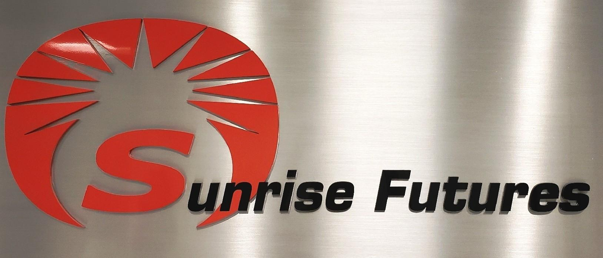

## Table of Contents

## What is Sunrise Futures?

Sunrise Futures is a company that helps people trade things like gold, oil, and other stuff that can be bought and sold in the future. They have a special place where people can come together and make deals. This place is called a futures exchange. People use Sunrise Futures to try to make money by guessing what the prices of these things will be later on.

The company makes sure that everything is fair and safe for everyone who uses their services. They have rules and people who watch over the trading to make sure no one cheats. Sunrise Futures also gives people information and tools to help them make smart choices about their trades. This way, people can feel more confident when they are trying to make money with futures trading.

## How does Sunrise Futures differ from traditional futures trading?

Sunrise Futures is different from traditional futures trading because it focuses on making things easier and safer for people who want to trade. In traditional futures trading, you might need to go to a big building where lots of people shout and make deals. But with Sunrise Futures, you can do everything on a computer or phone. They have special tools and information that help you understand what's happening in the market, so you don't need to be an expert to start trading.

Another way Sunrise Futures is different is that they work hard to make sure everything is fair and safe. In traditional trading, there can be a lot of risk and sometimes people might try to cheat. Sunrise Futures has strict rules and people who watch over the trading to stop any cheating. They also have ways to protect your money and make sure you get paid if you make a good trade. This makes it a lot less scary for someone new to futures trading.

## What are the benefits of trading with Sunrise Futures?

Trading with Sunrise Futures has many benefits. One big benefit is that it's easy to use. You don't need to go to a big trading floor or be an expert. You can trade from your computer or phone, and Sunrise Futures gives you tools and information to help you make good choices. This makes it simple for anyone to start trading, even if you're new to it.

Another benefit is that Sunrise Futures keeps things safe and fair. They have rules and people who watch over the trading to make sure no one cheats. They also protect your money and make sure you get paid if you make a good trade. This means you can feel more confident and less worried when you're trading with them.

## Who can trade on Sunrise Futures?

Anyone who wants to trade can use Sunrise Futures. You don't need to be an expert or have a lot of money to start. As long as you have a computer or a phone and some money to trade with, you can join in. This makes it easy for people who are new to trading to get started.

Sunrise Futures welcomes all kinds of traders, from people who just want to try it out to those who trade a lot. They have tools and information that help everyone, no matter how much you know about trading. This means you can feel comfortable and confident when you're trading with them.

## What types of assets can be traded on Sunrise Futures?

Sunrise Futures lets you trade many different things. You can trade stuff like gold, oil, and other things that people use a lot. These are called commodities. You can also trade things like stocks and bonds, which are pieces of companies or loans that people can buy and sell.

Besides commodities and stocks, Sunrise Futures also lets you trade things that depend on other things, like the weather or how much a currency is worth compared to another. These are called derivatives. So, no matter what you're interested in, Sunrise Futures has a lot of different things you can trade.

## How do you start trading on Sunrise Futures?

To start trading on Sunrise Futures, you first need to sign up for an account on their website or app. You'll need to give them some information about yourself, like your name and where you live. Once your account is set up, you'll need to put some money into it. This money is what you'll use to make trades. Sunrise Futures will help you with all these steps, so it's easy to get started.

After you have your account set up and money in it, you can start looking at the different things you can trade, like gold, oil, or stocks. Sunrise Futures gives you tools and information to help you decide what to trade. When you see something you want to buy or sell, you can make your trade right from your computer or phone. It's simple and you don't need to be an expert to start trading with Sunrise Futures.

## What are the fees associated with Sunrise Futures?

When you trade with Sunrise Futures, you need to know about the fees. There are two main types of fees: the ones you pay when you make a trade and the ones you pay to keep your account open. The trading fees are usually a small amount of money for each trade you make. This fee can change depending on what you're trading and how much you're trading. Sunrise Futures tries to keep these fees low so more people can trade without spending too much money.

Besides the trading fees, there's also a fee to keep your account open. This is called a maintenance fee, and it's usually a small amount of money that you pay every month or every year. The maintenance fee helps Sunrise Futures cover the costs of running their service and keeping everything safe and fair for everyone. They make sure to tell you about all the fees upfront so you know exactly what you're paying for when you start trading with them.

## What are the risks involved in trading on Sunrise Futures?

Trading on Sunrise Futures can be risky because the prices of things like gold, oil, and stocks can go up and down a lot. If you guess wrong about which way the price will go, you could lose money. This is called market risk. It's important to know that even with the tools and information Sunrise Futures gives you, there's no way to be sure you'll always make money. Sometimes, big events like a war or a natural disaster can change prices suddenly, and that can be hard to predict.

Another risk is called leverage risk. When you trade futures, you can use leverage, which means you can trade with more money than you actually have in your account. This can help you make more money if things go well, but it can also make you lose more money if things go badly. It's like borrowing money to trade, and if the price moves against you, you might have to pay back more than you expected. Sunrise Futures tries to help you understand these risks, but it's still important to be careful and only trade with money you can afford to lose.

## How does Sunrise Futures ensure the security of transactions?

Sunrise Futures works hard to keep your trades safe. They use special computer programs and technology to protect your information and money. When you make a trade, they check everything carefully to make sure it's all correct and no one is trying to cheat. They also have rules and people who watch over the trading to stop any bad behavior. This way, you can feel safe knowing that Sunrise Futures is looking out for you.

Another way Sunrise Futures keeps things secure is by using strong passwords and other ways to make sure only you can get into your account. They also keep your money in safe places, so even if something goes wrong, your money is protected. Sunrise Futures wants you to feel confident and secure when you're trading with them, so they do everything they can to make sure your transactions are safe.

## What advanced trading features does Sunrise Futures offer?

Sunrise Futures offers some cool tools that can help you trade better. One of these is called [algorithmic trading](/wiki/algorithmic-trading). This means you can use a computer program to make trades for you based on special rules you set up. It's like having a robot that trades for you! Another neat feature is real-time data and charts. This means you can see what's happening in the market right now and use graphs to help you decide what to do. It's like having a crystal ball that shows you the market.

They also have something called margin trading. This lets you trade with more money than you actually have in your account, kind of like borrowing money to trade. It can help you make more money if things go well, but you need to be careful because it can also make you lose more if things go badly. Sunrise Futures gives you all these tools to help you trade smarter and make better choices, but it's important to understand how to use them right.

## How does Sunrise Futures comply with regulatory standards?

Sunrise Futures follows the rules set by the people who watch over trading, like the government and special groups. They make sure to do everything by the book so that everyone can trade fairly and safely. This means they have to check every trade carefully, keep good records, and report anything that looks fishy. They also have to make sure that the people who work for them know the rules and follow them.

By following these rules, Sunrise Futures helps keep the trading world honest and safe for everyone. They work with the regulators to make sure they are always doing the right thing. This way, people who trade with Sunrise Futures can feel confident that they are trading in a place that plays by the rules and looks out for their best interests.

## What future developments can we expect from Sunrise Futures?

Sunrise Futures is always working on new things to make trading easier and better for everyone. They are planning to add more things you can trade, like new kinds of commodities and stocks. They also want to make their computer programs even smarter, so they can help you make better choices when you trade. This means they might add more tools that use special math to predict what the market will do next.

Another thing Sunrise Futures is thinking about is making their app and website even easier to use. They want to make sure that even if you're new to trading, you can figure out how to use their service without any trouble. They might also start teaching people more about trading through videos and classes, so everyone can learn how to trade and feel more confident when they do it.

## References & Further Reading

[1]: Aldridge, I. (2013). ["High-Frequency Trading: A Practical Guide to Algorithmic Strategies and Trading Systems."](https://www.amazon.com/High-Frequency-Trading-Practical-Algorithmic-Strategies/dp/1118343506) Wiley.

[2]: Cartea, Á., Jaimungal, S., & Penalva, J. (2015). ["Algorithmic and High-Frequency Trading."](https://assets.cambridge.org/97811070/91146/frontmatter/9781107091146_frontmatter.pdf) Cambridge University Press.

[3]: Kaufman, P. J. (2013). ["Trading Systems and Methods."](https://onlinelibrary.wiley.com/doi/book/10.1002/9781119202561) Wiley.

[4]: Narang, R. K. (2013). ["Inside the Black Box: A Simple Guide to Quantitative and High-Frequency Trading."](https://onlinelibrary.wiley.com/doi/book/10.1002/9781118662717) Wiley Finance.

[5]: Treleaven, P., Galas, M., & Lalchand, V. (2013). ["Algorithmic trading review."](https://www.researchgate.net/publication/262239006_Algorithmic_Trading_Review) Communications of the ACM.

[6]: Peters, E. E. (1994). ["Fractal Market Analysis: Applying Chaos Theory to Investment and Economics."](https://archive.org/details/fractalmarketana0000pete) Wiley.

