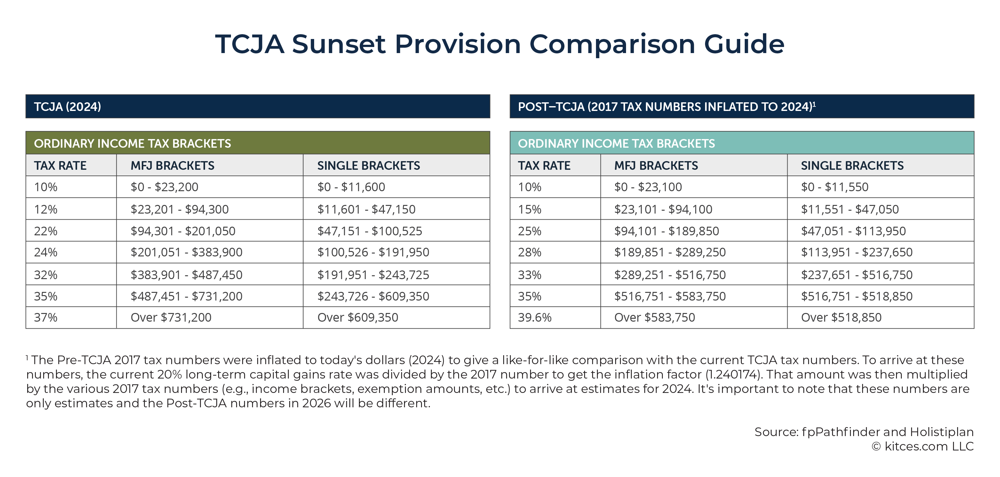

## Table of Contents

## What are sunset provisions?

Sunset provisions are laws or parts of laws that expire after a certain time. They are like timers on rules that governments set. If the government wants to keep the rule, they have to pass a new law before the old one runs out.

These provisions help make sure that laws don't stay around forever without anyone checking if they are still needed or working well. It's a way for lawmakers to try out new ideas without committing to them forever. If a law with a sunset provision is useful, lawmakers can decide to keep it going by making a new law.

## How do sunset provisions work in legislation?

Sunset provisions in legislation are like expiration dates on laws. When lawmakers create a new law, they can add a sunset provision that says the law will stop working after a certain date. This gives the law a chance to be tested for a while. If the law is helpful, lawmakers can pass a new law to keep it going before the old one expires. If it's not working well, they can let it end without doing anything.

These provisions help keep laws fresh and relevant. They make sure that old laws don't stay on the [books](/wiki/algo-trading-books) forever without anyone checking if they're still needed. By setting an end date, lawmakers have to look at the law again and decide if it's worth keeping. This can lead to better laws because it forces regular reviews and updates.

## Why are sunset provisions implemented in laws?

Sunset provisions are put into laws to make sure that rules don't stay around forever without anyone checking if they are still needed. They act like a timer on a law, so after a certain time, the law stops working unless lawmakers decide to keep it going. This helps keep laws up to date and relevant because it forces lawmakers to look at them again and see if they are still useful.

By using sunset provisions, lawmakers can try out new ideas without committing to them forever. If a new law works well, they can pass a new law to keep it going. If it doesn't work, they can let it end without doing anything more. This way, sunset provisions help make sure that only the best and most needed laws stay in place.

## What is the basic impact of sunset provisions on investments?

Sunset provisions can affect investments by creating uncertainty. When a law has a sunset provision, it means the law will end after a certain time unless it's renewed. This can make investors unsure about what rules will be in place in the future. If they think a law that helps their investment might not be renewed, they might be less likely to invest or might want a higher return to take on the risk.

On the other hand, sunset provisions can also encourage investment in some cases. If a new law with a sunset provision is seen as a good test of a new idea, investors might see it as a chance to get in early on something that could become permanent. If the law works well and gets renewed, early investors could benefit. So, while sunset provisions add uncertainty, they can also create opportunities for those willing to take the risk.

## How do sunset provisions affect long-term investment planning?

Sunset provisions can make long-term investment planning harder because they add uncertainty. When a law has a sunset provision, it means the law will stop working after a certain time unless lawmakers decide to keep it going. Investors might not know if the rules that help their investments will still be around in the future. This can make them less likely to invest for the long term, or they might want a bigger return to take on the risk of the law changing.

On the other hand, sunset provisions can also create chances for long-term investment. If a new law with a sunset provision looks like a good test of a new idea, some investors might see it as a chance to get in early. If the law works well and gets renewed, those early investors could benefit a lot. So, while sunset provisions can make long-term planning trickier, they can also offer opportunities for those willing to take the risk and plan carefully.

## Can sunset provisions create uncertainty for investors?

Yes, sunset provisions can create uncertainty for investors. When a law has a sunset provision, it means the law will stop working after a certain time unless lawmakers decide to keep it going. This can make investors unsure about what rules will be in place in the future. If they think a law that helps their investment might not be renewed, they might be less likely to invest or might want a higher return to take on the risk.

On the other hand, sunset provisions can also create opportunities for investors. If a new law with a sunset provision is seen as a good test of a new idea, some investors might see it as a chance to get in early. If the law works well and gets renewed, those early investors could benefit a lot. So, while sunset provisions add uncertainty, they can also offer chances for those willing to take the risk.

## What are some examples of sunset provisions in tax laws?

One example of a sunset provision in tax laws is the Tax Cuts and Jobs Act (TCJA) passed in the United States in 2017. Many of the changes made by this law, like lower tax rates for individuals, were set to expire at the end of 2025. This means that unless lawmakers decide to keep these changes, the tax rates will go back to what they were before the law was passed.

Another example is the research and development (R&D) tax credit in the U.S. This credit, which helps companies that spend money on research, has had different sunset provisions over the years. Sometimes, lawmakers have to renew it every year or two, which can make it hard for businesses to plan their R&D spending because they're not sure if the credit will still be there in the future.

## How do investors adapt their strategies in response to sunset provisions?

Investors often have to be careful when there are sunset provisions in laws. They know that the rules might change after a certain time, so they might not want to put their money into things that depend on those rules. If they do invest, they might want a bigger reward to make up for the risk that the law might not be renewed. This can make them look for other investments that are not affected by the sunset provision, or they might wait to see if the law gets renewed before making a big move.

On the other hand, some investors see sunset provisions as a chance to get in early on something new. If they think a law with a sunset provision is a good test of a new idea, they might invest early, hoping that the law will work well and get renewed. This way, they could benefit a lot if the law becomes permanent. So, while sunset provisions can make investing trickier, they can also create opportunities for those who are willing to take a chance and plan carefully.

## What are the potential economic consequences of sunset provisions on investment markets?

Sunset provisions can make investment markets less stable because they add uncertainty. When laws have a sunset provision, it means they will stop working after a certain time unless lawmakers decide to keep them going. This can make investors unsure about what rules will be in place in the future. If they think a law that helps their investment might not be renewed, they might be less likely to invest or might want a higher return to take on the risk. This uncertainty can lead to less money being put into the market, which can slow down economic growth.

On the other hand, sunset provisions can also create opportunities for investment markets. If a new law with a sunset provision is seen as a good test of a new idea, some investors might see it as a chance to get in early. If the law works well and gets renewed, those early investors could benefit a lot. This can lead to more money being put into new areas of the economy, which can help drive innovation and growth. So, while sunset provisions can make markets less predictable, they can also encourage investment in new and potentially rewarding areas.

## How do sunset provisions influence international investment decisions?

Sunset provisions can make it harder for international investors to decide where to put their money. When a country has laws with sunset provisions, it means those laws will stop working after a certain time unless they are renewed. This can make investors from other countries unsure about what rules will be in place in the future. If they think a law that helps their investment might not be renewed, they might be less likely to invest in that country or might want a bigger return to take on the risk. This uncertainty can make them look for other places to invest where the rules are more stable.

On the other hand, sunset provisions can also create opportunities for international investors. If a new law with a sunset provision in a country is seen as a good test of a new idea, some investors might see it as a chance to get in early. If the law works well and gets renewed, those early investors could benefit a lot. This can lead to more money being put into new areas of the economy in that country, which can help drive innovation and growth. So, while sunset provisions can make international investment decisions trickier, they can also offer chances for those willing to take a chance and plan carefully.

## What are the debates surrounding the effectiveness of sunset provisions in promoting economic growth?

Some people think that sunset provisions can help the economy grow by making laws better. They say that because these provisions make lawmakers check laws again after a while, it helps keep rules up to date and useful. If a new law with a sunset provision works well, it can bring in more investment and help new ideas grow. This can lead to more jobs and more money moving around in the economy. So, they believe that sunset provisions can make the economy stronger by encouraging good laws and new investments.

On the other hand, some people worry that sunset provisions can make the economy less stable. They say that because these provisions add uncertainty, investors might not want to put their money into things that depend on those laws. If investors are unsure about what rules will be in place in the future, they might choose to invest their money somewhere else where the rules are more certain. This can slow down economic growth because less money is being put into the market. So, they think that while sunset provisions might help in some ways, they can also make it harder for the economy to grow steadily.

## How can policymakers balance the benefits and drawbacks of sunset provisions to optimize investment climates?

Policymakers can balance the benefits and drawbacks of sunset provisions by making sure they are clear about when and why a law will end. If they tell investors early and often about the sunset provision, it can help reduce uncertainty. They can also set up a regular review process where they look at the law before it expires. This way, investors know that the law will be checked and can plan better. By being open and having a good review system, policymakers can make investors feel more sure about their investments.

Another way to balance the benefits and drawbacks is to use sunset provisions for new ideas or temporary fixes. If a law is meant to test something new, a sunset provision can be a good way to see if it works without making it permanent right away. This can encourage investment in new areas of the economy. But for laws that are important for long-term stability, like tax laws that affect big investments, policymakers might want to avoid sunset provisions or make them longer. This way, they can keep the economy stable while still trying out new ideas.

## References & Further Reading

[1]: Bergstra, J., Bardenet, R., Bengio, Y., & Kégl, B. (2011). ["Algorithms for Hyper-Parameter Optimization."](https://papers.nips.cc/paper/4443-algorithms-for-hyper-parameter-optimization) Advances in Neural Information Processing Systems 24.

[2]: ["Advances in Financial Machine Learning"](https://www.amazon.com/Advances-Financial-Machine-Learning-Marcos/dp/1119482089) by Marcos Lopez de Prado

[3]: ["Evidence-Based Technical Analysis: Applying the Scientific Method and Statistical Inference to Trading Signals"](https://www.amazon.com/Evidence-Based-Technical-Analysis-Scientific-Statistical/dp/0470008741) by David Aronson

[4]: ["Machine Learning for Algorithmic Trading"](https://github.com/stefan-jansen/machine-learning-for-trading) by Stefan Jansen

[5]: ["Quantitative Trading: How to Build Your Own Algorithmic Trading Business"](https://www.amazon.com/Quantitative-Trading-Build-Algorithmic-Business/dp/1119800064) by Ernest P. Chan