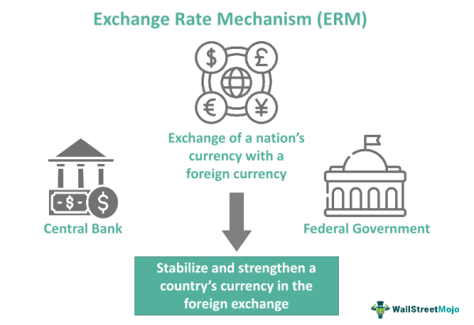

In the evolving landscape of global finance, interactions between currency mechanisms, super currency concepts, and algorithmic trading are becoming increasingly prominent. As financial systems become more interconnected, understanding these dynamics is crucial for predicting economic stability and trading patterns. Currency mechanisms, including exchange rates and monetary policies, are the foundation of international trade, facilitating the flow of goods, services, and capital between nations. However, these mechanisms are not without their challenges, as exchange rate volatility and monetary policy discrepancies can lead to financial instability.

The concept of a super currency, a universal monetary unit, emerges as a potential solution to these challenges. By stabilizing and unifying international financial transactions, a super currency could simplify global trade and reduce exchange rate uncertainties. Historical propositions, such as John Maynard Keynes' Bancor and the International Monetary Fund's Special Drawing Rights (SDRs), provide insights into the feasibility of a global currency pool. These frameworks highlight both the potential benefits and inherent challenges associated with a super currency's implementation.



Simultaneously, algorithmic trading is reshaping the methods of conducting financial transactions. By deploying sophisticated algorithms, traders can execute deals at speeds and efficiencies unattainable by humans, optimizing trade execution and enhancing market liquidity. However, this technological advancement also introduces complexities, such as increased market volatility and the need for robust risk management strategies.

This article explores these interactions and their implications for financial systems. It examines hypothetical scenarios where a super currency influences algorithmic trading strategies and assesses how these elements affect today's interconnected financial environment. Understanding these relationships is vital for stakeholders aiming to foster economic resilience and stability in an ever-changing global market.

## Table of Contents

## Understanding Currency Mechanisms

Currency mechanisms are integral to ensuring economic stability and fostering international trade and financial equilibrium. These mechanisms include exchange rates, monetary policies, and financial derivatives, each contributing uniquely to the financial system.

**Exchange Rates**: Exchange rates are a fundamental aspect of currency mechanisms, determining how much one currency is worth in terms of another. They play a crucial role in cross-border trade by affecting import and export prices. For example, a stronger currency makes imports cheaper and exports more expensive, potentially reducing a country's trade surplus. Exchange rates can be floating, where they are determined by market forces, or fixed, where a currency's value is pegged to that of another currency or a basket of currencies. Central banks may intervene in foreign exchange markets to stabilize or manipulate exchange rates for economic advantage [1].

**Monetary Policies**: Central banks implement monetary policies to control the money supply and interest rates, influencing economic activity and inflation. These policies can be expansionary, where the money supply is increased to stimulate economic growth, or contractionary, where the supply is restricted to curb inflation. Central banks utilize various tools, such as open market operations, discount rates, and reserve requirements, to enforce these policies. 

**Financial Derivatives**: Financial derivatives, including futures, options, and swaps, are contracts whose value is derived from underlying assets such as currencies, stocks, or commodities. In currency markets, derivatives provide instruments for hedging against exchange rate risks, enabling businesses and investors to lock in prices and mitigate potential losses. Currency derivatives, such as forward contracts, allow parties to agree on an exchange rate for a future date, thus offering protection against volatility [2]. 

**Role of Central Banks and International Financial Institutions**: Central banks are pivotal in stabilizing national economies through various currency mechanisms. They conduct foreign exchange operations to manage reserves and intervene in currency markets. Additionally, central banks collaborate with international financial institutions like the International Monetary Fund (IMF) to achieve broader financial stability. The IMF, for instance, provides financial assistance and policy advice to member countries facing balance of payments problems, helping stabilize their currencies. 

Overall, understanding these currency mechanisms is essential for comprehending how countries balance economic objectives with global financial integration. 

**References**:
[1] Krugman, P. R., & Obstfeld, M. (2006). International Economics: Theory and Policy. Addison-Wesley.
[2] Hull, J. C. (2015). Options, Futures, and Other Derivatives. Pearson Education Limited.

## The Concept of a Super Currency

A super currency is a theoretical global monetary unit suggested to harmonize and stabilize international financial transactions. It aims to address issues related to currency [volatility](/wiki/volatility-trading-strategies) and exchange rate fluctuations that can disrupt global trade and economic stability. The concept of a super currency is not new and has been proposed in various forms over the years.

Historically, one of the earliest and most notable proposals was John Maynard Keynes' idea of the "Bancor". Conceived during the Bretton Woods Conference in 1944, the Bancor was envisioned as an international currency unit used for clearing balances between nations. Keynes proposed that the Bancor would not be held by the public but used in internal transactions between central banks, facilitating trade while discouraging global imbalances by charging interest on countries with high surpluses and providing incentives for deficit countries to balance their trade. Although the Bancor was never adopted, it set the stage for subsequent discussions on global currency systems.

Another significant development in the area of super currencies is the Special Drawing Rights (SDRs), introduced by the International Monetary Fund (IMF) in 1969. SDRs serve as supplementary foreign exchange reserve assets and are intended to supplement member countries' official reserves. While not a currency per se, SDRs represent a potential step towards a global currency, composed of a basket of major currencies, thus providing a more stable asset for nations to hold. 

The potential advantages of implementing a super currency involve reduced transaction costs in international trade, elimination of exchange rate risks, and possibly enhanced global economic stability. For example, a unified currency system could eliminate the need for extensive foreign exchange reserves, thereby freeing up resources for productive investments. Additionally, countries engaged in trade would benefit from more predictable terms of trade and price stability.

However, there are significant challenges and complexities in materializing a super currency. The adoption of such a system would require monumental geopolitical consensus and an unprecedented level of international cooperation. A global monetary authority would need to be established to manage the issuance and regulation of the super currency, which would necessitate surrendering a degree of national sovereignty. Furthermore, the transition period could pose significant risks to existing financial markets and economies, as traditional monetary policies and fiscal controls would need to be adjusted or relinquished.

In summary, while a super currency offers theoretical benefits in terms of stability and uniformity in global financial transactions, its realization is fraught with technical, political, and economic obstacles. The historical context of proposals like the Bancor and ongoing functions of SDRs highlights the complexity of achieving consensus for a universal monetary unit.

## Financial Systems and Algorithmic Trading

Algorithmic trading has transformed the financial landscape by introducing automated processes for executing orders, which are typically too complex and numerous for manual intervention. By leveraging advanced mathematical models and computer-based algorithms, this trading method facilitates efficient market operations.

Integration of [algorithmic trading](/wiki/algorithmic-trading) into financial systems primarily affects the optimization of trade execution. In currency markets, also known as foreign exchange or Forex markets, algorithmic trading plays a crucial role. These markets are characterized by high [liquidity](/wiki/liquidity-risk-premium) and continuous trading. Algorithms facilitate the quick adaptation to changing market conditions by automatically executing trades based on pre-set criteria, thus minimizing human error and reaction time.

Algorithmic trading enhances liquidity in several ways. It increases the [volume](/wiki/volume-trading-strategy) and frequency of trades, leading to tighter bid-ask spreads. This improved liquidity is beneficial for all market participants as it reduces the cost of trading and helps in price discovery. A well-functioning algorithm can match buy and sell orders more effectively, thus contributing to a more stable market.

Nevertheless, algorithmic trading is not without risks. The speed and automation can lead to increased market volatility, as seen in instances of "flash crashes" where prices plummet rapidly in response to algorithmic actions. Such events underscore the importance of effective risk management and regulatory measures to mitigate potential adverse effects. Algorithms are typically programmed based on historical data, which may not always predict future trends accurately, leading to potential losses.

Python, widely favored for its simplicity and a robust set of libraries, is commonly used in algorithmic trading. Below is an example of a basic algorithmic trading strategy implemented in Python, using a moving average crossover strategy:

```python
# Example of a simple moving average crossover strategy
import pandas as pd
import numpy as np
import matplotlib.pyplot as plt

# Assume df is a pandas DataFrame containing historical price data with a 'Close' column
def moving_average_crossover(df, short_window=40, long_window=100):
    df['Short_MA'] = df['Close'].rolling(window=short_window, min_periods=1).mean()
    df['Long_MA'] = df['Close'].rolling(window=long_window, min_periods=1).mean()

    # Signals
    df['Signal'] = 0
    df.loc[df['Short_MA'] > df['Long_MA'], 'Signal'] = 1
    df.loc[df['Short_MA'] < df['Long_MA'], 'Signal'] = -1

    return df

# Visualization
def plot_trading_strategy(df):
    plt.figure(figsize=(14, 7))
    plt.plot(df['Close'], label='Close Price')
    plt.plot(df['Short_MA'], label='40-Day MA')
    plt.plot(df['Long_MA'], label='100-Day MA')
    plt.scatter(df.index, df['Close'], label='Buy Signal', marker='^', color='g', where=df['Signal']==1)
    plt.scatter(df.index, df['Close'], label='Sell Signal', marker='v', color='r', where=df['Signal']==-1)
    plt.title('Moving Average Crossover Strategy')
    plt.legend()
    plt.show()

# Example usage
# moving_average_crossover(df)
# plot_trading_strategy(df)
```

Complex algorithmic systems involve more sophisticated strategies incorporating [machine learning](/wiki/machine-learning) models to predict market movements, and statistical [arbitrage](/wiki/arbitrage) to exploit the price differentials between correlated currencies.

Algorithmic trading has undeniably reshaped financial markets, providing significant efficiency gains but also highlighting the need for comprehensive oversight. As these systems evolve, the industry must address the delicate balance between automation benefits and associated risks.

## The Interaction of Currency, Super Currencies, and Algorithmic Trading

The interaction between currency, super currencies, and algorithmic trading brings forth a dynamic and evolving aspect of modern financial markets. Algorithmic trading, which leverages sophisticated algorithms to automate and optimize trading strategies, could be significantly transformed with the introduction of a hypothetical super currency.

Algorithmic trading strategies can be adapted to incorporate a super currency by developing algorithms that can efficiently analyze and predict the movements of this new monetary unit, similarly to how they currently handle multiple currency pairs. For instance, algorithms could utilize machine learning models to identify patterns and correlations between the super currency and existing global currencies, allowing traders to make informed decisions based on anticipated moves.

In practice, existing algorithmic trading strategies already demonstrate the capability to handle complex currency systems. For example, High-Frequency Trading ([HFT](/wiki/high-frequency-trading-strategies)) algorithms are designed to execute trades at exceptionally high speeds across various currency pairs, profiting from minute price discrepancies. A study by Kirilenko et al. (2017) on HFT in currency markets indicated how algorithmic strategies adapt to multiple asset dynamics, providing insights into the potential for accommodating a super currency. Similarly, the integration of Quantitative Easing (QE)-based algorithms, as seen during the European Central Bank's QE programmes, has ideal applicability in scenarios involving a super currency by adjusting for changes in liquidity and interest rates.

The introduction of a super currency could offer several advantages for algorithmic trading. Firstly, it would reduce the complexity associated with managing and trading multiple currency pairs, streamlining operations and potentially reducing transaction costs. A unified currency could mitigate exchange rate risks, allowing algorithms to focus more on macroeconomic indicators and less on volatile currency swings. Secondly, the enhanced liquidity provided by a global super currency could improve market stability, making it easier for algorithmic trading systems to execute large volume trades without disrupting the market equilibrium.

However, the implementation of a super currency in algorithmic trading is not without challenges. The establishment of a new, globally accepted currency unit would require extensive cooperation among nations, each with its economic interests and monetary policies. Additionally, algorithms would need to adapt to a new set of parameters and data that reflect the super currency's influence on global market dynamics. These adjustments might involve time-consuming revisions of existing trading models and the development of new risk management strategies to account for unprecedented market behaviors influenced by a super currency.

In summary, the potential adaptation of algorithmic trading strategies to a super currency highlights both opportunistic and challenging aspects of innovation in financial markets. While the promise of reduced complexity and improved market stability is appealing, significant obstacles remain concerning the unification of international monetary systems and the subsequent recalibration of algorithmic models.

## Challenges and Opportunities in Global Markets

The proposal of a super currency introduces a myriad of challenges and opportunities, shaped by geopolitical, economic, and regulatory landscapes. The geopolitical challenges are significant, as a super currency would require unprecedented collaboration and consensus among nations, each with distinct economic interests and political agendas. Countries may hesitate to surrender monetary sovereignty, fearing a loss of control over domestic economic policy and reduced ability to respond independently to economic crises.

Economically, the transition to a super currency could initially provoke instability. Exchange rate adjustments would be necessary, potentially leading to fluctuations in prices of goods, services, and assets. The economic disparities between nations present further complications, as wealthier nations may disproportionately influence the monetary policies of a super currency, to the detriment of less economically powerful countries. The delicate balance of economic influence would need careful management to prevent exacerbating global inequalities.

Regulatory challenges are also critical. A super currency would demand a new regulatory framework to govern its use and ensure transparency and fairness in its implementation. Existing international financial institutions, such as the International Monetary Fund (IMF), might need to undergo significant restructuring to accommodate a unified currency system.

Despite these challenges, the opportunities presented by a super currency are substantial. A unified currency system could enhance economic stability by eliminating exchange rate risks, potentially leading to more predictable and stable global trade and investment flows. It could reduce the costs associated with currency exchange and compliance with multiple regulatory environments, which would be especially beneficial for multinational businesses and investors. Furthermore, a super currency might foster more integrated financial markets, promoting efficient capital allocation on a global scale.

In the context of emerging technologies and currency innovations, the future of financial markets holds exciting potential. Blockchain technology, for instance, could play a crucial role in the secure and transparent management of a super currency. Digital currencies, such as Central Bank Digital Currencies (CBDCs), already demonstrate the capacity to transform traditional financial systems, hinting at the possibilities for a globally integrated monetary structure.

Algorithmic trading, which already thrives in today's financial markets, could adapt to and benefit from a unified currency system by facilitating faster and more efficient trading strategies that capitalize on reduced currency risk. However, the integration of a super currency into algorithmic trading also carries challenges, such as recalibrating algorithms to operate within a new currency environment and ensuring algorithms do not inadvertently introduce new forms of market volatility.

In conclusion, while the journey towards adopting a super currency is fraught with complexities, it holds the promise of a more stable and efficient global financial system. The opportunities for innovation and advancement are vast, and addressing these challenges will require collaborative efforts from nations, regulators, and technological pioneers.

## Conclusion

In analyzing the intricate relationships between currency mechanisms, the notion of a super currency, and the advancements in algorithmic trading, several critical insights emerge. Currency mechanisms remain fundamental to the stability and functionality of global trade and economic systems. Through instruments such as exchange rates, monetary policies, and financial derivatives, central banks and international institutions aim to maintain equilibrium and support economic growth. 

The exploration of a super currency offers a compelling vision to streamline global financial transactions, mitigate currency fluctuation risks, and potentially enhance international monetary stability. Historical propositions like Keynes' Bancor and the IMF's Special Drawing Rights (SDRs) provide valuable frameworks for understanding the potential implementation and impact of a ubiquitous global currency.

Simultaneously, algorithmic trading represents a transformative force within financial systems, introducing efficiencies in trade execution and liquidity optimization, especially in currency markets. The seamless interaction between algorithmic trading and traditional financial systems could lead to unprecedented levels of market precision and speed.

The integration of these elements could dramatically transform global financial infrastructures. A super currency, stabilized through algorithmic trading, could yield significant advancements in economic stability and transactional efficiency. However, such transformations also necessitate a robust consideration of the associated risks, including market volatility and regulatory challenges.

Therefore, ongoing exploration and adaptation are essential as these financial trends evolve. Embracing these innovations with a forward-looking perspective could enhance economic resilience, signaling a new era of stability and cooperation in the global financial landscape. Economic stakeholders and policymakers must invest in adaptive strategies and regulatory frameworks that enable these emerging trends to bolster economic stability and growth worldwide.

## References & Further Reading

[1]: Krugman, P. R., & Obstfeld, M. (2006). ["International Economics: Theory and Policy."](https://archive.org/details/internationaleco0000krug_t6h6) Addison-Wesley.

[2]: Hull, J. C. (2015). ["Options, Futures, and Other Derivatives."](https://www.amazon.com/Options-Futures-Other-Derivatives-Global/dp/1292410655) Pearson Education Limited.

[3]: Keynes, J. M. (1980). ["The Collected Writings of John Maynard Keynes: Activities 1944-1946: The Transition to Peace."](https://www.cambridge.org/core/series/collected-writings-of-john-maynard-keynes/76BAC759DE69633B2FE5A471646FE40E) Cambridge University Press.

[4]: International Monetary Fund (2018). ["Special Drawing Rights (SDRs): Factsheet."](https://www.elibrary.imf.org/view/book/9781484330876/ch04.xml?redirect=true)

[5]: Kirilenko, A. A., Kyle, A. S., Samadi, M., & Tuzun, T. (2017). ["The Flash Crash: High-Frequency Trading in an Electronic Market."](https://www.jstor.org/stable/26652722) The Review of Financial Studies, 30(11), 2221–2256.

[6]: Lopez de Prado, M. (2018). ["Advances in Financial Machine Learning."](https://www.amazon.com/Advances-Financial-Machine-Learning-Marcos/dp/1119482089) Wiley.

[7]: Chan, E. P. (2009). ["Quantitative Trading: How to Build Your Own Algorithmic Trading Business."](https://github.com/ftvision/quant_trading_echan_book) Wiley.