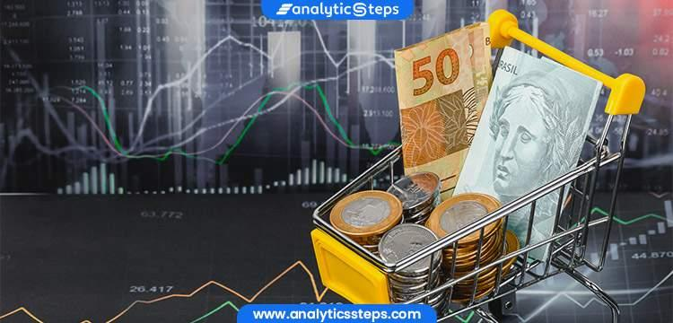

## Table of Contents

## What is a super currency?

A super currency is a type of money that is used across many different countries. It is meant to make trading and buying things easier between nations. Instead of each country using its own money, they all use the same super currency. This can help businesses and people save time and money when they need to exchange currencies.

For example, the Euro is a super currency used by many countries in Europe. Before the Euro, each country had its own money, like the French Franc or the German Mark. Now, they all use the Euro, which makes it simpler for them to trade with each other. A super currency can also help make the world's economy more stable because it reduces the risk of big changes in currency values.

## How does a super currency differ from traditional currencies?

A super currency is different from traditional currencies because it is used by many countries instead of just one. Traditional currencies, like the US Dollar or the Japanese Yen, are used only in their own countries. But a super currency, like the Euro, is used in many countries at the same time. This makes it easier for people and businesses in different countries to buy and sell things without having to change their money into another currency.

Another difference is that a super currency can help make the world's economy more stable. When each country has its own currency, the value of that currency can go up and down a lot. This can make it hard for businesses to plan and can cause problems in the economy. But with a super currency, the value is more stable because it is used by many countries. This can help prevent big changes in currency values and make trading between countries smoother.

## What are the key features of a super currency?

A super currency is used by many countries, not just one. This makes it easier for people and businesses in different countries to buy and sell things without having to change their money into another currency. For example, the Euro is a super currency used by many countries in Europe. This means that someone in France can easily buy something from Germany without worrying about exchanging their money.

Another key feature of a super currency is that it can help make the world's economy more stable. When each country has its own currency, the value of that currency can go up and down a lot. This can make it hard for businesses to plan and can cause problems in the economy. But with a super currency, the value is more stable because it is used by many countries. This can help prevent big changes in currency values and make trading between countries smoother.

## What is the mechanism behind a super currency?

A super currency works by being used in many countries at the same time. Instead of each country having its own money, like the US Dollar or the Japanese Yen, they all use the same super currency, like the Euro. This makes it easier for people and businesses in different countries to buy and sell things. For example, if someone in France wants to buy something from Germany, they can use the Euro without needing to change their money into another currency. This saves time and money and makes trading between countries simpler.

Another important part of how a super currency works is that it can help make the world's economy more stable. When each country has its own currency, the value of that currency can change a lot. This can make it hard for businesses to plan and can cause problems in the economy. But with a super currency, the value is more stable because it is used by many countries. This can help prevent big changes in currency values and make trading between countries smoother. By using a super currency, countries can work together to keep their economies strong and stable.

## How is a super currency created and managed?

A super currency is created when many countries agree to use the same money instead of their own. They work together to set up a special bank or organization to manage the super currency. For example, the Euro was created when many European countries decided to use it instead of their own money like the French Franc or the German Mark. They set up the European Central Bank to manage the Euro and make sure it works well for everyone.

Once a super currency is created, it is managed by the special bank or organization that was set up. This group makes decisions about how much of the super currency should be made and how to keep its value stable. They also watch over the economy of all the countries using the super currency to make sure it helps everyone. By working together, these countries can keep their economies strong and make it easier for people and businesses to trade with each other.

## What role do blockchain and cryptocurrencies play in super currencies?

Blockchain and cryptocurrencies can play a big role in super currencies. Blockchain is a special kind of computer system that keeps track of money in a very safe way. It can be used to make sure that a super currency is managed well and that no one can cheat the system. Cryptocurrencies, like Bitcoin, are a type of money that uses blockchain. They can be used as a super currency because they are not controlled by any one country. This means that people from different countries can use them to buy and sell things without needing to change their money into another currency.

However, using blockchain and cryptocurrencies for a super currency also has some challenges. One big challenge is that cryptocurrencies can be very up and down in value. This can make it hard for businesses to plan and can cause problems in the economy. Another challenge is that not everyone understands how to use cryptocurrencies yet. This means that it might take time for people to start using them as a super currency. But if these challenges can be solved, blockchain and cryptocurrencies could help make super currencies even better and more useful for everyone.

## What are the economic implications of adopting a super currency?

Adopting a super currency can make trading between countries easier. When countries use the same money, people and businesses don't have to change their money into another currency to buy and sell things. This saves time and money and makes it simpler for everyone. For example, if someone in France wants to buy something from Germany, they can use the Euro without any trouble. This can help businesses grow and create more jobs because it's easier to trade with other countries.

Another big effect of using a super currency is that it can make the world's economy more stable. When each country has its own money, the value of that money can go up and down a lot. This can make it hard for businesses to plan and can cause problems in the economy. But with a super currency, the value is more stable because it is used by many countries. This can help prevent big changes in money values and make trading between countries smoother. By using a super currency, countries can work together to keep their economies strong and stable.

## How does a super currency affect global trade and financial stability?

A super currency makes global trade easier. When many countries use the same money, people and businesses don't need to change their money to buy and sell things. This saves time and money. For example, someone in France can buy something from Germany using the Euro without any trouble. This helps businesses grow because trading with other countries is simpler. More trade can lead to more jobs and a stronger economy.

A super currency also helps make the world's economy more stable. When each country has its own money, the value of that money can change a lot. This can make it hard for businesses to plan and can cause problems in the economy. But with a super currency, the value is more stable because it is used by many countries. This can help prevent big changes in money values and make trading between countries smoother. By using a super currency, countries can work together to keep their economies strong and stable.

## What are the potential risks and challenges associated with super currencies?

One big challenge with super currencies is that not all countries might want to use the same money. Each country has its own economy and its own way of doing things. If they all use the same money, some countries might feel like they are losing control over their own economy. This can make it hard for them to make decisions that are best for their own people. Also, if one country has a big problem with its economy, it can affect all the other countries using the same super currency. This means that everyone has to work together to solve the problem, which can be hard.

Another risk is that the value of a super currency can still go up and down. Even though it is used by many countries, things like big changes in the world's economy or problems in one country can make the value of the super currency change. This can make it hard for businesses to plan and can cause problems in the economy. Also, not everyone might understand how to use a super currency at first. It can take time for people to learn how to use it and trust it. If people don't trust the super currency, they might not want to use it, which can make it hard for the super currency to work well.

## How can a super currency be integrated into existing financial systems?

To integrate a super currency into existing financial systems, countries need to work together to set up a special bank or organization to manage it. This group will make rules about how the super currency works and how to keep its value stable. They will also need to connect the super currency to the banks and businesses in each country. This means changing the computer systems and rules that banks use so they can handle the new super currency. It's a bit like adding a new type of money to a store's cash register, but on a much bigger scale.

Once the super currency is set up, people and businesses need to learn how to use it. Banks will need to teach their customers how to use the super currency for buying and selling things. They might also need to change their ATMs and online banking systems to work with the new money. It can take some time for everyone to get used to the new system, but once they do, it can make trading between countries much easier. By working together, countries can make sure the super currency fits well into their existing financial systems and helps everyone.

## What are the regulatory considerations for implementing a super currency?

When countries decide to use a super currency, they need to think about the rules that will help it work well. They need to set up a special group or bank to manage the super currency. This group will make rules about how the super currency is made and used. They will also need to make sure that the rules fit with the laws of all the countries using the super currency. This can be hard because each country has its own rules about money and banking. They will need to work together to find rules that everyone can agree on.

Another important thing to think about is how the super currency will be watched over. The special group or bank will need to make sure that the super currency is used in a fair way and that no one can cheat the system. They will also need to watch the economy of all the countries using the super currency to make sure it helps everyone. This means they will need to work with the governments and banks of each country to keep everything running smoothly. By making good rules and watching over the super currency carefully, countries can help make sure it works well for everyone.

## What future developments can we expect in the evolution of super currencies?

In the future, we might see more countries using super currencies to make trading easier. Right now, the Euro is used by many countries in Europe, but other parts of the world might start using their own super currencies too. For example, countries in Asia or Africa might decide to use the same money to help their economies grow. This could make it easier for people and businesses in these countries to buy and sell things without having to change their money into another currency.

Another big change we might see is the use of technology like blockchain and cryptocurrencies in super currencies. Blockchain can help keep the super currency safe and make sure no one can cheat the system. Cryptocurrencies, like Bitcoin, could be used as a super currency because they are not controlled by any one country. This means that people from different countries can use them to buy and sell things without needing to change their money. But for this to happen, people will need to learn how to use these new technologies and trust them. If these challenges can be solved, blockchain and cryptocurrencies could make super currencies even better and more useful for everyone.

## References & Further Reading

[1]: Krugman, P. R., & Obstfeld, M. (2006). ["International Economics: Theory and Policy."](https://archive.org/details/internationaleco0000krug_t6h6) Addison-Wesley.

[2]: Hull, J. C. (2015). ["Options, Futures, and Other Derivatives."](https://www.amazon.com/Options-Futures-Other-Derivatives-Global/dp/1292410655) Pearson Education Limited.

[3]: Keynes, J. M. (1980). ["The Collected Writings of John Maynard Keynes: Activities 1944-1946: The Transition to Peace."](https://www.cambridge.org/core/series/collected-writings-of-john-maynard-keynes/76BAC759DE69633B2FE5A471646FE40E) Cambridge University Press.

[4]: International Monetary Fund (2018). ["Special Drawing Rights (SDRs): Factsheet."](https://www.elibrary.imf.org/view/book/9781484330876/ch04.xml?redirect=true)

[5]: Kirilenko, A. A., Kyle, A. S., Samadi, M., & Tuzun, T. (2017). ["The Flash Crash: High-Frequency Trading in an Electronic Market."](https://www.jstor.org/stable/26652722) The Review of Financial Studies, 30(11), 2221–2256.

[6]: Lopez de Prado, M. (2018). ["Advances in Financial Machine Learning."](https://www.amazon.com/Advances-Financial-Machine-Learning-Marcos/dp/1119482089) Wiley.

[7]: Chan, E. P. (2009). ["Quantitative Trading: How to Build Your Own Algorithmic Trading Business."](https://github.com/ftvision/quant_trading_echan_book) Wiley.