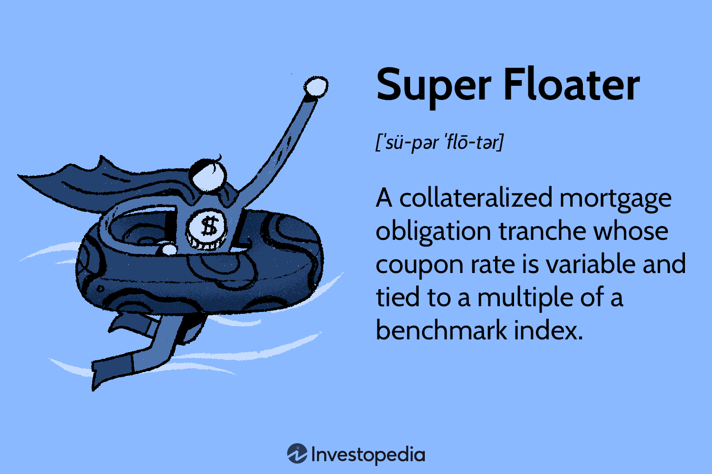

The thrilling world of both water sports and algorithmic trading presents unique challenges and opportunities. While they might seem unrelated at first glance, both fields demand a high degree of precision, strategic planning, and the utilization of appropriate tools to ensure success and safety. In water sports, participants rely heavily on devices like the Super Floater to maintain buoyancy and protection against potential hazards. Meanwhile, in financial markets, algorithmic trading uses advanced computer algorithms to execute trades with speed and accuracy that surpass human capability.

Both disciplines are characterized by their requirement for careful, calculated decision-making. In water sports, the choice of equipment, such as flotation devices, directly impacts the safety and performance of the athlete. Similarly, in financial trading, the selection and implementation of algorithms can mean the difference between profit and loss, especially in today's fast-paced and volatile markets.



This article explores the intriguing intersection of water sports flotation devices, particularly the Super Floater, and the principles of algorithmic trading. By examining how strategies and tools function in each domain to minimize risks and optimize outcomes, we can uncover new insights and opportunities that transcend the boundaries of each field. Understanding these concepts can not only enhance physical safety and performance in water sports but also lead to mastery and profitability in the financial markets.

## Table of Contents

## What is a Super Floater in Water Sports?

A super floater in water sports refers to a highly effective flotation device designed to enhance buoyancy and safety for individuals participating in water activities. These devices are crucial for non-swimmers and individuals engaging in high-risk water sports, providing essential support to prevent drowning and ensure enjoyment and safety on the water.

Flotation devices come in various types, each serving specific purposes depending on the activity and the user's skill level. The most common types include life jackets, buoyancy aids, and throwable flotation devices. Life jackets are generally recommended for weak swimmers or when engaging in activities like boating or kayaking, where there is a risk of the user being displaced from the vessel into the water. They provide significant buoyancy and are designed to turn an unconscious person face-up in the water.

Buoyancy aids, on the other hand, are more suited for confident swimmers and are often used in activities such as paddleboarding, windsurfing, and other surface water sports. These aids offer buoyancy support while allowing for greater freedom of movement, which is crucial for the dynamic requirements of these activities.

Choosing the right type of flotation device is vital not only for safety but also for performance. The selection should be based on factors such as the specific activity, water conditions, and the user's swimming ability and comfort. For instance, a kayaking enthusiast might prefer a lightweight, high-mobility life jacket that allows for paddling ease, whereas a surfer might opt for a personal flotation device that strikes a balance between buoyancy and unobstructed motion.

It's important to note that regulations often dictate the type and specifications of flotation devices required for certain activities or environments. These regulations are intended to minimize risks and promote safety among participants. Thus, understanding and adhering to these guidelines is essential for ensuring the proper use of flotation devices.

In summary, super floaters play a significant role in water sports by enhancing safety and providing users with the confidence to enjoy water activities. The appropriate choice of a flotation device, tailored to the specific requirements of the activity and the user's proficiency, is crucial for maximizing both safety and performance.

## The Role of Super Floaters in Financial Markets

In financial markets, a 'super floater' is a type of collateralized mortgage obligation (CMO) characterized by its floating coupon rate, which adjusts periodically based on a reference [interest rate](/wiki/interest-rate-trading-strategies) index, such as the London Interbank Offered Rate (LIBOR) or the Secured Overnight Financing Rate (SOFR). These securities are structured to provide investors with protection against interest rate [volatility](/wiki/volatility-trading-strategies), a crucial feature in the often unpredictable financial landscapes.

CMOs, including super floaters, are investment-grade securities backed by pools of residential or commercial mortgage loans. These mortgages are split into various tranches, each with its own risk and return profile. A super floater tranche is designed to appeal to investors seeking higher yield potential compared to fixed-rate securities while accepting some degree of interest rate risk variability.

The floating coupon rate is the defining characteristic of super floaters. It adjusts periodically, typically every quarter, according to the movements in the designated reference rate plus a fixed spread. This dynamic adjustment mechanism provides a hedge against rising interest rates because, as rates increase, so do the coupon payments from the super floaters. Conversely, when rates decrease, the coupon payments decline, but investors benefit from potential capital appreciation as bond prices might rise.

Understanding the role of super floaters is increasingly relevant for investment strategies, especially in volatile markets. These securities can serve as effective tools for portfolio diversification, allowing investors to mitigate interest rate risk while potentially capitalizing on market fluctuations. Additionally, super floaters' popularity often rises when investors anticipate interest rate hikes, positioning them as a strategic hedge against inflationary pressures.

The ability to properly integrate super floaters into investment portfolios requires a solid grasp of macroeconomic indicators and interest rate forecasts. Investors and financial managers must also consider underlying mortgage pool qualities, the legal structure of CMOs, and potential prepayment risks, which can affect cash flow and yield. By doing so, they can leverage super floaters to optimize returns and manage interest rate exposure effectively. 

In conclusion, super floaters play a pivotal role in financial markets by offering a flexible and adaptive investment vehicle. They enable investors to align their strategy with prevailing interest rate conditions, providing a balance of risk and reward that can be crucial in maintaining portfolio stability in turbulent economic times.

## Algo Trading: The New Age of Trading

Algorithmic trading, commonly known as algo trading, revolutionizes the financial markets by employing computer programs to execute trades automatically. These programs leverage algorithms to analyze extensive datasets, identify optimal trading opportunities, and perform transactions at speeds unattainable by human traders. 

The core of algo trading lies in its ability to process vast amounts of market data rapidly—this includes historical data, current market conditions, and predictive analysis. Algorithms utilize statistical and quantitative methods to predict market movements and determine the best times to buy or sell assets. For example, a simple moving average crossover strategy might generate buy signals when a short-term moving average crosses above a long-term moving average, and sell signals in the opposite scenario.

Algorithms also exploit [arbitrage](/wiki/arbitrage) opportunities by quickly identifying price discrepancies across different markets or exchanges and executing trades to profit from these differences. The speed and efficiency of algo trading eliminate human errors and biases, providing a precise and consistent trading approach.

The impact of algo trading on modern financial markets is profound. One of the significant contributions is increased market [liquidity](/wiki/liquidity-risk-premium). By facilitating large volumes of transactions with [high frequency](/wiki/high-frequency-trading), algo trading ensures that markets are liquid, making it easier to enter and [exit](/wiki/exit-strategy) positions without affecting price stability. This liquidity reduces bid-ask spreads, lowers trading costs for all market participants, and enhances market efficiency.

Moreover, algo trading contributes to the price discovery process, helping markets reflect the true value of assets more accurately. As algorithms react to new information almost instantaneously, they adjust prices to new equilibrium levels rapidly, reflecting the latest market sentiments and data.

However, it's essential to consider the risks and ethical concerns associated with algo trading. Market glitches, often exacerbated by high-frequency trading ([HFT](/wiki/high-frequency-trading-strategies)) algorithms, can lead to significant disruptions, as seen in the 2010 Flash Crash. Risk management strategies, including circuit breakers and fail-safes, are crucial in mitigating these risks and ensuring market stability. 

In summary, [algorithmic trading](/wiki/algorithmic-trading) transforms financial markets by fostering efficiency, liquidity, and price discovery. Nonetheless, the integration of robust risk management measures is vital to address potential pitfalls and maintain market integrity.

## Aligning Algo Trading Strategies with Super Floaters

The strategic parallel between the use of super floaters in water sports and algorithmic trading is grounded in the principles of risk management and optimization. In water sports, super floaters are essential for ensuring buoyancy and safety, acting as a preventative measure against emergencies. Similarly, in algorithmic trading, algorithms are crafted with precision to maximize potential profits while minimizing risks, acting as a financial safety net.

Algorithmic trading, driven by complex mathematical models and algorithms, seeks to optimize the execution of trades by analyzing vast datasets to identify patterns and opportunities that may not be apparent to human traders. At its core, algorithmic trading seeks to execute trades that are most favorable in terms of timing and price, ultimately aiming to increase profitability. This mirrors the function of super floaters, which aim to optimize safety in the water by providing support and stability.

For instance, just as super floaters are designed to support and stabilize participants during unpredictable conditions in water, trading algorithms are designed to adapt and stabilize in volatile market conditions. Strategies such as mean reversion, where an asset's price is predicted to revert to an average value, or [trend following](/wiki/trend-following), which advises taking positions based on the direction of the trend, are employed to anticipate and mitigate financial risks much like a floater mitigates the risk of drowning.

One illustrative case study of algorithmic strategies simulating the protective quality of super floaters can be observed in the use of [pair trading](/wiki/pair-trading) algorithms. Pair trading involves statistically matching pairs of securities that have historically moved together. When a divergence occurs, the algorithm shorts the outperforming security and longs the underperforming security, betting on their prices converging. This hedging mechanism provides a safety net through market volatility, maintaining balance much like a floater stabilizes a person in rough waters.

Another example is the use of volatility arbitrage strategies, which take advantage of discrepancies between option prices and the anticipated movement in stock prices (historical volatility vs. implied volatility). These strategies use complex mathematical models, such as the Black-Scholes model, to exploit differences, effectively providing a stabilizing effect much like the buoyancy provided by a super floater.

In both instances, the overarching goal is to balance potential risks and rewards. Flotation devices ensure the safety of water sport enthusiasts, protecting against physical harm, while algo trading strategies provide a buffer against potential financial losses, harnessing the computational power to swiftly react to market conditions. This careful tailoring of algorithms to address specific market conditions highlights the importance of strategic planning and risk management shared between water safety and financial trading.

## The Importance of Risk Management

Risk management is a critical component in both water sports and financial trading, serving to safeguard participants and investors against potential hazards. In water sports, the right choice of flotation device, such as a life jacket or a super floater, is essential for preventing accidents and ensuring safety in aquatic environments. These devices are designed to keep individuals buoyant and reduce the risk of drowning, particularly in high-risk activities like rafting or surfing. Properly fitted and suitable flotation devices act as a first line of defense against unforeseen circumstances, such as strong currents or equipment malfunctions, providing a safety net that can mean the difference between life and death.

Similarly, in trading, robust risk management strategies are crucial for mitigating financial losses. These strategies involve a systematic approach to identifying, analyzing, and responding to potential market risks. Popular tools in trading include stop-loss orders, which automatically close a position upon reaching a predetermined loss level, and position sizing, which helps determine the amount of capital to risk on a trade based on the trader's risk appetite. Another vital aspect of risk management in trading is diversification, which spreads investments across various assets to reduce exposure to any single asset's volatility.

Mathematically, traders often use quantitative methods to assess risk. For example, the Value at Risk (VaR) metric estimates the maximum potential loss an investment portfolio might experience over a specified time frame with a given confidence level. This is calculated using historical price data and statistical models:

$$
\text{VaR} = \text{Portfolio Value} \times \text{(Z-score of confidence level)} \times \text{(Standard deviation of portfolio returns)}
$$

In Python, a simple calculation of VaR might look like this:

```python
import numpy as np
from scipy.stats import norm

portfolio_value = 100000  # Example portfolio value in dollars
confidence_level = 0.95  # 95% confidence level
std_dev = 0.02  # Example standard deviation of portfolio returns

z_score = norm.ppf(confidence_level)
var = portfolio_value * z_score * std_dev

print(f"Value at Risk (VaR): ${var:.2f}")
```

This approach is analogous to choosing the right flotation device: both are precautionary measures that protect against adverse outcomes. Just as a poorly chosen or improperly used flotation device can fail during an emergency, inadequate risk management in trading can lead to significant monetary losses. In both fields, a comprehensive understanding of risks and the implementation of proactive safety measures are key to achieving optimal outcomes.

## Conclusion

The interplay between water sports flotation devices, like the Super Floater, and algorithmic trading highlights a fascinating juxtaposition of safety and precision tools in vastly different arenas. Both domains emphasize the necessity of employing the right instruments and strategies to achieve success and manage risks effectively. In water sports, the choice of an appropriate flotation device can be life-saving, providing essential buoyancy and security amidst unpredictable aquatic environments. Similarly, in finance, algorithmic trading serves as a vital tool, enhancing decision-making and profitability while navigating the complexities of financial markets.

The strategic applications of flotation devices and trading algorithms both underscore their critical roles in mitigating risks. In water sports, the Super Floater exemplifies how the right equipment can instill confidence and ensure safety. In parallel, algorithmic trading strategies, with their capacity to analyze vast datasets and execute trades with remarkable speed and accuracy, offer a formidable safety net against volatile market conditions.

Encouraging further exploration and understanding in both arenas is vital. For enthusiasts or professionals in water sports, learning more about flotation technologies can significantly enhance safety outcomes. Similarly, in trading, an in-depth comprehension of algorithmic strategies and risk management tools can foster improved financial resilience and smart investment decisions.

Ultimately, the symbiosis of safety measures and strategic planning seen in these two fields serves as a reminder of the universal importance of being prepared and informed, whether one is tackling waves or the stock market.

## References & Further Reading

[1]: ["Advances in Financial Machine Learning"](https://www.amazon.com/Advances-Financial-Machine-Learning-Marcos/dp/1119482089) by Marcos Lopez de Prado

[2]: ["Evidence-Based Technical Analysis: Applying the Scientific Method and Statistical Inference to Trading Signals"](https://www.amazon.com/Evidence-Based-Technical-Analysis-Scientific-Statistical/dp/0470008741) by David Aronson

[3]: ["Machine Learning for Algorithmic Trading"](https://github.com/stefan-jansen/machine-learning-for-trading) by Stefan Jansen

[4]: ["Quantitative Trading: How to Build Your Own Algorithmic Trading Business"](https://www.amazon.com/Quantitative-Trading-Build-Algorithmic-Business/dp/1119800064) by Ernest P. Chan

[5]: Damodaran, A. (2008). ["Strategic Risk Taking: A Framework for Risk Management"](https://archive.org/details/strategicrisktak0000damo). Pearson.

[6]: Hirschey, M. (2009). ["Risk Management and Derivatives"](https://archive.org/details/managerialeconom0000hirs_s2b6). Emerald Group Publishing Limited.