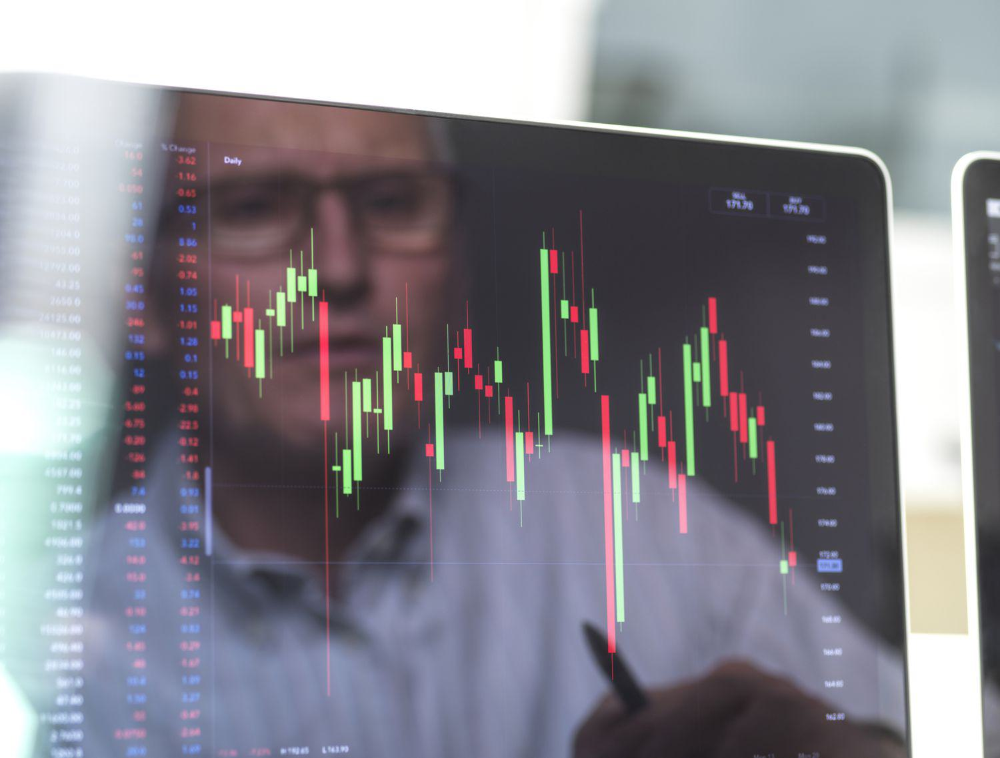

In the fast-paced world of finance, risk management is critical to maintaining stability and ensuring profitability. As financial markets become increasingly sophisticated and subject to rapid changes, the demand for effective risk mitigation strategies has never been higher. Among these strategies, super-hedging and algorithmic trading have emerged as powerful tools that leverage technology to enhance trade execution and manage risks effectively.

Super-hedging, a strategy borrowed from mathematical finance, involves creating a portfolio capable of withstanding market fluctuations by replicating or offsetting positions. This approach aims to ensure the value of the hedged portfolio meets or exceeds the value of the initial portfolio at a specified future date. Achieving this requires intricate knowledge and the ability to efficiently recycle capital within the portfolio, counterbalancing potential losses with gains from alternative positions.

On the other hand, algorithmic trading employs sophisticated computer programs to execute trades at high speeds and volumes, offering distinct advantages such as heightened efficiency and reduced costs. The ability to implement complex strategies with precision has made algorithmic trading a staple in high-frequency trading environments, where even minute price movements can lead to significant gains. However, the technology introduces new risks related to system malfunctions, as well as the accuracy and reliability of the data being processed.

This article explores the intersection of super-hedging and algorithmic trading, examining their collective impact on financial risk management. It will address how super-hedging can be effectively integrated into algorithmic trading to optimize risk management strategies. By engaging with these advanced strategies, traders and financial analysts can enhance their capabilities, making informed decisions that strike a balance between potential rewards and the risks involved.

As the financial landscape evolves, it is essential for market participants to adapt and incorporate innovative strategies that enable them to thrive despite inherent uncertainties. This discussion is intended for traders, financial analysts, and anyone with a keen interest in modern financial strategies, aiming to provide insights into optimizing risk management in the current financial environment.

## Table of Contents

## Understanding Super-Hedging

Super-hedging is a sophisticated financial strategy employed by traders to safeguard their portfolios against adverse market movements. At its core, super-hedging aims to construct a portfolio that can endure market volatility and ensure that its value does not fall below a certain threshold at a predetermined future date.

This strategy is implemented by creating a replicating portfolio that offsets the positions held by the trader. The replicating portfolio is built such that its payoff matches the obligations or liabilities the trader aims to hedge against. The essential feature of super-hedging is to ensure that the value of the hedged portfolio is at least equivalent to the initial portfolio at the given future date, even under unfavorable market conditions. This offers a form of risk control by guaranteeing a minimum outcome, despite potential market fluctuations.

Super-hedging requires a self-financing approach. This means that adjustments to the portfolio, such as buying new assets, must be financed by the proceeds from selling existing holdings. The self-financing condition can be expressed mathematically as:

$$
dV_t = \theta_t \cdot dS_t,
$$

where $dV_t$ is the change in value of the portfolio, $\theta_t$ represents the position in the risky asset, and $dS_t$ is the change in the asset's price. This equation underscores the need for dynamic management of the portfolio to maintain the hedge.

Challenges in super-hedging arise due to transaction costs associated with frequent trading and market imperfections such as illiquidity and slippage. Replicating a portfolio accurately can be costly and complex, often requiring advanced computational methods to optimize the strategy effectively. Despite these challenges, super-hedging remains a pivotal component of robust risk management, providing traders with an approach to mitigate potential losses and stabilize returns across various market scenarios.

## Algorithmic Trading: An Overview

Algorithmic trading utilizes sophisticated computer programs to execute trades at high speeds and volumes, transforming the landscape of modern financial markets. This approach leverages advanced algorithms to automate the trading process, enabling the execution of complex trading strategies with minimal human intervention. Key advantages of [algorithmic trading](/wiki/algorithmic-trading) include enhanced efficiency, significant cost reductions, and the ability to capitalize on intricate market opportunities that are challenging to execute manually.

One of the primary benefits of algorithmic trading is its ability to perform rapid and precise trade executions. This high-speed execution is crucial in market environments where prices can change in fractions of a second. Algorithms can process large volumes of data and make trading decisions faster than human traders, thus offering a competitive edge. Moreover, the automation of trades reduces the overall transaction costs by minimizing the impact of human errors and allowing trades to be executed at the most favorable prices.

Algorithmic trading also facilitates the implementation of complex trading strategies that utilize quantitative models and statistical methods. These strategies can analyze a vast array of data points, including market trends, historical prices, and real-time news, to identify profitable trading opportunities. By employing techniques like statistical [arbitrage](/wiki/arbitrage) and mean-reversion strategies, algorithmic trading can exploit small price differentials that are imperceptible to human traders.

Despite its advantages, algorithmic trading comes with inherent risks. Market [volatility](/wiki/volatility-trading-strategies) can lead to significant losses if algorithms do not respond adequately to rapid price changes. Additionally, technical failures such as system malfunctions or connectivity problems can disrupt trading activities, potentially leading to substantial financial setbacks. Data inaccuracies, whether due to erroneous inputs or misinterpretations, also pose risks that necessitate robust data validation and verification processes.

Algorithmic trading is predominantly used in high-frequency trading ([HFT](/wiki/high-frequency-trading-strategies)), where the goal is to capitalize on extremely short-term market inefficiencies. In HFT, traders use algorithms to conduct a high number of trades within very short time frames, often milliseconds or microseconds. By leveraging tiny price movements, HFT can generate substantial profits over time, although it requires significant capital investment in technology and infrastructure to maintain competitive latency advantages.

Understanding the architecture and strategy behind algorithmic trading is crucial for traders who aim to maximize the benefits of this technology. Successful algorithmic trading involves the integration of several components, including data acquisition, signal generation, risk management, and execution models. Advanced algorithms must be continuously refined and tested to adapt to changing market conditions, ensuring they remain effective in achieving the desired trading objectives.

In summary, algorithmic trading represents a powerful tool in modern finance, offering the ability to execute high-speed, [volume](/wiki/volume-trading-strategy)-driven trades while implementing sophisticated strategies. However, traders must remain vigilant in managing the associated risks and technical challenges to fully exploit the potential benefits of algorithmic trading in an evolving financial landscape.

## Integration of Super-Hedging in Algorithmic Trading

Integrating super-hedging with algorithmic trading offers enhanced risk management capabilities through the automation of complex hedging strategies. This integration leverages the strengths of algorithmic trading, which excels in efficiency and speed, to dynamically implement super-hedging techniques in real time. By doing so, algorithms are able to swiftly adjust positions in response to market changes, effectively maximizing returns while systematically minimizing potential losses.

The core of this integration lies in the algorithm's ability to continuously assess market conditions and adjust hedging positions accordingly. Traditional hedging strategies often require manual intervention and are limited by human reaction times. In contrast, algorithmic systems can execute trades based on pre-defined criteria and continuously optimize these criteria through data analysis and [machine learning](/wiki/machine-learning). For instance, an algorithm designed to implement a super-hedging strategy might involve constructing a portfolio that replicates a required payoff while accounting for market imperfections and transaction costs.

A successful integration of super-hedging into algorithmic trading mandates the deployment of sophisticated monitoring systems. These systems require continuous data feeds and robust computational frameworks to simulate and predict market behaviors. Advanced monitoring allows traders to ensure that hedging strategies remain effective under changing market conditions and that the implemented algorithms adhere to risk management guidelines rigorously.

Moreover, continuous optimization of trading algorithms is critical. This involves regular updates to the algorithmic models based on [backtesting](/wiki/backtesting) and forward-testing results. Machine learning techniques can be instrumental in refining these models, allowing them to adapt to new patterns and anomalies within the financial markets.

The benefits of integrating super-hedging strategies into algorithmic trading are clear. By automating the execution of these strategies, traders can potentially achieve superior portfolio resilience and profitability, even amidst volatile market conditions. This approach minimizes the manual workload on traders and enhances the precision of hedging efforts, ultimately leading to more robust financial risk management practices.

In summary, the integration of super-hedging with algorithmic trading provides significant advantages in risk management by automating adjustments to hedging positions based on real-time data. Such strategies enable traders to maintain competitive and profitable portfolios, adapting quickly to market dynamics without sacrificing accuracy or efficiency.

## Risk Management Strategies in Algorithmic Trading

Risk management is an integral component of algorithmic trading, ensuring traders can efficiently navigate market complexities while minimizing potential losses. One of the primary strategies for effective risk reduction is diversification across various algorithms and asset classes. By spreading investments across multiple assets and employing a variety of trading algorithms, traders can mitigate the impact of adverse movements in any single asset or strategy. This approach not only reduces exposure to idiosyncratic risks but also enhances the stability of the trading portfolio.

Setting risk limits and employing stop-loss orders are crucial practices for preventing excessive losses. Risk limits define the maximum allowable downside for each position, ensuring that traders maintain a disciplined approach to risk exposure. Similarly, stop-loss orders automatically sell positions when asset prices reach predetermined levels, thereby capping potential losses and preventing emotional decision-making during volatile markets.

Real-time monitoring and stress testing are essential tools for identifying and mitigating unexpected risks. By continuously assessing market conditions and evaluating the performance of trading strategies, traders can react swiftly to unforeseen events. Stress testing simulates extreme market scenarios to evaluate the resilience of trading systems, allowing for adjustments before actual adverse conditions occur.

Advanced techniques such as dynamic position sizing and adaptive algorithms further optimize risk-reward ratios. Dynamic position sizing involves adjusting the size of trading positions based on current volatility and market conditions, ensuring that risk exposure is aligned with potential returns. Adaptive algorithms modify trading strategies in real-time, using machine learning and data analysis to predict market trends and adjust positions accordingly. These adaptive systems can enhance profitability by optimizing entry and [exit](/wiki/exit-strategy) points based on evolving market dynamics.

Technical and operational risk management ensures the robustness of algorithmic trading systems. This includes regular system audits to prevent technical failures and thorough testing to guarantee strategy compliance with regulatory requirements. Implementing reliable infrastructure, redundancy systems, and real-time technical support mitigates the risk of operational disruptions, which could otherwise lead to significant financial losses.

By employing these risk management strategies, algorithmic traders can not only safeguard their investments but also position themselves to capitalize on market opportunities with greater confidence. The combination of diversification, risk limits, dynamic algorithms, and robust technical systems creates a comprehensive framework for managing the multifaceted risks associated with algorithmic trading.

## Challenges and Future of Super-Hedging and Algorithmic Trading

Super-hedging and algorithmic trading have become integral components of modern financial markets, each presenting a unique set of challenges and opportunities. Despite the promise of risk mitigation via super-hedging, practitioners encounter significant hurdles, primarily due to the high transaction costs and the inherent complexity of maintaining replicating portfolios. Super-hedging requires the creation of a replicating strategy that guarantees the hedged portfolio to perform as well as the initial one under various market conditions. This comes with expenses such as commission fees, potential market impact, and slippage, which can erode profit margins and complicate implementation.

Algorithmic trading, while offering efficiency and speed, introduces its complexities. The technical failures and market volatility it faces demand robust and adaptable infrastructure. There's an ever-present risk of system malfunctions, exacerbated by high-frequency environments where trades occur in fractions of a second. As such, traders need comprehensive risk management frameworks to address operational and market risks. The combination of stop-loss mechanisms, real-time monitoring, and rigorous stress testing is essential to mitigate these risks effectively.

The future of super-hedging and algorithmic trading may hinge on the advancement of [artificial intelligence](/wiki/ai-artificial-intelligence) and machine learning. These technologies hold the potential to refine risk analysis and strategy development, making trading models more adaptive and predictive. Machine learning algorithms can process vast datasets to identify patterns and insights that might elude traditional analysis, enabling traders to refine hedging approaches dynamically.

Furthermore, continuous technological progress may enhance the accessibility and efficacy of super-hedging strategies. Innovations in computational power, data analytics, and trading platforms could reduce the complexity and cost-related barriers currently associated with super-hedging.

For traders, staying informed and adaptive is imperative to capitalize on future opportunities. This involves keeping abreast of technological advancements, regulatory changes, and market dynamics to maintain a competitive edge and mitigate emerging risks. With the financial landscape constantly evolving, a proactive approach to education and technology integration will be crucial for success.

In conclusion, while the challenges of super-hedging and algorithmic trading are significant, the opportunities for refinement and innovation through AI and technology advancements present a promising pathway for future growth and effectiveness in risk management.

## Conclusion

Risk management is an essential component of successful trading, especially when utilizing algorithmic strategies and super-hedging techniques. Integrating these advanced strategies allows traders to enhance their capacity for risk management and to maximize returns. These methods provide a strong framework for mitigating potential losses and adapting to varying market conditions.

As financial markets become more intricate and interconnected, the adoption of innovative risk management tools is crucial for maintaining a competitive edge. Algorithmic trading and super-hedging offer traders the precision and flexibility needed to navigate these complexities. By implementing these technologies, traders can systematically manage risk, thereby ensuring their portfolios remain robust and profitable even amidst market volatility.

Continuous education, updates in technology, and meticulous strategic planning are vital for traders to tackle the challenges of present-[day trading](/wiki/day-trading-spy) environments. Staying informed about technological advancements and market trends will empower traders to refine their strategies continually, leading to improved risk management and better decision-making capabilities.

The intersection of risk management practices with algorithmic technologies opens up new opportunities for future exploration and success. This synergy enhances the overall effectiveness of trading strategies, enabling traders to capitalize on opportunities while mitigating potential downsides. The progression of these strategies promises significant advancements in how traders manage risk and optimize portfolio performance.

## References & Further Reading

[1]: Bergstra, J., Bardenet, R., Bengio, Y., & Kégl, B. (2011). ["Algorithms for Hyper-Parameter Optimization."](https://dl.acm.org/doi/10.5555/2986459.2986743) Advances in Neural Information Processing Systems 24.

[2]: ["Advances in Financial Machine Learning"](https://www.amazon.com/Advances-Financial-Machine-Learning-Marcos/dp/1119482089) by Marcos Lopez de Prado

[3]: ["Evidence-Based Technical Analysis: Applying the Scientific Method and Statistical Inference to Trading Signals"](https://www.amazon.com/Evidence-Based-Technical-Analysis-Scientific-Statistical/dp/0470008741) by David Aronson

[4]: ["Machine Learning for Algorithmic Trading"](https://github.com/stefan-jansen/machine-learning-for-trading) by Stefan Jansen

[5]: ["Quantitative Trading: How to Build Your Own Algorithmic Trading Business"](https://www.amazon.com/Quantitative-Trading-Build-Algorithmic-Business/dp/1119800064) by Ernest P. Chan