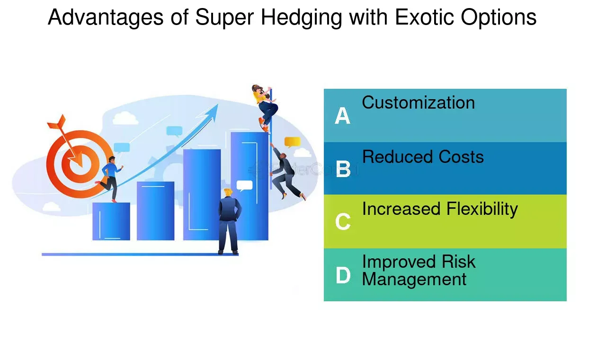

## Table of Contents

## What is super-hedging?

Super-hedging is a strategy used in finance to make sure an investment is completely safe from losing money. It involves using different financial tools, like options and futures, to cover all possible risks. The goal is to create a situation where no matter what happens in the market, the investment will not lose value. This is different from regular hedging, which only reduces risk but doesn't eliminate it entirely.

Super-hedging can be very expensive because it requires buying a lot of financial tools to cover every possible outcome. It's often used by big investors or companies that need to protect large amounts of money. While it provides the highest level of protection, it's not always practical for everyone because of the high costs involved.

## How does super-hedging differ from traditional hedging?

Super-hedging and traditional hedging both aim to reduce risk, but they do it in different ways. Traditional hedging is like putting on a raincoat when it might rain. It helps protect you from getting wet, but if it pours heavily, you might still get a little damp. In finance, traditional hedging uses tools like options or futures to lessen the impact of market changes, but it doesn't guarantee you won't lose any money.

On the other hand, super-hedging is like carrying an umbrella, wearing a raincoat, and having a backup plan all at once. It's designed to make sure you stay completely dry no matter how hard it rains. In finance, super-hedging uses a lot of different financial tools to cover every possible risk, ensuring that your investment won't lose value under any circumstances. This makes super-hedging more expensive and complex than traditional hedging, but it offers the highest level of protection.

## What are the primary objectives of super-hedging?

The main goal of super-hedging is to make sure an investment is totally safe from losing money. It does this by using lots of different financial tools, like options and futures, to cover all the possible risks. The idea is to set things up so that no matter what happens in the market, the investment will keep its value. This is different from regular hedging, which only tries to reduce the risk but doesn't promise to keep the investment completely safe.

Super-hedging is often used by big investors or companies who need to protect large amounts of money. It's like having the best insurance you can get, but it costs a lot more because you need to buy many different financial tools. While super-hedging gives the highest level of protection, it's not always practical for everyone because of how expensive it can be.

## Can you explain the basic mechanics of super-hedging?

Super-hedging works by using a lot of different financial tools, like options and futures, to make sure an investment stays safe no matter what happens in the market. Imagine you're trying to protect a garden from bad weather. Instead of just using a simple cover, you set up multiple layers of protection: a greenhouse, a sprinkler system, and even a backup power source. In finance, this means buying options that cover all possible price movements, so if the market goes up, down, or stays the same, your investment is protected.

This strategy is like having the best insurance you can get. It's very expensive because you need to buy many different financial tools to cover every possible outcome. Big investors or companies often use super-hedging because they need to protect large amounts of money. While it gives the highest level of protection, it's not always practical for everyone because of the high costs involved.

## What financial instruments are commonly used in super-hedging strategies?

Super-hedging uses a lot of different financial tools to make sure an investment is totally safe. The most common tools are options and futures. Options give you the right to buy or sell something at a certain price, which can protect your investment if the market moves against you. Futures are agreements to buy or sell something at a set price in the future, which can help lock in prices and avoid losses.

Other tools used in super-hedging include swaps and forwards. Swaps let you exchange cash flows with someone else, which can be useful for managing different kinds of risk. Forwards are like futures but are more customizable and not traded on exchanges. All these tools work together to cover every possible risk, making sure your investment stays safe no matter what happens in the market.

## How does super-hedging help in managing risk in financial markets?

Super-hedging helps manage risk in financial markets by making sure an investment doesn't lose value, no matter what happens. It's like using many layers of protection to keep your investment safe. Imagine you're protecting a garden from bad weather. Instead of just using one cover, you set up a greenhouse, a sprinkler system, and even a backup power source. In finance, this means using lots of different tools like options and futures to cover all possible risks. If the market goes up, down, or stays the same, your investment is protected.

This strategy is very expensive because you need to buy many different financial tools to cover every possible outcome. Big investors or companies often use super-hedging because they need to protect large amounts of money. While it gives the highest level of protection, it's not always practical for everyone because of the high costs involved. But for those who can afford it, super-hedging offers peace of mind, knowing their investment is safe no matter what happens in the market.

## What are the potential benefits of implementing a super-hedging strategy?

Implementing a super-hedging strategy can give you the biggest protection against losing money in the market. It's like having the best insurance you can get. No matter what happens, your investment stays safe. This is really helpful for big investors or companies that need to protect a lot of money. They can feel more secure knowing that their investments won't lose value, even if the market goes crazy.

But super-hedging isn't perfect. It can be very expensive because you need to buy a lot of different financial tools to cover every possible risk. This means it might not be practical for everyone. Smaller investors might find it too costly. Still, for those who can afford it, super-hedging offers peace of mind and the highest level of protection against market changes.

## What are the challenges and limitations associated with super-hedging?

Super-hedging can be really hard to do because it's very expensive. You need to buy a lot of different financial tools, like options and futures, to cover every possible risk. This means it might not be practical for everyone, especially smaller investors who can't afford the high costs. It's like trying to buy the best insurance for your investment, but the price tag can be too high for many people.

Another challenge is that super-hedging can be very complicated. You have to understand and manage a lot of different financial instruments at the same time. This requires a lot of knowledge and skill, which not everyone has. Even if you can afford it, setting up and maintaining a super-hedging strategy can be tricky and time-consuming. It's like trying to juggle many balls at once, and if you drop one, your whole plan could fail.

## How can super-hedging be integrated into a broader investment strategy?

Super-hedging can be a part of a bigger investment plan, but it's important to think about how it fits in. Imagine you're planning a trip and you want to make sure nothing goes wrong. You might buy travel insurance, which is like super-hedging for your trip. In your investment plan, super-hedging can be used to protect your most important investments, like the ones you can't afford to lose. You might use it for a big part of your money, while still taking some risks with the rest to try and grow your wealth.

The tricky part is balancing super-hedging with other parts of your investment plan. Since super-hedging is expensive, you have to decide how much you're willing to spend on safety versus how much you want to invest in things that could grow your money. It's like choosing how much to spend on a safety net versus how much to put into a new business. If you're a big investor or a company, super-hedging might be worth it for the peace of mind it brings. But for smaller investors, it might be better to use simpler, cheaper ways to manage risk and still have a chance to make more money.

## What are some real-world examples of super-hedging in action?

A big company might use super-hedging to protect itself from changes in currency values. Imagine a company in the U.S. that buys a lot of stuff from Europe. They want to make sure that if the euro gets stronger against the dollar, they don't have to pay more money. So, they might use options and futures to cover all possible changes in the exchange rate. This way, no matter what happens, they know exactly how much they'll have to pay for their European goods.

Another example could be an investment fund that wants to protect a big part of its money. Let's say the fund has a lot of money in stocks, but they're worried about a big drop in the market. They might use super-hedging by buying options that will pay off if the stock market goes down. They could also use futures to lock in prices and protect against big losses. This way, even if the market crashes, their investment stays safe.

## How does super-hedging impact the pricing and valuation of financial derivatives?

Super-hedging can make financial derivatives more expensive because it involves buying a lot of them to cover every possible risk. Imagine you're buying insurance for your house. If you want the best insurance that covers everything, like fire, flood, and theft, it will cost more than a basic policy. In finance, super-hedging is like buying the best insurance for your investments. You need to buy many different options and futures, which increases the demand for these derivatives and can drive up their prices.

This also affects how people value these financial tools. When you're super-hedging, you're looking at the worst-case scenarios and making sure you're covered for all of them. This means you might pay more for derivatives that protect against extreme market moves. It's like valuing a life jacket more if you know you're going to sail through a storm. So, the need to cover all risks with super-hedging can lead to higher valuations for derivatives that offer the most protection.

## What advanced mathematical models are used to optimize super-hedging strategies?

Advanced mathematical models like stochastic calculus and option pricing models, such as the Black-Scholes model, are used to optimize super-hedging strategies. These models help investors figure out the best way to use financial tools like options and futures to protect their investments from all possible risks. Stochastic calculus deals with random changes in the market, which is important for super-hedging because it needs to cover every possible outcome. The Black-Scholes model helps calculate the fair price of options, which is key for buying the right amount of options to create a super-hedge.

Another important model is the binomial model, which breaks down the possible future movements of an asset into a series of steps. This model is useful for super-hedging because it lets investors see all the different paths the market could take and plan their hedging strategy accordingly. By using these models, investors can make sure they're buying the right mix of financial tools to cover all risks, making their super-hedging strategy as effective as possible.

## What is Understanding Super-Hedging?

Super-hedging is a sophisticated financial strategy employed by traders to safeguard their portfolios against adverse market movements. At its core, super-hedging aims to construct a portfolio that can endure market [volatility](/wiki/volatility-trading-strategies) and ensure that its value does not fall below a certain threshold at a predetermined future date.

This strategy is implemented by creating a replicating portfolio that offsets the positions held by the trader. The replicating portfolio is built such that its payoff matches the obligations or liabilities the trader aims to hedge against. The essential feature of super-hedging is to ensure that the value of the hedged portfolio is at least equivalent to the initial portfolio at the given future date, even under unfavorable market conditions. This offers a form of risk control by guaranteeing a minimum outcome, despite potential market fluctuations.

Super-hedging requires a self-financing approach. This means that adjustments to the portfolio, such as buying new assets, must be financed by the proceeds from selling existing holdings. The self-financing condition can be expressed mathematically as:

$$
dV_t = \theta_t \cdot dS_t,
$$

where $dV_t$ is the change in value of the portfolio, $\theta_t$ represents the position in the risky asset, and $dS_t$ is the change in the asset's price. This equation underscores the need for dynamic management of the portfolio to maintain the hedge.

Challenges in super-hedging arise due to transaction costs associated with frequent trading and market imperfections such as illiquidity and slippage. Replicating a portfolio accurately can be costly and complex, often requiring advanced computational methods to optimize the strategy effectively. Despite these challenges, super-hedging remains a pivotal component of robust risk management, providing traders with an approach to mitigate potential losses and stabilize returns across various market scenarios.

## References & Further Reading

[1]: Bergstra, J., Bardenet, R., Bengio, Y., & Kégl, B. (2011). ["Algorithms for Hyper-Parameter Optimization."](https://dl.acm.org/doi/10.5555/2986459.2986743) Advances in Neural Information Processing Systems 24.

[2]: ["Advances in Financial Machine Learning"](https://www.amazon.com/Advances-Financial-Machine-Learning-Marcos/dp/1119482089) by Marcos Lopez de Prado

[3]: ["Evidence-Based Technical Analysis: Applying the Scientific Method and Statistical Inference to Trading Signals"](https://www.amazon.com/Evidence-Based-Technical-Analysis-Scientific-Statistical/dp/0470008741) by David Aronson

[4]: ["Machine Learning for Algorithmic Trading"](https://github.com/stefan-jansen/machine-learning-for-trading) by Stefan Jansen

[5]: ["Quantitative Trading: How to Build Your Own Algorithmic Trading Business"](https://www.amazon.com/Quantitative-Trading-Build-Algorithmic-Business/dp/1119800064) by Ernest P. Chan