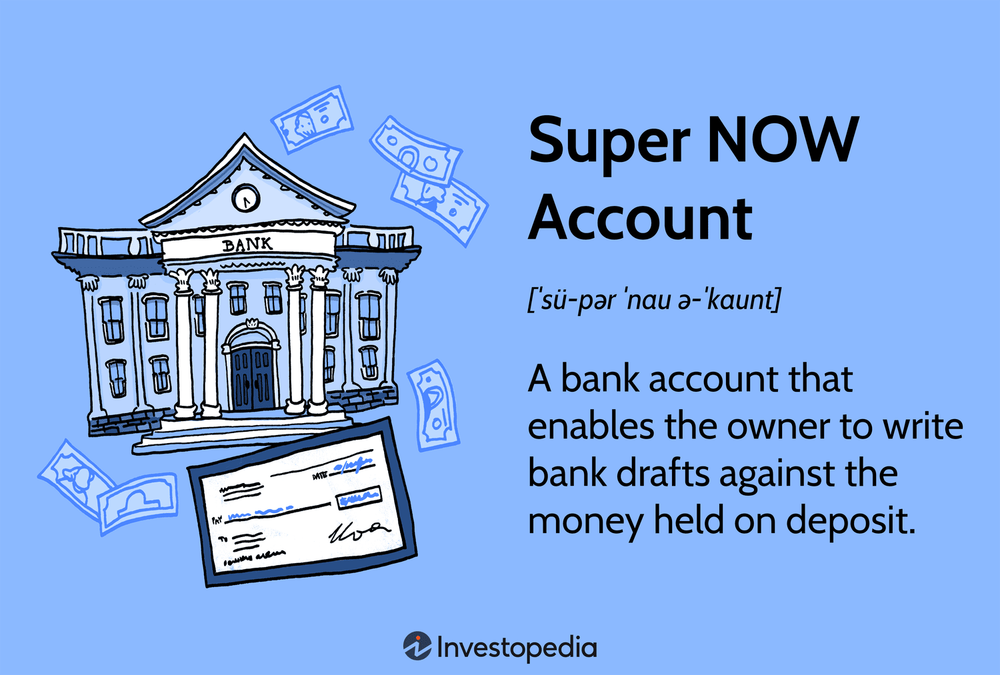

The financial sector is a dynamic field that encompasses a variety of banking and investment options designed to meet diverse financial needs. Among the myriad choices available, Super NOW Accounts, Negotiable Order of Withdrawal (NOW) accounts, and algorithmic trading stand out as significant components. This article intends to shed light on the functionalities and benefits of these banking products and trading methods. By doing so, it aims to enhance your financial management and trading strategies.

Super NOW Accounts and NOW accounts are specialized bank accounts that offer interest-bearing capabilities alongside the flexibility of traditional checking accounts. These accounts represent historical and regulatory developments in banking, providing users with the opportunity to earn interest while maintaining the convenience of check-writing privileges. Understanding their origins and their roles in today's financial landscape can help assess current banking options and choose those that align with personal financial goals.



Furthermore, algorithmic trading represents a modern approach to financial trading, where computer algorithms swiftly execute trades based on pre-established criteria. Its adoption is increasing rapidly due to its ability to handle intricate computations and adjust to market changes quickly, providing a strategic edge in today's fast-paced markets. Integrating these advanced trading techniques with traditional banking services, such as Super NOW Accounts, can optimize cash management, enhancing the efficiency of overall financial strategies.

By exploring these subjects, this article will demystify complex terminologies and functionalities, offering valuable insights into managing finances and making more informed decisions about banking and trading. As the financial market continues to evolve, staying informed about these tools is essential for optimizing financial outcomes and ensuring robust financial planning.

## Table of Contents

## What is a Super NOW Account?

A Super NOW Account is a unique type of interest-bearing bank account that combines elements of traditional checking accounts with the benefits of a money market account. This type of account allows account holders to write checks against deposited funds while simultaneously earning interest, typically at a rate higher than that offered by conventional checking accounts. This combination of features makes Super NOW Accounts advantageous for individuals who desire the convenience of check-writing capabilities alongside the benefit of accruing interest on their deposited funds.

Historically, Super NOW Accounts became popular due to regulatory constraints that restricted interest payments on demand deposits, such as traditional checking accounts. Prior to the deregulation that occurred with amendments to federal banking laws, these accounts offered an attractive alternative by providing a means to earn interest while maintaining liquidity similar to that of checking accounts. As a result, they played a significant role in circumventing restrictions imposed by Regulation Q, which prohibited banks from offering interest on demand deposits.

However, due to subsequent regulatory changes and the introduction of other financial products offering competitive interest rates and favorable terms, Super NOW Accounts are not as prevalent as they once were. Financial institutions now provide various alternatives, such as high-yield savings accounts and money market accounts, which often come with fewer restrictions and potentially higher returns.

Understanding the origins and characteristics of Super NOW Accounts is essential for evaluating their relevance in today's financial landscape. Individuals exploring banking options must weigh the benefits and limitations of Super NOW Accounts against contemporary alternatives to determine the best fit for their financial needs and goals. While these accounts historically offered a distinctive blend of features, changing regulations and market dynamics have shifted the landscape, prompting consumers to consider newer, often more advantageous banking solutions.

## The Mechanics of Negotiable Order of Withdrawal (NOW) Accounts

Negotiable Order of Withdrawal (NOW) accounts emerged as a financial innovation to enable interest payments on checking accounts, which were previously restricted under the Federal Reserve's Regulation Q. Prior to their introduction, depositors could not earn interest on demand deposits, limiting the appeal of traditional checking accounts for those seeking both accessibility and interest income.

NOW accounts are characterized by their flexibility, permitting accountholders to write drafts against their account balance in a manner akin to traditional check-writing. This feature provides a convenient means of accessing funds while maintaining the [liquidity](/wiki/liquidity-risk-premium) essential for everyday banking needs. The introduction of NOW accounts marked a significant step in evolving U.S. banking regulations, effectively blurring the lines between checking and savings accounts and setting a precedent for future innovations in the financial services sector.

While NOW accounts typically necessitate the maintenance of a minimum balance to sidestep fees, they offer appreciably greater liquidity relative to conventional savings accounts. This makes them an attractive option for users requiring swift access to their funds while retaining the ability to accrue interest. The balance between accessibility and earnings is a distinctive advantage, aligning well with the financial goals of individuals who need both immediate fund availability and interest generation.

The benefits of NOW accounts, combined with their ability to provide moderate interest earnings, underscore their ongoing relevance in personal banking. Despite evolving banking products and services, NOW accounts continue to serve those seeking a balance between ease of access and financial growth.

## Advantages and Disadvantages of NOW and Super NOW Accounts

NOW (Negotiable Order of Withdrawal) accounts offer several advantages that make them appealing to certain consumers. One of their primary benefits is the ability to earn interest on the balance while maintaining the flexibility of check-writing capabilities, similar to a standard checking account. This dual functionality provides account holders with liquidity and modest income generation, making them suitable for individuals who seek to grow their funds while retaining easy access. Additionally, NOW accounts are insured by the Federal Deposit Insurance Corporation (FDIC), providing an added layer of security that ensures the safety of depositor funds up to the insured limits.

However, NOW accounts also have disadvantages that potential account holders need to consider. These accounts often require a minimum balance to be maintained to avoid incurring fees. Failure to meet this requirement may lead to additional costs that detract from any interest earnings. Moreover, specific withdrawal limitations may apply, affecting account accessibility when compared to traditional checking accounts.

Super NOW accounts, a variant of the standard NOW account, typically offer slightly higher interest rates. These accounts are designed to provide even greater benefits for those who can maintain higher deposit balances. The increased [interest rate](/wiki/interest-rate-trading-strategies) can result in more significant earnings from the deposited funds, enhancing the attractiveness of Super NOW accounts for consumers seeking to optimize their interest income.

Overall, understanding the pros and cons of NOW and Super NOW accounts is crucial in selecting the right account to align with one's financial strategies. Choosing the appropriate account depends on individual financial circumstances and needs, such as the ability to maintain minimum balances and the desired balance between liquidity and income. This awareness can lead to more informed decisions, optimizing both convenience and financial returns.

## Algorithmic Trading: A Modern Trading Strategy

Algorithmic trading, often referred to as algo trading, leverages advanced computer algorithms to execute trades in financial markets based on predefined criteria. This approach significantly enhances speed and efficiency compared to traditional trading methods, as it allows traders to automate processes that would otherwise require human intervention. 

The popularity of [algorithmic trading](/wiki/algorithmic-trading) has surged as algorithms can process complex computations and swiftly adapt to ever-changing market conditions. By using real-time data analysis and historical patterns, algorithms can identify optimal trading opportunities within milliseconds, a feat unattainable by human traders. The efficiency of this method can be illustrated through a simple algorithm using Python's Pandas library for financial data analysis:

```python
import pandas as pd

# Sample pseudocode for a basic moving average crossover strategy
def simple_moving_average(prices, window_size):
    return prices.rolling(window=window_size).mean()

def trading_strategy(prices):
    # Calculate short and long-term moving averages
    short_window = 40
    long_window = 100
    signals = pd.DataFrame(index=prices.index)
    signals['signal'] = 0.0
    signals['short_mavg'] = simple_moving_average(prices['Close'], short_window)
    signals['long_mavg'] = simple_moving_average(prices['Close'], long_window)

    # Create signals when short MA crosses above long MA
    signals['signal'][short_window:] = np.where(signals['short_mavg'][short_window:] 
                                                > signals['long_mavg'][short_window:], 1.0, 0.0)   

    # Generate trading orders
    signals['positions'] = signals['signal'].diff()
    return signals
```

Algorithmic trading can be effectively integrated with banking services like Negotiable Order of Withdrawal (NOW) accounts to optimize cash management. By ensuring that cash is efficiently managed between trading activities and interest-bearing accounts, this integration maximizes the use of available capital. For example, idle funds can be seamlessly moved to NOW accounts, where they continue to earn interest until needed for trading.

Moreover, traders benefit from lower transaction costs due to the high-[volume](/wiki/volume-trading-strategy) trading capabilities of algorithms. The analytical power of algorithmic trading allows for an enhanced market analysis, providing insights into market trends, price movements, and potential risk factors. This comprehensive market understanding translates into more informed trading decisions and improved financial outcomes. 

Algorithmic trading's capability to execute large volumes of trades at a fraction of the usual cost, combined with the strategic use of real-time analytics, positions it as an indispensable tool in modern financial strategies.

## Integrating Super NOW Accounts with Algorithmic Trading

Integrating Super NOW accounts with algorithmic trading can significantly enhance the efficiency of asset management and optimize return rates. Super NOW accounts offer a higher yield than standard checking accounts due to their interest-bearing nature. By harnessing this liquidity, traders can achieve an attractive balance between [earning](/wiki/earning-announcement) interest and maintaining readily accessible funds for trading activities.

Algorithmic trading operates by executing trades through computer algorithms based on predefined criteria, optimizing both speed and efficiency. By incorporating Super NOW accounts into this trading strategy, traders can bolster their cash management. The high liquidity of Super NOW accounts ensures that funds can be quickly mobilized to take advantage of trading opportunities, reducing the amount of idle cash and optimizing transaction timing.

The integration can be represented by optimizing the balance between account liquidity and algorithmic execution. Consider a scenario where the average annual interest rate of a Super NOW account is $r$, and the average annual return rate from investments made using algorithmic trading is $R$. The strategy aims to maximize the combined return:

$$

\text{Total Return} = (1 - \alpha) \cdot r + \alpha \cdot R 
$$

where $\alpha$ represents the proportion of the total capital allocated for algorithmic trading. The goal is to find the optimal $\alpha$ that maximizes total return while considering the risks and liquidity needs.

Python code can be employed to simulate different scenarios and optimize $\alpha$:

```python
def optimize_allocation(r, R, total_funds, trading_liquidity_requirement):
    best_alpha = 0
    max_return = 0
    for alpha in [i * 0.01 for i in range(101)]:
        if alpha * total_funds >= trading_liquidity_requirement:
            current_return = (1 - alpha) * r + alpha * R
            if current_return > max_return:
                max_return = current_return
                best_alpha = alpha
    return best_alpha, max_return

# Example usage:
r = 0.02  # 2% interest rate in Super NOW account
R = 0.05  # 5% return rate from algorithmic trading
total_funds = 100000  # Total capital
trading_liquidity_requirement = 20000  # Minimum required liquidity for trading

optimal_allocation = optimize_allocation(r, R, total_funds, trading_liquidity_requirement)
print("Optimal alpha:", optimal_allocation[0])
print("Maximized total return:", optimal_allocation[1])
```

This code simulates the allocation of assets between a Super NOW account and algorithmic trading ventures, considering the constraint of maintaining necessary trading liquidity. Understanding and optimizing these interactions can significantly improve trading performance, manage liquidity efficiently, and enhance overall financial strategy.

## Conclusion

Super NOW and NOW accounts, despite seeing a decline in their prevalence, continue to provide beneficial features for addressing specific financial needs. These accounts afford individuals the opportunity to earn interest while maintaining the ability to engage in transactions similar to those in checking accounts, albeit with certain constraints on balances and withdrawals. Such characteristics make them suitable for individuals who prioritize both liquidity and interest accruals in their financial strategy.

Algorithmic trading extends the capabilities of traditional banking tools, delivering unparalleled speed and precision to the trading process. By deploying complex computational algorithms, this trading strategy evaluates intricate market dynamics and executes trades with efficiency that manual trading processes cannot match. This integration ensures that financial transactions and investments can be conducted with improved accuracy and reduced transaction costs, offering a significant advantage in today’s dynamic markets.

A sound comprehension and strategic deployment of Super NOW, NOW accounts, and algorithmic trading can significantly elevate one’s financial management and trading results. These resources, when used judiciously, enhance the ability to manage liquidity and invest wisely, thus optimizing financial outcomes. As the financial landscape continues to advance and adapt, keeping abreast of these developments and remaining flexible is vital in achieving superior financial results. This ongoing evolution underscores the importance of staying informed and adapting strategies to align with emerging trends and technologies.

## References & Further Reading

[1]: ["Advances in Financial Machine Learning"](https://www.amazon.com/Advances-Financial-Machine-Learning-Marcos/dp/1119482089) by Marcos Lopez de Prado

[2]: ["Quantitative Trading: How to Build Your Own Algorithmic Trading Business"](https://www.amazon.com/Quantitative-Trading-Build-Algorithmic-Business/dp/1119800064) by Ernest P. Chan

[3]: ["Machine Learning for Algorithmic Trading"](https://github.com/stefan-jansen/machine-learning-for-trading) by Stefan Jansen

[4]: ["Evidence-Based Technical Analysis: Applying the Scientific Method and Statistical Inference to Trading Signals"](https://www.amazon.com/Evidence-Based-Technical-Analysis-Scientific-Statistical/dp/0470008741) by David Aronson