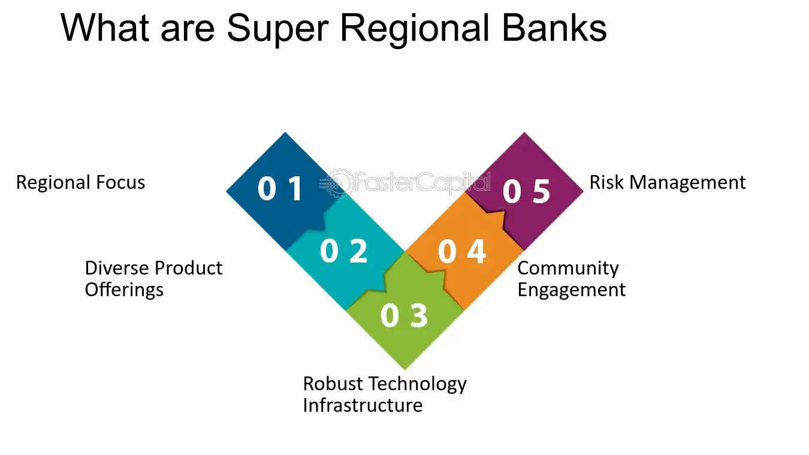

## Table of Contents

## What is a Super Regional Bank?

A Super Regional Bank is a large bank that operates in several states or regions but is not big enough to be considered a national bank. These banks are bigger than community or regional banks but smaller than the giant banks that everyone knows. They offer a wide range of financial services, like checking and savings accounts, loans, and investment options, but they focus on serving customers in specific areas rather than across the whole country.

Super Regional Banks are important because they help local economies grow by providing money and services to businesses and people in their regions. They often know their customers well and can offer personalized services. While they compete with bigger national banks, they try to stand out by understanding and meeting the specific needs of their communities better than larger banks might.

## How does a Super Regional Bank differ from a national bank?

A Super Regional Bank is different from a national bank mainly in size and where they do business. A Super Regional Bank works in a few states or regions but not all over the country. They are bigger than small local banks but smaller than the huge national banks that you see everywhere. National banks, on the other hand, have branches and services all across the country. They are the biggest banks, and everyone knows their names.

Another difference is how they serve their customers. Super Regional Banks often know their customers better because they focus on specific areas. They can offer services that fit the needs of people and businesses in those regions. National banks, because they are so big, might not know their customers as well. They offer a lot of the same services everywhere, but they might not be as good at meeting the special needs of smaller communities.

In short, Super Regional Banks are like the middle child of the banking world. They are not as small as community banks, but they are not as big as national banks. They try to give the best of both worlds by offering a wide range of services while still understanding and meeting the needs of their local customers. National banks, while offering many services, might not be as connected to the local communities they serve.

## What are some examples of Super Regional Banks?

Some examples of Super Regional Banks are U.S. Bancorp, PNC Financial Services, and BB&T (now part of Truist Financial). U.S. Bancorp is a big bank that works in many states in the Midwest and West of the United States. They have lots of branches and offer many services like checking accounts, loans, and investment options. PNC Financial Services is another Super Regional Bank that operates in the East and Midwest. They are known for their good customer service and for helping businesses grow.

BB&T, now part of Truist Financial after merging with SunTrust Banks, used to be a Super Regional Bank that worked in the Southeast. They were known for their community involvement and for offering services that fit the needs of people and businesses in their area. Now, as Truist Financial, they continue to serve many regions but have become even bigger. These banks show how Super Regional Banks can be important in their areas by knowing their customers well and helping local economies.

## What services do Super Regional Banks typically offer?

Super Regional Banks offer a wide range of financial services to their customers. They provide basic services like checking and savings accounts, which help people manage their everyday money. They also offer loans, such as personal loans, home mortgages, and business loans, to help people buy homes, cars, or start and grow their businesses. Additionally, these banks often have investment options, like mutual funds and retirement accounts, to help people save for the future.

Beyond these basic services, Super Regional Banks also offer more specialized services. They might provide wealth management and financial planning to help people make smart decisions about their money. They also offer business banking services, like commercial loans and cash management, to help companies run smoothly. These banks often have online and mobile banking options, making it easy for customers to do their banking from anywhere. By offering all these services, Super Regional Banks aim to meet the diverse needs of their customers in the regions they serve.

## How do Super Regional Banks impact local economies?

Super Regional Banks help local economies grow by lending money to businesses and people. When a business needs money to start up or expand, these banks can give them a loan. This helps the business create jobs and bring more money into the local area. People can also get loans from these banks to buy homes or cars, which means more money is spent in the community. This spending helps other businesses grow and keeps the local economy strong.

These banks also know their local areas well. They understand what people and businesses need, so they can offer services that fit those needs. For example, they might help a farmer get a loan for new equipment or help a small business owner with financial planning. By working closely with their customers, Super Regional Banks can make sure that money is used in ways that help the local economy the most. This close relationship helps keep money flowing in the community and supports economic growth.

## What are the advantages of banking with a Super Regional Bank?

Banking with a Super Regional Bank has some good advantages. These banks know their local areas well, so they can offer services that fit the needs of people and businesses in those places. For example, they might give a farmer a loan for new equipment or help a small business owner with financial planning. Because they understand their customers, they can offer personalized help that bigger national banks might not give. This means you can get better advice and support for your money needs.

Another advantage is that Super Regional Banks help local economies grow. They lend money to businesses and people, which helps create jobs and keeps money moving in the community. When a business gets a loan from a Super Regional Bank, it can grow and hire more people. When people get loans to buy homes or cars, they spend more money locally, which helps other businesses too. By working closely with their customers, these banks make sure that money is used in ways that help the local area the most.

## What are the potential drawbacks of using a Super Regional Bank?

One potential drawback of using a Super Regional Bank is that they might not have as many branches or ATMs as a national bank. If you travel a lot or live in an area where the bank doesn't have many locations, it could be harder to do your banking. You might need to use another bank's ATM, which could mean paying extra fees. Also, if you move to a new area that the bank doesn't serve, you might need to switch banks, which can be a hassle.

Another drawback is that Super Regional Banks might not offer as many services or products as bigger national banks. While they usually have a good range of services, they might not have all the latest financial products or investment options that a national bank has. This could mean missing out on some opportunities to grow your money or manage your finances in new ways. If you need very specific or advanced financial services, a Super Regional Bank might not be the best fit for you.

## How do Super Regional Banks manage risk and compliance?

Super Regional Banks manage risk by being careful about who they lend money to and how much they lend. They look at a person's or business's ability to pay back the loan before giving it to them. They also keep an eye on the economy to make sure they are not lending too much money if things might get tough. They use computers and special software to help them see if their loans are safe or if they need to be more careful. This helps them avoid losing money and keeps the bank strong.

They also have to follow rules set by the government to make sure they are doing things the right way. These rules are called compliance rules. Super Regional Banks have special teams that make sure the bank follows all these rules. They check things like how the bank handles customer information, how it reports money it lends, and how it treats its customers. If the bank does not follow these rules, it can get in big trouble. So, these banks work hard to make sure they are always doing things correctly and safely.

## What role do Super Regional Banks play in financial markets?

Super Regional Banks play an important role in financial markets by providing money to businesses and people. They do this by giving loans to help businesses grow or start up. When a business gets a loan, it can buy new things or hire more people, which helps the economy. People can also get loans from these banks to buy homes or cars. This spending helps keep money moving in the economy and makes it stronger.

These banks also help in financial markets by offering different services like checking and savings accounts, and investment options. They help people save and invest their money in things like mutual funds or retirement accounts. By doing this, they help people plan for their future and grow their money. Super Regional Banks are important because they know their local areas well and can offer services that fit the needs of their customers, making the financial markets work better for everyone in the community.

## How have Super Regional Banks adapted to digital banking trends?

Super Regional Banks have changed a lot to keep up with digital banking trends. They now offer online and mobile banking so people can do their banking from anywhere, anytime. They have apps that let you check your account, pay bills, and even deposit checks using your phone. They also use new technology to make banking easier and safer, like using special codes to keep your money safe when you bank online.

These banks also use digital tools to help their customers better. They use data to understand what people need and offer them the right services. For example, they might suggest a loan or an investment based on what they know about you. They also use social media and websites to talk to customers and help them with any questions or problems. By doing all this, Super Regional Banks are trying to give the best service to their customers while keeping up with the latest technology.

## What are the future growth prospects for Super Regional Banks?

Super Regional Banks have good chances to grow in the future. They can get bigger by opening more branches in new areas or by buying other smaller banks. This can help them serve more people and businesses. They can also grow by offering new services that people want, like better online banking or special loans for businesses. By understanding their local areas well, these banks can find new ways to help their customers and make more money.

Another way Super Regional Banks can grow is by using new technology. They can make their banking apps even better so people can do more things easily from their phones. They can also use data to understand what their customers need and offer them the right services at the right time. By keeping up with technology and listening to their customers, these banks can keep growing and stay important in their communities.

## How do Super Regional Banks contribute to financial inclusion and community development?

Super Regional Banks help more people join the financial world by offering services that fit the needs of different communities. They know their areas well, so they can give loans and banking services to people who might not get them from bigger banks. For example, they might help someone start a small business or buy a home. By doing this, they make it easier for people to save money, borrow money, and plan for their future. This is called financial inclusion, and it helps everyone in the community have a chance to do better.

These banks also help their communities grow by supporting local projects and businesses. They might give money to help build a new school or a community center. They also work with local groups to make their areas better places to live. By lending money to businesses and helping them grow, Super Regional Banks create jobs and keep money moving in the local economy. This helps the whole community develop and become stronger.

## What is Algorithmic Trading in Super Regional Banks?

Algorithmic trading has become an integral part of the financial services landscape, offering significant advantages in investment strategy execution for super regional banks. These institutions harness [algorithmic trading](/wiki/algorithmic-trading) to enhance portfolio management and consistently outperform market benchmarks through precise, rapid, and effective investment decisions.

Super regional banks employ sophisticated algorithms to analyze vast datasets, allowing them to identify and act on market opportunities swiftly. By leveraging big data and [machine learning](/wiki/machine-learning), these banks can process large quantities of information more efficiently than traditional trading methods. Machine learning models, such as those built on supervised learning techniques, empower banks to forecast price movements and market trends with greater accuracy. 

For instance, algorithms can be used to execute trades based on predefined criteria that can include anything from statistical correlations to real-time news sentiment analysis. A common approach within algorithmic trading is the use of linear regression models to predict future price movements based on historical data. The fundamental linear regression model can be expressed as:

$$
y = \beta_0 + \beta_1x_1 + \beta_2x_2 + \ldots + \beta_nx_n + \epsilon
$$

where $y$ is the dependent variable (e.g., future asset price), $x_1, x_2, \ldots, x_n$ are the independent variables (e.g., current asset prices, volume, indicators), $\beta_0, \beta_1, \ldots, \beta_n$ are the coefficients, and $\epsilon$ is the error term.

Moreover, the employment of algorithmic trading allows super regional banks to substantially reduce transaction costs. This is achieved by executing trades in smaller, more strategically timed segments to minimize market impact and slippage. Additionally, algorithms can act autonomously to adjust trading strategies in real-time, adapting to dynamic market conditions and thereby improving the probability of capturing more favorable pricing.

An example of Python code that super regional banks might use to perform basic algorithmic trading functions could include libraries such as NumPy for numerical calculations and Pandas for data manipulation:

```python
import pandas as pd
import numpy as np
from sklearn.linear_model import LinearRegression

# Load historical price data
data = pd.read_csv('historical_prices.csv')

# Prepare features and target variables
X = data[['feature1', 'feature2', 'feature3']]  # Independent variables
y = data['target']  # Dependent variable (e.g., future price)

# Implement linear regression model
model = LinearRegression()
model.fit(X, y)

# Predict future prices based on the model
predictions = model.predict(X)
```

Through these sophisticated means, super regional banks are not only enhancing their trading capabilities but are also providing their clients with better returns. This strategic application of big data and algorithmic trading enables these banks to remain competitive and nimble in the fast-paced financial markets, effectively contributing to their overall economic strength and client satisfaction.

## References & Further Reading

[1]: Bergstra, J., Bardenet, R., Bengio, Y., & Kégl, B. (2011). ["Algorithms for Hyper-Parameter Optimization."](https://papers.nips.cc/paper/4443-algorithms-for-hyper-parameter-optimization) Advances in Neural Information Processing Systems 24.

[2]: ["Advances in Financial Machine Learning"](https://www.amazon.com/Advances-Financial-Machine-Learning-Marcos/dp/1119482089) by Marcos Lopez de Prado

[3]: ["Evidence-Based Technical Analysis: Applying the Scientific Method and Statistical Inference to Trading Signals"](https://www.amazon.com/Evidence-Based-Technical-Analysis-Scientific-Statistical/dp/0470008741) by David Aronson

[4]: ["Machine Learning for Algorithmic Trading"](https://github.com/stefan-jansen/machine-learning-for-trading) by Stefan Jansen

[5]: ["Quantitative Trading: How to Build Your Own Algorithmic Trading Business"](https://www.amazon.com/Quantitative-Trading-Build-Algorithmic-Business/dp/1119800064) by Ernest P. Chan