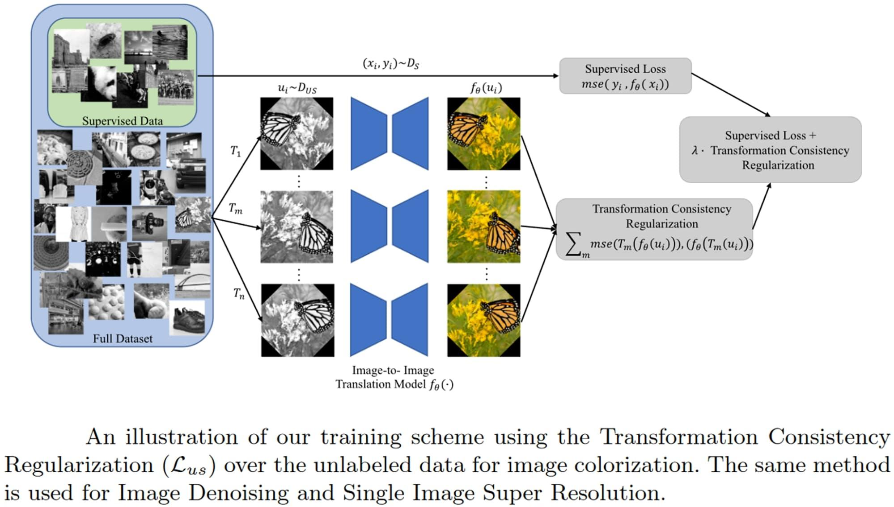

## Table of Contents

## What is super-resolution in the context of machine learning?

Super-resolution in machine learning is a technique used to enhance the resolution of images or videos. It takes low-resolution images and uses algorithms to predict and add more details, making the image appear clearer and sharper. This is particularly useful in fields like medical imaging, satellite imagery, and even in enhancing old photographs. The process involves training a model on pairs of low and high-resolution images, so it learns how to upscale images effectively.

The most common approach to super-resolution is through deep learning, where convolutional neural networks (CNNs) are often used. These networks learn to map the low-resolution input to a high-resolution output. For example, a popular model for this task is the Super-Resolution Convolutional Neural Network (SRCNN). By analyzing patterns and details in the training data, the model can generate higher resolution images that look more natural and detailed than those produced by traditional methods. This technology continues to evolve, making it possible to achieve impressive results even from very low-quality source images.

## How do super-resolution models improve image quality?

Super-resolution models improve image quality by taking a blurry or low-resolution image and making it look sharper and clearer. They do this by using special computer programs called neural networks. These networks are trained with lots of pictures, some blurry and some clear. By looking at these pictures, the network learns how to add more details to a blurry image to make it look like a clear one. For example, if the network sees a blurry face, it can learn to add details like eyes, nose, and mouth to make the face look real and sharp.

The way these models work is by understanding patterns in images. When a low-resolution image is given to the model, it uses what it learned from training to guess what the high-resolution version should look like. This is done through layers of math calculations that help the model decide where to add more pixels and how to arrange them. The result is an image that looks much better than the original, with clearer edges and more visible details. This can be very helpful in many areas, like making old photos look new or helping doctors see more details in medical images.

## What are the main types of super-resolution techniques?

There are mainly three types of super-resolution techniques: interpolation-based, reconstruction-based, and learning-based methods. Interpolation-based methods are the simplest and most common. They work by adding new pixels between the existing ones in a low-resolution image. These new pixels are guessed based on the colors and brightness of the nearby original pixels. This method can make images look a bit bigger but often makes them blurry because it doesn't add real details.

Reconstruction-based methods try to fix this by using more information. They look at a series of low-resolution images of the same thing taken from slightly different angles or times. By combining these images, the method can guess where the details should be and create a sharper, clearer image. This is like putting together pieces of a puzzle to see the full picture.

Learning-based methods are the newest and use artificial intelligence, specifically neural networks. These networks are trained on many pairs of low and high-resolution images. By learning from these pairs, the network can predict what a high-resolution version of a new low-resolution image should look like. This method can add very realistic details to images, making them look much better than with the other two methods.

## What is SRGAN and how does it work?

SRGAN, or Super-Resolution Generative Adversarial Network, is a type of super-resolution model that uses two neural networks to improve the quality of images. One network, called the generator, tries to create high-resolution images from low-resolution ones. The other network, called the discriminator, checks if the images made by the generator look real or if they are fake. They work together, with the generator trying to fool the discriminator and the discriminator trying to get better at spotting fakes. This back-and-forth helps both networks improve until the generator can make very good high-resolution images.

SRGAN is special because it not only makes images sharper but also tries to make them look more natural. It does this by using something called perceptual loss, which helps the generator focus on making images that look real to human eyes, not just mathematically correct. This means the images can have more realistic details and textures. For example, if the generator is making a picture of a tree, it will try to add realistic leaves and branches, not just make the image bigger and blurrier. This makes SRGAN very useful for things like enhancing old photos or improving the quality of videos.

## What are the key components of the SRGAN architecture?

The SRGAN architecture has two main parts: the generator and the discriminator. The generator is a deep neural network that takes a low-resolution image and tries to make it into a high-resolution one. It does this by adding more pixels and details to make the image look clearer and more real. The generator uses something called residual blocks, which help it learn how to add details without losing the original image's quality. The discriminator is another neural network that looks at the images made by the generator and decides if they look real or fake. It helps the generator get better by giving feedback on how real the generated images look.

The generator and discriminator work together in a process called adversarial training. During this process, the generator tries to make images that can fool the discriminator, while the discriminator tries to get better at telling real images from fake ones. This back-and-forth helps both parts of SRGAN improve over time. SRGAN also uses a special kind of loss function called perceptual loss. This helps the generator focus on making images that look good to human eyes, not just ones that are mathematically correct. By using perceptual loss, SRGAN can create images that have realistic details and textures, making them look much better than simple upscaled images.

## How does SRGAN differ from traditional super-resolution methods?

SRGAN, or Super-Resolution Generative Adversarial Network, is different from traditional super-resolution methods in how it makes images look better. Traditional methods, like interpolation or reconstruction, try to add more pixels to make images bigger. Interpolation guesses new pixels based on the colors around them, but this can make images blurry. Reconstruction uses many low-resolution images of the same thing to guess where details should go, but it still might not add the right details. SRGAN, on the other hand, uses two special computer programs called neural networks: a generator and a discriminator. The generator tries to make high-resolution images from low-resolution ones, and the discriminator checks if these images look real or fake. This back-and-forth helps the generator get better at making realistic images.

Another big difference is that SRGAN focuses on making images look good to human eyes. Traditional methods often just try to make images mathematically correct, which can make them look unnatural. SRGAN uses something called perceptual loss, which helps the generator add details that look real. For example, if SRGAN is making a picture of a tree, it will try to add realistic leaves and branches, not just make the image bigger and blurrier. This makes SRGAN very useful for things like fixing old photos or making videos look better. By using these special techniques, SRGAN can create images that look much more natural and detailed than those made by traditional super-resolution methods.

## What datasets are commonly used to train super-resolution models like SRGAN?

Super-resolution models like SRGAN are often trained on datasets that include both low-resolution and high-resolution versions of images. One of the most commonly used datasets is the DIV2K dataset, which contains 1,000 high-quality images from the NTIRE 2017 challenge. These images are used to create low-resolution versions, and the model learns how to turn the low-resolution images back into high-resolution ones. Another popular dataset is the Set5 and Set14 datasets, which are smaller but still very useful for training and testing super-resolution models. These datasets help the model learn how to add details to images and make them look clearer.

Another dataset that is often used is the BSDS100 dataset, which has 100 images that can be used to train and test super-resolution models. This dataset is good for checking how well the model works on different types of images. Researchers also sometimes use the Urban100 dataset, which has 100 images of urban scenes. This dataset is helpful because it includes many sharp edges and details that are important for super-resolution. By using these different datasets, models like SRGAN can learn how to make all kinds of images look better and more detailed.

## What are the performance metrics used to evaluate super-resolution models?

Super-resolution models are evaluated using different performance metrics that help understand how well they can make images look better. One common metric is Peak Signal-to-Noise Ratio (PSNR), which measures how much noise or error is in the image compared to the original. A higher PSNR means the image is closer to the original and has less noise. Another important metric is the Structural Similarity Index (SSIM), which looks at how similar the structure of the super-resolution image is to the high-resolution original. SSIM focuses on things like brightness, contrast, and structure, and a higher SSIM score means the image looks more like the original.

Another metric used is the Mean Squared Error (MSE), which calculates the average of the squares of the errors between the super-resolution image and the original. A lower MSE means the image is closer to the original. For models like SRGAN, which focus on making images look good to human eyes, metrics like the Learned Perceptual Image Patch Similarity (LPIPS) are used. LPIPS compares images based on how humans see them, rather than just looking at pixel values. This helps to evaluate how realistic and visually pleasing the super-resolution images are.

## How can the training process of SRGAN be optimized for better results?

To optimize the training process of SRGAN for better results, it's important to start with a good dataset. Using datasets like DIV2K, which has many high-quality images, helps the model learn how to add details to low-resolution images. During training, you can also use techniques like data augmentation, where you change the images a bit by rotating or flipping them. This helps the model see different versions of the same image and learn better. Another way to improve training is by adjusting the learning rate, which is how fast the model learns. If the learning rate is too high, the model might miss important details, but if it's too low, training can take a long time. Finding the right balance can make a big difference in how well SRGAN performs.

Another important part of optimizing SRGAN's training is using the right loss functions. SRGAN uses a mix of different losses, like perceptual loss and adversarial loss, to make images look good to human eyes. Perceptual loss helps the model focus on adding realistic details, while adversarial loss helps the generator make images that can fool the discriminator. You can also use techniques like batch normalization to make training more stable. This means the model can learn more consistently and produce better results. By carefully choosing and tuning these elements, you can help SRGAN create high-resolution images that look more natural and detailed.

## What are some of the challenges faced when implementing super-resolution models in real-world applications?

Super-resolution models like SRGAN can face several challenges when used in real-world applications. One big challenge is the need for a lot of computing power. These models use complex neural networks that need strong computers to work quickly. In real life, this can be a problem because not everyone has access to such powerful machines. Another challenge is the quality of the input images. If the low-resolution images are very blurry or have a lot of noise, the super-resolution model might not be able to make them look good. It's hard for the model to add details if the original image doesn't have enough information to work with.

Another issue is the time it takes to process images. Super-resolution models can take a long time to turn a low-resolution image into a high-resolution one, which can be a problem for things like live video feeds or real-time applications. Balancing the speed and quality of the output is a big challenge. Additionally, there can be ethical concerns, especially if these models are used to enhance surveillance images or to change photos in ways that could mislead people. Ensuring that super-resolution models are used responsibly and ethically is an important consideration in their real-world implementation.

## How do advanced techniques like GANs enhance super-resolution capabilities?

Advanced techniques like Generative Adversarial Networks (GANs) enhance super-resolution capabilities by using two neural networks that work together to make images look better. One network, called the generator, tries to create high-resolution images from low-resolution ones. The other network, called the discriminator, checks if the images made by the generator look real or if they are fake. This back-and-forth process helps the generator get better at making realistic images. For example, if the generator makes a picture of a tree, it will try to add realistic leaves and branches, not just make the image bigger and blurrier. This makes the final image look much more natural and detailed than images created by simpler methods.

GANs also focus on making images look good to human eyes, not just mathematically correct. They use something called perceptual loss, which helps the generator add details that look real. This is different from older methods that might just try to make images bigger and clearer but end up looking unnatural. By using these special techniques, GANs can create images that look much more realistic and detailed, which is very helpful for things like fixing old photos or making videos look better. This makes GANs a powerful tool for super-resolution in many real-world applications.

## What are the future directions and potential improvements for super-resolution models like SRGAN?

Future directions for super-resolution models like SRGAN include making them faster and more efficient. Right now, these models need a lot of computing power to work well. Researchers are working on ways to make them run on smaller devices like smartphones and tablets. They are also trying to make the models process images more quickly, which is important for things like live video feeds. Another area of improvement is making the models work better with very blurry or noisy images. By using new techniques and more data, the models can learn to add details even when the original image doesn't have much information to work with.

Another potential improvement is making super-resolution models more versatile. This means they can work well on different types of images, like photos, medical scans, and satellite images. Researchers are also looking into ways to make these models more ethical and responsible. For example, they want to make sure the models are not used to change photos in ways that could mislead people. By focusing on these areas, super-resolution models like SRGAN can become even more useful and reliable in the future.