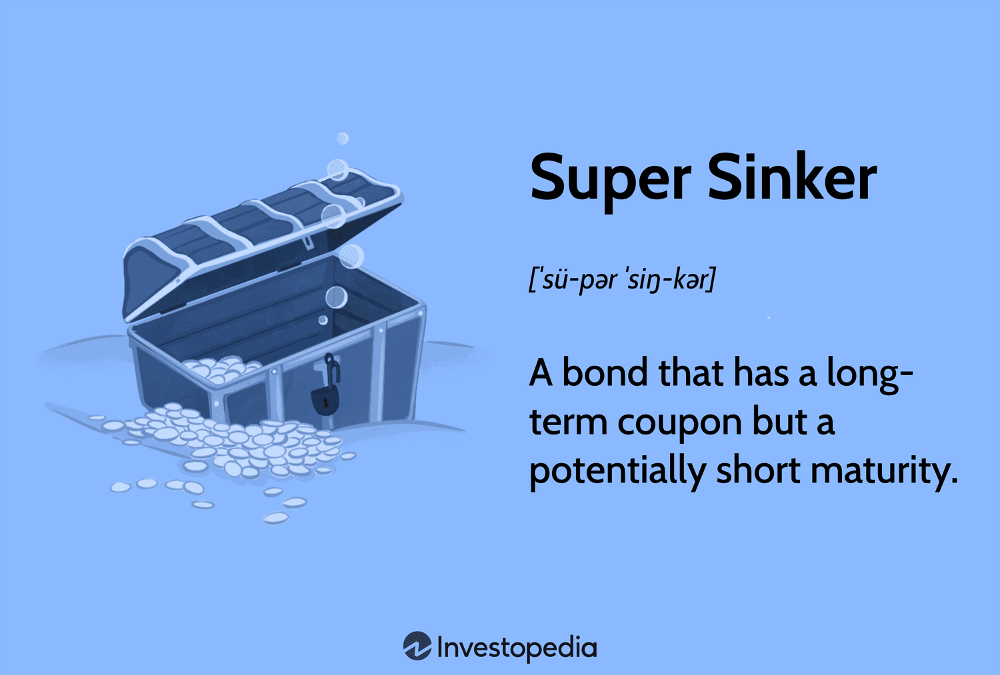

Fishing, one of humanity's oldest practices, has evolved into both a recreational pastime and a vital industry. When engaging in this activity, choosing the right fishing equipment is essential for both novice and seasoned anglers. The right gear can make the difference between a successful catch and a day spent on the water with little to show for it. At the core of effective fishing are fishing weights and sinkers, particularly the innovative "super sinkers", which play a crucial role in ensuring the bait reaches the optimal depth and stays in place against currents and waves. These weights come in various shapes and sizes, each designed to tackle specific challenges in diverse fishing environments.

Parallel to the strategic thinking involved in fishing is the world of finance, where precision tools like algorithmic trading (algo trading) transform investment approaches. Algo trading involves using computer programs and algorithms to execute trades automatically, offering efficiency and the capacity to handle vast data streams and execute orders at high speeds. This has revolutionized financial markets by enhancing liquidity and allowing for more efficient price discovery.

This article seeks to explore the importance of choosing the right tools—whether in fishing or finance—by introducing the concept of super sinkers and their financial counterpart, super sinker bonds. By understanding their impact and design, in fishing as well as financial markets, readers can gain insights into effective strategies for success. The structure of the article unfolds to cover fishing weights, super sinkers, financial trading, and unique insights that blend parallels between these two seemingly unrelated domains. Through this approach, we aim to shed light on the strategic thinking required in both fields, encouraging readers to leverage adaptive strategies in achieving their goals.

## Table of Contents

## Understanding Fishing Equipment

Fishing is an activity that requires not only patience but also the right set of equipment to ensure success. At its core, basic fishing equipment includes a rod, reel, line, hook, bait or lures, and importantly, fishing weights or sinkers. These components work together to enhance the angler's ability to catch fish in various environments—from calm lakes to dynamic ocean surf.

Selecting the appropriate fishing weight is crucial, as it directly affects the presentation of the bait and the ability to fish effectively in different conditions. Fishing weights help in casting farther, anchoring the bait at the desired water depth, and maintaining stability against currents or waves. The choice of fishing weight can vary depending on factors such as water depth, type of water body, weather conditions, and the target species of fish.

Different types of fishing weights are available, each designed for specific purposes and scenarios. Among the most common are egg sinkers and pyramid sinkers. Egg sinkers, characterized by their oval shape with a hole through the center, are ideal for bottom fishing. They allow the line to move freely while keeping the bait near the substrate—a technique particularly effective for species dwelling at the bottom. Pyramid sinkers, with their pointed ends and flat sides, are preferred in surf fishing. Their shape ensures they stay anchored in sandy bottoms despite strong waves and currents, making them suitable for catching fish in turbulent coastal environments.

Bluewing Fishing is a notable provider of a diverse array of fishing sinkers. Their offerings include traditional egg and pyramid sinkers, along with innovative designs aimed at improving fishing performance across different contexts. Bluewing Fishing emphasizes durability and precision in their sinker designs, catering to both amateur and professional anglers who require reliability in challenging fishing situations.

When choosing a sinker for surf fishing, several tips can be beneficial. First, it is important to consider the weight of the sinker in relation to the rod's capacity and the expected conditions. Heavier sinkers may be necessary in strong currents or when aiming to reach greater depths. It is also advisable to use pyramid sinkers for their ability to provide stability in the shifting seabed, ensuring the bait remains stationary where fish are likely to feed. Adapting the sinker's size and design to the specific surf conditions can significantly influence the success rate of catching target fish species.

In summary, the selection of the right fishing weights is instrumental in adapting to various fishing conditions. Understanding the function and suitability of different sinker types, like those offered by Bluewing Fishing, can greatly enhance fishing efficacy, particularly in surf fishing scenarios.

## Super Sinkers in Fishing

Super sinkers, a fundamental component in the fishing arsenal, play a crucial role in optimizing angling techniques. These specialized weights are engineered to enhance casting distance, improve bait presentation, and ensure stability in various aquatic environments. Unlike regular sinkers, which may simply add weight, super sinkers are often designed with specific hydrodynamic shapes and materials that provide unique advantages to anglers.

The primary distinction between super sinkers and traditional sinkers lies in their composition and design. While regular sinkers are typically made of lead due to its density and ease of molding, super sinkers may incorporate more advanced materials such as tungsten or environmentally friendly composites. This choice of material can influence the sinker's performance, particularly in terms of how quickly it sinks and its resistance to water currents. Moreover, the shape of super sinkers can vary, offering options like streamlined or low-profile designs that minimize turbulence and allow for longer, more accurate casts.

One of the main advantages of using super sinkers is their ability to adapt to challenging fishing conditions. Whether it's strong tidal flows, rocky seabeds, or swift river currents, super sinkers can provide the necessary weight and stability to keep the bait in the target zone. Their design helps in reducing drift caused by water movement, ensuring that the bait remains appealing to potential catches for longer periods.

Insights from the fishing industry emphasize the innovation behind super sinker design. Engineers and product developers continually experiment with different shapes and materials to create sinkers that not only perform well under specific conditions but also reduce environmental impact. For example, some manufacturers offer biodegradable or non-toxic alternative sinkers, responding to growing ecological concerns about lead pollution in waterways.

Customer reviews often highlight the real-world benefits of using super sinkers. Anglers appreciate their effectiveness in penetrating to desired depths swiftly, particularly in deep-water fishing scenarios. Super sinkers are also noted for their adaptability, with many models featuring interchangeable components that allow users to adjust weights based on the fishing context, whether it be off a pier or from a boat in open water.

In conclusion, super sinkers are more than mere weights; they are sophisticated tools that enhance the efficiency and success rate of anglers. By selecting the appropriate super sinker, fishers can better handle a variety of fishing environments and improve their overall angling experience.

## Super Sinker Bonds in Finance

Super sinker bonds are specialized instruments within the financial markets, offering distinct advantages for certain types of investors. Super sinker bonds are structured mortgage-backed securities (MBS), most notably found in housing finance. Their primary feature is an accelerated repayment schedule which comes into play as underlying loans are prepaid. This means that investors in super sinker bonds receive their principal back more rapidly compared to traditional bonds, assuming prepayments occur.

The operational mechanism of super sinker bonds hinges on the speed of prepayments from borrowers. In scenarios where interest rates fall, homeowners have the incentive to refinance their loans. This results in an influx of prepayments which, in the case of super sinker bonds, is directed towards reducing the bond’s principal rapidly. This makes them attractive for investors seeking to mitigate [interest rate](/wiki/interest-rate-trading-strategies) risk or match liabilities with anticipated cash flows.

The terminology "super sinker" in finance shares its conceptual basis with "super sinkers" in fishing; both focus on achieving a specific utility more efficiently. In fishing, a super sinker provides better anchorage or penetration, particularly in challenging conditions, ensuring stability and effectiveness. Likewise, in finance, a super sinker bond aims to offer stability in an uncertain interest rate environment by promising quicker financial settlements.

Investment strategies around super sinker bonds often center on hedging interest rate risk. For institutional investors or fund managers, these bonds can be part of a broader strategy to balance portfolios that have more volatile or longer-duration assets. Furthermore, given their accelerated repayment schedule, super sinker bonds can serve as an interest rate hedge, potentially smoothing portfolio performance across different rate environments.

Recent market trends have shown a fluctuating interest in super sinker bonds, primarily influenced by interest rate movements and housing market dynamics. For instance, during periods of rising interest rates, the appeal of super sinkers wanes as the incentive for prepayment diminishes. Conversely, during low-interest environments, their popularity increases as refinance activities surge, pushing more cash back into the hands of investors.

Overall, super sinker bonds represent a unique blend of financial strategy, combining the intricacies of mortgage-backed securities with the strategic acumen required to harness their benefits effectively. These instruments illustrate how financial products can be crafted to meet the varied needs of investors, much like specialized equipment in other fields such as fishing.

## Algorithmic Trading and Financial Markets

Algorithmic trading, often referred to as "algo trading," is a method that uses computer programs to execute trades at speeds and frequencies that are beyond the capacity of human traders. The significance of [algorithmic trading](/wiki/algorithmic-trading) lies primarily in its ability to leverage mathematical models and sophisticated algorithms to identify and exploit market inefficiencies. This trading approach enhances decision-making processes by swiftly analyzing market conditions and executing pre-programmed trading instructions for variables such as timing, price, and [volume](/wiki/volume-trading-strategy).

**Benefits and Risks of Algorithmic Trading Strategies**

Algorithmic trading offers multiple benefits, such as increased trading speed and accuracy, which reduces transaction costs and the potential for human error. These strategies allow for high-frequency trading where large volumes of orders are processed swiftly, providing a competitive edge. Moreover, algorithmic trading can access diverse markets and perform hundreds of trades simultaneously, thus optimizing market opportunities.

However, the risks involved include technological failures, such as system outages or defects in the trading algorithms, which can lead to significant financial losses. Furthermore, the high speed at which trades are conducted can contribute to market [volatility](/wiki/volatility-trading-strategies) and may exacerbate systemic risk in financial markets. Ensuring robust risk management protocols is essential to mitigate these risks.

**Correlation Between Computerized Systems and Financial Performance**

The efficiency brought by computerized systems in trading correlates with improved financial performance as these systems enable the handling of complex operations at reduced operational costs. By automating processes, financial institutions can lower staffing expenses and minimize the bid-ask spread, which can enhance profitability. However, reliance on such systems necessitates continuous monitoring and updates to the algorithms to respond to ever-changing market conditions.

**Role of AI and Machine Learning in Modern Trading**

Artificial Intelligence (AI) and Machine Learning (ML) have increasingly become integral to modern trading systems. AI enables predictive analytics, helping traders forecast market trends and asset price movements more accurately. Machine learning algorithms analyze vast datasets to identify patterns and correlations that may not be visible to human analysts. These insights can then inform trading strategies that are more adaptive and responsive to market dynamics.

Machine learning models are trained using historical data, allowing them to recognize complex patterns. For example, a [machine learning](/wiki/machine-learning) model may use regression analysis or neural networks to predict future asset prices. With the continuous feed of data, these models improve over time, enhancing the efficiency and success rate of the trading strategies employed.

**Case Studies or Examples from Automated Trading Platforms**

Several automated trading platforms exemplify the efficacy of algorithmic trading. One notable example is QuantConnect, a platform that allows users to design, backtest, and deploy trading algorithms in financial markets. QuantConnect provides users with access to a diverse range of data sources and computational resources to develop sophisticated trading models.

Another example is the [Interactive Brokers](/wiki/interactive-brokers-api) Algorithm API, which enables traders to implement their trading algorithms using Python. By integrating advanced computational capabilities with real-time data feeds, traders can automate their strategies effectively.

These platforms illustrate the practical application of algorithmic trading and its impact on market participation. They underscore the necessity for traders to adapt to technological advancements to maintain a competitive position in the financial markets. Overall, algorithmic trading continues to shape the landscape of financial markets, pushing the boundaries of how trades are executed and strategies are developed.

## Connecting the Dots Between Fishing and Trading

Fishing and trading, at first glance, might seem worlds apart—one is often a serene outdoor pursuit, while the other involves high-stakes financial markets. However, a closer examination reveals intriguing parallels between these two disciplines, primarily in strategy, timing, and risk management.

**The 'Waiting Game'**

Both fishing and market trading demand patience and resilience. In fishing, anglers often wait for extended periods for the perfect catch, adapting their tactics based on environmental cues. Similarly, traders must often withstand market fluctuations, waiting for opportune moments to execute trades. This 'waiting game' can be a test of nerve, requiring both fishermen and traders to remain composed and observant. The ability to wait without losing focus or becoming overly reactive is a common skill necessary in both endeavors.

**Precise Timing**

Timing is crucial in fishing and trading alike. Just as an angler must cast their line at the right moment to capture a fish, a trader needs to enter or [exit](/wiki/exit-strategy) a market position at the right time to maximize returns or minimize losses. In both activities, small timing differences can significantly impact results. Precision involves analyzing patterns, anticipating movements, and making informed decisions swiftly—akin to deploying fishing weights at depths where fish are most likely to bite or executing trades during optimal market conditions. 

**Risk Management**

Risk management plays a pivotal role in fishing weights and financial investments. Anglers use different weights to control the depth and movement of their bait, adapting to variable conditions such as current speed and water depth to avoid snags or losing their bait. Similarly, investors must employ strategies to mitigate risk, such as diversifying portfolios or using stop-loss orders. Effective risk management ensures stability and enhances the likelihood of success in both activities. 

**Lessons from Seasoned Anglers**

Investors can learn several valuable lessons from seasoned anglers. One lesson is the importance of adaptability. Just as an angler may change bait or location based on their observations, traders should remain flexible, adjusting strategies in response to market changes. Another lesson is the significance of mastering one's tools; proficient handling of fishing equipment is akin to leveraging financial instruments efficiently. Lastly, understanding environmental factors, much like interpreting market signals, can lead to strategic advantages.

Thus, the disciplines of fishing and trading, though distinct, share common fundamental strategies. By understanding and applying these parallels, one can enhance performance both on the water and in the financial markets.

## Conclusion

In summarizing the core themes explored, the article highlights the importance of strategic thinking in both fishing and trading. In fishing, the selection of equipment such as fishing weights and super sinkers dictates success by adapting to diverse scenarios, much like algorithmic trading employs data-driven strategies for optimized financial outcomes. Recognizing the nuances and interplay of timing, risk management, and environmental conditions in fishing can effectively parallel the decision-making processes utilized within financial markets. By tailoring approaches to suit specific conditions, whether casting a line or executing a trade, individuals can maximize their results.

A key takeaway is the maximization of tools and technologies available in achieving desired outcomes. In fishing, this involves the selection of the right sinker for varying water conditions and the use of advanced super sinkers for enhanced performance. In finance, leveraging algorithmic trading platforms and machine learning models exemplifies the application of modern tools to improve trading precision and outcomes.

Readers are encouraged to explore adaptive strategies that align with their objectives, whether honing fishing techniques or refining investment portfolios. By understanding the parallels in these distinct areas, individuals can cultivate adaptable strategies that enhance efficiency and effectiveness.

For those interested in further exploration, several resources can provide deeper insights into these subjects, such as industry-specific guides on fishing equipment selection and technical analyses on algorithmic trading methodologies.

## References & Further Reading

[1]: Bergstra, J., Bardenet, R., Bengio, Y., & Kégl, B. (2011). ["Algorithms for Hyper-Parameter Optimization."](https://dl.acm.org/doi/10.5555/2986459.2986743) Advances in Neural Information Processing Systems 24.

[2]: ["Advances in Financial Machine Learning"](https://www.amazon.com/Advances-Financial-Machine-Learning-Marcos/dp/1119482089) by Marcos Lopez de Prado

[3]: ["Evidence-Based Technical Analysis: Applying the Scientific Method and Statistical Inference to Trading Signals"](https://www.amazon.com/Evidence-Based-Technical-Analysis-Scientific-Statistical/dp/0470008741) by David Aronson

[4]: ["Machine Learning for Algorithmic Trading"](https://github.com/stefan-jansen/machine-learning-for-trading) by Stefan Jansen

[5]: ["Quantitative Trading: How to Build Your Own Algorithmic Trading Business"](https://www.amazon.com/Quantitative-Trading-Build-Algorithmic-Business/dp/1119800064) by Ernest P. Chan