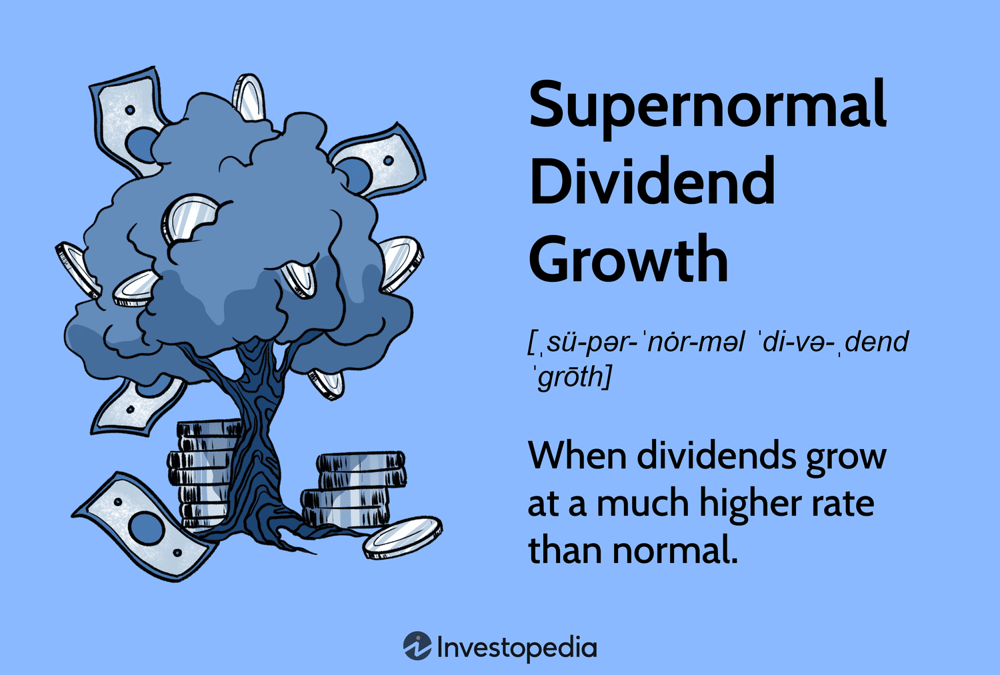

In today's financial landscape, investors seek strategies that not only deliver solid returns but also manage risk effectively. This article explores a blend of three key strategies: investment in supernormal dividends, dividend growth, and algorithmic trading. These strategies offer different but complementary benefits, providing investors with tools to enhance portfolio performance. 

Investing in supernormal dividends involves capitalizing on periods when companies temporarily increase their dividend payouts significantly due to improved earnings. This can lead to short-term gains if the company's future growth prospects and stock valuation are favorable. Meanwhile, dividend growth investing focuses on companies that consistently increase their dividends, signaling financial stability and efficient management, which can provide both income and capital appreciation over time. In contrast, algorithmic trading utilizes automated systems to execute trades based on pre-defined rules, optimizing trade execution and reducing human error through real-time data analysis. 



By understanding these strategies, investors can navigate the complexities of financial markets with greater confidence, leveraging a diverse set of approaches to build resilient and profitable portfolios. Through continual adaptation and learning, investors can effectively integrate these tactics to optimize their financial outcomes and enhance their participation in the markets.

## Table of Contents

## Understanding Investment Strategies for Supernormal Dividends

Supernormal dividend growth occurs when a company’s dividends experience an unusually high rate of increase, often driven by significant improvements in earnings. This phase of accelerated growth is generally unsustainable in the long term, as it typically stabilizes to a more normalized rate over time. Investors can capitalize on these periods of supernormal growth for short-term gains by carefully assessing the company's future prospects and relative valuation.

To effectively leverage supernormal dividend growth, investors should employ techniques such as the Dividend Discount Model (DDM) to determine the stock’s intrinsic value. The DDM helps establish whether a stock is overvalued or undervalued based on anticipated dividend payments. The basic formula for determining the intrinsic value of a stock using the Gordon Growth Model, which is a variant of the DDM suitable for companies with stable dividend growth rates, is given by:

$$
P = \frac{D_1}{r-g}
$$

where:
- $P$ is the current stock price.
- $D_1$ is the dividend expected in the next period.
- $r$ is the required rate of return.
- $g$ is the growth rate in dividends.

During periods of supernormal growth, the challenge lies in estimating the accurate growth rate ($g$) and adjusting the required rate of return ($r$) to reflect the heightened risk profile. A thorough analysis involves examining the company’s earnings trajectory, industry conditions, and broader economic factors contributing to the surge in dividends.

Moreover, quantitative analysis can be reinforced through qualitative assessments, considering management's ability to sustain these earnings improvements and the company's strategic initiatives for future growth. Investors should also remain vigilant for signs of potential dividend cuts once the supernormal growth phase subsides, as premature overvaluation can erode expected returns.

By marrying rigorous financial analysis with strategic foresight, investors can judiciously navigate the opportunities presented by supernormal dividend growth. This approach balances the pursuit of short-term gains with an awareness of the inherent risks associated with such high-growth phases in a company's dividend lifecycle.

## The Role of Dividend Growth in Investment Portfolios

Dividend growth investing is a strategic approach focused on acquiring stocks that consistently offer rising dividends over time. This investment strategy is particularly appealing to investors who are seeking both income and capital appreciation. The core premise behind dividend growth investing is that companies that can sustain and increase dividend payouts are likely to exhibit solid financial health and efficient management.

The appeal of dividend growth strategies lies in their dual benefit: providing a steady income stream while also fostering capital appreciation. Dividend growth can serve as an indicator of a company's overall financial stability, as consistent increases in dividends often reflect underlying profitability and prudent financial management. Companies that regularly raise their dividends often have strong cash flows, manageable levels of debt, and a commitment to returning value to shareholders.

Investors focusing on dividend growth often turn to companies known as "Dividend Aristocrats." These companies are renowned for their long-standing histories of dividend increases, typically over a period of at least 25 consecutive years. Such a track record not only highlights a company's capability to generate consistent earnings but also its dedication to maintaining shareholder value through regular and growing dividend disbursements.

Selecting stocks with strong dividend growth potential involves careful analysis of several key factors. Investors should assess the company's payout ratio, which is the proportion of earnings paid out as dividends. A sustainable payout ratio indicates that the company is not overextending itself to maintain or increase dividends. Additionally, examining the company’s historical dividend growth rate can provide insight into its ability to sustain this growth pattern. A comprehensive evaluation of a company’s financial statements, industry position, and economic moat (a competitive advantage that is difficult for competitors to overcome) can further guide investors in making informed decisions.

Furthermore, dividend growth investing can be complemented by using quantitative models. These models can help predict future dividend growth based on historical trends and current financial metrics. Python libraries like pandas and NumPy can be employed to analyze historical dividend data and project future growth. For instance, a simple predictive model could use the average historical dividend growth rate to forecast future dividends:

```python
import numpy as np

# Historical dividend growth rates (example)
historical_growth_rates = [0.05, 0.06, 0.04, 0.07]

# Calculate average growth rate
average_growth_rate = np.mean(historical_growth_rates)

# Current dividend
current_dividend = 1.50  # Example current dividend

# Project dividend for future years using the average growth rate
years_ahead = 5
projected_dividends = [current_dividend * (1 + average_growth_rate) ** year for year in range(1, years_ahead + 1)]

projected_dividends
```

This code provides a basic means to project future dividends assuming a constant average growth rate. While it simplifies real-world complexities, such models help investors gauge potential income streams from their investments.

In conclusion, dividend growth investing is a robust strategy for those looking to balance income and capital appreciation. By focusing on companies that reliably increase their dividends, investors can build portfolios that not only offer income but also highlight financial soundness and growth potential.

## Algorithmic Trading: Enhancing Decision Making

Algorithmic trading represents a transformative approach in modern financial markets by automating trading processes that were traditionally manual. It utilizes computer algorithms based on pre-defined criteria to execute trades rapidly and efficiently. This method leverages advanced data analysis to assess vast volumes of market data in real-time, allowing it to identify and capitalize on trading opportunities that might be invisible to human traders.

The automation inherent in [algorithmic trading](/wiki/algorithmic-trading) significantly improves trading efficiency by reducing the latency between decision-making and trade execution. This efficiency is crucial in fast-paced markets where price movements are swift and volatile. Moreover, algorithmic trading minimizes human error, such as misinterpretation of market signals or emotional biases that can impair judgment.

A notable feature of algorithmic trading is its ability to incorporate complex investment strategies, such as those based on dividends. For example, algorithms can be programmed to monitor companies with strong dividend histories and automatically execute trades when certain conditions, such as reaching a target dividend yield or during dividend announcements, are met. This allows investors to implement dividend-based strategies consistently and without delay.

Furthermore, algorithmic trading can adapt to changing market conditions. Algorithms are equipped to modify their behavior based on real-time data, optimizing trade execution by selecting the best possible price, timing, and execution method. This adaptability ensures that trading strategies remain effective across different market environments.

The rise of algorithmic trading has coincided with advancements in technology, including increased computational power and access to vast datasets. As a result, algorithmic trading tools have become more sophisticated, incorporating [machine learning](/wiki/machine-learning) techniques to enhance pattern recognition and predictive capabilities. These advancements have cemented algorithmic trading as a critical tool for serious investors seeking to maintain a competitive edge in the financial markets.

In summary, algorithmic trading enhances decision-making by automating trade execution based on thorough data analysis. This approach not only improves trading efficiency and reduces errors but also integrates advanced investment strategies, such as those involving dividends, and adapts to real-time market conditions to maximize investment outcomes.

## Case Studies: Practical Applications

Johnson & Johnson offers a clear model of success in dividend growth strategies, having increased its dividends consecutively for over 50 years. This consistent rise in payouts signals robust financial health and reliable cash flow management. Johnson & Johnson maintains a payout ratio that balances rewarding shareholders with reinvesting in future growth. Such discipline supports the sustainability of its dividend strategy. Analysts often apply the dividend discount model (DDM) to evaluate the intrinsic value of Johnson & Johnson stock during periods of dividend growth. The formula used is:

$$
P = \frac{D_1}{r - g}
$$

where $P$ is the price of the stock, $D_1$ is the expected dividend in the next period, $r$ is the required rate of return, and $g$ is the growth rate of the dividends.

Warren Buffett's investment methods underscore thorough analysis and prudent valuations. He focuses on intrinsic value over market price, famously disregarding short-term market fluctuations. Buffett's philosophy advocates for buying stocks at a price below their intrinsic value, derived from careful calculation of a company's earnings potential relative to its current market value. This approach involves a deep dive into financial statements, qualitative aspects of management, and market positioning, emphasizing a margin of safety as described by Benjamin Graham.

Renaissance Technologies exemplifies the powerful application of algorithmic trading. Founded by Jim Simons, this [hedge fund](/wiki/hedge-fund-trading-strategies) leverages quantitative models and advanced data analytics to capture market inefficiencies. By processing vast amounts of data, algorithms identify patterns and execute trades with precision and speed unattainable by human traders. Renaissance Technologies' Medallion Fund is renowned for its exceptional returns, a testament to the efficacy of sophisticated algorithms powered by cutting-edge technology.

These case studies illustrate a spectrum of successful investment strategies, from traditional dividend growth exemplified by Johnson & Johnson, to profound valuation analysis à la Buffett, and the avant-garde approach of Renaissance Technologies. Together, they offer actionable insights into crafting a diversified and adaptable investment strategy.

## Conclusion

A strategic investment approach requires a comprehensive understanding of different methods, such as dividend growth and algorithmic trading. These strategies not only provide diverse opportunities but also enable investors to build resilient and profitable portfolios. By carefully selecting companies that demonstrate consistent dividend growth, investors can create a steady income stream while also benefiting from potential capital appreciation. For instance, companies classified as dividend aristocrats have shown a commitment to increasing shareholder value through consistent payouts. 

Algorithmic trading, on the other hand, utilizes advanced data analytics and pre-defined criteria to execute trades efficiently and accurately. This technological approach significantly reduces human error and allows investors to capitalize on fleeting market opportunities, thus optimizing their financial outcomes. Integration of such tactics within a portfolio can lead to improved decision-making and enhanced market participation, with the potential to outperform traditional strategies based solely on human judgment.

Continual learning and adaptation are crucial as financial markets evolve and present new opportunities and challenges. Investors should remain informed about emerging trends and technological advancements to refine their investment strategies continually. This dynamic approach ensures that their portfolios are not only resilient but also well-positioned to take advantage of the ever-changing economic landscape. By staying proactive and open to adaptation, investors can better manage risks, enhance returns, and achieve their long-term financial goals.

## References & Further Reading

1. **Gordon, M. J. (1959). "Dividends, Earnings, and Stock Prices."** The Review of Economics and Statistics. This seminal paper introduces the Gordon Growth Model, a fundamental principle for evaluating stock prices based on dividends expected to grow at a constant rate. The model assists investors in estimating the intrinsic value of a stock, using the formula:
$$
   P = \frac{D_1}{r - g}

$$

   where $P$ is the price of the stock, $D_1$ is the expected dividend in the next period, $r$ is the required rate of return, and $g$ is the growth rate of dividends.

2. **The Intelligent Investor by Benjamin Graham.** A classic in investment literature, Graham's book emphasizes value investing and the importance of analyzing a company's intrinsic worth. Graham's principles provide a foundation for investors seeking consistent dividend growth, reinforcing the importance of thorough financial analysis.

3. **Asness, C. S. (1994). "Variables that Explain Stock Returns."** The American Economic Review. Asness explores various factors influencing stock returns, offering insights that assist in crafting robust investment strategies. His analysis is valuable for understanding how dividend growth and other metrics can impact stock valuation, guiding investors in making informed decisions.

4. **Algorithmic Trading & DMA: An Introduction to Direct Access Trading Strategies by Barry Johnson.** Johnson's work provides a comprehensive overview of algorithmic trading, detailing how automated processes can enhance decision-making and trade execution. This book is pivotal for investors interested in leveraging technology to improve the efficiency and effectiveness of their trading strategies.

