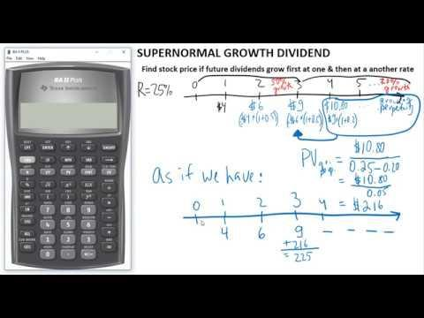

## Table of Contents

## What is a dividend?

A dividend is a payment that a company gives to its shareholders from its profits. When a company makes money, it can choose to share some of that money with the people who own its stock. This payment is usually given out in cash, but sometimes it can be in the form of more stock.

Dividends are important because they provide investors with a regular income. For example, if you own shares in a company that pays dividends, you will get money from the company a few times a year. This can be a good way to earn money, especially for people who want to get regular payments from their investments.

## What does dividend growth mean?

Dividend growth means that the amount of money a company pays to its shareholders as dividends is increasing over time. When a company does well and makes more profit, it might decide to give more money back to its shareholders. This is good for investors because it means they get more money each time the company pays dividends.

For example, if a company paid $1 per share last year and this year it pays $1.10 per share, that's dividend growth. Investors like this because it shows the company is doing well and is willing to share more of its profits. Over many years, this growth can make a big difference in how much money an investor earns from their shares.

## What is considered supernormal dividend growth?

Supernormal dividend growth is when a company's dividends grow much faster than what is normal or expected. This can happen when a company is doing really well and making a lot more profit than usual. It might be because the company is in a booming industry, or it has found a new way to make more money. When this happens, the company can decide to give a lot more money back to its shareholders through higher dividends.

This kind of growth is exciting for investors because it means their income from the company can go up a lot in a short time. But, supernormal growth usually doesn't last forever. After a while, the growth rate might slow down to a more normal level. So, while it's great when it happens, investors need to be ready for the growth to not stay super high forever.

## How can supernormal dividend growth impact a company's stock price?

When a company has supernormal dividend growth, it can make its stock price go up a lot. This happens because when a company pays more dividends, it shows that the company is doing really well and making more money. Investors like this because they get more money from their shares. So, more people want to buy the stock, and when more people want to buy something, the price goes up. This can make the stock price grow faster than normal.

But, supernormal dividend growth can't last forever. When it slows down, the stock price might not go up as fast anymore. Sometimes, if investors were expecting the high growth to keep going and it doesn't, they might sell their shares. This can make the stock price go down. So, while supernormal dividend growth can be good for the stock price in the short term, it's important for investors to know that it won't last forever and to be ready for changes.

## What are the common causes of supernormal dividend growth?

Supernormal dividend growth often happens when a company is doing really well. It might be because the company is in an industry that is growing fast, like technology or healthcare. When the industry does well, the company can make more money. Another reason is if the company finds a new way to make more profit, like a new product that sells a lot or a new way to save money. When the company makes more money, it can decide to give more of it back to shareholders as dividends.

But supernormal dividend growth doesn't last forever. It's like a special time when everything is going great for the company. After a while, the growth might slow down because the industry might not grow as fast anymore, or the company might have already used its best ideas. When this happens, the company might not be able to keep increasing dividends at the same high rate. So, while supernormal dividend growth is exciting, it's important to know it won't last forever.

## Can supernormal dividend growth be sustainable over the long term?

Supernormal dividend growth is really hard to keep going for a long time. It's like a special time when a company is doing amazing and making a lot more money than usual. This can happen if the company is in a fast-growing industry or if it finds a new way to make more profit. But, keeping this up for many years is tough because the industry might slow down or the company might run out of new ideas to keep making more money.

So, while supernormal dividend growth is exciting and can make investors happy, it usually doesn't last forever. After a while, the growth rate will probably slow down to a more normal level. This is why it's important for investors to know that supernormal dividend growth is not something that can be counted on to keep going year after year. They should be ready for the growth to slow down and plan their investments accordingly.

## How do investors identify companies with potential for supernormal dividend growth?

Investors look for companies that are doing really well and are in industries that are growing fast. They might check if the company is making more money every year and if it's finding new ways to make even more profit. For example, a company in the technology industry that keeps coming up with new products that people want to buy could be a good sign. Also, if a company starts making money in new countries or finds a way to save a lot of money, that can help it grow its dividends faster than normal.

But it's not just about finding a company that's doing well now. Investors also need to think about the future. They should look at if the company can keep growing its profits in the long run. This means checking if the industry the company is in will keep growing, or if the company has good plans for the future. It's important to remember that supernormal dividend growth is hard to keep up for a long time, so investors should be careful and not expect it to last forever.

## What are the risks associated with investing in companies exhibiting supernormal dividend growth?

Investing in companies with supernormal dividend growth can be exciting because it means you might get a lot more money from your shares. But it also comes with risks. One big risk is that supernormal growth usually doesn't last forever. When the company can't keep growing its dividends at such a high rate, the stock price might go down. This can happen if the industry slows down or if the company runs out of new ideas to make more money. So, if you bought the stock because you expected the high growth to keep going, you might lose money when it slows down.

Another risk is that the stock price might be too high because everyone is excited about the supernormal growth. When a lot of people want to buy the stock, the price can go up a lot. But if the growth slows down, people might start selling their shares, and the price can drop fast. This can be a problem if you need to sell your shares at that time. So, it's important to be ready for the stock price to go up and down a lot when you invest in companies with supernormal dividend growth.

## How does supernormal dividend growth affect a company's financial health?

When a company has supernormal dividend growth, it means it's giving more money to its shareholders than usual. This can be good because it shows the company is making a lot of money. But, it can also be risky for the company's financial health. If the company keeps paying out more and more money, it might not have enough left to grow the business or to save for tough times. So, while supernormal dividend growth can make shareholders happy, it can also make the company's future less secure if it doesn't have enough money saved up.

Also, if the company is paying out supernormal dividends, it might need to borrow money or use up its savings to keep doing this. This can make the company's financial situation more risky. If the company can't keep making a lot of money, it might have trouble paying back what it borrowed or it might run out of savings. So, while supernormal dividend growth can be exciting, it's important for the company to make sure it's not hurting its financial health by giving away too much money.

## What are some historical examples of companies that experienced supernormal dividend growth?

One example of a company that experienced supernormal dividend growth is Apple. In the early 2010s, Apple started paying dividends again after many years of not doing so. They also kept increasing the amount they paid each year. This was because Apple was making a lot more money from selling iPhones, iPads, and other products. Investors were excited because they got more money from their shares each year. But, this kind of growth slowed down after a while as the company's profits didn't keep growing as fast.

Another example is Microsoft. In the late 1990s and early 2000s, Microsoft's dividends grew a lot because the company was making a lot of money from its software, especially Windows and Office. The company kept increasing its dividends year after year. This made investors happy because they got more money from their shares. But, like with Apple, the supernormal growth didn't last forever. The growth rate slowed down as the company's profits grew at a more normal pace.

## How should an investor adjust their portfolio strategy when investing in stocks with supernormal dividend growth?

When investing in stocks with supernormal dividend growth, an investor should be careful and not put all their money into just these stocks. It's important to have a mix of different kinds of investments. This way, if the supernormal growth slows down and the stock price goes down, the investor won't lose all their money. They should also think about how long the supernormal growth might last and be ready for it to slow down. This means they might want to sell some of their shares before the growth slows down too much.

Another thing to think about is how much risk the investor is okay with. Stocks with supernormal dividend growth can be exciting, but they can also be risky. If the investor doesn't like a lot of risk, they might want to only put a little bit of their money into these stocks. They should also keep an eye on the company's financial health. If the company is paying out too much money in dividends and not saving enough, it might be a sign to be careful. By thinking about these things, an investor can make a smart plan for their portfolio.

## What advanced financial metrics should be monitored to assess the sustainability of supernormal dividend growth?

To check if a company's supernormal dividend growth can last, investors should look at some key financial numbers. One important number is the payout ratio, which shows how much of the company's earnings are being paid out as dividends. If this number is very high, it might mean the company is giving away too much money and not keeping enough for itself. Another number to watch is the free cash flow, which is the money the company has left after paying for everything it needs to run the business. If the free cash flow is growing and is more than the dividends being paid, it's a good sign that the company can keep paying high dividends.

Investors should also keep an eye on the company's debt levels. If a company is borrowing a lot of money to pay dividends, it might not be able to keep doing this forever. The return on equity (ROE) is another useful number to look at. It shows how well the company is using the money shareholders have put into it to make more money. If the ROE is high and growing, it's a good sign that the company can keep up its supernormal dividend growth. By watching these numbers, investors can get a better idea of whether a company's high dividend growth is something that can last or if it's likely to slow down soon.

## What are the strategies for understanding investments that yield supernormal dividends?

Supernormal dividend growth occurs when a company’s dividends experience an unusually high rate of increase, often driven by significant improvements in earnings. This phase of accelerated growth is generally unsustainable in the long term, as it typically stabilizes to a more normalized rate over time. Investors can capitalize on these periods of supernormal growth for short-term gains by carefully assessing the company's future prospects and relative valuation.

To effectively leverage supernormal dividend growth, investors should employ techniques such as the Dividend Discount Model (DDM) to determine the stock’s intrinsic value. The DDM helps establish whether a stock is overvalued or undervalued based on anticipated dividend payments. The basic formula for determining the intrinsic value of a stock using the Gordon Growth Model, which is a variant of the DDM suitable for companies with stable dividend growth rates, is given by:

$$
P = \frac{D_1}{r-g}
$$

where:
- $P$ is the current stock price.
- $D_1$ is the dividend expected in the next period.
- $r$ is the required rate of return.
- $g$ is the growth rate in dividends.

During periods of supernormal growth, the challenge lies in estimating the accurate growth rate ($g$) and adjusting the required rate of return ($r$) to reflect the heightened risk profile. A thorough analysis involves examining the company’s earnings trajectory, industry conditions, and broader economic factors contributing to the surge in dividends.

Moreover, quantitative analysis can be reinforced through qualitative assessments, considering management's ability to sustain these earnings improvements and the company's strategic initiatives for future growth. Investors should also remain vigilant for signs of potential dividend cuts once the supernormal growth phase subsides, as premature overvaluation can erode expected returns.

By marrying rigorous financial analysis with strategic foresight, investors can judiciously navigate the opportunities presented by supernormal dividend growth. This approach balances the pursuit of short-term gains with an awareness of the inherent risks associated with such high-growth phases in a company's dividend lifecycle.

## What are some practical applications discussed in the case studies?

Johnson & Johnson offers a clear model of success in dividend growth strategies, having increased its dividends consecutively for over 50 years. This consistent rise in payouts signals robust financial health and reliable cash flow management. Johnson & Johnson maintains a payout ratio that balances rewarding shareholders with reinvesting in future growth. Such discipline supports the sustainability of its dividend strategy. Analysts often apply the dividend discount model (DDM) to evaluate the intrinsic value of Johnson & Johnson stock during periods of dividend growth. The formula used is:

$$
P = \frac{D_1}{r - g}
$$

where $P$ is the price of the stock, $D_1$ is the expected dividend in the next period, $r$ is the required rate of return, and $g$ is the growth rate of the dividends.

Warren Buffett's investment methods underscore thorough analysis and prudent valuations. He focuses on intrinsic value over market price, famously disregarding short-term market fluctuations. Buffett's philosophy advocates for buying stocks at a price below their intrinsic value, derived from careful calculation of a company's earnings potential relative to its current market value. This approach involves a deep dive into financial statements, qualitative aspects of management, and market positioning, emphasizing a margin of safety as described by Benjamin Graham.

Renaissance Technologies exemplifies the powerful application of algorithmic trading. Founded by Jim Simons, this [hedge fund](/wiki/hedge-fund-trading-strategies) leverages quantitative models and advanced data analytics to capture market inefficiencies. By processing vast amounts of data, algorithms identify patterns and execute trades with precision and speed unattainable by human traders. Renaissance Technologies' Medallion Fund is renowned for its exceptional returns, a testament to the efficacy of sophisticated algorithms powered by cutting-edge technology.

These case studies illustrate a spectrum of successful investment strategies, from traditional dividend growth exemplified by Johnson & Johnson, to profound valuation analysis à la Buffett, and the avant-garde approach of Renaissance Technologies. Together, they offer actionable insights into crafting a diversified and adaptable investment strategy.

## What are some references and further reading materials?

1. **Gordon, M. J. (1959). "Dividends, Earnings, and Stock Prices."** The Review of Economics and Statistics. This seminal paper introduces the Gordon Growth Model, a fundamental principle for evaluating stock prices based on dividends expected to grow at a constant rate. The model assists investors in estimating the intrinsic value of a stock, using the formula:
$$
   P = \frac{D_1}{r - g}

$$

   where $P$ is the price of the stock, $D_1$ is the expected dividend in the next period, $r$ is the required rate of return, and $g$ is the growth rate of dividends.

2. **The Intelligent Investor by Benjamin Graham.** A classic in investment literature, Graham's book emphasizes value investing and the importance of analyzing a company's intrinsic worth. Graham's principles provide a foundation for investors seeking consistent dividend growth, reinforcing the importance of thorough financial analysis.

3. **Asness, C. S. (1994). "Variables that Explain Stock Returns."** The American Economic Review. Asness explores various factors influencing stock returns, offering insights that assist in crafting robust investment strategies. His analysis is valuable for understanding how dividend growth and other metrics can impact stock valuation, guiding investors in making informed decisions.

4. **Algorithmic Trading & DMA: An Introduction to Direct Access Trading Strategies by Barry Johnson.** Johnson's work provides a comprehensive overview of algorithmic trading, detailing how automated processes can enhance decision-making and trade execution. This book is pivotal for investors interested in leveraging technology to improve the efficiency and effectiveness of their trading strategies.

## References & Further Reading

1. **Gordon, M. J. (1959). "Dividends, Earnings, and Stock Prices."** The Review of Economics and Statistics. This seminal paper introduces the Gordon Growth Model, a fundamental principle for evaluating stock prices based on dividends expected to grow at a constant rate. The model assists investors in estimating the intrinsic value of a stock, using the formula:
$$
   P = \frac{D_1}{r - g}

$$

   where $P$ is the price of the stock, $D_1$ is the expected dividend in the next period, $r$ is the required rate of return, and $g$ is the growth rate of dividends.

2. **The Intelligent Investor by Benjamin Graham.** A classic in investment literature, Graham's book emphasizes value investing and the importance of analyzing a company's intrinsic worth. Graham's principles provide a foundation for investors seeking consistent dividend growth, reinforcing the importance of thorough financial analysis.

3. **Asness, C. S. (1994). "Variables that Explain Stock Returns."** The American Economic Review. Asness explores various factors influencing stock returns, offering insights that assist in crafting robust investment strategies. His analysis is valuable for understanding how dividend growth and other metrics can impact stock valuation, guiding investors in making informed decisions.

4. **Algorithmic Trading & DMA: An Introduction to Direct Access Trading Strategies by Barry Johnson.** Johnson's work provides a comprehensive overview of algorithmic trading, detailing how automated processes can enhance decision-making and trade execution. This book is pivotal for investors interested in leveraging technology to improve the efficiency and effectiveness of their trading strategies.

