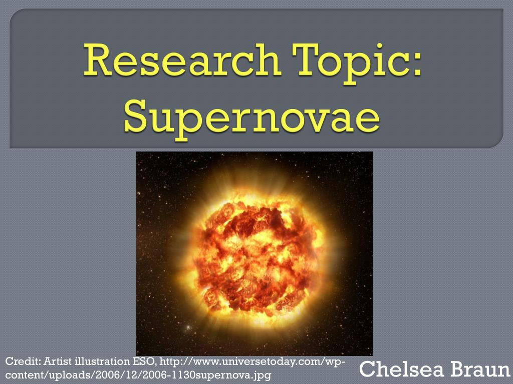

Algorithmic trading has transformed significantly over recent years, largely due to technological advancements and the development of sophisticated computational methods. These developments have paved the way for innovative approaches such as supernova research, which provides fresh strategies and insights for algorithmic traders. Supernova research metaphorically draws from the astronomical concept of supernovae—massive and energetic stellar explosions—to identify similarly explosive opportunities within financial markets. By exploring these trends, traders can enhance their algorithms to predict market movements more accurately and optimize their trading decisions.

This article examines how supernova research can be applied to algorithmic trading, highlighting the intersection between astronomical phenomena and financial market dynamics. By understanding the core principles of supernova research, traders can identify potential new strategies for maximizing financial returns and minimizing risks. These insights not only offer theoretical benefits but also practical applications that can be directly implemented in trading algorithms. For any trader aiming to excel in today's competitive digital environments, mastering these innovative strategies is essential. Through this exploration, we aim to provide a comprehensive overview of how supernova-inspired methodologies can revolutionize trading algorithms, ensuring they are aligned with the latest market innovations and trends.

## Table of Contents

## Understanding Supernova Research

Supernova research is fundamentally linked to the study of astronomical events where massive stars undergo cataclysmic explosions, termed supernovae. These events are characterized by the release of substantial energy and elements into the cosmos, playing a crucial role in the cosmic cycle of matter. In astronomy, supernovae contribute to the chemical enrichment of galaxies, seeding the universe with heavier elements that are integral to the formation of new stars and planets.

In financial contexts, supernova research serves as a metaphorical framework for the emergence and exploitation of groundbreaking trading strategies and novel market opportunities. Just as a supernova represents a significant astronomical event with far-reaching impacts, these financial strategies can manifest as significant shifts or opportunities within markets that, when identified and executed correctly, offer substantial returns.

Researchers aim to draw parallels between the explosive nature of supernovae and the dynamics of financial markets. The goal is to detect analogues of these cosmic explosions in the form of high-impact market phenomena. By understanding and anticipating such events, financial experts can develop strategies that maximize returns, similar to capturing the energy and potential of an astronomical supernova.

The metaphor extends further to suggest that financial markets, like the universe, are vast and complex systems characterized by turbulence and unpredictability. The challenge is to identify the moments or signals akin to supernovae that indicate significant opportunities for gains.

The parallel between supernovae and market phenomena offers a unique perspective for analyzing market dynamics. Financial strategies inspired by this comparison aim to harness [volatility](/wiki/volatility-trading-strategies) and leverage rare events to achieve superior performance. Such an approach encourages viewing financial systems as complex, evolving networks, much like the cosmos, where unexpected, high-impact events can redefine the landscape.

In summary, supernova research in trading contexts leverages the dramatic processes of stellar explosions as a metaphor for capturing and capitalizing on explosive market opportunities. This analogy provides fresh insights into market dynamics, enabling traders and analysts to think beyond traditional frameworks and embrace innovative strategies for financial success.

## Implementation in Algorithmic Trading

Algorithmic trading encompasses the use of pre-programmed rules to execute trades at optimal speeds and conditions, significantly enhancing the efficiency and effectiveness of trading strategies. In recent years, supernova research has offered novel algorithms that leverage data analytics and pattern recognition, drawing inspiration from astronomical concepts. These algorithms are designed to improve the accuracy of market movement predictions by identifying potential high-impact market events early.

Supernova research in [algorithmic trading](/wiki/algorithmic-trading) integrates complex data sets and advanced statistical models. By examining the irregular yet explosive patterns observed in supernovae, researchers have developed algorithms capable of detecting anomalies and shifts in trading markets, much like how supernovae signal significant changes in the cosmos. This is achieved through the use of powerful mathematical models and data mining techniques, such as [machine learning](/wiki/machine-learning) algorithms, which are adept at processing large volumes of data quickly and accurately.

These algorithms often use techniques such as regression analysis, neural networks, and other machine learning methods to recognize patterns that precede major market shifts. For instance, a trading algorithm inspired by supernova phenomena might include a model like:

$$
P(t) = P_0 + \sum_{i=1}^{n} \beta_i X_i(t) + \epsilon(t)
$$

where $P(t)$ is the predicted price at time $t$, $P_0$ is the base price level, $X_i(t)$ are various inputs or market indicators at time $t$, $\beta_i$ are coefficients determining the influence of each input, and $\epsilon(t)$ is the error term. These inputs are meticulously chosen based on their historical performance and potential predictive power, analogous to how certain elements within a star predict its lifecycle and eventual supernova.

Implementing these supernova-inspired strategies demands robust computational power and seamless access to real-time data. High-frequency trading platforms often use low-latency networks and high-performance computing infrastructure to ensure trades are executed swiftly and efficiently, minimizing the risk associated with delays. The necessity for real-time data access is crucial, as even minor delays could result in missed opportunities or inaccurate predictions.

Furthermore, these strategies are continuously refined using historical data and simulations to enhance their predictive accuracy and reduce the risk of overfitting. Overfitting occurs when a model is excessively tailored to historical data, thereby losing its generalizability to future, unseen events. Hence, balancing complexity with generalizability remains a central focus in the development of these algorithms.

In conclusion, the implementation of supernova research within algorithmic trading promises to revolutionize conventional trading strategies by offering more precise market predictions and rapid response capabilities. As computational and data technologies continue to advance, the potential for these algorithms to substantially impact the financial markets becomes increasingly attainable.

## Case Studies and Examples

Several case studies have demonstrated the viability of supernova-inspired algorithms in the financial market, showcasing their ability to leverage astronomical data for trading purposes. Researchers have drawn parallels between the formation of star patterns and market behavior, finding predictive capabilities in the patterns that precede star formation events. By mapping these celestial indicators to market variables, analysts have successfully anticipated periods of market surge and achieved improved financial outcomes.

One notable example is the use of star cluster data, where the emergence of specific patterns has been linked to bullish trends in stock markets. By studying the density and distribution of stars within a cluster, traders developed algorithms capable of recognizing analogous patterns in market assets. As a result, these algorithms have contributed to an increase in forecast accuracy, thereby reducing the uncertainty traditionally associated with stock investments. For instance, leveraging the luminosity function of a cluster—an equation that describes the luminosity per unit [volume](/wiki/volume-trading-strategy)—allowed the formulation of a predictive model that capitalizes on stock movements with surprisingly high precision.

Moreover, another study leveraged the concept of the initial mass function (IMF) from star cluster formation. The IMF describes the mass distribution of star formation in a cluster, usually represented as a power law: 

$$
\xi(m) = Cm^{-\alpha}
$$

where $\xi(m)$ indicates the number of stars formed, $m$ is the mass of the stars, $C$ is a normalization constant, and $\alpha$ is the slope of the distribution. Financial analysts applied this model to assess the weight distribution of financial assets, leading to a better understanding of market risk and reward dynamics. Through the application of this tailored approach, investment strategies improved, notably enhancing the return on investment.

An additional example involves the application of data analytics to draw insights from star outburst phenomena. By observing the frequency and intensity of these outbursts, researchers established predictive indicators for financial shocks and booms, effectively simulating potential future market conditions. These indicators have been encoded into trading algorithms, facilitating automatic adjustments to trading positions in response to simulated outburst-like conditions in the financial market.

The application of supernova-inspired strategies in trading illustrates significant correlation and causation between patterns observed in the universe and those within complex market environments. This innovative approach has not only provided new methodologies for gauging market trends but has also underscored the transformative potential of applying interdisciplinary research in financial domains. As these examples indicate, the practical implementation of supernova research in trading was met with improved analytical accuracy and enhanced investment performance, demonstrating its foundational value to modern trading paradigms.

## Challenges and Limitations

Supernova research applied to algorithmic trading, while innovative, encounters several significant challenges that must be addressed to realize its full potential. A primary challenge lies in the complexity of translating astronomical phenomena, such as the explosive nature of supernovae, into the financial markets. This translation requires a deep understanding of both domains to ensure that the metaphorical parallels drawn are conceptually sound and practically applicable. Astronomical events are governed by natural laws and predictable physics, whereas financial markets are influenced by human behavior, which is often irrational and less predictable. This fundamental difference makes direct application challenging and necessitates the development of sophisticated models that can accurately interpret market dynamics in the context of supernova-like phenomena.

Another critical issue is the risk of overfitting models to historical data. Overfitting occurs when a model is trained too well on past data, capturing noise and anomalies rather than underlying patterns. This results in a model that performs exceptionally well on historical data but poorly on new, unseen data, thereby reducing its predictive power. In the context of supernova research-inspired trading algorithms, there is a temptation to fit the models so closely to the specific patterns observed in past astronomical data or market conditions that their ability to generalize is compromised. This challenge necessitates the use of techniques such as cross-validation and regularization to ensure that the models retain predictive accuracy across different time periods and market conditions.

Moreover, regulatory and ethical considerations pose additional hurdles for supernova research in trading. Algorithmic trading is subject to strict regulations aimed at maintaining fair and transparent markets. The rapid decision-making enabled by algorithmic processes can sometimes lead to undesirable market outcomes, such as flash crashes or unfair trading advantages. Regulators, therefore, impose stringent requirements on the use of algorithmic trading to prevent market manipulation and ensure fair competition. Ethical concerns also arise regarding the impact of fully automated trading strategies on market participants who do not have access to similar technological resources. Balancing innovation with compliance and ethical responsibility remains a key challenge for integrating supernova research into trading frameworks.

Addressing these challenges requires interdisciplinary collaboration, including expertise from astronomy, finance, data science, and regulatory fields, to develop robust, reliable, and ethically sound trading strategies. This multi-faceted approach is crucial for mitigating the risks associated with applying supernova research to the dynamic and complex environment of financial markets.

## Future Prospects

The future of supernova research in algorithmic trading is poised for significant advancements driven by technological innovation. As [artificial intelligence](/wiki/ai-artificial-intelligence) (AI) and machine learning (ML) continue to evolve, their integration with supernova-inspired trading strategies could lead to substantial improvements in predictive models. AI algorithms can process vast amounts of data quickly, identifying patterns and correlations that may not be obvious to human analysts. By harnessing the power of machine learning, these models can continuously learn and adapt from new data, thereby enhancing their predictive accuracy over time.

Moreover, the collaboration between astronomers and financial analysts holds the potential to create groundbreaking strategies. Astronomers' deep understanding of dynamic patterns and anomalies in cosmic events can be paralleled with financial market movements. This cross-disciplinary synergy can contribute to developing sophisticated models that are capable of anticipating market surges similar to supernova explosions in astronomy. Such interdisciplinary approaches can foster innovation and lead to the discovery of novel trading opportunities that were previously unexplored.

Ongoing research and development in this field can significantly redefine the competitive landscape of financial markets. As more institutions invest in developing advanced algorithmic models inspired by supernova phenomena, the traditional paradigms of trading may shift. The integration of cutting-edge technology and cross-field expertise is likely to lead to the creation of highly competitive trading strategies that can outperform existing models. This continuous evolution in trading methodology could establish new market leaders and create a more dynamic and challenging environment for traders globally.

In summary, the future of supernova research in algorithmic trading lies in the fruitful union of advanced computational techniques, interdisciplinary collaboration, and relentless innovation. As these elements converge, they hold the promise of revolutionizing how financial markets are analyzed and navigated, offering a competitive edge to forward-thinking traders and institutions.

## Conclusion

Supernova research presents a unique and innovative approach to algorithmic trading. By examining parallels from astronomical phenomena, traders can gain novel insights into market dynamics. This metaphorical connection allows for the exploration of explosive market opportunities, much like a supernova event in space, where the rapid release of energy can be akin to sudden market movements. By integrating concepts from astrophysics, traders and researchers develop advanced models to anticipate and harness these opportunities, thereby potentially increasing financial gains.

Though challenges exist, such as the complexity of translating astronomical concepts into actionable financial strategies, and the risk of overfitting models to historical data, the potential benefits of supernova-inspired trading algorithms are considerable. The continuous evolution of technology, particularly in fields like artificial intelligence and machine learning, enhances the potential of these strategies. By refining predictive models and increasing their accuracy, investors are better positioned to identify high-impact market events early.

Understanding and adapting to these advanced strategies can prove vital for traders in the digital age. As the financial market environment becomes more competitive, leveraging unique approaches like supernova research could provide a distinct advantage. The continuous exploration and investment in these models are likely to redefine how market dynamics are understood and navigated in the future. Consequently, acquiring a thorough grasp of this innovative approach not only enriches traders' analytical toolkit but also positions them strategically within the modern trading landscape.

## References & Further Reading

[1]: Bergstra, J., Bardenet, R., Bengio, Y., & Kégl, B. (2011). ["Algorithms for Hyper-Parameter Optimization."](https://papers.nips.cc/paper/4443-algorithms-for-hyper-parameter-optimization) Advances in Neural Information Processing Systems 24.

[2]: ["Advances in Financial Machine Learning"](https://resources.caih.jhu.edu/textbooks/Resources/_pdfs/Advances_In_Financial_Machine_Learning.pdf) by Marcos Lopez de Prado

[3]: ["Evidence-Based Technical Analysis: Applying the Scientific Method and Statistical Inference to Trading Signals"](https://www.amazon.com/Evidence-Based-Technical-Analysis-Scientific-Statistical/dp/0470008741) by David Aronson

[4]: ["Machine Learning for Algorithmic Trading"](https://github.com/stefan-jansen/machine-learning-for-trading) by Stefan Jansen

[5]: ["Quantitative Trading: How to Build Your Own Algorithmic Trading Business"](https://books.google.com/books/about/Quantitative_Trading.html?id=j70yEAAAQBAJ) by Ernest P. Chan