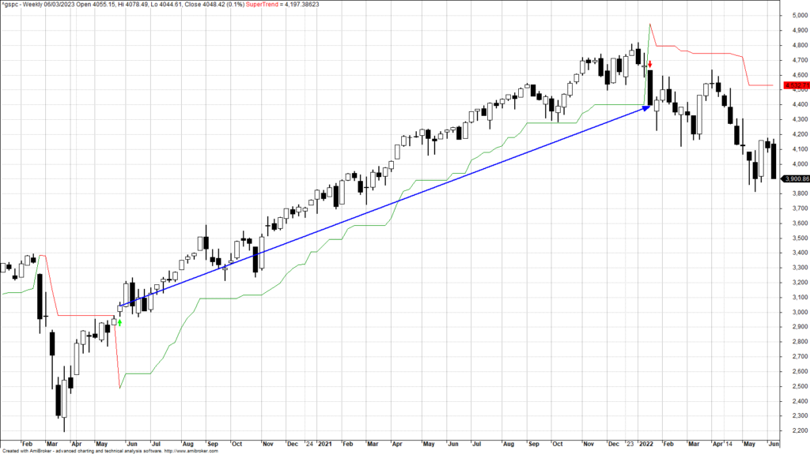

The Supertrend algorithm is a widely-used trading indicator renowned for its ability to effectively identify prevailing market trends and discern potential entry and exit points. It operates through a streamlined mechanism that leverages price action, providing traders with dynamic support and resistance levels. This functionality is achieved by plotting the Supertrend directly over the price chart where it visually represents ongoing trends: displaying in green during upward trends and shifting to red during downward trends. 

This algorithm proves invaluable for traders seeking clarity in rapidly changing markets, offering a straightforward, interpretative method centered on trend reversals and closing price crossovers. By simplifying complex market data into actionable insights, the Supertrend indicator enhances the trader's capacity to make informed decisions. This article will explore various facets of the Supertrend strategy, examine its benefits, and discuss its implementation within algorithmic trading frameworks. Automating the Supertrend within algorithmic systems amplifies the speed and precision of trades, allowing traders to adapt swiftly to market volatility. Through effective backtesting and parameter optimization, the Supertrend algorithm can be a powerful component of a diversified trading strategy, facilitating improved market timing and return maximization.



## Table of Contents

## What is the Supertrend Strategy?

The Supertrend strategy is a trend-following approach designed to capitalize on market movements by marking suitable entry and exit points for trades based on prevailing market trends. This method utilizes the Supertrend indicator, which is incorporated directly onto the price chart, providing visual cues by changing colors: it adopts a green hue during upward price trends and a red hue during downward movements. This color-coding helps traders quickly assess the current market trend.

The functioning of the Supertrend indicator primarily involves calculating the Average True Range (ATR) to define the volatility level. The indicator is represented by a line drawn above or below the closing price based on ATR calculations. The core computation of the Supertrend is as follows:

- **Uptrend Line**: $\text{Upper Band} = (\text{Close} + \text{ATR} \times \text{Multiplier})$
- **Downtrend Line**: $\text{Lower Band} = (\text{Close} - \text{ATR} \times \text{Multiplier})$

The multiplier is a critical component, typically set between 2 and 3, that adjusts the spread between the price and the indicator, thereby affecting sensitivity. A crossover of the closing price above or below these bands signals potential buy or sell points, making the Supertrend an accessible means for traders to interpret trend reversals.

Traders rely on the Supertrend strategy for its simplicity and effectiveness in highlighting trends, gaining insights through visual cues, and making more informed trading decisions. Its straightforward output allows for easy interpretation, guiding traders on how to align with prevailing market trends and efficiently manage their positions.

## Supertrend Indicator Strategy – Backtest and Calculation

We conducted a comprehensive backtest of the Supertrend strategy utilizing S&P 500 index data spanning the last 60 years. The primary configurations employed in this analysis were an Average True Range (ATR) period of 10 and a multiplier of 3. Given the S&P 500's long-term upward trajectory, the backtest focused exclusively on long positions to align with historical trends.

The Supertrend indicator, a trend-following tool, assists in pinpointing optimal entry and [exit](/wiki/exit-strategy) points based on prevailing market trends. In this backtest, we sought to evaluate the strategy's performance via several critical metrics: annual return, success rate, and risk-adjusted return. 

**Calculation of the Supertrend Indicator:**

The Supertrend indicator is determined using the following formulae:

1. **Average True Range (ATR):**
   The ATR provides a measure of market [volatility](/wiki/volatility-trading-strategies) over a specified period. It is calculated as follows:
$$
   \text{ATR}_t = \frac{1}{n} \sum_{i=0}^{n-1} \text{TR}_{t-i}

$$

   where $\text{TR}_t$ (True Range) is the maximum of:

   - Difference between current high and current low
   - Difference between current high and previous close (absolute value)
   - Difference between current low and previous close (absolute value)

2. **Supertrend Calculation:**
   The basic principle of the Supertrend revolves around the ATR value. The Supertrend is formulated as:
$$
   \text{Upper Band} = \left( \frac{\text{High} + \text{Low}}{2} \right) + (\text{Multiplier} \times \text{ATR})

$$
$$
   \text{Lower Band} = \left( \frac{\text{High} + \text{Low}}{2} \right) - (\text{Multiplier} \times \text{ATR})

$$

   The Supertrend switches between these bands depending on price movements, helping signal potential buy or sell conditions.

**Backtesting Approach:**

The backtest simulated trades based on long signals generated by the Supertrend indicator, tracking the hypothetical performance over the assessment period. To compute key performance metrics:

- **Annual Return:** The compound annual growth rate (CAGR) was used to measure returns over time.
- **Success Rate:** This metric assessed the percentage of trades resulting in a profit.
- **Risk-Adjusted Return:** The Sharpe Ratio was calculated to evaluate the return of the strategy relative to its risk, defined as:
$$
  \text{Sharpe Ratio} = \frac{\text{Average Portfolio Return} - \text{Risk-Free Rate}}{\text{Standard Deviation of Portfolio Return}}

$$

This meticulous [backtesting](/wiki/backtesting) approach aimed to provide clarity on the Supertrend strategy's efficacy, demonstrating its potential as a reliable indicator for executing long positions on a historically bullish index like the S&P 500.

## How accurate is the Supertrend indicator?

The Supertrend indicator is renowned for its effectiveness in capturing price trends, boasting a historical success rate of approximately 67%. This level of accuracy positions it as a reliable tool for traders seeking to identify and act upon market trends. However, the indicator's accuracy is highly dependent on selecting financial instruments that exhibit sustained directional movement. Instruments with clear and enduring trends tend to align better with the Supertrend's inherent design, which is based on capturing existing trends rather than predicting new ones.

To maintain or improve accuracy, fine-tuning the parameters of the Supertrend is essential. The indicator typically relies on the Average True Range (ATR) to determine its sensitivity to market fluctuations. The default settings often involve an ATR period of 10 and a multiplier between 2 and 3. These values can be adjusted based on backtesting results and specific market conditions to enhance the indicator's efficiency. 

Backtesting plays a crucial role in determining the optimal settings for the Supertrend indicator. It involves testing the indicator on historical data to evaluate its performance in different market scenarios. This process aids in understanding the trade-offs between minimizing false signals and maximizing trend captures. By carefully tuning the parameters through iterative backtesting, traders can tailor the Supertrend to suit their strategic objectives and market preferences, improving its precision in various trading environments.

Overall, while the Supertrend is a potent tool in trend identification, its effectiveness depends largely on the careful selection of financial instruments and meticulous parameter adjustments. Such diligence ensures that the indicator can effectively navigate diverse market conditions, improving its utility in a trader’s toolbox.

## Benefits and Limitations of Supertrend Indicators

Supertrend indicators are widely recognized for their straightforward application and ability to provide clear trading signals. Their design focuses on simplicity, making them particularly accessible for both novice and experienced traders. The indicator continuously adapts to market movements, offering dynamic support and resistance levels that guide trading decisions based on the prevailing trend direction.

The principal advantage of Supertrend indicators is their ease of use. They streamline the process of identifying trend direction and potential reversals, as the indicator color changes from green to red or vice versa when a trend shift is signaled. This visual clarity helps traders promptly identify buy and sell signals, reducing the cognitive load often associated with complex trading strategies.

Nevertheless, it is important to acknowledge the limitations inherent to Supertrend indicators. As lagging indicators, they often rely on historical price data to generate signals. This characteristic can lead to delayed responses in rapidly changing market environments, resulting in potential missed opportunities or late exits from trades. Moreover, in choppy or sideways markets, Supertrend indicators may produce false signals, causing traders to enter or exit positions prematurely or incorrectly. This susceptibility to generating inaccurate signals necessitates cautious application.

To mitigate these limitations, traders are encouraged to integrate additional technical analysis tools alongside Supertrend indicators. For instance, using [momentum](/wiki/momentum) oscillators such as the Relative Strength Index (RSI) can help confirm the strength and sustainability of a trend, while [volume](/wiki/volume-trading-strategy)-based indicators might provide further context to price movements. This complementary approach can enhance the accuracy of the signals, enabling better-informed trading decisions and reducing the likelihood of adverse outcomes due to misleading signals.

By combining Supertrend indicators with other analytical tools, traders can construct a more robust trading framework, balancing the simplicity and clarity offered by Supertrend with the depth and verification provided by additional indicators. This balanced approach not only helps in maximizing the effectiveness of the Supertrend strategy but also contributes to a more comprehensive trading plan.

## Using Supertrend in Algorithmic Trading

Supertrend indicators are particularly suited for integration into [algorithmic trading](/wiki/algorithmic-trading) systems due to their simple calculation and clear signal generation. These qualities allow traders to automate the execution of trades efficiently and with precisional alignment to trading algorithms, which demand speed and accuracy.

The computation of the Supertrend indicator involves pivotal elements like the Average True Range (ATR), which gauges market volatility. Here's a basic formulation employed to calculate the Supertrend indicator:

1. Calculate the ATR.

2. Determine the basic upper band:
$$
   \text{Upper Band} = (\text{High} + \text{Low}) / 2 + (\text{Multiplier} \times \text{ATR})

$$

3. Determine the basic lower band:
$$
   \text{Lower Band} = (\text{High} + \text{Low}) / 2 - (\text{Multiplier} \times \text{ATR})

$$

4. Compute the final upper band and final lower band by taking into account previous values for continuity. The Supertrend is plotted based on these values.

The straightforward nature of these calculations and the simple interpretation of trend signals make the Supertrend a natural choice for algorithmic strategies. Python, for example, provides a conducive environment for coding and executing these algorithms efficiently:

```python
import pandas as pd

def calculate_supertrend(data, atr_period=10, multiplier=3):
    data['TR'] = abs(data['High'] - data['Low'])
    data['ATR'] = data['TR'].rolling(window=atr_period).mean()

    data['Upper Band'] = (data['High'] + data['Low']) / 2 + (multiplier * data['ATR'])
    data['Lower Band'] = (data['High'] + data['Low']) / 2 - (multiplier * data['ATR'])

    data['Supertrend'] = data['Upper Band']
    for i in range(1, len(data)):
        if data['Close'][i] > data['Upper Band'][i-1]:
            data['Supertrend'][i] = data['Lower Band'][i]
        elif data['Close'][i] < data['Lower Band'][i-1]:
            data['Supertrend'][i] = data['Upper Band'][i]
        else:
            data['Supertrend'][i] = data['Supertrend'][i-1]

    return data
```

This Python function demonstrates how traders can automate the Supertrend calculation, ensuring quicker decision-making and execution than manual approaches.

Furthermore, using Supertrend indicators in conjunction with other technical indicators such as the Relative Strength Index (RSI) can yield even more comprehensive analyses. Combining the Supertrend's trend-following capacity with RSI's momentum assessment can provide a more robust trading system that diminishes false signals from volatile markets while capitalizing on genuine market opportunities. This multi-layered approach allows algorithmic traders to develop more sophisticated and adaptive trading strategies.

## Effective Timeframes and Settings

The choice of timeframe is crucial for the effectiveness of the Supertrend strategy, with the weekly timeframe often recommended due to its ability to filter out market noise and capture sustained trends. This timeframe suits traders seeking to capitalize on longer-term market movements by providing a clearer view of the prevailing trend.

Despite the weekly timeframe setting offering reliable signals, traders can experiment with different timeframes to better align the Supertrend indicator with their specific trading goals. Shorter timeframes, such as daily or hourly, may cater to active traders who wish to exploit semi-short-term trends or intraday price movements. However, these shorter intervals might deliver more frequent but less reliable signals due to inevitable market fluctuations. In contrast, monthly or quarterly timeframes could be beneficial for investors focusing on broader market trends.

The settings of the Supertrend indicator can also be adjusted to optimize its performance. A common configuration utilizes the Average True Range (ATR) over a period of 10, combined with a multiplier of 2 to 3. This is typically expressed in the formula:

$$
\text{Supertrend} = \text{Upper Band or Lower Band} = \text{HL2} \pm (\text{Multiplier} \times \text{ATR}_{10})
$$

where $\text{HL2}$ represents the average of the high and low prices. The ATR provides a measure of market volatility, allowing the Supertrend indicator to adapt dynamically to changing market conditions. The choice of multiplier affects the sensitivity of the indicator; a higher multiplier results in a broader band, reducing the frequency of signals but potentially improving their accuracy, while a lower multiplier offers more signals that are shorter in fidelity.

By experimenting with these settings, traders can tailor the Supertrend to suit their risk tolerance and trading objectives. A systematic backtesting process is fundamental in determining the optimal settings for individual strategies and financial instruments.

## Conclusion

The Supertrend strategy stands as a formidable component within the trading toolkit, recognized for its efficacy in deciphering market trends and optimizing financial returns. With its capacity to deliver actionable insights through straightforward visual signals, the Supertrend approach has carved out its place as an advantageous method for traders seeking to navigate the complexities of market dynamics. The strategy's reliability stems from its systematic use of price action and support/resistance levels, offering traders clear indicators for making informed trading decisions.

A critical element in harnessing the full potential of the Supertrend strategy lies in conducting thorough backtesting and fine-tuning of its parameters. By rigorously evaluating historical data, traders can calibrate the Average True Range (ATR) and the multiplier to better reflect prevailing market conditions. Such meticulous adjustments ensure the strategy remains attuned to fluctuations in market volatility, thereby enhancing its predictive power and profitability over time.

Incorporating the Supertrend strategy into a broader, diversified trading framework further amplifies its utility. By complementing it with other indicators and strategies, traders can mitigate risks associated with potential false signals and increase the robustness of their overall trading approach. The integration of the Supertrend into algorithmic trading systems exemplifies its adaptability, as its clear and simple calculations allow for seamless automation of trade execution.

Ultimately, the Supertrend strategy’s ability to adapt and enhance decision-making processes makes it an invaluable asset for traders aiming to capitalize on market trends. When appropriately implemented and synergized with other analytical tools, this strategy can significantly contribute to a trader's ability to make precise and profitable investment decisions.

## References & Further Reading

[1]: ["Advances in Financial Machine Learning"](https://www.amazon.com/Advances-Financial-Machine-Learning-Marcos/dp/1119482089) by Marcos Lopez de Prado

[2]: ["Evidence-Based Technical Analysis: Applying the Scientific Method and Statistical Inference to Trading Signals"](https://www.amazon.com/Evidence-Based-Technical-Analysis-Scientific-Statistical/dp/0470008741) by David Aronson

[3]: ["Machine Learning for Algorithmic Trading"](https://github.com/PacktPublishing/Machine-Learning-for-Algorithmic-Trading-Second-Edition) by Stefan Jansen

[4]: ["Quantitative Trading: How to Build Your Own Algorithmic Trading Business"](https://books.google.com/books/about/Quantitative_Trading.html?id=j70yEAAAQBAJ) by Ernest P. Chan

[5]: Wilder, Jr., J. W. (1978). "New Concepts in Technical Trading Systems." Trend Research.