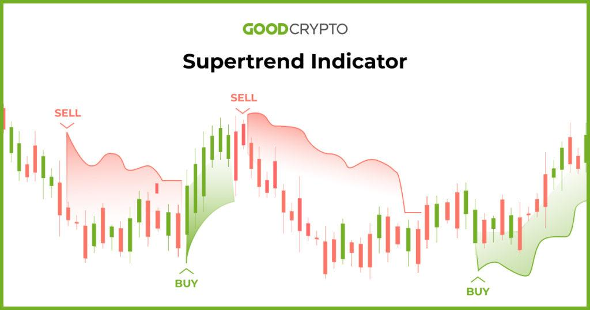

## Table of Contents

## What is the Supertrend Indicator?

The Supertrend Indicator is a tool used in trading to help people decide when to buy or sell stocks. It uses price and a special number called the "Average True Range" (ATR) to create a line on a chart. When the price of a stock goes above this line, it's a sign that you might want to buy. If the price goes below the line, it might be time to sell. This makes it easier for traders to see the overall trend of a stock's price.

The Supertrend Indicator is popular because it's simple to use and can help traders make quick decisions. It's shown as a single line that changes color, usually green for buying and red for selling. This makes it easy to spot when the trend changes. Traders often use it along with other tools to get a better understanding of the market and make smarter trading choices.

## How does the Supertrend Indicator work?

The Supertrend Indicator helps traders by showing them when it might be a good time to buy or sell a stock. It does this by drawing a line on the price chart that moves based on the stock's price and something called the Average True Range (ATR). The ATR is a way to measure how much a stock's price tends to move up and down. When the stock's price goes above the Supertrend line, the line turns green, suggesting it's a good time to buy. If the price drops below the line, it turns red, indicating it might be time to sell.

Traders like the Supertrend Indicator because it makes it easy to see the overall trend of a stock's price without getting lost in too many details. The line changes color to show when the trend is going up or down, making it simple to spot when to make a trade. While the Supertrend Indicator can be a helpful tool, many traders use it together with other indicators and tools to get a fuller picture of what's happening in the market and make better trading decisions.

## What are the key components of the Supertrend Indicator?

The Supertrend Indicator has two main parts that help traders make decisions about buying or selling stocks. The first part is the price of the stock itself. The Supertrend Indicator uses the stock's current price to figure out where to draw its line on the chart. The second part is something called the Average True Range, or ATR. The ATR measures how much the stock's price moves up and down over a certain period. The Supertrend Indicator uses the ATR to decide how far away from the current price its line should be.

These two parts work together to create the Supertrend line on the chart. When the stock's price goes above the Supertrend line, the line turns green, which is a signal that it might be a good time to buy the stock. If the stock's price drops below the Supertrend line, the line turns red, suggesting it might be time to sell. This color change makes it easy for traders to see when the trend of the stock's price is changing. By using the price and the ATR, the Supertrend Indicator helps traders spot trends and make quick decisions without getting bogged down in too many details.

## How can beginners use the Supertrend Indicator in their trading?

Beginners can start using the Supertrend Indicator by adding it to their trading chart on their platform. Once it's on the chart, they will see a line that changes color based on the stock's price. If the line turns green, it means the stock's price is above the line, and it might be a good time to buy. If the line turns red, it means the price is below the line, and it might be time to sell. Beginners should watch this line to see when it changes color and use that as a signal for when to make a trade.

It's important for beginners to remember that the Supertrend Indicator is just one tool among many. They should not rely on it alone but use it along with other tools and indicators to get a better understanding of the market. For example, they might also look at the stock's overall trend, news about the company, and other technical indicators. By combining the Supertrend Indicator with other information, beginners can make more informed trading decisions and improve their chances of success.

## What are the default settings for the Supertrend Indicator?

The Supertrend Indicator usually comes with two main settings that you can change. The first setting is called the period, which is often set to 10 by default. This number tells the indicator how many recent price movements to look at when calculating the Average True Range (ATR). The second setting is the multiplier, which is usually set to 3 by default. This number helps decide how far away the Supertrend line should be from the current price of the stock.

When you use the Supertrend Indicator with these default settings, it will draw a line on your chart based on the stock's price and the ATR. If the stock's price goes above this line, the line will turn green, suggesting it might be a good time to buy. If the price drops below the line, it will turn red, indicating it might be time to sell. These default settings are a good starting point, but you might want to adjust them based on your own trading style and the specific stock you are looking at.

## How can the Supertrend Indicator be customized for different trading styles?

The Supertrend Indicator can be changed to fit different ways people like to trade. For example, if someone likes to make quick trades and wants to catch small changes in the stock's price, they might set the period to a smaller number, like 7, and the multiplier to 2. This makes the Supertrend line more sensitive to price changes, so it will switch between green and red more often. On the other hand, if someone prefers to hold onto stocks for a longer time and wants to see bigger trends, they might use a larger period, like 14, and a bigger multiplier, like 4. This makes the line less likely to change color, so it will only signal big shifts in the stock's trend.

People can also change the Supertrend Indicator to match the kind of stocks they are trading. For stocks that move a lot in price, a higher multiplier might help avoid too many false signals. For stocks that don't move much, a lower multiplier could be better to catch smaller trends. By playing around with these settings, traders can make the Supertrend Indicator work better for their own way of trading and the specific stocks they are looking at.

## What are the advantages of using the Supertrend Indicator in trading?

The Supertrend Indicator is a helpful tool for traders because it makes it easy to see when a stock's price is going up or down. It shows this with a line that changes color: green when it's a good time to buy and red when it's time to sell. This simple signal helps traders make quick decisions without having to look at a lot of complicated charts. It's especially useful for people who are just starting to trade because it gives them a clear sign of when to act.

Another advantage of the Supertrend Indicator is that it can be changed to fit different ways of trading. Traders can adjust settings like the period and multiplier to match their own style and the stocks they are trading. This means it can be used by people who like to make fast trades and by those who hold onto stocks for a longer time. By using the Supertrend Indicator along with other tools, traders can get a better overall picture of the market and make smarter choices about when to buy and sell.

## What are the limitations and potential pitfalls of the Supertrend Indicator?

The Supertrend Indicator is a helpful tool, but it has some limits. It can sometimes give false signals, making traders think it's time to buy or sell when it's not. This happens because the indicator is based on past price movements, and it can't predict the future. If the market is moving a lot and the stock's price is jumping around, the Supertrend Indicator might change color too often, leading to quick trades that might not be good for making money.

Another problem is that the Supertrend Indicator works best when used with other tools. If traders only use the Supertrend Indicator, they might miss important information about the market. For example, they might not see news about a company or other signs that the stock's price is about to change. It's important for traders to combine the Supertrend Indicator with other indicators and do their own research to make the best trading decisions.

## How does the Supertrend Indicator perform in different market conditions?

The Supertrend Indicator works well in markets that have a clear trend, either going up or down. When the market is moving in a strong direction, the Supertrend line will stay green if the market is going up, telling traders to buy, or red if the market is going down, telling them to sell. This makes it easier for traders to follow the trend and make money. But if the market is moving a lot and the price is jumping around, the Supertrend Indicator might change color too often. This can lead to false signals, making traders buy and sell too quickly, which might not be good for making money.

In markets that are not moving much and the price is staying the same, the Supertrend Indicator might not be very helpful. It might not change color at all, or it might give signals that are hard to use because the price isn't moving enough to make a clear trend. Traders need to be careful in these conditions and might want to use other tools along with the Supertrend Indicator to get a better idea of what's happening in the market. By combining the Supertrend Indicator with other indicators and doing their own research, traders can make better decisions no matter what the market is doing.

## Can the Supertrend Indicator be combined with other technical indicators for better results?

Yes, the Supertrend Indicator can be combined with other technical indicators to get better results. For example, traders might use it with the Moving Average Convergence Divergence (MACD) to see if the trend shown by the Supertrend is strong. If the Supertrend line turns green and the MACD shows a bullish signal, it can give traders more confidence to buy. On the other hand, if the Supertrend line turns red and the MACD shows a bearish signal, it might be a good time to sell. By using these two indicators together, traders can get a clearer picture of the market and make smarter trading decisions.

Another way to use the Supertrend Indicator with other tools is to combine it with the Relative Strength Index (RSI). The RSI helps traders see if a stock is overbought or oversold. If the Supertrend line turns green but the RSI shows the stock is overbought, traders might want to wait before buying. If the Supertrend line turns red and the RSI shows the stock is oversold, it could be a good time to sell. By looking at both the Supertrend Indicator and the RSI, traders can avoid making trades at the wrong times and improve their chances of making money.

## What are some advanced strategies using the Supertrend Indicator?

One advanced strategy using the Supertrend Indicator is to combine it with other indicators to confirm trends and reduce false signals. For example, traders might use the Supertrend Indicator along with the Moving Average Convergence Divergence (MACD). When the Supertrend line turns green, indicating a buy signal, traders can check if the MACD also shows a bullish crossover. This double confirmation can help traders feel more confident about entering a trade. Similarly, if the Supertrend line turns red and the MACD shows a bearish crossover, it might be a good time to sell. By using these two indicators together, traders can make more informed decisions and avoid acting on false signals.

Another advanced strategy involves using the Supertrend Indicator with the Relative Strength Index (RSI) to identify overbought or oversold conditions. When the Supertrend line turns green, suggesting a buy, traders can look at the RSI to see if the stock is overbought. If the RSI is above 70, it might be wise to wait before buying, as the stock could be due for a price drop. Conversely, if the Supertrend line turns red and the RSI is below 30, indicating an oversold condition, it could be a good time to sell. This strategy helps traders avoid entering trades at the wrong times and can improve their overall trading performance.

## How can traders backtest and optimize their Supertrend Indicator trading strategy?

To backtest and optimize a trading strategy using the Supertrend Indicator, traders first need to use historical data to see how well the strategy would have worked in the past. They can set up their trading platform or use special software to go back in time and apply the Supertrend Indicator to old price charts. By doing this, traders can see if the buy and sell signals given by the Supertrend Indicator would have made them money or caused them to lose money. They can try different settings for the period and multiplier to see which ones work best for the stocks they are interested in. This helps them find the best way to use the Supertrend Indicator for their trading style.

Once traders have backtested their strategy, they can start to optimize it by making small changes to the settings and seeing how those changes affect the results. For example, they might try different period lengths or multiplier values to see if they can improve the number of winning trades or reduce the number of losing ones. It's important to test these changes over a long period of time and with different market conditions to make sure the strategy works well in all situations. By carefully backtesting and optimizing, traders can fine-tune their use of the Supertrend Indicator to make better trading decisions and increase their chances of success.

## What is the Supertrend Indicator Strategy and how is it backtested and calculated?

We conducted a comprehensive backtest of the Supertrend strategy utilizing S&P 500 index data spanning the last 60 years. The primary configurations employed in this analysis were an Average True Range (ATR) period of 10 and a multiplier of 3. Given the S&P 500's long-term upward trajectory, the backtest focused exclusively on long positions to align with historical trends.

The Supertrend indicator, a trend-following tool, assists in pinpointing optimal entry and [exit](/wiki/exit-strategy) points based on prevailing market trends. In this backtest, we sought to evaluate the strategy's performance via several critical metrics: annual return, success rate, and risk-adjusted return. 

**Calculation of the Supertrend Indicator:**

The Supertrend indicator is determined using the following formulae:

1. **Average True Range (ATR):**
   The ATR provides a measure of market [volatility](/wiki/volatility-trading-strategies) over a specified period. It is calculated as follows:
$$
   \text{ATR}_t = \frac{1}{n} \sum_{i=0}^{n-1} \text{TR}_{t-i}

$$

   where $\text{TR}_t$ (True Range) is the maximum of:

   - Difference between current high and current low
   - Difference between current high and previous close (absolute value)
   - Difference between current low and previous close (absolute value)

2. **Supertrend Calculation:**
   The basic principle of the Supertrend revolves around the ATR value. The Supertrend is formulated as:
$$
   \text{Upper Band} = \left( \frac{\text{High} + \text{Low}}{2} \right) + (\text{Multiplier} \times \text{ATR})

$$
$$
   \text{Lower Band} = \left( \frac{\text{High} + \text{Low}}{2} \right) - (\text{Multiplier} \times \text{ATR})

$$

   The Supertrend switches between these bands depending on price movements, helping signal potential buy or sell conditions.

**Backtesting Approach:**

The backtest simulated trades based on long signals generated by the Supertrend indicator, tracking the hypothetical performance over the assessment period. To compute key performance metrics:

- **Annual Return:** The compound annual growth rate (CAGR) was used to measure returns over time.
- **Success Rate:** This metric assessed the percentage of trades resulting in a profit.
- **Risk-Adjusted Return:** The Sharpe Ratio was calculated to evaluate the return of the strategy relative to its risk, defined as:
$$
  \text{Sharpe Ratio} = \frac{\text{Average Portfolio Return} - \text{Risk-Free Rate}}{\text{Standard Deviation of Portfolio Return}}

$$

This meticulous [backtesting](/wiki/backtesting) approach aimed to provide clarity on the Supertrend strategy's efficacy, demonstrating its potential as a reliable indicator for executing long positions on a historically bullish index like the S&P 500.

## How can Supertrend be used in algorithmic trading?

Supertrend indicators are particularly suited for integration into [algorithmic trading](/wiki/algorithmic-trading) systems due to their simple calculation and clear signal generation. These qualities allow traders to automate the execution of trades efficiently and with precisional alignment to trading algorithms, which demand speed and accuracy.

The computation of the Supertrend indicator involves pivotal elements like the Average True Range (ATR), which gauges market volatility. Here's a basic formulation employed to calculate the Supertrend indicator:

1. Calculate the ATR.

2. Determine the basic upper band:
$$
   \text{Upper Band} = (\text{High} + \text{Low}) / 2 + (\text{Multiplier} \times \text{ATR})

$$

3. Determine the basic lower band:
$$
   \text{Lower Band} = (\text{High} + \text{Low}) / 2 - (\text{Multiplier} \times \text{ATR})

$$

4. Compute the final upper band and final lower band by taking into account previous values for continuity. The Supertrend is plotted based on these values.

The straightforward nature of these calculations and the simple interpretation of trend signals make the Supertrend a natural choice for algorithmic strategies. Python, for example, provides a conducive environment for coding and executing these algorithms efficiently:

```python
import pandas as pd

def calculate_supertrend(data, atr_period=10, multiplier=3):
    data['TR'] = abs(data['High'] - data['Low'])
    data['ATR'] = data['TR'].rolling(window=atr_period).mean()

    data['Upper Band'] = (data['High'] + data['Low']) / 2 + (multiplier * data['ATR'])
    data['Lower Band'] = (data['High'] + data['Low']) / 2 - (multiplier * data['ATR'])

    data['Supertrend'] = data['Upper Band']
    for i in range(1, len(data)):
        if data['Close'][i] > data['Upper Band'][i-1]:
            data['Supertrend'][i] = data['Lower Band'][i]
        elif data['Close'][i] < data['Lower Band'][i-1]:
            data['Supertrend'][i] = data['Upper Band'][i]
        else:
            data['Supertrend'][i] = data['Supertrend'][i-1]

    return data
```

This Python function demonstrates how traders can automate the Supertrend calculation, ensuring quicker decision-making and execution than manual approaches.

Furthermore, using Supertrend indicators in conjunction with other technical indicators such as the Relative Strength Index (RSI) can yield even more comprehensive analyses. Combining the Supertrend's trend-following capacity with RSI's momentum assessment can provide a more robust trading system that diminishes false signals from volatile markets while capitalizing on genuine market opportunities. This multi-layered approach allows algorithmic traders to develop more sophisticated and adaptive trading strategies.

## What are effective timeframes and settings?

The choice of timeframe is crucial for the effectiveness of the Supertrend strategy, with the weekly timeframe often recommended due to its ability to filter out market noise and capture sustained trends. This timeframe suits traders seeking to capitalize on longer-term market movements by providing a clearer view of the prevailing trend.

Despite the weekly timeframe setting offering reliable signals, traders can experiment with different timeframes to better align the Supertrend indicator with their specific trading goals. Shorter timeframes, such as daily or hourly, may cater to active traders who wish to exploit semi-short-term trends or intraday price movements. However, these shorter intervals might deliver more frequent but less reliable signals due to inevitable market fluctuations. In contrast, monthly or quarterly timeframes could be beneficial for investors focusing on broader market trends.

The settings of the Supertrend indicator can also be adjusted to optimize its performance. A common configuration utilizes the Average True Range (ATR) over a period of 10, combined with a multiplier of 2 to 3. This is typically expressed in the formula:

$$
\text{Supertrend} = \text{Upper Band or Lower Band} = \text{HL2} \pm (\text{Multiplier} \times \text{ATR}_{10})
$$

where $\text{HL2}$ represents the average of the high and low prices. The ATR provides a measure of market volatility, allowing the Supertrend indicator to adapt dynamically to changing market conditions. The choice of multiplier affects the sensitivity of the indicator; a higher multiplier results in a broader band, reducing the frequency of signals but potentially improving their accuracy, while a lower multiplier offers more signals that are shorter in fidelity.

By experimenting with these settings, traders can tailor the Supertrend to suit their risk tolerance and trading objectives. A systematic backtesting process is fundamental in determining the optimal settings for individual strategies and financial instruments.

## References & Further Reading

[1]: ["Advances in Financial Machine Learning"](https://www.amazon.com/Advances-Financial-Machine-Learning-Marcos/dp/1119482089) by Marcos Lopez de Prado

[2]: ["Evidence-Based Technical Analysis: Applying the Scientific Method and Statistical Inference to Trading Signals"](https://www.amazon.com/Evidence-Based-Technical-Analysis-Scientific-Statistical/dp/0470008741) by David Aronson

[3]: ["Machine Learning for Algorithmic Trading"](https://github.com/PacktPublishing/Machine-Learning-for-Algorithmic-Trading-Second-Edition) by Stefan Jansen

[4]: ["Quantitative Trading: How to Build Your Own Algorithmic Trading Business"](https://books.google.com/books/about/Quantitative_Trading.html?id=j70yEAAAQBAJ) by Ernest P. Chan

[5]: Wilder, Jr., J. W. (1978). "New Concepts in Technical Trading Systems." Trend Research.