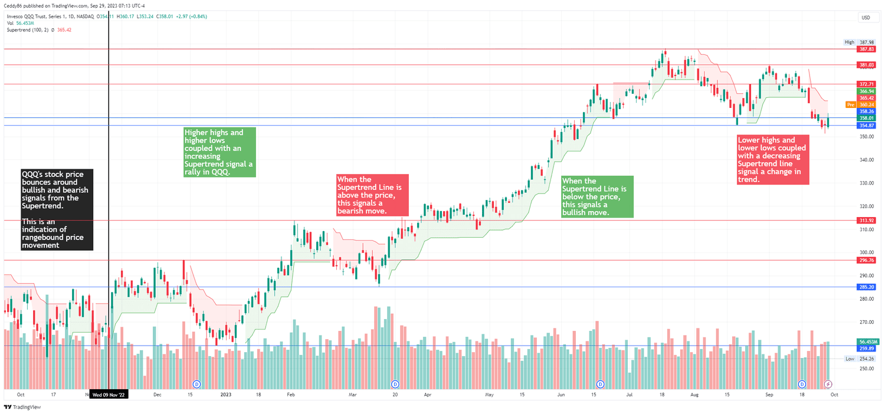

## Table of Contents

## What is the Supertrend Indicator?

The Supertrend Indicator is a tool used in stock market trading to help traders decide when to buy or sell stocks. It is shown as a line on a stock chart and changes color based on the stock's price movement. When the line is green, it suggests that it might be a good time to buy the stock because the price is going up. When the line turns red, it indicates that it might be a good time to sell because the price is going down.

This indicator is popular because it is easy to understand and use. It is calculated using the stock's price and a special formula that looks at the highest and lowest prices over a certain period. Traders like it because it helps them see the overall trend of the stock's price quickly and make decisions based on that trend. By following the Supertrend Indicator, traders hope to buy stocks at a lower price and sell them at a higher price to make a profit.

## How does the Supertrend Indicator work?

The Supertrend Indicator works by using the stock's price to draw a line on the chart that changes color. It looks at the highest and lowest prices of the stock over a certain time, usually a few days or weeks. It uses these prices to figure out if the stock is going up or down. If the stock's price is higher than the Supertrend line, the line turns green, suggesting it might be a good time to buy. If the stock's price is lower than the Supertrend line, the line turns red, suggesting it might be a good time to sell.

Traders like the Supertrend Indicator because it's easy to see and understand. It helps them quickly spot the trend of the stock's price. When the line is green, it means the stock's price is going up, so traders might want to buy it. When the line is red, it means the stock's price is going down, so traders might want to sell it. By following the color of the Supertrend line, traders try to buy low and sell high to make a profit.

## What are the key components of the Supertrend Indicator?

The Supertrend Indicator has two main parts: the Supertrend line and the stock's price. The Supertrend line is what you see on the chart, and it changes color based on the stock's price. If the stock's price is above the Supertrend line, the line turns green. This tells traders that the stock's price is going up and it might be a good time to buy. If the stock's price falls below the Supertrend line, the line turns red. This tells traders that the stock's price is going down and it might be a good time to sell.

The Supertrend line is calculated using the stock's highest and lowest prices over a certain period of time. This period can be set by the trader, but it's usually a few days or weeks. The formula for the Supertrend line looks at these high and low prices to figure out where to draw the line. By watching where the stock's price is compared to the Supertrend line, traders can quickly see if the stock is in an uptrend or a downtrend. This helps them make decisions about buying or selling the stock based on the overall trend.

## How is the Supertrend Indicator calculated?

The Supertrend Indicator is calculated using the stock's highest and lowest prices over a certain period of time. This period is usually set by the trader and can be a few days or weeks. The formula for the Supertrend line uses these high and low prices to figure out where to draw the line on the chart. It also uses a number called the "multiplier," which is usually set to 3 but can be changed by the trader. The multiplier helps make the Supertrend line more or less sensitive to price changes.

To calculate the Supertrend line, you first find the average of the highest high and the lowest low over the chosen period. Then, you multiply the difference between the high and low by the multiplier and add or subtract this from the average, depending on whether the stock's price is going up or down. If the stock's price is above the Supertrend line, the line turns green, suggesting it might be a good time to buy. If the stock's price is below the Supertrend line, the line turns red, suggesting it might be a good time to sell. By watching where the stock's price is compared to the Supertrend line, traders can quickly see the overall trend and make decisions about buying or selling.

## What are the default settings for the Supertrend Indicator?

The default settings for the Supertrend Indicator are simple and easy to use. The most common setting is a period of 10 days or 10 bars on the chart. This means the indicator looks at the highest and lowest prices over the last 10 days to figure out where to draw the line.

The other important setting is the multiplier, which is usually set to 3. The multiplier helps decide how sensitive the Supertrend line is to changes in the stock's price. A higher multiplier makes the line less sensitive, while a lower multiplier makes it more sensitive. With these default settings, the Supertrend Indicator works well for many traders, helping them see the overall trend of the stock's price and make buying or selling decisions.

## How can the Supertrend Indicator be used in trading?

The Supertrend Indicator can be used in trading to help traders decide when to buy or sell stocks. Traders watch the Supertrend line on the chart, which changes color based on the stock's price. If the line is green, it means the stock's price is going up and it might be a good time to buy. If the line turns red, it means the stock's price is going down and it might be a good time to sell. By following the color of the line, traders can try to buy stocks at a lower price and sell them at a higher price to make a profit.

Traders can also use the Supertrend Indicator with other tools to make better decisions. For example, they might use it with other indicators like the Moving Average or the Relative Strength Index to confirm the trend. If both the Supertrend Indicator and another tool suggest the same thing, like buying or selling, traders might feel more confident in their decision. This way, the Supertrend Indicator helps traders see the overall trend quickly and easily, making it a useful part of their trading strategy.

## What are the advantages of using the Supertrend Indicator?

The Supertrend Indicator is easy to use and understand. It shows a line on the chart that changes color, making it simple for traders to see if the stock's price is going up or down. When the line is green, it means the stock's price is going up, and it might be a good time to buy. When the line turns red, it means the stock's price is going down, and it might be a good time to sell. This helps traders make quick decisions without needing to look at a lot of complicated information.

Another advantage of the Supertrend Indicator is that it helps traders follow the overall trend of the stock's price. By using this indicator, traders can try to buy stocks at a lower price and sell them at a higher price to make a profit. The Supertrend Indicator can also be used with other tools, like the Moving Average or the Relative Strength Index, to confirm the trend. This makes traders feel more confident in their decisions and helps them trade more effectively.

## What are the limitations of the Supertrend Indicator?

The Supertrend Indicator is not perfect and has some limitations. One big problem is that it can give false signals, telling traders to buy or sell when it might not be the best time. This happens because the indicator looks at past prices to make its decisions, but the stock market can change quickly. If the stock's price moves a lot in a short time, the Supertrend Indicator might not keep up and could lead traders to make the wrong choice.

Another limitation is that the Supertrend Indicator works best in markets that have a clear trend, either going up or down. If the market is moving sideways, with the stock's price not going up or down much, the Supertrend Indicator can be less helpful. It might keep switching between buy and sell signals, making it hard for traders to know what to do. Traders need to be careful and use other tools along with the Supertrend Indicator to make better decisions.

## How can the Supertrend Indicator be customized for different trading strategies?

The Supertrend Indicator can be customized to fit different trading strategies by changing its settings. Traders can adjust the period, which is how many days or bars the indicator looks at to figure out the trend. A shorter period, like 7 days, makes the indicator more sensitive and it might change color more often. This could be good for traders who like to buy and sell quickly. A longer period, like 14 days, makes the indicator less sensitive and it might stay the same color longer, which could be better for traders who hold onto stocks for a longer time.

Traders can also change the multiplier, which is usually set to 3 but can be made higher or lower. A higher multiplier, like 4 or 5, makes the Supertrend line less sensitive to price changes, so it might not switch colors as often. This could be useful for traders who want to avoid false signals and stay in trades longer. A lower multiplier, like 2 or 1, makes the line more sensitive, so it might switch colors more often, which could be good for traders who want to catch small price movements. By playing with these settings, traders can make the Supertrend Indicator work better for their own trading style.

## Can the Supertrend Indicator be used in conjunction with other technical indicators?

Yes, the Supertrend Indicator can be used with other technical indicators to make better trading decisions. Traders often use it with the Moving Average to see if the stock's price is following the trend. If the Supertrend line is green and the stock's price is above the Moving Average, it might be a strong sign to buy. On the other hand, if the Supertrend line is red and the stock's price is below the Moving Average, it might be a good time to sell. By using these two indicators together, traders can feel more confident in their choices.

Another popular combination is using the Supertrend Indicator with the Relative Strength Index (RSI). The RSI helps traders see if a stock is overbought or oversold. If the Supertrend line is green and the RSI is not in the overbought zone, it might be a good time to buy. If the Supertrend line is red and the RSI is not in the oversold zone, it might be a good time to sell. By looking at both the Supertrend Indicator and the RSI, traders can get a clearer picture of the stock's trend and make more informed decisions.

## How does the Supertrend Indicator perform in different market conditions?

The Supertrend Indicator works best in markets that have a clear trend, either going up or down. When the market is moving in one direction, the Supertrend line stays the same color for a longer time, helping traders know when to buy or sell. For example, in a strong uptrend, the line will be green, suggesting it's a good time to buy and hold onto the stock. In a strong downtrend, the line will be red, telling traders it might be a good time to sell. This makes it easier for traders to follow the trend and make profitable trades.

However, the Supertrend Indicator can be less helpful in markets that are moving sideways, with the stock's price not going up or down much. In these conditions, the Supertrend line might switch between green and red often, giving false signals that can confuse traders. They might buy or sell at the wrong times, leading to losses. Traders need to be careful and use other tools along with the Supertrend Indicator to understand the market better and make smarter decisions.

## What are some advanced techniques for using the Supertrend Indicator effectively?

To use the Supertrend Indicator effectively, traders can combine it with other indicators like the Moving Average or the Relative Strength Index (RSI). For example, if the Supertrend line is green and the stock's price is above the Moving Average, it might be a strong sign to buy. If the Supertrend line is red and the stock's price is below the Moving Average, it might be a good time to sell. Using these indicators together helps traders feel more confident in their decisions because they get a clearer picture of the trend. Another technique is to watch the RSI along with the Supertrend Indicator. If the Supertrend line is green and the RSI is not in the overbought zone, it might be a good time to buy. If the Supertrend line is red and the RSI is not in the oversold zone, it might be a good time to sell.

Another advanced technique is to adjust the settings of the Supertrend Indicator to fit different trading strategies. Traders can change the period, which is how many days or bars the indicator looks at to figure out the trend. A shorter period, like 7 days, makes the indicator more sensitive and it might change color more often, which could be good for quick trading. A longer period, like 14 days, makes the indicator less sensitive and it might stay the same color longer, which could be better for holding onto stocks for a longer time. Traders can also change the multiplier, which is usually set to 3. A higher multiplier, like 4 or 5, makes the Supertrend line less sensitive to price changes, so it might not switch colors as often. This could be useful for traders who want to avoid false signals and stay in trades longer. A lower multiplier, like 2 or 1, makes the line more sensitive, so it might switch colors more often, which could be good for traders who want to catch small price movements. By playing with these settings, traders can make the Supertrend Indicator work better for their own trading style.

## What is the Supertrend Indicator Formula?

The Supertrend indicator formula is a widely-used tool in trading that is primarily constructed using the median price and the Average True Range (ATR). The median price is calculated by the formula:

$$
\text{MedianPrice} = \frac{\text{High} + \text{Low}}{2}
$$

This median price is a crucial starting point for the Supertrend formula, providing a balanced position between the high and low prices observed within a specific time frame.

The Supertrend indicator further refines this by employing the ATR, a metric that quantifies market [volatility](/wiki/volatility-trading-strategies). Using the ATR, two crucial bands, the Upper and Lower bands, are calculated through the following formulas:

$$
\text{UpBand} = \text{MedianPrice} + \text{Multiplier} \times \text{ATR}
$$

$$
\text{DnBand} = \text{MedianPrice} - \text{Multiplier} \times \text{ATR}
$$

In these equations, the Multiplier is a user-defined parameter that scales the ATR to adjust the sensitivity of the Supertrend indicator. By considering both the MedianPrice and the scaled ATR, these bands encapsulate the prevailing price range with adaptability to the market's current volatility.

The Supertrend line itself is dynamic, alternating between these Upper and Lower bands. This alternation occurs based on the asset's current price relative to the bands. When the market price rises above the Upper band, the Supertrend indicator signals a bullish trend, causing the line to shift to the Upper band position. Conversely, when the price falls below the Lower band, the Supertrend line indicates a bearish trend and moves to the Lower band position. This behavior helps traders clearly identify trend directions and possible reversal points, providing actionable signals based on market volatility and price movement.

## References & Further Reading

[1]: Wilder, J. W. (1978). ["New Concepts in Technical Trading Systems"](https://books.google.com/books/about/New_Concepts_in_Technical_Trading_System.html?id=WesJAQAAMAAJ). Trend Research.

[2]: Seban, O. ["Supertrend Introduction and Development."](https://trendspider.com/learning-center/supertrend-indicator-a-comprehensive-guide/) Retrieved from Oliver Seban's website.

[3]: ["Algorithmic Trading: Winning Strategies and Their Rationale"](https://www.wiley.com/en-us/Algorithmic+Trading%3A+Winning+Strategies+and+Their+Rationale-p-9781118460146) by Ernie Chan.

[4]: Kaufman, P. J. (2013). ["Trading Systems and Methods"](https://www.amazon.com/Trading-Systems-Methods-Website-Wiley/dp/1118043561) (5th ed.). Wiley.

[5]: Colby, R. W. (2003). ["The Encyclopedia of Technical Market Indicators"](https://www.amazon.com/Encyclopedia-Technical-Market-Indicators-Second/dp/0070120579) (2nd ed.). McGraw-Hill.