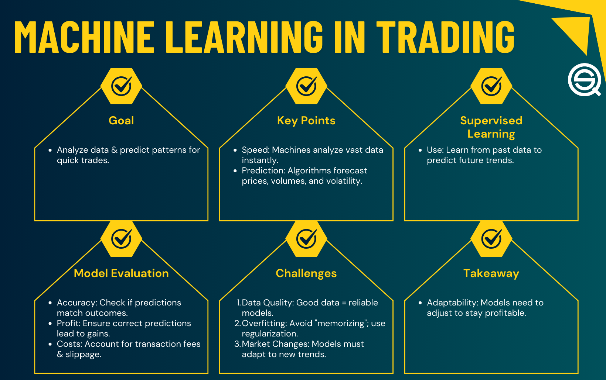

Supervised learning has become an influential element in the field of algorithmic trading, providing tools to predict market movements with increased accuracy. This approach involves training models on known data and outcomes to forecast future events accurately. In trading, where precision and timely decisions are critical, supervised learning models can significantly enhance traders' ability to forecast market behaviors.

This article explores the application of supervised learning techniques in trading, focusing on regression and classification tasks. Regression techniques are used to predict continuous values, such as future stock prices, by analyzing patterns in historical price data. Meanwhile, classification methods allow traders to categorize market signals, like predicting a stock price movement's direction—up or down. By employing these techniques, traders can design algorithms that respond swiftly and effectively to market changes, optimizing strategies for better financial outcomes.



Choosing the right model is crucial for developing efficient trading strategies. Different models offer varied advantages and trade-offs, depending on factors such as the data's nature and the specific trading problem at hand. For instance, linear regression might be suitable for predicting stock prices in a stable market environment, while more dynamic markets may require advanced classification techniques like support vector machines or neural networks. Understanding these distinctions helps traders select models that align best with their strategies, whether their focus is on speed, accuracy, or resource efficiency.

## Table of Contents

## Understanding Supervised Learning in Trading

Supervised learning is a subset of machine learning in which a model is trained on labeled data, meaning that each input data point has an associated correct output. This process allows the model to learn the relationship between inputs and outputs, making it possible to predict outcomes for new, unseen data. In the context of trading, supervised learning employs historical financial data as input features to build predictive models that forecast future market behavior or generate actionable trade signals.

Historical price data, trading volume, economic indicators, and technical analysis metrics compose the typical inputs for these models. These features serve as inputs in both regression and classification tasks, the two primary branches of supervised learning.

Regression techniques in supervised learning aim to predict continuous output variables. For instance, predicting the future price of a stock or the expected return on an investment falls under this category. The regression models capture and quantify the relationship between input features and continuous financial outcomes, facilitating more informed trading decisions.

Classification tasks, on the other hand, categorize inputs into discrete classes or categories. In trading, this might involve predicting whether a stock price will increase ("buy"), decrease ("sell"), or remain stable ("hold") within a given time frame. Classification models help traders classify market conditions or detect unusual patterns that may indicate significant market movements.

Python, a widely used programming language in [algorithmic trading](/wiki/algorithmic-trading), offers numerous libraries and frameworks to implement supervised learning models efficiently. Libraries such as scikit-learn provide tools to perform both regression and classification through a user-friendly interface, enabling traders to develop and refine their predictive models continuously.

```python
from sklearn.model_selection import train_test_split
from sklearn.ensemble import RandomForestRegressor, RandomForestClassifier
from sklearn.metrics import mean_squared_error, accuracy_score

# Example: Using random forests for trading
# Load your data
X, y_regression = load_regression_data()  # Input features and continuous output
X, y_classification = load_classification_data()  # Input features and categorical output

# Split data into training and testing sets
X_train, X_test, y_train_reg, y_test_reg = train_test_split(X, y_regression, test_size=0.2, random_state=42)
X_train, X_test, y_train_class, y_test_class = train_test_split(X, y_classification, test_size=0.2, random_state=42)

# Regression: Random Forest Regressor
regressor = RandomForestRegressor(n_estimators=100, random_state=42)
regressor.fit(X_train, y_train_reg)
y_pred_reg = regressor.predict(X_test)
regression_mse = mean_squared_error(y_test_reg, y_pred_reg)

# Classification: Random Forest Classifier
classifier = RandomForestClassifier(n_estimators=100, random_state=42)
classifier.fit(X_train, y_train_class)
y_pred_class = classifier.predict(X_test)
classification_accuracy = accuracy_score(y_test_class, y_pred_class)

print(f"Regression Mean Squared Error: {regression_mse}")
print(f"Classification Accuracy: {classification_accuracy}")
```

Supervised learning introduces a structured approach to forecasting and decision-making in trading. By leveraging labeled datasets, these models transform historical trends into predictive insights, enhancing the ability of traders to navigate complex market environments.

## Regression Techniques for Trading

Regression analysis serves as a cornerstone in supervised learning, particularly when applied to predict continuous financial outcomes like stock prices. This technique involves modeling the relationship between a dependent variable, such as stock price, and one or more independent variables, potentially including economic indicators, historical prices, or technical analysis metrics.

### Linear Regression

Linear regression is among the simplest and most widely used methods in financial forecasting due to its straightforward approach in modeling the relationship between variables. It assumes a linear relationship, expressed mathematically as:

$$
Y = \beta_0 + \beta_1X_1 + \beta_2X_2 + \ldots + \beta_nX_n + \epsilon
$$

Where $Y$ is the dependent variable, $X_1, X_2, \ldots, X_n$ are independent variables, $\beta_0$ is the intercept, $\beta_1, \beta_2, \ldots, \beta_n$ are the coefficients, and $\epsilon$ is the error term. The goal is to minimize the sum of the squared differences between observed and predicted values, providing the best fit line that describes the relationship.

While linear regression is computationally efficient and interpretable, its assumes that relationships among the dependent and independent variables are linear and normally distributed. This can be a limitation when financial data exhibits non-linearity or is influenced by external factors.

### Poisson Regression

Poisson regression is another regression model, applied primarily to predict count data or events rather than continuous outcomes. This model is particularly useful when forecasting occurrences that follow a Poisson distribution, often characterized by the formula:

$$
\text{E}(Y|X) = \lambda = e^{\beta_0 + \beta_1X_1 + \ldots + \beta_nX_n}
$$

Here, $\lambda$ represents the expected count of events occurring within a fixed period, given the independent variables $X$. Poisson regression is suitable for scenarios where events are distributed over time, such as the number of trades or customer arrivals at trading platforms.

This method is advantageous when modeling data where the underlying distribution fits count-based outcomes. However, it requires that the mean and variance of the distribution are equal, a condition not always met in financial data where overdispersion is common.

### Practical Implementation

In practical terms, implementing regression models such as linear and Poisson regression in Python is straightforward with libraries like `scikit-learn` and `statsmodels`. For example, a simple linear regression model can be fitted using `scikit-learn` as follows:

```python
from sklearn.linear_model import LinearRegression
import numpy as np

# Example data
X = np.array([[1, 2], [2, 3], [3, 4], [4, 5]])
y = np.array([2, 3, 4, 5])

# Fit linear regression model
model = LinearRegression()
model.fit(X, y)

# Predict new values
predictions = model.predict(np.array([[5, 6], [6, 7]]))
```

Choosing between these regression models requires careful consideration of data characteristics and specific financial forecasting objectives. Linear regression provides simplicity and ease of understanding, while Poisson regression offers robustness for predicting event occurrence rates in appropriate contexts.

## Classification Methods in Algorithmic Trading

Classification models are pivotal in algorithmic trading, allowing traders to categorize data, assess market conditions, and make informed decisions on whether stock prices will rise or fall. These tools are essential in organizing complex financial data into digestible insights that can drive trading strategies.

Decision trees are among the simplest classification tools, functioning as a flowchart that makes decisions based on the input features. Each node of the tree represents a question about an attribute, with branches leading to the outcome. They provide transparency and are easy to interpret, but can suffer from overfitting, especially with noisy data.

Logistic regression is typically used for binary classification tasks in trading, such as determining the likelihood of a stock price moving up or down. It models the probability that an input belongs to a particular category by using the logistic function:

$$
P(y=1|X) = \frac{1}{1 + e^{-(\beta_0 + \beta_1X_1 + ... + \beta_nX_n)}}
$$

where $\beta$ are the coefficients that are learned from the data. This method is valued for its simplicity and interpretability.

Naïve Bayes classifiers are built on Bayes' theorem, assuming independence between features. Despite the simplicity of this assumption, these classifiers perform well and are computationally efficient. They are particularly effective for small datasets where the independence assumption is reasonably valid.

Support Vector Machines (SVMs) aim to find the hyperplane that maximizes the margin between data points of different classes. This is beneficial when dealing with high-dimensional spaces. SVMs can use kernel functions to handle non-linear classification tasks, making them versatile in complex trading scenarios.

The K-Nearest Neighbors (KNN) algorithm classifies data based on the majority vote of its k-nearest neighbors in the feature space. Despite being intuitive and straightforward, KNN can be computationally demanding, especially as the dataset grows.

These classification methods are instrumental in analyzing market regimes, determining bullish or bearish conditions, and recognizing anomalous patterns that could indicate potential trades. The choice of model depends on the specific characteristics of the dataset, as well as the trading objectives pursued. By appropriately applying these models, traders can enhance their predictive accuracy and ultimately improve their trading performance.

## Key Considerations in Model Selection

When selecting a supervised learning model for algorithmic trading, it is crucial to consider the unique characteristics of both the data and the trading problem at hand. Different [machine learning](/wiki/machine-learning) estimators possess strengths and weaknesses that vary depending on several critical factors.

Firstly, data dimensionality must be scrutinized. High-dimensional datasets, such as those containing a large number of financial indicators or technical metrics, may lead to overfitting if not managed properly. Dimensionality reduction techniques like Principal Component Analysis (PCA) can mitigate this risk by transforming data into a lower-dimensional space while retaining essential information.

The need for interpretability is another vital consideration. In trading, being able to understand and explain model predictions can be as important as the predictions themselves. Linear regression and decision trees, for example, offer more interpretability compared to more complex models like neural networks, which often act as 'black boxes'. Interpretability helps in ensuring that the model's decisions align with financial logic and market expectations.

Robustness to noisy data is essential in the often-volatile environment of financial markets. Models must be able to handle data discrepancies due to missing values, irregular trading patterns, or unexpected market events. Algorithms like support vector machines and ensemble methods like Random Forest are renowned for their resilience to noise and can enhance the reliability of trading decisions.

Additionally, the balance between speed, accuracy, and computational resources cannot be overlooked. Fast execution is crucial for high-frequency trading where delays can lead to missed opportunities. However, accuracy should not be sacrificed, and computational resources must be efficiently utilized to process real-time data and execute trades swiftly.

A practical example to illustrate the balancing act between these considerations might involve the use of Python to evaluate model performance:

```python
from sklearn.model_selection import train_test_split
from sklearn.ensemble import RandomForestClassifier
from sklearn.metrics import accuracy_score

# Assuming `X` is the feature set and `y` is the target variable
X_train, X_test, y_train, y_test = train_test_split(X, y, test_size=0.2, random_state=42)

# Initialize the model with computational resources in consideration
model = RandomForestClassifier(n_estimators=100, max_depth=10, random_state=42)

# Fit the model
model.fit(X_train, y_train)

# Predict and evaluate
predictions = model.predict(X_test)
accuracy = accuracy_score(y_test, predictions)
print(f'Model accuracy: {accuracy}')
```

In summary, careful consideration of these factors results in a more robust and effective use of supervised learning models in algorithmic trading. Successfully balancing the trade-offs between complexity, speed, accuracy, and interpretability can significantly enhance trading strategies and improve overall profitability.

## Conclusion

Supervised learning offers potent tools for improving algorithmic trading strategies when applied thoughtfully. Algorithmic trading relies significantly on the precision and the adaptability of its underlying models. These models, built using historical financial data, can significantly enhance the prediction accuracy of market trends, subsequently assisting traders in decision-making processes. Understanding the nuances of different models is essential for ensuring they are aptly suited to specific trading problems. This involves selecting between regression or classification techniques based on the nature of the forecast and the available data.

For instance, when determining future stock prices, regression models such as linear regression help predict continuous financial outcomes. In contrast, if the goal is to predict market movements categorically, like whether a stock's price will increase or decrease, classification models such as support vector machines or decision trees become more pertinent.

Leveraging the strengths of various supervised learning techniques enables traders to optimize their strategies for achieving enhanced market predictions and increased profitability. Emphasis on data quality, selection of appropriate model features, and ongoing validation against real-world outcomes are crucial practices. Furthermore, implementing models that maintain a balance between speed and accuracy and optimizing computational resource usage ensures robust, efficient trading operations. As financial markets continue evolving, the strategic application of supervised learning enhances the adaptability and resilience of trading models, empowering traders with a competitive edge.

## References & Further Reading

[1]: ["Advances in Financial Machine Learning"](https://www.amazon.com/Advances-Financial-Machine-Learning-Marcos/dp/1119482089) by Marcos Lopez de Prado

[2]: ["Machine Learning for Algorithmic Trading"](https://github.com/stefan-jansen/machine-learning-for-trading) by Stefan Jansen

[3]: ["Quantitative Trading: How to Build Your Own Algorithmic Trading Business"](https://www.amazon.com/Quantitative-Trading-Build-Algorithmic-Business/dp/1119800064) by Ernest P. Chan

[4]: ["Hands-On Machine Learning for Algorithmic Trading"](https://github.com/PacktPublishing/Hands-On-Machine-Learning-for-Algorithmic-Trading) by Stefan Jansen

[5]: ["Python for Finance: Mastering Data-Driven Finance"](https://www.amazon.com/Python-Finance-Mastering-Data-Driven/dp/1492024333) by Yves Hilpisch

[6]: ["Introduction to Statistical Learning"](https://www.statlearning.com/) by Gareth James, Daniela Witten, Trevor Hastie, and Robert Tibshirani

[7]: Hastie, T., Tibshirani, R., & Friedman, J. (2009). ["The Elements of Statistical Learning: Data Mining, Inference, and Prediction"](https://link.springer.com/book/10.1007/978-0-387-84858-7). Springer Series in Statistics.