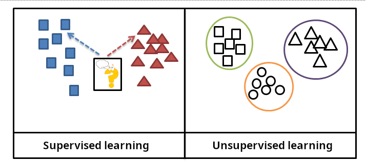

## Table of Contents

## What is supervised machine learning?

Supervised machine learning is a type of machine learning where the computer is given examples to learn from. These examples include both the input data and the correct output, so the computer can see what it's supposed to do. Imagine you're teaching a child to recognize animals. You show them pictures of cats and dogs and tell them which is which. The child learns by seeing many examples and figuring out the differences. In supervised learning, the computer does something similar. It looks at many examples of input data and their corresponding correct outputs, and tries to find a pattern or rule to predict the output for new, unseen data.

There are two main types of supervised learning: classification and regression. Classification is used when the output is a category, like deciding if an email is spam or not. Regression is used when the output is a number, like predicting the price of a house. Both types use algorithms to learn from the training data. For example, a common algorithm for classification is the logistic regression, where the probability of an input belonging to a certain class is calculated using $$ P(Y=1|X) = \frac{1}{1 + e^{-(\beta_0 + \beta_1 X)}} $$. For regression, a simple linear regression model might look like $$ Y = \beta_0 + \beta_1 X $$. These formulas help the computer make predictions based on what it has learned from the examples.

## How does supervised machine learning differ from unsupervised machine learning?

Supervised machine learning and unsupervised machine learning are two different approaches to teaching computers to learn from data. In supervised learning, the computer is given examples that include both the input data and the correct output. It's like showing a child pictures of animals and telling them which is a cat and which is a dog. The computer uses these examples to learn a pattern or rule, so it can predict the output for new data it hasn't seen before. For example, if you want to predict house prices, you give the computer data about houses and their prices, and it learns to estimate prices for new houses.

On the other hand, unsupervised [machine learning](/wiki/machine-learning) doesn't use examples with correct outputs. Instead, it tries to find patterns or groupings in the data on its own. It's like giving the child a bunch of pictures and asking them to group similar ones together without telling them what the pictures are. The computer might find clusters of data that are similar, or it might find ways to reduce the complexity of the data. For instance, if you give the computer data about customers, it might group them into different types of customers without knowing anything about them beforehand.

Both methods have their uses. Supervised learning is great when you have labeled data and want to make predictions or classify new data. Unsupervised learning is useful when you want to explore the data and find hidden structures or relationships. Each method helps the computer learn in different ways, depending on what you want it to do.

## What are the main types of supervised learning?

The main types of supervised learning are classification and regression. Classification is used when you want to sort things into different groups or categories. For example, you might use classification to decide if an email is spam or not. The computer learns from examples of emails labeled as spam or not spam, and then it can predict whether new emails are spam. A common algorithm for classification is logistic regression, where the probability of an input belonging to a certain class is calculated using $$ P(Y=1|X) = \frac{1}{1 + e^{-(\beta_0 + \beta_1 X)}} $$.

Regression, on the other hand, is used when you want to predict a number. For instance, you might use regression to predict the price of a house based on its size, location, and other features. The computer learns from examples of houses and their prices, and then it can predict the price of a new house. A simple linear regression model might look like $$ Y = \beta_0 + \beta_1 X $$. Both classification and regression help the computer make predictions based on what it has learned from the examples.

## What is the difference between classification and regression in supervised learning?

Classification and regression are two main types of supervised learning. Classification is used when you want to put things into different groups or categories. For example, you might use classification to decide if an email is spam or not. The computer looks at many examples of emails labeled as spam or not spam, and then it learns to tell the difference. A common way to do this is with logistic regression, where the computer calculates the chance of an email being spam using a formula like $$ P(Y=1|X) = \frac{1}{1 + e^{-(\beta_0 + \beta_1 X)}} $$. This helps the computer decide if new emails are spam or not.

Regression is used when you want to predict a number. For instance, you might use regression to guess the price of a house based on its size, location, and other details. The computer learns from examples of houses and their prices, and then it can predict the price of a new house. A simple way to do this is with linear regression, where the computer uses a formula like $$ Y = \beta_0 + \beta_1 X $$ to make its predictions. Both classification and regression help the computer learn from examples, but they are used for different kinds of predictions.

## How do you choose the right algorithm for a supervised learning task?

Choosing the right algorithm for a supervised learning task depends on several factors, including the type of problem you're trying to solve and the nature of your data. If you're working on a classification problem where you need to sort things into categories, like deciding if an email is spam or not, you might start with algorithms like logistic regression or decision trees. Logistic regression uses a formula like $$ P(Y=1|X) = \frac{1}{1 + e^{-(\beta_0 + \beta_1 X)}} $$ to calculate the probability of an input belonging to a certain class. For regression tasks, where you're trying to predict a number, like the price of a house, you might begin with linear regression, which uses a formula like $$ Y = \beta_0 + \beta_1 X $$.

Another important [factor](/wiki/factor-investing) is the size and complexity of your data. For small datasets, simpler algorithms like linear regression or logistic regression might work well. But if you have a lot of data or if the relationships in your data are complex, you might need more powerful algorithms like random forests or support vector machines. It's also a good idea to try out different algorithms and see which one performs the best on your data. You can use techniques like cross-validation to test how well each algorithm works. This way, you can pick the one that gives you the most accurate predictions for your specific problem.

## What are common metrics used to evaluate supervised learning models?

When you want to see how good your supervised learning model is, you use different metrics to check its performance. For classification tasks, where you sort things into groups, common metrics include accuracy, precision, recall, and F1 score. Accuracy is how often your model gets the right answer. Precision tells you how many of the things your model said were in a certain group really are in that group. Recall shows how many of the things that should be in a certain group your model actually found. The F1 score is a way to balance precision and recall into one number. You can calculate the F1 score with the formula $$ F1 = 2 \times \frac{\text{precision} \times \text{recall}}{\text{precision} + \text{recall}} $$. These metrics help you understand how well your model is doing at sorting things correctly.

For regression tasks, where you predict numbers, you use different metrics like mean squared error (MSE), root mean squared error (RMSE), and R-squared. MSE measures the average of the squares of the errors between what your model predicted and the actual numbers. You can find MSE with the formula $$ MSE = \frac{1}{n} \sum_{i=1}^{n} (y_i - \hat{y}_i)^2 $$. RMSE is just the square root of MSE, which makes it easier to understand because it's in the same units as your data. R-squared tells you how well your model's predictions fit the actual data, with values closer to 1 meaning a better fit. These metrics help you see how close your model's guesses are to the real numbers.

## How do you prepare data for supervised learning?

Getting your data ready for supervised learning means cleaning it up and organizing it so the computer can learn from it. You start by making sure your data is complete and correct. This means filling in any missing pieces, fixing mistakes, and getting rid of any information that doesn't fit. You might also need to change some of your data into numbers if it's not already, like turning words into numbers. For example, if you're predicting house prices, you might turn the location into a number code. This step is called data preprocessing, and it's really important because it helps the computer understand your data better.

Once your data is clean, you split it into two parts: one for training the computer and one for testing how well it learned. The training data is what the computer uses to learn the pattern or rule. The testing data is used to see if the computer can make good guesses on new data it hasn't seen before. A common way to split the data is to use 70% for training and 30% for testing, but this can change depending on how much data you have. You also need to make sure the data is in the right format for the computer to use. This might mean putting all the input data into one place and the correct answers into another. For example, if you're using linear regression to predict house prices, you'd put the house features like size and location into the input data, and the actual prices into the correct answers. This way, the computer can learn from the examples and make predictions.

## What is the role of feature selection in supervised machine learning?

Feature selection in supervised machine learning is like choosing the best tools for a job. When you have a lot of information, not all of it might be helpful for making predictions. Feature selection helps you pick the most important pieces of information, or "features," that the computer should use to learn from. This makes the computer's job easier and can make its predictions better. By focusing on the most useful features, you can avoid confusing the computer with too much or irrelevant information.

The process of feature selection can also make your model work faster and use less memory. Imagine you're trying to predict house prices. You might start with many details about houses, like the number of rooms, the size of the garden, and the age of the house. But maybe only the size and location really matter for predicting the price. By selecting these two features, you can build a simpler model that still gives good predictions. This not only speeds up the learning process but also helps you understand which factors are most important for your predictions.

## How can overfitting be prevented in supervised learning models?

Overfitting in supervised learning happens when a model learns too much from the training data, including the little mistakes and oddities, and then doesn't work well on new data. It's like memorizing a test instead of learning the subject. To prevent overfitting, you can use a method called regularization. Regularization adds a penalty to the model for being too complex, which encourages it to be simpler and focus on the most important patterns. A common way to do this is with L2 regularization, which adds a term to the loss function like $$ \text{Loss} + \lambda \sum_{i=1}^{n} \beta_i^2 $$. This helps the model balance between fitting the training data well and keeping things simple.

Another way to prevent overfitting is by using more data for training. The more examples the model sees, the better it can understand the general pattern without getting stuck on the specifics of any one example. If you can't get more data, you can use a technique called cross-validation. This involves splitting your data into different parts and using some for training and some for testing multiple times. This way, you can check how well your model works on different sets of data and make sure it's not just memorizing one set. By using these methods, you can help your model learn the right lessons from the data and make better predictions on new data it hasn't seen before.

## What are some advanced techniques used in supervised learning?

In supervised learning, one advanced technique is called ensemble learning. This method combines the predictions from multiple models to make a final prediction that's often better than any single model on its own. Imagine you're trying to guess the price of a house. Instead of relying on one person's guess, you ask a group of people and then take the average of their guesses. This is similar to what ensemble methods do. A popular type of ensemble learning is random forests, which use many decision trees and combine their results. Each tree might make different mistakes, but when you put them all together, the errors cancel out, and you get a more accurate prediction. Another example is boosting, where you build models one after another, with each new model focusing on fixing the mistakes of the previous ones.

Another advanced technique is [deep learning](/wiki/deep-learning), which uses neural networks with many layers to learn from data. These networks can find very complex patterns that simpler models might miss. For example, deep learning is great for recognizing images or understanding human speech. The layers in a [neural network](/wiki/neural-network) work together to break down the input into simpler parts and then put them back together to make a prediction. A common type of neural network used in deep learning is the [convolutional neural network](/wiki/convolutional-neural-network) (CNN), which is especially good at working with images. The CNN uses a special layer called a convolutional layer, which looks at small parts of the image at a time and learns important features. The math behind these layers can be shown with a formula like $$ (I * K)(i,j) = \sum_m \sum_n I(i+m, j+n) K(m,n) $$, where $I$ is the input image, $K$ is the kernel, and $*$ represents the convolution operation. By using these advanced techniques, you can build models that are much better at understanding and predicting from complex data.

## How do ensemble methods improve supervised learning models?

Ensemble methods make supervised learning models better by combining the predictions from many different models. Imagine you're trying to guess how much a house will cost. Instead of asking just one person, you ask a whole group of people and then take the average of their guesses. This is what ensemble methods do. By using many models, each one might make different mistakes, but when you put all their predictions together, the errors cancel out, and you get a more accurate guess. A popular type of ensemble method is called random forests. This method uses many decision trees, and each tree votes on the final prediction. Another example is boosting, where you build models one after another, with each new model trying to fix the mistakes of the previous ones.

Ensemble methods also help make your model more reliable. When you use just one model, it might be good at some things but not others. But when you combine many models, they can cover each other's weaknesses. For example, if one model is really good at recognizing cats but not dogs, and another model is good at dogs but not cats, together they can do a better job at recognizing both. This is why ensemble methods are often used in competitions and real-world problems where you want the best possible predictions. By using these methods, you can build models that are more accurate and trustworthy.

## What are the current challenges and future directions in supervised machine learning?

One of the main challenges in supervised machine learning is dealing with the need for large amounts of labeled data. Labeling data can be time-consuming and expensive, especially for complex tasks like image recognition or natural language processing. This problem, known as the "data labeling bottleneck," can slow down the development of new models. Another challenge is the risk of overfitting, where a model learns too much from the training data and doesn't work well on new data. Techniques like regularization and cross-validation help, but finding the right balance can be tricky. Also, supervised learning models can sometimes struggle with understanding cause and effect, which is important for making good predictions in many real-world situations.

In the future, one direction for supervised machine learning might be improving the efficiency of data labeling. Researchers are working on ways to use less labeled data, like semi-supervised learning, where models learn from both labeled and unlabeled data. Another exciting area is the development of more advanced ensemble methods and deep learning techniques. These methods can help models learn complex patterns and make better predictions. For example, deep learning models like convolutional neural networks (CNNs) are good at recognizing images, and the math behind these layers can be shown with a formula like $$ (I * K)(i,j) = \sum_m \sum_n I(i+m, j+n) K(m,n) $$. As these technologies improve, supervised learning will become more powerful and easier to use in many different fields.

## References & Further Reading

[1]: Hastie, T., Tibshirani, R., & Friedman, J. (2009). ["The Elements of Statistical Learning: Data Mining, Inference, and Prediction."](https://link.springer.com/book/10.1007/978-0-387-84858-7) Second Edition. Springer.

[2]: Goodfellow, I., Bengio, Y., & Courville, A. (2016). ["Deep Learning."](https://link.springer.com/article/10.1007/s10710-017-9314-z) MIT Press.

[3]: Murphy, K. P. (2012). ["Machine Learning: A Probabilistic Perspective."](https://www.cs.ubc.ca/~murphyk/MLbook/pml-toc-1may12.pdf) MIT Press.

[4]: Bishop, C. M. (2006). ["Pattern Recognition and Machine Learning."](https://link.springer.com/book/9780387310732) Springer.

[5]: Friedman, J., Hastie, T., & Tibshirani, R. (2000). ["Additive Logistic Regression: A Statistical View of Boosting."](https://www.researchgate.net/publication/228776646_Additive_Logistic_Regression_A_Statistical_View_of_Boosting) The Annals of Statistics, 28(2), 337-407.