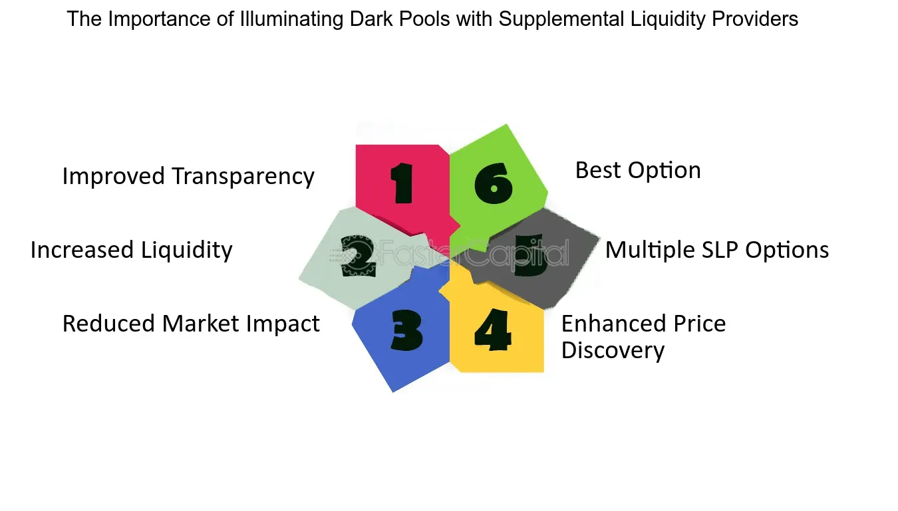

## Table of Contents

## What is a Supplemental Liquidity Provider (SLP)?

A Supplemental Liquidity Provider (SLP) is a type of market maker that helps improve the liquidity of financial markets. They do this by buying and selling assets, like stocks or currencies, to make sure there are always enough buyers and sellers. This helps keep the market stable and makes it easier for people to trade.

SLPs are often used in stock exchanges and forex markets. They get special incentives, like lower fees or rebates, for providing liquidity. This encourages them to keep trading, even when the market is not very active. By doing this, SLPs help make sure that people can always buy or sell what they need, without big delays or price jumps.

## Why are Supplemental Liquidity Providers important in financial markets?

Supplemental Liquidity Providers (SLPs) are important in financial markets because they help keep the market running smoothly. They do this by making sure there are always people ready to buy or sell, even when the market is not very busy. This means that if you want to sell your stocks or buy some currency, you can do it quickly without waiting a long time. SLPs help make sure the market stays stable and that prices don't jump around too much.

Having SLPs in the market also helps attract more people to trade. When people know they can buy or sell easily, they feel more confident about joining the market. This can bring more money into the market, which can help it grow. So, SLPs not only help with the day-to-day trading but also support the overall health and growth of the financial market.

## How does a Supplemental Liquidity Provider differ from a traditional market maker?

A Supplemental Liquidity Provider (SLP) and a traditional market maker both help keep financial markets running smoothly, but they do it in slightly different ways. A traditional market maker is always on the job, ready to buy or sell assets at any time. They have to keep the market moving by always being there to trade, no matter how busy or quiet the market is. They usually work for big financial firms and have to follow strict rules about how they trade.

On the other hand, a Supplemental Liquidity Provider steps in to help when the market needs a bit more help. They don't have to be trading all the time like traditional market makers. Instead, they come in to add more buyers and sellers when the market is not as busy. This helps keep things stable and makes it easier for people to trade. SLPs often get special rewards, like lower fees, for helping out when the market needs it.

## What are the key responsibilities of a Supplemental Liquidity Provider?

The main job of a Supplemental Liquidity Provider (SLP) is to help keep the market running smoothly by adding more buyers and sellers when the market needs it. They do this by trading assets like stocks or currencies, especially when the market is not very busy. This helps make sure that people can always buy or sell what they need without waiting too long or seeing big price changes.

SLPs also help keep the market stable. When they trade, they make sure there are always enough people ready to buy or sell, which helps keep prices from jumping around too much. This is important because it makes people feel more confident about trading, which can bring more money into the market and help it grow.

## Can you explain the basic mechanism through which SLPs operate?

Supplemental Liquidity Providers (SLPs) help keep the market running smoothly by adding more buyers and sellers when the market needs it. They do this by trading assets like stocks or currencies, especially when there aren't many people trading. This means that if you want to sell your stocks or buy some currency, you can do it quickly without waiting a long time. SLPs step in to make sure there are always enough people ready to trade, which helps keep the market active and stable.

SLPs get special rewards for helping out when the market needs it. These rewards can be things like lower fees or rebates, which encourage them to keep trading even when the market is quiet. By doing this, SLPs make sure that people can always buy or sell what they need, and it helps keep prices from jumping around too much. This makes the market a more reliable place for everyone to trade.

## What types of financial instruments do SLPs typically provide liquidity for?

Supplemental Liquidity Providers (SLPs) usually help with trading different kinds of financial instruments, like stocks and currencies. In stock markets, SLPs make sure there are always people ready to buy or sell shares, even when the market is not very busy. This means if you want to sell your stocks, you can find someone to buy them without waiting too long.

In the forex market, SLPs do something similar but with currencies. They help make sure there are always buyers and sellers for different currencies, which is important for people who want to trade money from one country to another. By doing this, SLPs help keep the forex market stable and easy to use for everyone.

## How do SLPs earn revenue and what are their typical compensation structures?

Supplemental Liquidity Providers (SLPs) earn money by trading financial instruments like stocks and currencies. They make a profit from the difference between the price they buy at and the price they sell at, which is called the bid-ask spread. When they help keep the market active and stable, they also get special rewards from the exchanges or financial institutions they work with. These rewards can be things like lower fees or rebates, which help them make more money.

The typical compensation structure for SLPs often includes these rebates or fee reductions. For example, an exchange might give them a small amount of money back for each trade they make, which adds up over time. This encourages SLPs to keep trading, even when the market is not very busy. By doing this, they help make sure the market stays stable and easy to use for everyone, and they get paid for their efforts.

## What are the regulatory requirements for becoming a Supplemental Liquidity Provider?

To become a Supplemental Liquidity Provider (SLP), you need to follow certain rules set by financial regulators and the exchanges where you want to work. These rules are there to make sure that SLPs do their job well and help keep the market fair and stable. For example, you might need to have a certain amount of money or assets to show that you can handle the risks of trading. You also need to follow rules about how you trade, like not doing anything that could trick people or make the market unfair.

Different countries and exchanges can have different rules for SLPs. In the United States, for example, the Securities and Exchange Commission (SEC) and stock exchanges like the New York Stock Exchange (NYSE) have their own sets of rules. These might include getting special permission or a license to work as an SLP. You also need to keep good records of your trades and report them to the regulators regularly. This helps make sure that everyone is playing by the rules and that the market stays safe and fair for everyone.

## How do SLPs impact market volatility and price stability?

Supplemental Liquidity Providers (SLPs) help keep the market from being too wild by making sure there are always people ready to buy or sell. When the market is not very busy, SLPs step in to trade, which means you can always find someone to trade with. This helps keep prices from jumping around too much because there are always enough buyers and sellers to balance things out. If there were no SLPs, the market could get very unpredictable, with big price changes happening all the time.

By adding more buyers and sellers, SLPs make the market more stable. When people know they can buy or sell easily, they feel more confident about trading. This confidence can bring more people into the market, which helps keep it stable and growing. So, SLPs not only help with the day-to-day trading but also support the overall health of the financial market by making sure it stays calm and reliable.

## What are the risks associated with being a Supplemental Liquidity Provider?

Being a Supplemental Liquidity Provider (SLP) comes with some risks. One big risk is losing money. SLPs make money from the difference between buying and selling prices, but if the market moves quickly or in unexpected ways, they can end up buying high and selling low. This means they could lose money instead of making it. Another risk is market risk, where big events like economic news or global happenings can make the market very unpredictable, making it hard for SLPs to keep up.

There's also operational risk. SLPs need good technology and systems to trade quickly and correctly. If something goes wrong with their computers or software, they might miss out on trades or make mistakes that cost them money. Plus, they have to follow a lot of rules set by regulators and exchanges. If they break these rules, they could get fined or even lose their right to be an SLP. So, they need to be very careful and always on top of things to manage these risks well.

## How do technological advancements influence the operations of SLPs?

Technological advancements have made a big difference in how Supplemental Liquidity Providers (SLPs) do their job. With new technology, SLPs can trade faster and more accurately. They use special computer programs called algorithms to watch the market and make trades in just a few seconds. This means they can keep up with the market even when it's moving very quickly. Also, better technology helps SLPs handle more trades at the same time, which can help them make more money and do a better job of keeping the market stable.

But there are also some challenges that come with using new technology. SLPs need to make sure their systems are always working well because even a small problem can cause them to lose money or miss out on trades. They also have to keep up with new tech as it comes out, which can be hard and expensive. But if they can use technology well, it helps them do their job better and keep the market running smoothly for everyone.

## What are some case studies or examples of successful SLP implementations in major financial markets?

One good example of successful SLP implementation is in the New York Stock Exchange (NYSE). The NYSE started using SLPs to help keep the market stable and active. They gave SLPs special rewards like lower fees for trading when the market was not very busy. This helped make sure there were always enough people ready to buy or sell, even during quiet times. As a result, the market became more stable, and people felt more confident about trading there. This example shows how SLPs can really help make a big market like the NYSE work better for everyone.

Another example is in the forex market, where companies like Citadel Securities have acted as SLPs. They help keep the market for different currencies stable by trading when there aren't many other people doing so. This makes it easier for people to buy and sell currencies without big price jumps. Citadel Securities uses advanced technology to trade quickly and accurately, which helps them do their job well. Their work as an SLP has helped make the forex market more reliable and easier to use, showing how important SLPs can be in keeping financial markets running smoothly.

## References & Further Reading

[1]: Hasbrouck, J., & Saar, G. (2013). ["Low-Latency Trading."](https://www.sciencedirect.com/science/article/abs/pii/S1386418113000165) The Review of Financial Studies, 26(9), 2471–2512.

[2]: Kirilenko, A. A., & Lo, A. W. (2013). ["Moore's Law versus Murphy's Law: Algorithmic Trading and Its Discontents."](https://www.aeaweb.org/articles?id=10.1257/jep.27.2.51) The Journal of Finance, 68(3), 1301–1340.

[3]: "High-Frequency Trading: A Practical Guide to Algorithmic Strategies and Trading Systems" by Irene Aldridge

[4]: Menkveld, A. J. (2013). ["High-Frequency Trading and the New-Market Makers."](https://www.sciencedirect.com/science/article/pii/S1386418113000281) Journal of Financial Markets, 16(4), 712-740.

[5]: Cartea, Á., Jaimungal, S., & Penalva, J. (2015). ["Algorithmic and High-Frequency Trading."](https://assets.cambridge.org/97811070/91146/frontmatter/9781107091146_frontmatter.pdf) Cambridge University Press.