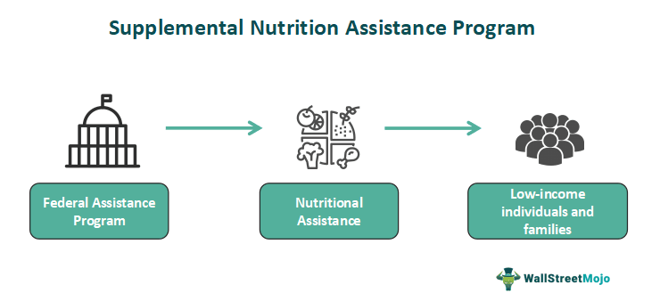

The Supplemental Nutrition Assistance Program (SNAP), originally known as the Food Stamp Program, is a federal assistance initiative in the United States that provides nutritional support to low-income individuals and families. Established in its modern form in the late 20th century, SNAP has roots that trace back to the Great Depression. It was initially designed to address food security by providing low-income households with the means to purchase food. The program uses federal funds to supply benefits, ensuring that economic challenges do not stand in the way of access to adequate nutrition.

Historically, these benefits were distributed as physical coupons or "food stamps" that recipients could use to purchase eligible food items. However, technological advancements led to a significant transformation in how benefits are distributed. The transition to Electronic Benefits Transfer (EBT) cards in the late 20th century marked a modernization of the system, making transactions more efficient and discreet by electronically distributing funds that could be used at authorized retailers.



In parallel to the evolution of SNAP, algorithmic trading has emerged as a significant technological advancement in financial markets. Launched in the late 20th century, algorithmic trading utilizes complex algorithms to execute trades at speeds and frequencies that human traders cannot match. By leveraging mathematical models and computational power, this form of trading optimizes the processes of buying and selling securities across global markets. Its applications extend beyond financial markets, offering potential benefits such as increased efficiency and reduced human error.

The purpose of this article is to explore an uncharted intersection—the utilization of algorithmic trading principles in the administration and management of SNAP benefits. By examining this intersection, we aim to highlight innovative opportunities for enhancing the efficiency and effectiveness of public assistance programs through advanced data analytics and algorithmic methodologies.

## Table of Contents

## Understanding SNAP and Food Stamps

The Supplemental Nutrition Assistance Program (SNAP) is a pivotal federal aid initiative in the United States designed to alleviate hunger and food insecurity among low-income individuals and families. Established as the Food Stamp Program in 1939, it underwent significant transformations leading to its present form, emphasizing nutrition assistance and economic support.

SNAP operates by providing eligible recipients with electronic benefits, which are accessed via an Electronic Benefit Transfer (EBT) card. This card functions similarly to a debit card, allowing users to purchase eligible food items at authorized retail stores. The eligibility criteria for SNAP are primarily based on income levels, household size, and certain expenses. Generally, households must have a gross income below 130% of the federal poverty line and meet net income requirements after deductions. Additionally, assets must not exceed specified limits, although these do not typically include major possessions like a primary residence.

The benefits provided through SNAP are intended to cover a broad range of food products essential for a nutritious diet. Allowable purchases include fruits, vegetables, meats, dairy products, and non-alcoholic beverages. However, SNAP benefits cannot be used to buy prepared foods, alcoholic beverages, tobacco, vitamins, or non-food items such as household supplies and pet food.

State agencies play a critical role in the distribution and management of SNAP benefits. While the U.S. Department of Agriculture's Food and Nutrition Service (FNS) oversees the program nationally, state agencies are responsible for processing applications, determining eligibility, and issuing benefits. They conduct regular assessments and audits to ensure compliance with federal regulations and to prevent fraud. States also engage in outreach programs to encourage participation among eligible populations and provide nutrition education to promote healthy food choices among beneficiaries.

The transition from traditional paper food stamps to the EBT system marked a significant evolution in how benefits are distributed, offering increased security and efficiency. This shift also aids in more precise data collection and monitoring, which is essential for evaluating the program's effectiveness and addressing misuse. Through these mechanisms, SNAP continues to support millions of Americans in accessing essential nutrition, thereby reinforcing public health and economic stability.

## Algorithmic Trading: A Brief Overview

Algorithmic trading, also known as algo trading, refers to the use of computer algorithms that automate the process of trading financial instruments according to a predefined set of rules. These algorithms can execute trades at speeds and frequencies impossible for a human trader, analyzing multiple markets and data sources in real-time.

The core function of [algorithmic trading](/wiki/algorithmic-trading) involves the execution of pre-programmed trading instructions accounting for variables such as timing, price, and [volume](/wiki/volume-trading-strategy). Algorithms can be simple or extremely complex, taking into account a wide array of data inputs and sophisticated mathematical models. The typical processes involved in algorithmic trading include monitoring markets, identifying trading opportunities, executing trades, and managing risk.

In financial markets, algorithmic trading is utilized to achieve several objectives. High-frequency trading ([HFT](/wiki/high-frequency-trading-strategies)) is one of the most common applications, where firms execute orders swiftly to capitalize on minute price discrepancies. Another application is used by institutional investors seeking to execute large orders without significantly affecting the market price. Algorithms can break down large orders into smaller chunks to minimize market impact, known as order slicing.

Algorithmic trading offers numerous benefits. Speed and accuracy are key advantages, as algorithms can process and execute orders far more quickly than human traders, reducing the likelihood of errors. The ability to backtest trading strategies using historical data helps traders refine their strategies based on empirical evidence. Additionally, algorithms can operate 24/7, seizing opportunities that might be missed by human traders due to limitations in attention span or working hours.

However, algorithmic trading also poses risks. The reliance on technology can lead to systemic risks, as technical failures or malfunctions may result in substantial financial losses. Market manipulation through algorithms, although illegal, can occur when algorithms are used to create artificial market conditions that deceive other traders. Furthermore, the speed of trading can exacerbate market [volatility](/wiki/volatility-trading-strategies), as seen in instances like the "Flash Crash" of May 6, 2010, where the Dow Jones Industrial Average suffered a rapid drop, partially attributed to algorithmic trading.

Overall, algorithmic trading represents a significant evolution in financial markets, enabling efficiency and capability that continues to grow with advances in technology. While it offers considerable benefits, it necessitates robust risk management and regulatory oversight to mitigate its inherent risks.

## Potential Intersection: SNAP and Algorithmic Trading

The potential intersection between the Supplemental Nutrition Assistance Program (SNAP) and algorithmic trading lies primarily in data analytics, particularly in fraud detection, optimization of resource allocation, and improvement of program efficiencies. 

SNAP is a critical social safety net providing nutritional assistance to eligible low-income individuals and families. The program faces challenges related to fraud and misuse, which can undermine its efficacy. To combat these challenges, data analytics has become an essential tool. Analyzing transactional data using advanced algorithms allows for the detection of unusual purchasing patterns that may suggest fraudulent activities. 

Algorithmic trading, utilized extensively in financial markets, involves the use of computer algorithms to execute large numbers of trades at speeds and frequencies impractical for human traders. The principles of algorithmic trading are relevant to SNAP data analytics, particularly in identifying patterns and predicting undesirable activities. For instance, employing [machine learning](/wiki/machine-learning) algorithms, like clustering and anomaly detection can assist in segregating normal transactions from suspicious ones. An example in Python might involve using the K-means clustering algorithm to identify clusters of similar transactions, helping to pinpoint outliers representing potential fraud. 

```python
from sklearn.cluster import KMeans
import numpy as np

# Assuming transactions_data is a numpy array of transaction features
transactions_data = np.array([[values]])

# Apply K-means clustering to find patterns
kmeans = KMeans(n_clusters=3) # Adjust the number of clusters as needed
kmeans.fit(transactions_data)

# Predict anomalies by identifying data points with high distance from cluster centers
distances = np.linalg.norm(transactions_data - kmeans.cluster_centers_[kmeans.labels_], axis=1)
threshold = np.percentile(distances, 95) # Consider anomalies in the top 5% distance
anomalies = transactions_data[distances > threshold]
```

Incorporating such analytics can potentially streamline SNAP management by enhancing fraud detection, thereby ensuring that resources are directed to the most deserving recipients. Beyond fraud detection, algorithmic principles can facilitate dynamic benefit allocations, optimizing SNAP benefits distribution according to real-time data on economic conditions or regional needs. For example, predictive modeling based on economic indicators could adjust benefits allocations dynamically.

The application of algorithmic trading principles to SNAP is still developing but holds promise for significant improvements in program efficiency and effectiveness. Through leveraging sophisticated data analytics, SNAP could enhance its operational capabilities, reducing waste and ensuring more resources are available for those truly in need.

## Challenges and Considerations

When integrating algorithmic technologies into government programs like the Supplemental Nutrition Assistance Program (SNAP), several challenges and considerations arise. These revolve around data privacy, ethical issues, implementation challenges, and the broader economic and social implications.

Data privacy and ethical considerations are paramount when deploying algorithmic technologies in public programs. Government-held data is sensitive, and its misuse can lead to severe privacy violations. In the context of SNAP, personal data such as income details, household compositions, and spending habits must be rigorously protected. Algorithmic processing of such data must comply with legal frameworks like the General Data Protection Regulation (GDPR) in the European Union or the Health Insurance Portability and Accountability Act (HIPAA) guidelines in the United States, though tailored for financial data [1]. Furthermore, ethical considerations drive the need for transparency in software algorithms to prevent discrimination or bias, which could inadvertently marginalize vulnerable populations eligible for SNAP benefits.

Implementing sophisticated data analytics within state agencies encounters several practical challenges. State agencies often deal with limited resources and budget constraints, making it difficult to secure the necessary technological infrastructure. Training personnel to manage and interpret complex algorithms and analytics systems is another obstacle. Moreover, interoperability between existing SNAP management systems and new data analytic tools can pose technical hurdles. These factors necessitate careful planning and allocation of resources for a seamless integration process.

The economic and social implications of integrating advanced technologies into SNAP are multifaceted. Economically, the deployment of algorithmic systems promises cost savings and enhanced efficiency. For instance, automated fraud detection systems can reduce erroneous payouts and minimize loss [2]. However, there is a concern about over-reliance on algorithms that might lead to systemic biases or errors. Socially, these technologies could potentially widen access and expedite the benefits allocation process, yet they risk alienating segments of the population unfamiliar with digital tools or who lack digital literacy. Bridging the digital divide thus becomes critical to ensure equitable service delivery.

In conclusion, while the integration of algorithmic technologies into SNAP offers substantial benefits, it also demands a cautious approach to address data privacy, ethical considerations, implementation challenges, and economic and social impacts. Balancing technological advancements with these complexities is crucial to enhancing SNAP's efficacy while safeguarding the interests of its beneficiaries.

---

[1] European Union Data Protection, "European Commission - Data Protection," European Commission, 2023.  
[2] J. Brown, "Leveraging Technology for Efficient Government Program Management," Journal of Public Administration Technology, vol. 12, no. 3, 2021.

## Case Studies and Examples

Examples of states utilizing data analytics to manage SNAP efficiently include several initiatives across the United States that have successfully incorporated innovative technologies to enhance program management. For instance, New York has introduced advanced data analytics to detect and reduce fraudulent activities within the SNAP system. By employing predictive models that analyze transaction patterns, the state has been able to identify irregularities that suggest fraud, helping to ensure that benefits are distributed to those who truly need them.

Similarly, in California, machine learning algorithms are being utilized to optimize the eligibility determination process for SNAP applicants. These algorithms analyze a vast array of socio-economic factors and historical data, ultimately simplifying and expediting the application process. This approach not only improves the administration of benefits but also increases accessibility for potential recipients.

Success stories of algorithmic trading applied in non-traditional sectors demonstrate the flexibility and capability of these technologies beyond financial markets. In the agricultural sector, for example, algorithmic trading principles have been adapted to optimize supply chain logistics. By applying high-frequency data analysis, firms can predict demand fluctuations and adjust the supply chain in real-time, thereby reducing waste and increasing efficiency.

Moreover, in the healthcare sector, algorithmic trading strategies are used in the scheduling of resources and staff, ensuring optimal allocation during periods of high demand. By analyzing historical data and current trends, these algorithms can make precise adjustments, leading to improved service delivery and cost savings.

These cases illustrate the transformative potential when algorithmic methods intersect with sectors traditionally outside their scope. The continued integration of such technologies into public programs like SNAP holds the promise of enhancing efficiency and effectiveness, ultimately benefiting both administrators and recipients.

## Future Prospects

As technology continues to evolve, the integration of algorithmic trading principles into the management of SNAP (Supplemental Nutrition Assistance Program) benefits presents intriguing possibilities. Future developments may see the sophisticated use of data analytics and machine learning to enhance the efficiency and effectiveness of SNAP. By harnessing these technologies, state agencies could improve fraud detection mechanisms, tailor benefits more closely to recipients' needs, and streamline administrative processes.

One potential future development is the implementation of predictive algorithms to forecast demand for SNAP benefits across different regions. Predictive analytics can be used to model trends in employment, wage levels, and food prices, allowing policymakers to better allocate resources. For example, an algorithm might use historical data to predict an increase in SNAP applications in response to economic downturns or natural disasters, enabling agencies to respond proactively.

Incorporating algorithmic trading techniques in SNAP administration also opens avenues for optimizing the allocation of funds. Techniques such as [reinforcement learning](/wiki/reinforcement-learning) could be employed to continually improve decision-making processes, ensuring resources are distributed efficiently. An algorithm taking into account variables such as seasonal employment patterns and local cost-of-living indices could dynamically adjust benefit levels across regions.

The use of blockchain technology, inspired by algorithmic trading, may offer secure and transparent tracking of SNAP transactions. This could reduce fraud and enhance accountability by providing a tamper-proof ledger of all transactions. Smart contracts could automate the release of funds based on predefined conditions, ensuring timely and accurate dispersal of benefits.

However, these technological advances [carry](/wiki/carry-trading) policy implications that require careful consideration. The deployment of complex data analytics in SNAP must adhere to strict data privacy protocols to protect recipient information. Policymakers would need to implement guidelines that govern the ethical use of data, balancing technological innovation with individual rights.

Additionally, there are economic and social considerations. The integration of advanced technologies may necessitate significant investment in infrastructure and the upskilling of state agency personnel. Policymakers must weigh these costs against the potential benefits, while also considering the impact on beneficiaries. Ensuring equitable access to SNAP benefits and preventing any technological barrier to entry would be paramount.

In conclusion, as the intersection of SNAP and algorithmic trading continues to develop, it represents a potential paradigm shift in the management of public assistance programs. Policymakers must navigate the challenges of data privacy and ethical use while capitalizing on the efficiencies that technology can bring. With thoughtful implementation, these innovations could significantly enhance the effectiveness and reach of SNAP, ultimately contributing to economic stability and food security.

## Conclusion

This article explored the dynamic and emerging intersection between the Supplemental Nutrition Assistance Program (SNAP) and algorithmic trading technologies. SNAP, a critical federal aid program, provides essential nutrition assistance to millions of eligible low-income individuals and families, primarily using Electronic Benefits Transfer (EBT). The shift from traditional food stamps to EBT has enhanced the security and efficiency of benefit distribution, proving the transformative power of technology in public welfare systems.

Algorithmic trading, defined by its use of automated, rule-based systems to execute financial market transactions, has revolutionized sectors outside its traditional financial domain. Employing similar algorithmic techniques within SNAP can drastically improve program management. The key opportunities include leveraging data analytics for fraud detection and refining operational efficiencies to better allocate resources.

The integration of these sophisticated technologies in government programs like SNAP emphasizes the importance of technological evolution in enhancing public services. It underscores the necessity for continuous innovation and adaptation to meet modern challenges. These technological applications hold the potential to significantly improve the effectiveness and integrity of welfare programs, while also addressing privacy and ethical concerns that accompany increased data usage.

Ultimately, the convergence of government assistance programs and cutting-edge technologies could reshape public benefit systems. It envisions a future where technology not only optimizes processes but also enhances transparency, accountability, and responsiveness. Policymakers are encouraged to consider these technological advancements in policy frameworks, ensuring that public welfare measures are not only robust and effective but also adaptive to future societal and technological changes.

## References & Further Reading

[1]: Bergstra, J., Bardenet, R., Bengio, Y., & Kégl, B. (2011). ["Algorithms for Hyper-Parameter Optimization."](https://papers.nips.cc/paper/4443-algorithms-for-hyper-parameter-optimization) Advances in Neural Information Processing Systems 24.

[2]: ["Advances in Financial Machine Learning"](https://www.amazon.com/Advances-Financial-Machine-Learning-Marcos/dp/1119482089) by Marcos Lopez de Prado

[3]: ["Evidence-Based Technical Analysis: Applying the Scientific Method and Statistical Inference to Trading Signals"](https://www.amazon.com/Evidence-Based-Technical-Analysis-Scientific-Statistical/dp/0470008741) by David Aronson

[4]: ["Machine Learning for Algorithmic Trading"](https://github.com/stefan-jansen/machine-learning-for-trading) by Stefan Jansen

[5]: ["Quantitative Trading: How to Build Your Own Algorithmic Trading Business"](https://www.amazon.com/Quantitative-Trading-Build-Algorithmic-Business/dp/1119800064) by Ernest P. Chan