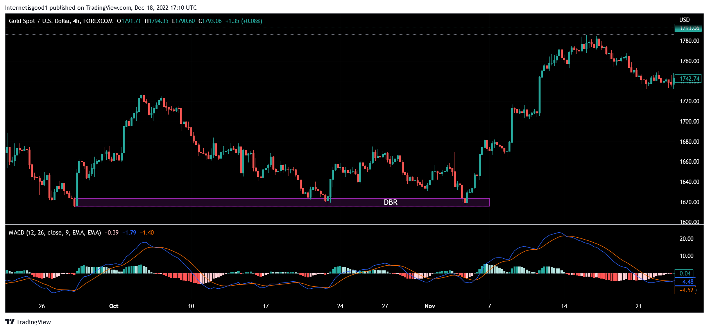

In the rapidly evolving landscape of trading, algorithmic trading stands out as a pivotal strategy that utilizes computer algorithms to execute trades with incredible speed and precision. This approach has transformed the way financial markets operate, enabling traders to execute complex strategies that were once unimaginable through manual trading. One of the standout strategies within algorithmic trading is supply and demand trading, which has garnered attention for its ability to enhance market insights and optimize execution efficiency.

Supply and demand trading, in the context of algorithmic trading, revolves around identifying key zones on price charts where buying or selling actions are anticipated. These zones, known as supply and demand zones, are areas where price has shown the potential for reversals or aggressive moves. Supply zones are regions where selling pressure overwhelms buying interest, leading to price declines, while demand zones are areas where buying interest outstrips selling pressure, resulting in price increases. Identifying these zones accurately allows traders to predict potential price movements, making it a valuable component of a trader's toolkit.



Incorporating supply and demand principles into algorithmic trading can provide traders with a strategic edge in navigating financial markets. This integration involves developing algorithms that automatically detect supply and demand zones and execute trades based on these pivotal areas. The precision and speed offered by algorithmic trading mean that traders can act swiftly, capitalizing on opportunities as they arise and mitigating risks associated with human errors or delays in trading decisions.

The mechanics behind supply and demand trading involve analyzing historical price data to identify patterns that indicate the presence of these zones. By aligning these concepts with the precision of algorithmic trading methods, traders can optimize their strategies for various market conditions. This approach not only enhances execution speed but also improves the accuracy of trade entries and exits, leading to better overall performance.

As with any advanced trading strategy, there are challenges and opportunities when implementing supply and demand trading algorithms. One of the primary challenges is the dynamic nature of financial markets, where conditions can change rapidly, affecting the reliability of supply and demand zones. Additionally, the complexity of developing and maintaining algorithms capable of accurately identifying these zones requires a deep understanding of both market mechanics and programming skills.

In conclusion, the integration of supply and demand trading strategies with algorithmic trading offers significant potential for enhancing market timing and generating systematic profits. Traders who master these strategies are well-positioned to thrive in the competitive world of algorithmic trading, leveraging both advanced technology and nuanced market theories to their advantage.

## Table of Contents

## Understanding Supply and Demand in Trading

Supply and demand is a fundamental concept that influences the movement of prices in financial markets. At its core, supply refers to the availability of a commodity or asset, while demand represents the level of interest and willingness of buyers to purchase that commodity or asset. The interplay between supply and demand determines the price at which transactions occur; when demand exceeds supply, prices typically rise, and conversely, when supply surpasses demand, prices tend to fall.

In technical analysis, supply and demand zones are critical areas on a price chart where the price has consolidated before experiencing a significant upward or downward movement. These zones are often associated with periods of accumulation or distribution, where large volumes of buy or sell orders are clustered. Identifying these zones allows traders to anticipate potential price reversals or continuations due to the significant market interest in these areas.

Understanding supply and demand zones provides valuable insights into market psychology by revealing the intentions of major market participants, often referred to as 'smart money.' Smart money represents institutional investors or large-scale traders who possess the capital and information to influence market trends. By recognizing the zones where these players are active, traders can align their strategies with powerful market forces, enhancing their probability of success.

Distinguishing supply and demand zones from conventional support and resistance levels is a critical skill for traders. While support and resistance are typically seen as horizontal lines or areas on a chart where the price has historically rebounded or declined, supply and demand zones are broader and more dynamic, reflecting clusters of orders rather than just price reaction points. This distinction is essential because it emphasizes the [volume](/wiki/volume-trading-strategy) of orders and market interest, rather than merely past price behavior.

Effectively utilizing supply and demand zones involves not only the identification of these areas but also understanding the context of market activity. Traders can use technical indicators, volume analysis, and price action patterns to enhance the accuracy of zone identification and improve their trading decisions. By aligning trades with these zones, traders position themselves to potentially benefit from large market moves prompted by the activities of the smart money.

In conclusion, by integrating supply and demand analysis into their trading strategies, market participants can gain a deeper understanding of price dynamics and improve their ability to forecast market movements. This approach brings traders closer to understanding the underlying forces that drive market behavior and helps to refine their trading strategies with precision and insight.

## Integrating Supply and Demand with Algorithmic Trading

Algorithmic trading leverages computer algorithms to execute trading strategies based on predefined rules, achieving speeds and precision that surpass human capabilities. Integrating supply and demand zone identification within these algorithms offers traders the ability to automate trading processes centered around key price areas. This integration aids in minimizing human errors and biases, thereby ensuring swift execution essential for benefiting from rapid market movements.

Identifying supply and demand zones involves detecting areas on price charts where significant buying or selling pressures are anticipated. Automating this process through algorithms enables traders to enter and [exit](/wiki/exit-strategy) positions at optimal points, aligning with market dynamics more effectively. The cornerstone of this integration is the accurate identification of these zones within the algorithmic framework.

High-frequency trading ([HFT](/wiki/high-frequency-trading-strategies)), characterized by a large number of trades executed in fractions of a second, can particularly benefit from the application of supply and demand dynamics. By incorporating real-time analysis and execution based on these zones, HFT strategies can capture minute price inefficiencies, potentially leading to enhanced profitability and reduced market impact.

To successfully integrate supply and demand strategies within [algorithmic trading](/wiki/algorithmic-trading), traders require a strong understanding of programming and algorithmic frameworks. Python is a popular choice due to its simplicity and the availability of numerous libraries like NumPy and Pandas for numerical operations, and StatsModels for statistical analysis. Below is a simple Python pseudocode example illustrating the concept of integrating supply and demand zones within an algorithmic strategy:

```python
import pandas as pd

# Example function to identify supply and demand zones
def identify_zones(price_data):
    supply_zones = []
    demand_zones = []
    threshold = 0.5  # define a threshold for price movement from a potential zone

    for idx, price in enumerate(price_data):
        if price >= max(price_data[idx-5:idx+5]) - threshold:  # potential supply zone
            supply_zones.append(price)
        elif price <= min(price_data[idx-5:idx+5]) + threshold:  # potential demand zone
            demand_zones.append(price)

    return supply_zones, demand_zones

# Mocked price data
price_data = pd.Series([1.0, 1.2, 1.1, 1.5, 1.3, 1.0, 1.2, 0.9, 1.4, 1.2])

# Identifying zones
supply_zones, demand_zones = identify_zones(price_data)

# Example trading decision based on identified zones
for price in price_data:
    if price in supply_zones:
        print("Sell order placed at price:", price)
    elif price in demand_zones:
        print("Buy order placed at price:", price)
```

This example highlights the basic principle of identifying and trading from supply and demand zones within a programmatic trading strategy. For effective deployment, traders need real-time data feeds, more sophisticated zone identification algorithms, and robust risk management protocols. Furthermore, maintaining low latency and high-speed execution is crucial to minimizing slippage and optimizing strategy performance, making a comprehensive understanding of trading infrastructure and its associated technologies essential.

## Challenges in Supply and Demand Algorithmic Trading

Despite the numerous benefits, integrating supply and demand strategies into algorithmic trading presents several challenges that traders and developers need to overcome. One of the primary challenges is the subjective nature of pinpointing supply and demand zones. Unlike clear-cut indicators or patterns, these zones require a keen understanding of market dynamics and price action, which can vary significantly among traders. This subjectivity complicates the process of [backtesting](/wiki/backtesting), as different interpretations may lead to inconsistent results and undermine the reliability of historical data analysis. 

Additionally, developing algorithms that accurately recognize and respond to supply and demand zones demands advanced programming skills coupled with access to real-time market data. Creating algorithms capable of identifying these zones necessitates not only sophisticated technical setups but also an understanding of complex coding frameworks. This requirement could pose a barrier for traders who lack either the programming expertise or the resources necessary to gather and interpret large datasets.

Moreover, one significant risk inherent in algorithmic trading, particularly when utilizing supply and demand strategies, is the tendency to overfit algorithms to past market conditions. While historical data offers valuable insights, relying too heavily on it can lead to strategies that perform well historically but fail to adapt to live market fluctuations. This overfitting issue stands as a significant obstacle in the quest for developing robust, future-proof trading algorithms.

Lastly, maintaining low latency and ensuring high-speed execution is crucial for optimizing the performance of these strategies. In the fast-paced environment of financial markets, even minute delays can result in slippage—discrepancies between the expected price of a trade and the price at which it is executed—potentially eroding profits or exacerbating losses. As such, traders must ensure that their systems are not only capable of executing trades in real-time but are also optimized to reduce latency to the bare minimum.

## Conclusion

Supply and demand trading strategies in algorithmic trading represent a confluence of market microstructure theory and advanced computational techniques. These strategies require traders to have a nuanced understanding of both the underlying mechanics of markets and the technological capabilities of algorithmic systems. At their core, supply and demand strategies aim to identify critical price zones where large orders are likely concentrated, providing opportunities for traders to anticipate significant price moves. The integration of these principles into automated systems facilitates the rapid execution of trades, essential for taking advantage of fleeting market opportunities.

Implementing such strategies effectively necessitates overcoming several challenges. Traders must possess a deep knowledge of algorithmic frameworks and programming to accurately define and execute these strategies. Additionally, the subjective nature of identifying supply and demand zones can complicate the development of automated algorithms, posing a risk of overfitting models to historical data without accurately forecasting future price movements. Despite these challenges, the potential for enhanced market timing and systematic profit generation remains considerable. As algorithms operate with high precision and speed, they can effectively exploit the inherent inefficiencies and dynamics dictated by supply and demand forces.

Technological advancements further expand the potential for integrating complex market theories into automated systems. Improved computational power, data analytics, and [machine learning](/wiki/machine-learning) offer new dimensions for refining supply and demand-driven strategies. These tools enable traders to process vast amounts of market data efficiently, identify patterns, and execute trades with minimal latency, reducing slippage and optimizing performance.

Traders who master the integration of supply and demand concepts with algorithmic trading position themselves strongly in the competitive landscape. By leveraging technological advancements and understanding market microstructures, they can harness these strategies to achieve systematic and sustainable profit generation. As trading technology continues to evolve, so too does the opportunity for traders to innovate and capitalize on the interplay between market theories and algorithmic execution.

## References & Further Reading

[1]: Bergstra, J., Bardenet, R., Bengio, Y., & Kégl, B. (2011). ["Algorithms for Hyper-Parameter Optimization."](https://proceedings.neurips.cc/paper/2011/file/86e8f7ab32cfd12577bc2619bc635690-Paper.pdf) Advances in Neural Information Processing Systems 24.

[2]: ["Advances in Financial Machine Learning"](https://www.amazon.com/Advances-Financial-Machine-Learning-Marcos/dp/1119482089) by Marcos Lopez de Prado

[3]: ["Evidence-Based Technical Analysis: Applying the Scientific Method and Statistical Inference to Trading Signals"](https://www.amazon.com/Evidence-Based-Technical-Analysis-Scientific-Statistical/dp/0470008741) by David Aronson

[4]: ["Machine Learning for Algorithmic Trading"](https://github.com/stefan-jansen/machine-learning-for-trading) by Stefan Jansen

[5]: ["Quantitative Trading: How to Build Your Own Algorithmic Trading Business"](https://books.google.com/books/about/Quantitative_Trading.html?id=j70yEAAAQBAJ) by Ernest P. Chan