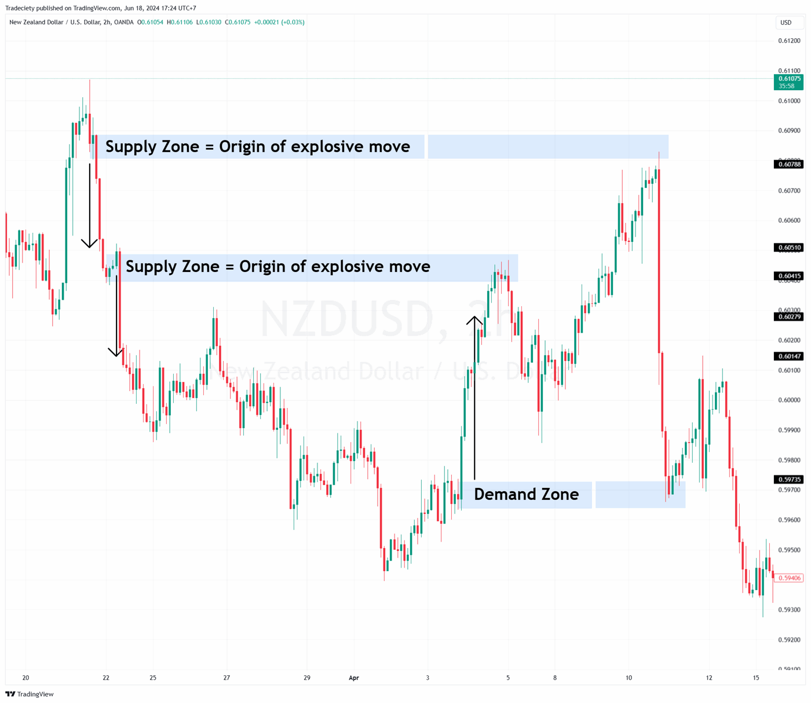

## Table of Contents

## What is the basic concept of supply and demand in trading?

Supply and demand is a fundamental concept in trading that helps explain how prices are determined in a market. It's based on the idea that the price of a good or service will eventually reach a point where the amount people want to buy (demand) is equal to the amount available for sale (supply). When there's a lot of something and not many people want it, the price tends to go down. On the other hand, if there's not much of something but a lot of people want it, the price tends to go up.

In trading, understanding supply and demand can help traders make better decisions. For example, if a trader sees that the demand for a certain stock is increasing while the supply stays the same, they might predict that the price will go up. They could then buy the stock hoping to sell it later at a higher price. Conversely, if they see that the supply of a stock is increasing but the demand is not, they might predict that the price will go down and decide to sell their shares before the price drops. By paying attention to these patterns, traders can try to buy low and sell high.

## How can supply and demand zones be identified on a price chart?

Supply and demand zones on a price chart can be identified by looking at where the price has moved quickly in the past. When the price of something goes up fast, it often means there was a lot of demand and not enough supply at that point. This creates a demand zone. You can spot these zones by finding areas on the chart where the price made a strong move upwards and then paused or reversed. The bottom of this move is where the demand zone starts, and it usually extends a bit above that point.

On the other hand, when the price drops quickly, it suggests there was a lot of supply and not enough demand. This creates a supply zone. To find these zones, look for areas on the chart where the price made a sharp move downwards and then paused or reversed. The top of this move is where the supply zone begins, and it usually extends a bit below that point. By marking these zones on your chart, you can see where the price might react in the future based on past supply and demand imbalances.

## What are the key differences between supply and demand zones and traditional support and resistance levels?

Supply and demand zones and traditional support and resistance levels both help traders predict where the price might go next, but they are a bit different. Supply and demand zones are areas on a chart where the price moved quickly up or down in the past. These zones show where there was a lot of buying or selling pressure. For example, a demand zone is where the price jumped up fast because a lot of people wanted to buy, and a supply zone is where the price dropped fast because a lot of people wanted to sell. These zones are usually wider on the chart and can give a clearer picture of where the price might react in the future.

Traditional support and resistance levels, on the other hand, are specific price points where the price has bounced off in the past. Support is a price level where the price tends to stop falling and start going up again, while resistance is a price level where the price tends to stop rising and start going down again. These levels are often shown as single lines on a chart and are based on where the price has touched multiple times. While support and resistance levels can be very useful, they might not show the full story of why the price reacted at those points as clearly as supply and demand zones do.

## How does one determine the strength of a supply or demand zone?

The strength of a supply or demand zone can be figured out by looking at how the price acted in that zone before. If the price moved a lot and fast when it hit the zone, it means the zone is strong. For example, if the price jumped up quickly in a demand zone, it shows there was a lot of buying interest, making the zone strong. On the other hand, if the price only moved a little bit when it hit the zone, it might not be as strong because there wasn't as much buying or selling pressure.

Another way to tell how strong a zone is by seeing how often the price comes back to it. If the price keeps coming back to the same zone and reacts strongly each time, it's a sign that the zone is very important. Traders pay more attention to these strong zones because they are more likely to affect the price in the future. So, by looking at how big the price move was and how often the price returns to the zone, you can get a good idea of how strong a supply or demand zone is.

## What are the common entry and exit strategies when trading supply and demand zones?

When trading supply and demand zones, a common entry strategy is to buy when the price comes back to a demand zone or sell when it reaches a supply zone. Traders look for the price to touch or get close to these zones and then wait for a sign that the price might move in their favor. This sign could be a candlestick pattern, like a bullish engulfing pattern in a demand zone, or a bearish one in a supply zone. Another entry method is to enter the trade as soon as the price breaks out of the zone in the expected direction, hoping to catch the start of a new trend.

For exiting a trade, traders often set a target price based on how far the price moved away from the zone in the past. If the price moved up 100 points from a demand zone before, a trader might set their target at 100 points above the zone. They also use stop-loss orders to limit their losses if the trade doesn't go as planned. A stop-loss might be placed just outside the zone, so if the price goes back into the zone, the trade is closed to avoid bigger losses. By using these entry and [exit](/wiki/exit-strategy) strategies, traders can try to make the most of the price movements caused by supply and demand zones.

## How can traders use volume to confirm supply and demand zones?

Traders can use [volume](/wiki/volume-trading-strategy) to confirm supply and demand zones by looking at how much trading is happening when the price hits these zones. If the price reaches a demand zone and the volume goes up a lot, it means many people are buying, which makes the zone stronger. On the other hand, if the price hits a supply zone and the volume is high, it shows that many people are selling, making the supply zone more important. High volume at these zones tells traders that the price is likely to react strongly because a lot of people are interested in buying or selling at those levels.

By watching the volume, traders can feel more confident about their trades. If the volume is low when the price touches a zone, it might mean the zone isn't as strong as it used to be. Traders might then decide to wait for another chance or look for other signs before making a trade. Using volume to confirm supply and demand zones helps traders make better decisions and avoid getting into trades that might not work out well.

## What role do market trends play in the effectiveness of supply and demand trading strategies?

Market trends play a big role in how well supply and demand trading strategies work. When the market is going up, or in an uptrend, demand zones become more important. Traders look for the price to come back to these zones and then go up again, making it a good time to buy. If the market is going down, or in a downtrend, supply zones are more useful. Traders watch for the price to reach these zones and then drop, which can be a good time to sell. By following the trend, traders can use supply and demand zones to make better trading choices.

Sometimes, though, the market might change direction, and this can affect how well supply and demand strategies work. If the market suddenly switches from going up to going down, a demand zone that used to work well might not be as strong anymore. Traders need to keep an eye on the overall trend and be ready to change their plans if the market starts moving the other way. By paying attention to these shifts, traders can adjust their use of supply and demand zones to match what the market is doing and improve their chances of making successful trades.

## How can supply and demand trading be integrated with other technical analysis tools?

Supply and demand trading can be used together with other tools like moving averages, trend lines, and chart patterns to make better trading decisions. For example, a trader might spot a strong demand zone on the chart and then look at the moving averages to see if the market is in an uptrend. If the moving averages show that the market is going up, it can make the trader feel more confident about buying when the price reaches the demand zone. Trend lines can also help by showing the overall direction of the market, making it easier to decide whether to buy at a demand zone or sell at a supply zone based on the trend.

Chart patterns, like triangles or head and shoulders, can also be used with supply and demand zones. If a trader sees a bullish chart pattern forming near a demand zone, it might be a good sign to buy. On the other hand, if a bearish pattern is forming near a supply zone, it could be a good time to sell. By combining these different tools, traders can get a fuller picture of what the market is doing and make more informed choices about when to enter and exit trades.

## What are the psychological aspects traders need to consider when trading based on supply and demand?

When trading based on supply and demand, traders need to think about their own feelings and how they can affect their choices. It's easy to feel excited or scared when the price moves a lot, and these feelings can make traders do things they might not do if they were calm. For example, if the price goes up fast in a demand zone, a trader might feel too excited and buy more than they should. Or, if the price drops and goes back into a supply zone, a trader might feel scared and sell too soon, missing out on a chance to make more money. It's important for traders to stay calm and stick to their plan, even when the market is moving a lot.

Another thing to think about is how other people's feelings can move the market. When a lot of people feel the same way about a stock, it can create big moves in the price. If everyone is excited about a stock and wants to buy it, the price can go up fast, making a strong demand zone. But if everyone gets scared and wants to sell, the price can drop fast, creating a strong supply zone. Traders need to watch for these big moves and think about why they are happening. By understanding how feelings can affect the market, traders can make better choices and be ready for big price changes.

## How can one manage risk effectively when using supply and demand trading strategies?

When using supply and demand trading strategies, managing risk is really important. One way to do this is by setting stop-loss orders. A stop-loss is like a safety net that automatically closes your trade if the price goes against you too much. For example, if you buy at a demand zone, you might set your stop-loss just below the zone. This way, if the price goes back into the zone, your trade will close, and you won't lose more money than you planned. Another way to manage risk is by not putting all your money into one trade. It's better to spread your money out over different trades, so if one trade doesn't work out, you still have other chances to make money.

Another important part of managing risk is knowing how much you can afford to lose. Before you start trading, decide how much money you're okay with losing, and stick to that amount. This is called setting a risk limit. If you're losing too much, it's okay to take a break and come back later. Also, it's good to keep learning and getting better at trading. The more you know about supply and demand zones and how the market works, the better you can manage your risk. By using these simple steps, you can trade more safely and have a better chance of making money over time.

## What advanced techniques can be used to refine entry and exit points in supply and demand trading?

One advanced technique for refining entry and exit points in supply and demand trading is using price action signals. Traders can look for specific candlestick patterns or price formations that confirm a move in the expected direction. For example, if the price comes back to a demand zone and forms a bullish engulfing pattern, it might be a good time to buy. Similarly, if the price reaches a supply zone and forms a bearish engulfing pattern, it could be a good time to sell. These patterns can help traders enter trades at better prices and increase their chances of success. By waiting for these signals, traders can avoid entering trades too early or too late, which can help them make more money.

Another technique is using multiple timeframes to get a better view of the market. Traders can look at the same supply and demand zones on different charts, like daily, hourly, or 15-minute charts. If a demand zone looks strong on all timeframes, it might be a better place to buy. On the other hand, if a supply zone is clear on multiple charts, it could be a better place to sell. By checking different timeframes, traders can see if the zones are really important and make more informed decisions about when to enter and exit trades. This can help them catch bigger moves and avoid getting into trades that might not work out well.

Lastly, traders can use indicators like the Relative Strength Index (RSI) or the Moving Average Convergence Divergence (MACD) to help refine their entry and exit points. These indicators can show if the market is overbought or oversold, which can help traders decide when to enter or exit a trade. For example, if the price reaches a demand zone and the RSI is low, it might be a good time to buy because the market could be ready to go up. If the price hits a supply zone and the RSI is high, it might be a good time to sell because the market could be ready to go down. By using these indicators along with supply and demand zones, traders can make smarter choices about when to get in and out of trades.

## How can algorithmic trading be applied to enhance the precision of supply and demand trading strategies?

Algorithmic trading can make supply and demand trading strategies more precise by using computers to find and act on supply and demand zones quickly. Traders can program their computers to look at lots of price data and find these zones automatically. The computer can then watch the price and enter a trade as soon as it touches a demand or supply zone. This can help traders get into trades at the best possible time, without waiting for the price to move too far away from the zone. Also, the computer can use other tools like moving averages or RSI to make sure the trade is a good one, making the strategy even more accurate.

Another way [algorithmic trading](/wiki/algorithmic-trading) helps is by managing trades better. Once a trade is open, the computer can keep an eye on it and close it at the right time. For example, it can set a stop-loss to limit losses if the price goes the wrong way, or take profits when the price reaches a target. This can help traders stick to their plan and not let their feelings get in the way. By using algorithms, traders can make their supply and demand strategies work better and have a better chance of making money.

## References & Further Reading

[1]: Bergstra, J., Bardenet, R., Bengio, Y., & Kégl, B. (2011). ["Algorithms for Hyper-Parameter Optimization."](https://proceedings.neurips.cc/paper/2011/file/86e8f7ab32cfd12577bc2619bc635690-Paper.pdf) Advances in Neural Information Processing Systems 24.

[2]: ["Advances in Financial Machine Learning"](https://www.amazon.com/Advances-Financial-Machine-Learning-Marcos/dp/1119482089) by Marcos Lopez de Prado

[3]: ["Evidence-Based Technical Analysis: Applying the Scientific Method and Statistical Inference to Trading Signals"](https://www.amazon.com/Evidence-Based-Technical-Analysis-Scientific-Statistical/dp/0470008741) by David Aronson

[4]: ["Machine Learning for Algorithmic Trading"](https://github.com/stefan-jansen/machine-learning-for-trading) by Stefan Jansen

[5]: ["Quantitative Trading: How to Build Your Own Algorithmic Trading Business"](https://books.google.com/books/about/Quantitative_Trading.html?id=j70yEAAAQBAJ) by Ernest P. Chan